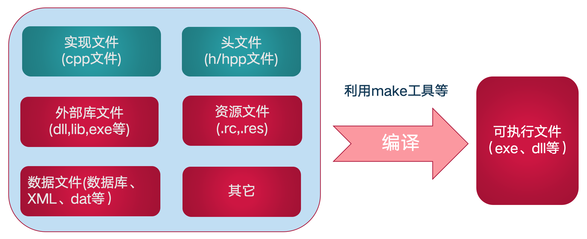
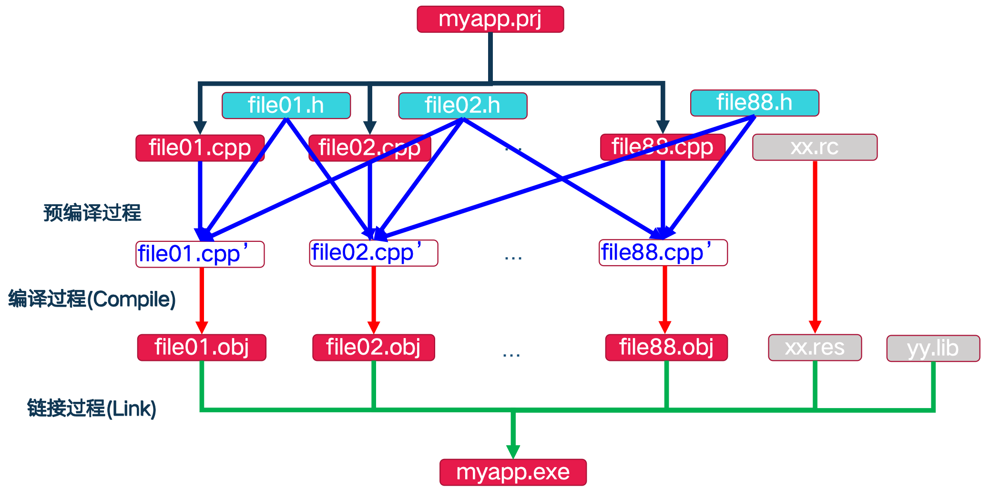
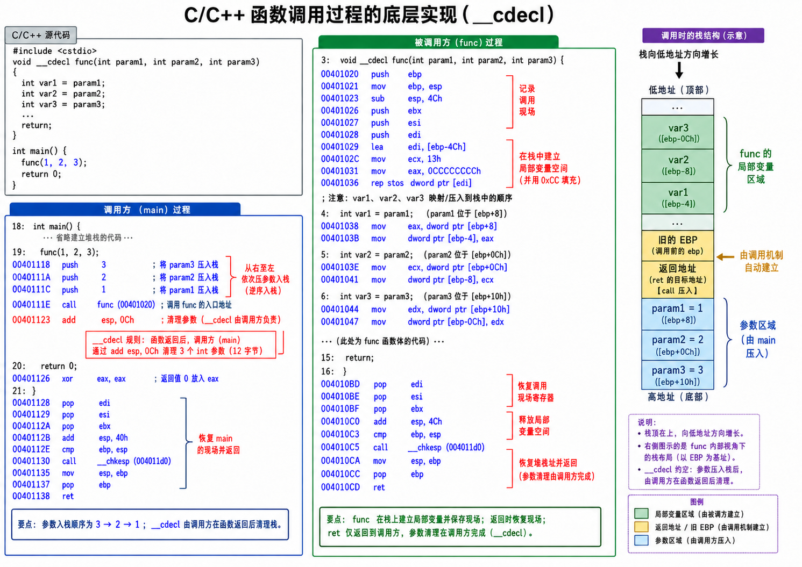

Our OOP exam seems to focus heavily on textbook questions and memorized explanations; even the longer questions require handwritten code. I used the occasion to work through the C++ material carefully. The exam format was pretty unforgiving, but the grading turned out to be surprisingly generous, thankfully.

The original notes were long enough, with so many blocks on a single page, to make the browser noticeably sluggish. I've split them into separate posts to reduce the rendering load.

## Structure of a C++ Program

### Components



- External libraries: we rarely write everything from scratch—for example, our own graphics-card interface just to draw something. Instead, we reuse tested code supplied by other developers or the operating system. These reusable components are libraries. A `lib` file is a static or import library; a `dll` is a dynamic-link library. An `exe`, by contrast, is an executable program, not normally a library linked into another program.
- Resource files contain the **non-code elements** of a program's interface and appearance. They can be embedded in the final executable: icons, cursors, dialog layouts, menus, version information shown in file properties, and even built-in images or sounds. `.rc .res`: resources are usually described in a plain-text `.rc` (Resource Script) file. During the build, a resource compiler converts it to a binary `.res` file that is ultimately packaged into the `.exe`.
- Data files are read, modified, or created **while the program runs**. They **do not** take part in compilation and are stored separately, beside the `.exe` or in another specified location. `XML` (Extensible Markup Language) is a structured plain-text format that resembles HTML, using tags such as `<user><name>张三</name></user>`.

### The Build Process



1. Preprocessing, shown by the blue arrows, is the first stage and is performed by the **preprocessor**. It processes directives beginning with `#` in the source (`.cpp`), especially `#include` for headers and `#define` for macros. The blue lines from `file01.h` and `file01.cpp` to `file01.cpp'` show the header's text being **inserted directly** into the source in place of the `#include`. The preprocessor also expands macros and removes comments. The result is a larger source file containing the required declarations, labeled `file01.cpp'` and `file02.cpp'` in the diagram. This intermediate form is normally passed straight to the next stage without the developer seeing it.
2. Compilation, shown by the red arrows, is the **compiler's** job: translating human-readable source into machine code. It checks the preprocessed files (`.cpp'`) for syntax and semantic errors and produces code for the target architecture. C++ translation units are compiled **independently**: `file01.cpp` and `file02.cpp` do not see each other's implementations, only the declarations made available through their headers. Each `fileXX.cpp'` produces an object file, **`fileXX.obj`** (usually `.o` on Linux). Separately, a resource compiler converts resources such as `xx.rc`, containing icons and dialogs, into **`xx.res`**. At this point we have separate binary object and resource files (`.obj` and `.res`), not a runnable program.

```cpp
   //appmain.cpp
   #include "my.h"
   int main(){
     f(2);
     return 0;
   }

   //my.h
   #ifndef AAA
       #include <string>
   #else
       void f(int);
   #endif
```

After preprocessing, the two example files above become:

```cpp
   //appmain.cpp
   #include <string>（这个string还会继续展开，在这里简写）
   int main(){
     f(2);
     return 0;
   }
```

Compilation now fails. Once preprocessing has expanded the directives, the compiler encounters a call to `f` with no preceding declaration in that translation unit.

Misspelling `main` as `mian`, on the other hand, does not by itself cause a compilation error: the compiler can treat it as an ordinary function called `mian`. The problem normally appears at link time, when the runtime startup code cannot find `main`. A standard hosted C++ program must define `main`; the actual operating-system entry point is usually supplied by the runtime and calls it. The linker combines the object files, fails to resolve the required `main`, and reports a **linker error**.

3. Linking, shown by the green arrows, is the final assembly step, performed by the **linker**. It joins the pieces and resolves references between files. If `file01.cpp` calls a function defined in `file02.cpp`, the linker connects the reference to the definition's address. In the diagram, the green lines bring together all the **`fileXX.obj`** files, **`xx.res`** resources, and external **`yy.lib`** static libraries. Together they form the final **`myapp.exe`** executable that the operating system can run.

At its core, linking involves **resolving symbols—names—to their addresses and applying the required relocations**.

Each `.obj` file has its own **relocation information** and **symbol table**.


The **relocation table** records:

**Offset to patch:** the byte position in the current object's code or data that contains a placeholder the linker must replace—for example, offset `0x0014`.

**Symbol name or index:** which symbol the linker must resolve to calculate the replacement value—for example, the address of `add`.

**Relocation type:** how to calculate that value, such as an absolute address or a relative displacement from an instruction. These are program addresses, not necessarily physical memory addresses.


The **symbol table** records:

**Name:** a function name such as `add`, or a variable name such as `global_count`.

**Type:** does the symbol represent function code or data?

**Binding:** is the symbol globally visible, or local to this object file?

**Section:** where it is defined, such as the `.text` code section or the `.data` data section.

**Value or offset:** the symbol's position relative to the start of its section—for example, 0x0030 bytes into `.text`.

Suppose `main.cpp` declares and calls `add` but does not define it. The compiler cannot yet supply the implementation's address, so it emits a placeholder and records a relocation that must be resolved later. Functions actually defined in `main.cpp` receive entries in that object's symbol table. When `math.cpp` is compiled, its definition of `add` is recorded in its own symbol table. At link time, the linker combines the relevant symbol information, sees the unresolved reference from `main.obj`, finds the matching definition of `add`, and patches the reference accordingly.

A few cases are worth distinguishing:

1. Ordinary functions or global variables with identical externally visible names: if both `fileA.cpp` and `fileB.cpp` define `int add(int a, int b)`, the program violates the one-definition rule (ODR). While combining the symbols, a typical linker detects two global definitions of the same symbol and stops with a multiple-definition error, such as LNK2005.
2. Functions with the same name but different parameter types or counts—overloads—can link without conflict. For example, `fileA.cpp` might define `int add(int a, int b)` and `fileB.cpp` might define `double add(double a, double b)`. C++ implementations use name mangling to encode the function name and signature in a distinct linker symbol. Under one common ABI, `int add(int, int)` becomes `_Z3addii`, while `double add(double, double)` becomes `_Z3adddd`. A call to the integer overload in `main.obj` references `_Z3addii`, so the linker selects the definition in `fileA.obj` rather than the floating-point overload in `fileB.obj`.
3. A namespace-scope function or variable declared `static` has internal linkage. If `fileA.cpp` defines the externally visible `int add(int a, int b)` and `fileB.cpp` defines `static int add(int a, int b)`, they can coexist. The first is a **global** symbol; the second is **local** to its translation unit. When resolving an external reference from `main.cpp`, the linker uses the global definition in `fileA.obj`, not the local one in `fileB.obj`.

Real toolchains are more complicated; this is a simplified model to make the process easier to follow.

### The main Function

The designated main function of an ordinary hosted C or C++ executable.

Return type: in standard C++, `main` must return `int`. Older teaching material sometimes shows `void main` or an implicit return type, as in `main()`. Neither is a valid declaration of `main` in modern standard C++.

The usual parameter forms are no parameters, or `(int argc, char* argv[])`.

### Header Guards

1. **Traditional approach:** `#ifndef #define #endif`

```cpp
#ifndef MY_HEADER_H
#define MY_HEADER_H

// 你的代码声明（类、函数等）
int add(int a, int b);

#endif
```

This relies on a **macro**. On the first inclusion, `MY_HEADER_H` is undefined, so preprocessing enters the conditional, defines the macro, and keeps the header's contents. If the same translation unit includes the header again, the macro is already defined and the contents up to `#endif` are skipped. Guard names must be unique: if another header has already defined `MY_HEADER_H`, this header will be skipped too.

2. **Common modern alternative:** `#pragma once`

```cpp
#pragma once

// 你的代码声明（类、函数等）
int add(int a, int b);
```

This works in terms of **file identity**. A supporting compiler records that it has included the file and ignores subsequent inclusions within the same translation unit. It is widely supported, though it is not a standard C++ directive; exact file-identity handling depends on the compiler.

### Standard-Library and Project Headers

The standard library supplies predefined facilities. Their headers and, where needed, compiled implementations are usually provided with the compiler or runtime.
These facilities are part of standard C++.

`#include <...>` — angle brackets, conventionally for standard or system headers.
The compiler searches its configured include locations, such as the toolchain's `include` directory and additional dependency paths supplied by the project.
Typical uses include C++ standard-library headers such as `<iostream>` and `<vector>`, operating-system APIs, and third-party libraries.

`#include "..."` — quotes, conventionally for local or project headers.
Compilers commonly search relative to the including source file first, then fall back to other include paths if no match is found. The precise search rules are implementation-defined.
Use this form for headers you write in your project, such as `"my_class.h"` and `"utils.h"`.

Common questions:

1. Can every header use the `#include "a.h"` form?
   `#include "iostream"` can work because the search may eventually reach the standard-library directories. Even so, using quotes for everything is a poor convention: it can add unnecessary searches and, more importantly, obscures the distinction between project headers and external dependencies. Consistent delimiters make that distinction visible at a glance.
2. Which comes first: `<>` or `""`?
   There is no language rule requiring either order. The Google style guide puts a source file's related header first, so a missing dependency in that header is exposed instead of being accidentally supplied by an earlier include. For instance, processing `my_math.h` before `<string>` reveals whether the header itself includes what it needs for `std::string`. Other conventions put standard headers first; that is also the order used in our course. For the exam, I'll follow the course convention, while keeping headers self-contained in actual projects.

## Types and Variables

### Types in an OOP Language

1. Fundamental types: the language's built-in representations, such as integers (`int`, `short`, `long`), floating-point types (`float`, `double`), characters (`char`), and Boolean values (`bool`). Some details worth a closer look follow below.
2. **User-defined types:** language representations of abstract data types (ADTs), central to OOP—for example, classes (`class`), structures (`struct`), and enumerations (`enum`).
3. Generics: a way to parameterize code by types so that the same logic can be reused. Without generics, you might write separate sorting functions for `int`, `double`, and `Student`. A **generic template** instead says: give me a type that supports the required comparisons, and I can sort it. C++ provides **templates**, such as `std::vector<T>`. Here `T` is a type parameter; using `vector<int>` or `vector<Student>` causes the compiler to instantiate the corresponding code.
4. *Metatypes and metaobjects: types that represent types themselves. C++ does not provide the same general runtime type-object model found in some other languages.*

### Built-In Types

- **Fundamental types include char, wchar_t (wide character), int, float, and void.**
- `wchar_t` is particularly interesting: it provides a wide character type for character sets that do not fit in a single narrow character.
  **The limit of `char`:** a C++ byte contains at least 8 bits, and on ordinary current platforms a `char` is an 8-bit byte with $2^8 = 256$ distinct values. That accommodates ASCII letters, digits, and punctuation, but cannot represent every Chinese, Japanese, or Korean character—or every emoji—as one value. Multibyte encodings such as UTF-8 address this by using multiple bytes.
  **Why wide characters exist:** `wchar_t` provides a wider code-unit type. It can hold more values than an 8-bit `char`, although whether one value represents a complete character depends on the platform's encoding.
  Wide character and string literals use the prefix **uppercase `L`**:

```cpp
  #include <iostream>
  #include <string>

  int main() {
      // 1. 声明单个宽字符：必须在字符前加 L
      wchar_t ch = L'中'; 

      // 2. 声明宽字符串：必须在双引号前加 L
      const wchar_t* str = L"你好，世界"; 

      // 3. 使用 C++ 标准库的宽字符串类：std::wstring
      std::wstring wStr = L"Hello C++";

      // 4. 打印输出：不能用普通的 cout，必须用配套的 wcout
      std::wcout << wStr << std::endl;

      return 0;
  }
```

The standard does **not fix the size of `wchar_t`**. In common **Windows/MSVC** implementations it is **2 bytes (16 bits)** and is used with UTF-16; in common **Linux/macOS GCC or Clang** implementations it is **4 bytes (32 bits)** and is used with UTF-32. This platform difference is a recurring portability trap.
This is unlikely to appear on our exam, but it is worth knowing.

- **Modified fundamental types: a type modifier combined with a base type.**
  **Modifiers include short, long, signed, and unsigned; valid combinations depend on the base type.**
- **Conversion to bool: zero becomes false; nonzero values become true.**

Modern C++ also provides `long long` and compile-time type deduction through `auto` and `decltype`; these were standardized in C++11, rather than first appearing in C++17.

- **auto: deduce a type from an initializer**

1. Basic rules

   An ordinary variable declared with `auto` **needs an initializer**, otherwise the compiler has no type to deduce.

   ```cpp
   auto a = 10; // 推导为 int
   auto b = 3.14; // 推导为 double
   auto c = "hello"; // 推导为 const char*
   ```
2. A particularly useful case: replacing lengthy type names

   Before `auto`, spelling out standard-library iterator types was tedious:

   ```cpp
   std::map<std::string, int> myMap;

   // 以前必须这么写：
   for (std::map<std::string, int>::const_iterator it = myMap.begin(); it != myMap.end(); ++it) {
       ...
   }

   // 有了 auto 之后：
   for (auto it = myMap.begin(); it != myMap.end(); ++it) {
       ...
   }
   ```
3. A common trap: plain `auto` drops references and top-level const
   For an ordinary by-value declaration, plain `auto` deduces a separate value type and drops the initializer's top-level `const` and reference qualification (`&`). Use an explicit reference or cv-qualifier in the declaration when you want to retain them.

   ```cpp
   const int x = 5;
   int& ref = x;
   auto y = x; // y 是普通的 int，顶层 const 被丢弃了。你可以修改 y 的值。
   auto z = ref; // z 是普通的 int，不是引用，它是 ref 所指对象的一个拷贝。

   // 如果你想保留 const 和引用，必须显式加上：
   const auto& safe_ref = x; // safe_ref 现在是 const int&
   ```

- **decltype: inspect the type of an expression**

1. Basic rules: unlike `auto`, `decltype` does not itself require a variable initializer. Its operand is **unevaluated**: the compiler inspects the expression without running it.

   ```cpp
   int x = 5;
   decltype(x) y; // y 被声明为 int，不需要初始化
   decltype(x + 3.14) z; // z 被声明为 double，因为 int + double 结果是 double。注意 x+3.14 不会被实际计算。
   ```
2. A key distinction: it can retain cv-qualification and references

   For an unparenthesized name, `decltype` yields the entity's declared type, including `const` and reference qualification (`&`). For other expressions, the result also depends on the expression's value category; adding parentheses can therefore change the result.

   ```cpp
   const int x = 5;
   const int& ref = x;
   decltype(x) a = 10; // a 完美继承了 x 的类型，是 const int。
   decltype(ref) b = x; // b 完美继承了 ref 的类型，是 const int&。注意：既然是引用，就必须在声明时绑定对象。
   ```
3. A useful application: return types in generic code

   In a function template, the type resulting from adding two different argument types may not be known in advance. `decltype` can express it:

   ```cpp
   // C++11 的尾置返回类型语法
   template <typename T1, typename T2>
   auto add(T1 a, T2 b) -> decltype(a + b) {
       return a + b;
   }
   ```

   This uses a trailing return type. First, a quick look at the generic-programming problem it solves.

   Without templates, adding two values can require several overloads:

   ```cpp
   int add(int a, int b) { return a + b; }
   double add(double a, double b) { return a + b; }
   double add(int a, double b) { return a + b; }
   double add(double a, int b) { return a + b; }
   ```

   With `template <typename T1, typename T2>`, a call to `add(5, 3.14)` lets the compiler deduce **`T1 = int`** from `5` and **`T2 = double`** from `3.14`. But how should the return type of `a + b` be written?
   The traditional attempt:

   ```cpp
   template <typename T1, typename T2>
   ??? add(T1 a, T2 b) {
       // 返回值写什么？写 T1 还是 T2 都不对！
       return a + b;
   }
   ```

   Trying to use `decltype` in the leading return type:

   ```cpp
   template <typename T1, typename T2>
   decltype(a + b) add(T1 a, T2 b) {
       // ❌ 编译直接报错！
       return a + b;
   }
   ```

   **Why does this fail?** At the leading `decltype(a + b)`, the parameter declarations `(T1 a, T2 b)` have not yet introduced `a` and `b` into scope. The compiler therefore reports undeclared identifiers.
   C++11's trailing return type solves this:

   ```cpp
   template <typename T1, typename T2>
   auto add(T1 a, T2 b) -> decltype(a + b) {
       return a + b;
   }
   ```

   Read the declaration as follows:
   1. **`auto` as a placeholder:** here it marks a return type that will be specified later, rather than deducing it from the function body.
   2. **`add(T1 a, T2 b)` introduces the parameters:** `a` and `b` are now in scope.
   3. **`-> decltype(a + b)` specifies the return type:** because the parameters have already been declared, the compiler can determine the type of `a + b` and use it as the function's return type.

### Type Aliases with typedef

**A typedef does not introduce a distinct type.** It gives an existing type another name, often to simplify declarations or isolate platform-specific choices.

1. Aliasing a basic type. **Syntax:** `typedef <existing-type> <alias-name>;`—an existing type followed by its new alias. **Uses:**
2. **Shorter declarations:** an alias such as `UCHAR` can save repeatedly writing `unsigned char`. Alias names are chosen by the programmer; `uint` conventionally refers to an unsigned integer, not necessarily an unsigned character.
3. **The same type under another name:** if `UCHAR` aliases `unsigned char`, then `UCHAR ch = 'a';` and `unsigned char ch = 'a';` declare the same kind of object.
4. **Meaningful names and platform adaptation, such as DWORD:** Windows APIs use `DWORD` (Double Word) as a name with a specific system-level meaning. A typedef separates that meaning from the underlying spelling. This makes a declaration easier to read:

   ```cpp
   // 在公共头文件中定义好业务类型
   typedef unsigned int HealthPoints;
   typedef unsigned int AccountBalance;
   typedef unsigned int PlayerID;

   // 在业务代码中使用
   HealthPoints hp = 100;
   AccountBalance balance = 500;
   PlayerID id = 1;
   ```

   The intent is clearer than a bare primitive type:

   ```cpp
   void takeDamage(unsigned int a, unsigned int b);
   void takeDamage(PlayerID target, HealthPoints amount);
   unsigned int result = calculatePlayerState(player);
   HealthPoints result = calculatePlayerState(player);
   ```

   Aliases can also isolate platform-dependent choices. C++ does not fix a single size for `int` and `long`; their sizes depend on the implementation and its data model.
   Suppose an application needs a value that is **exactly 32 bits wide**.
   **Without an alias:**
   If thousands of declarations use `unsigned long` because it happens to be 32 bits on the original platform, a port to a platform with a wider `long` requires changing all those declarations. Note that 64-bit Windows keeps `long` at 32 bits; moving to a 64-bit system does not automatically make it wider.
   **With an alias, the implementation choice is centralized:**
   A named intermediate type gives callers a stable interface:

   ```cpp
   // 在系统底层的头文件（比如 windows.h）里：
   #ifdef 运行在16位系统
   typedef unsigned long DWORD; // 16位系统里，long 是 32 位
   #else
   typedef unsigned int DWORD; // 32/64位系统里，int 是 32 位
   #endif
   ```

   Code can use `DWORD` consistently without depending on whether the underlying spelling is `int` or `long`. For portable fixed-width integers, the standard library also provides types such as `std::uint32_t` when the implementation supports an exact 32-bit type.
5. **Aliasing a function-pointer type.** **Syntax:** `typedef ReturnType (*AliasName)(ParameterTypes);`—the return type, pointer alias, and parameter types. This packages a complicated declarator into a readable type name.

```cpp
   int add(int a, int b) {
       return a + b;
   }
```

Without an alias, a pointer to the function above is declared as:

```cpp
   int (*funcPtr)(int, int) = add;
```

This declares `funcPtr` as a pointer to a function taking two `int` arguments and returning `int`, initialized with the address of `add`.

Passing that pointer as a function argument produces a cumbersome declaration:

```cpp
   // 原始定义写法：极其反人类的参数声明
   void calculate(int x, int y, int (*callback)(int, int)) {
       int result = callback(x, y);
       cout << result;
   }

   // 使用
   int main() {
       // 调用 calculate 函数
       calculate(10, 5, add); //传入add，使得 int (*callback)(int, int) = add; 从而真正确定函数指针的地址
       return 0;
   }
```

Alongside `x`, `y`, and `z`, we now have a function-pointer parameter whose type is difficult to read.

With `typedef`, the function-pointer signature—return type and parameters—gets a single name.

```cpp
   typedef int (*MathOperation)(int, int);
```

The alias names a pointer to a function returning `int` and taking two `int` arguments.

Declaring a function pointer is then much simpler:

```cpp
   // 以前： int (*func)(int, int) = add;
   MathOperation func = add;  // 现在
   // 以前： void calculate(int x, int y, int (*callback)(int, int))
   void calculate(int x, int y, MathOperation callback) {
       int result = callback(x, y); // 执行传进来的函数
   }

   // 调用时：
   calculate(10, 5, add); // 把 add 函数当做参数传进去
```

Arrays of function pointers also become easier to express:

```cpp
   int add(int a, int b);
   int sub(int a, int b);
   int mul(int a, int b);
   int div(int a, int b);

   // 像定义普通 int 数组一样定义函数指针数组！
   MathOperation ops[4] = {add, sub, mul, div};

   // 根据用户的输入（比如 0 代表加，1 代表减），直接调用：
   int userInput = 2; // 用户选择了乘法
   int result = ops[userInput](10, 5); // 相当于执行了 mul(10, 5)
```

Although `typedef` helps, placing the alias name in the middle, as in `typedef int (*Name)(int)`, still feels unintuitive.

C++11 added alias declarations with **`using`**, which put the new name on the left and are often easier to read:

```cpp
   // C++11 现代写法，完美符合人类直觉：新名字 = 旧类型
   using MathOperation = int(*)(int, int);
```

### Enumerations

```cpp
enum 枚举类型名 { 枚举值列表 };
```

Rules:
An enumeration has an **integral underlying type**.
If no value is explicitly assigned, **the first enumerator has value `0`**.
Each later enumerator without an explicit initializer is **one greater** than the preceding one.

For example:

```cpp
enum WeekDay {MON=1, TUR, WED, THU, FRI, SAT, SUN=0 };

int main()
{
  WeekDay day1,day2;
  day1 = SUN,day2 = THU;
  cout << day1 << endl;
  int num = day2 + 100;
}
```

`MON` is explicitly assigned 1. `TUR` through `SAT` then receive 2 through 6 implicitly, while `SUN` explicitly resets the value to 0.

Limitations of unscoped enums:

1. An enum is a distinct type, but implicit conversion to an integer weakens the separation. Its underlying type is integral and is not necessarily `int` in every case.
2. Type safety is limited. In an expression such as `day2 + 100`, the enumerator can be promoted to an integer and used in arithmetic, even though adding 100 to a day of the week may make no sense. The reverse conversion from an arbitrary integer to an enum generally requires an explicit cast.
3. Enumerator names enter the surrounding scope and can collide. For example:

```cpp
   enum Dir { LEFT, RIGHT }; （此时 RIGHT 默认为 1）
   enum State { RIGHT, FAILED }; （此时 RIGHT 默认为 0）
```

Here the compiler sees two constants named `RIGHT` in the same scope and rejects the conflicting declarations. There is no unambiguous way to choose between the intended values 0 and 1.

### Scoped Enumerations

```cpp
enum class 枚举类名 { 枚举值列表 };
```

`enum class` (equivalently, `enum struct`) addresses these issues:

1. The underlying integral type and enumerator values can be specified explicitly. Choosing a type such as `char` or `unsigned int` gives control over representation, useful in low-level code, memory-sensitive applications, and protocol handling.
2. Scoped enums do not implicitly convert to integers. An **explicit cast** is needed to use an enumerator as an integer.
3. Enumerator names must be qualified with the enum's scope, preventing collisions in the enclosing scope.

```cpp
enum class AAA : unsigned int {
    A = 'a', //字符 'a' 的 ASCII 码值是 97
    EF = 120
};

//需指定作用域，类型是完全隔离的新类型即强类型enum class，需强制显示转化为int才能被cout重载输出
cout << (int)(AAA::A) << endl;
cout << (int)(AAA::EF) << endl;
```

The underlying type must still be integral: `int`, `char`, `short`, `long`, `long long`, and their unsigned counterparts, including suitable aliases such as `unsigned int` or `uint8_t`. It cannot be a string (`std::string` or `const char*`), a floating-point type (`float`, `double`), or an arbitrary class or struct.

Scoped enums retain the rule that **an uninitialized enumerator is one greater than the preceding enumerator**.

`enum class` and `enum struct` are equivalent.

### User-Defined Types

- **`class`** and **`struct`** differ in their defaults: members and base classes are **private** by default in a `class`, and **public** by default in a `struct`.
- A **`union`** provides **overlapping storage** for its members:

```cpp
  union MyData {
      int i;      // 通常占用 4 字节
      float f;    // 通常占用 4 字节
      char c;     // 占用 1 字节
  };
```

The storage must be large enough for the largest member, with any required alignment padding. In this example, on the assumed platform, the largest member occupies 4 bytes and `MyData` is 4 bytes—not the sum, 4 + 4 + 1 = 9.

```cpp
  MyData data;
  data.i = 10;     // 此时内存里存的是整数 10
  data.f = 3.14f;  // 此时浮点数 3.14 写入了同一块内存！之前的整数 10 被覆盖破坏了。

  // 如果这时候你去读取 data.i，你会得到一个完全无意义的错乱数字
  // 因为这 4 字节的内存现在是以 float 的格式排列的
```

Situations where unions can be useful:

1. **Saving memory:** in constrained environments such as microcontrollers, embedded systems, or kernels, mutually exclusive values can share storage. A state machine might need `X` in state A and `Y` in state B, but never both at once.
2. **Examining representations:** low-level code sometimes needs different views of the same bytes, such as a 4-byte integer and its individual bytes. A union makes overlapping storage visible, but reading an inactive member is generally undefined behavior in standard C++, subject to limited exceptions. For representation conversion, use an appropriate technique such as `std::memcpy` or, in C++20, `std::bit_cast`. For storing one of several alternatives, C++17 provides the type-safe **`std::variant`**. The following examples illustrate why untracked union access is dangerous:
3. Interpreting the stored bits as the wrong type

   ```cpp
   union MyNumber {
       int i;
       float f;
   };
   MyNumber num;
   ```
   1. **Write:** `num.f = 3.14f;` stores the floating-point representation of `3.14` in the shared storage—for example, the 32-bit IEEE 754 pattern `01000000 01001000 11110101 11000011`.
   2. **Read incorrectly:** later, someone forgets which member is active and writes `cout << num.i;`, treating those bytes as an integer.
   3. **Possible result:** on an implementation that permits this extension, the same bits may appear as a large integer such as `1078530011`. In standard C++, the inactive-member read is generally undefined behavior, so that result is not guaranteed. Even without an immediate crash, misinterpreted data can cause serious logic errors, such as a game character suddenly having a billion health points or appearing outside the map.
4. A possible crash: invalid memory access

   ```cpp
   union DangerousUnion {
       int secret_code; // 普通整数
       char* text_ptr; // 指向一段文字的指针（地址）
   };
   DangerousUnion data;
   ```
   1. **Initially valid:** `text_ptr` points to `"Hello"`, and the union stores a valid pointer representation, illustrated here as `0x7FFF0011`.
   2. **Overwritten:** assigning `data.secret_code = 42;` overwrites overlapping bytes of that representation. How much is overwritten depends on the member sizes.
   3. **Invalid use:** later code reads `data.text_ptr` and tries to print the string. The pointer is no longer valid; in the simplified example, the corrupted representation is treated as address `42`.
   4. **A likely outcome:** accessing an unmapped or protected address can cause the operating system to terminate the process with a **segmentation fault** or equivalent access violation. The exact result is not guaranteed by C++ because the program already has undefined behavior. To understand the common crash, it helps to look at operating-system memory protection.
      Think of virtual memory as an enormous building whose numbered rooms are addresses. The operating system controls which rooms a process may access through **memory protection**.
   5. **Low-address or null-page protection:**
      Modern operating systems commonly leave the lowest addresses unmapped. The protected range is platform-dependent; a 64 KiB region, from `0` through `65535`, is one common example. Treating the integer 42 as a pointer and dereferencing it will then access an unmapped address.
   6. **Kernel-space protection:** a corrupted value need not be small. A large address, such as `3,221,225,472` in some 32-bit layouts, may fall in a region reserved for the kernel. A user process cannot simply read that memory either.
   7. How the fault is detected

      The CPU's MMU (memory management unit) checks address translations and access permissions. An access to an unmapped or protected address produces a hardware exception, transferring control to the operating system. If the access is invalid, the operating system can terminate the process—for example, by delivering **`SIGSEGV`** on Linux. This isolates the faulty program instead of allowing it to damage other processes or the system. Older systems offered much weaker isolation.

### Compound Types

```cpp
int a[5];  MyClass objs[3]; //数组
int *p = 0;  MyClass *pobjs[4];  int **pp = &p; //指针
int a = 100;  int &b = a; //引用（a为左值）
int&& r = 10; //右值引用（10为右值）
```

**Lvalues and rvalues:** these are categories of expressions, not storage locations. An lvalue identifies an object or function—for example, the expression naming `a`. Rvalues include prvalues, such as the integer literal `10`, and xvalues, which identify objects whose resources may be reused. Thinking of named objects versus temporary results is a useful starting point, but not a complete definition.

**Rvalue references:** a non-const lvalue reference (`&`) cannot bind directly to an rvalue; a const lvalue reference can. An rvalue reference uses `&&`, as in `int&& r = 10;`. Its main application is **move semantics**, which lets an object take over resources from another suitable object instead of performing an expensive deep copy.

### Declarations and Definitions

**Declaration:**

```cpp
extern int a;           // 声明外部整型变量a
extern const int c;     // 声明外部整型常量c
int f(int);             // 声明函数f
struct S;               // 声明结构S
typedef int Int;        // 声明类型 Int
extern X anotherX;      // 声明外部变量anotherX
using N::d;             // 声明名字d
```

**Definition:**

```cpp
int a;                       // 定义a
extern const int c = 1;      // 定义c
int f(int x) { return x+a; } // 定义 f 和 x
struct S { int a; int b; };  // 定义S、S::a、和S::b
struct X {                   // 定义 X
    int x;                   // 定义非静态数据成员x
    static int y;            // 声明静态数据成员y
    X(): x(0) { }            // 定义X的构造函数
};
int X::y = 1;                // 定义 X::y
enum { up, down };           // 定义up 和 down
namespace N { int d; }       // 定义N 和 N::d
namespace N1 = N;            // 定义N1
X anX;                       // 定义anX
```

A useful first distinction for variables is that a definition provides the object, while a declaration can merely introduce its name and type. Thinking of a definition as requesting storage is helpful, but actual allocation is subject to storage duration and optimization; it is not necessarily performed by the compiler at that line.


For example, `int a;` is a definition: it introduces an integer object named `a`. `extern int a;`, without an initializer, is only a declaration. An `int` is commonly 4 bytes, but its size is implementation-defined.

Whether `int a;` initializes the value depends on where it appears.

**Case A: inside a function, with automatic storage duration.** A plain local `int a;` leaves the value uninitialized. Implementations commonly place it on the stack, but no zero-initialization is required. It is tempting to describe the result as a garbage value, such as `-858993460`, but reading an uninitialized `int` is not a safe way to obtain a random number: under the C++ versions discussed here it has undefined behavior. Initialize it before use.

**Case B: at namespace scope, with static storage duration.** Here `int a;` is zero-initialized, so its initial value is `0`. Implementations often use a zero-filled BSS section, but the initialization guarantee comes from the language. Explicit initialization can still make the intent clearer.

`extern int a;` declares an object whose definition is supplied elsewhere, possibly later in the same translation unit. It does not itself allocate another object. References to that object can be resolved through the symbol and relocation machinery described above.

To understand `using N::d`, first consider C++ namespaces:
Large projects may have thousands of names. Namespaces organize those names into separate scopes and help avoid collisions.

```cpp
namespace N {
    int d = 100; // 在 N 这个文件夹里，定义了一个变量 d
}
```

Outside the namespace, the qualified name is **`N::d`**: `d` inside `N`.
If a function uses it repeatedly, a using-declaration avoids writing the prefix each time:

```cpp
void myFunction() {
    using N::d;   // 声明：接下来的代码里，我只要说 d，指的就是 N 里面的那个 d！

    int x = d + 1; // 编译器会懂，这里的 d 其实是 N::d
}
```

`using N::d;` makes the existing declaration visible under the unqualified name in the current scope. It does not create another variable or allocate new storage for `d`.

**Practical rules**

1. **Declare close to use**

```cpp
   //旧C语言风格（集中声明）
   int main( )
   {
       int i, j, k ;
       for(i=0;i<10;++i) {
           for( j= 1;j<20;++j) {
               k = f( i, j );
               // use k
           }
       }
   }

   //现代 C/C++ 语言风格（就近声明）：
   int main( )
   {
       for(int i=0;i<10;++i) {
           for(int j= 1;j<20;++j) {
               int k = f(i,j);
               // use k
           }
       }
   }
```

Declare and initialize variables near their first use—for example, `int i = 0;` directly in a `for` initializer. This keeps scopes small and makes accidental use before initialization less likely.

2. **Declare before use.** The compiler must be able to resolve a name and its type at the point where it is used. Two common examples:
   1. **Using a global variable from another source file:**

      ```cpp
      //a.cpp
      int count =1;
      int main() { }

      //b.cpp
      extern int count;
      void f( ) {
          count = 10;
      }
      ```

      To use the `count` defined in `a.cpp` from `b.cpp`, make its declaration available there, typically through a header containing `extern int count;`.
   2. **Forward-declaring a class:**

      ```cpp
      //dog.h
      class Bone;
      class Dog {
      public:
          void Eat(Bone * p);
      };
      ```

      In `dog.h`, the member function `Dog::Eat` takes a pointer to `Bone`. A forward declaration, `class Bone;`, makes the type name known without including the complete `Bone` definition. This can reduce compilation dependencies when only a pointer or reference is needed.
3. **The one-definition rule (ODR) and common traps:** an entity must not have multiple definitions within a translation unit, though compatible declarations may be repeated. Ordinary externally linked, non-inline functions and variables also require a single definition across the program. The rules allow specific exceptions across translation units, such as suitable inline functions and templates.

   ```cpp
   //反例1：同一文件内重复定义
   //a.cpp
   int count =1;
   int count =1;
   int main() { ... }

   //反例2-a.h：将定义直接放在头文件中（这也是为什么要求头文件只声明，编译过程预处理展开后可能会导致多重定义错误）
   int count =1; //变量count定义
   int f( int n) { //函数f定义
       return 1;
   }

   //反例2-a.cpp
   #include "a.h"
   void main( ) {
       count = 10;
       f( count );
   }

   //反例2-b.cpp
   //b.cpp
   #include "a.h"
   void g( ) {
       int n = f(count);
   }

   //反例2-a.h：尝试添加包含警戒修复
   #ifndef AH
   #define AH
   int count =1;
   int f( int n) {
       return 1;
   }
   #endif
   ```

   The first counterexample is straightforward. In the second, preprocessing inserts `a.h` into both `a.cpp` and `b.cpp`. Their object files then both define `count` and `f`, leading to a multiple-definition error at link time.
   **Header guards do not fix the second example.** They prevent repeated inclusion within one translation unit. They do not stop two separate `.cpp` files from each including the header once and producing their own definitions. Compilation can succeed independently, only for the final link to fail.

### Defining and Initializing Variables

**C++98: traditional declarations and older syntax**

1. Multiple declarators and initialization

```cpp
   int state=1, age, weight=10, val=weight;
```

- Several variables with the same base type can be declared on one line.
- `age` has no initializer. If it is an ordinary automatic local variable, its value must not be read before it is initialized.
- `val=weight` shows that an already initialized variable can supply another variable's initial value.

2. Namespace-scope static variables: internal linkage

```cpp
   static long count; // 函数外的static变量
```

- **Meaning:** at namespace scope, `static` gives the name **internal linkage**. The object has static storage duration either way; here the keyword changes linkage, not whether it outlives a function call.
- **Effect:** `count` cannot be named from a different translation unit by adding an `extern` declaration there.
- *Course note:* the slide recommends an unnamed namespace, `namespace { long count; }`, instead of a namespace-scope `static`. This is a common convention for grouping translation-unit-local entities; unnamed namespaces predate C++17, and namespace-scope `static` remains valid.

3. The old meaning of auto

```cpp
   auto float r=0.5; 
```

- **Meaning:** in C++98, `auto` was a storage-class specifier for automatic variables, typically local variables implemented on the stack.
- **Why that use disappeared:** ordinary local variables already have automatic storage duration by default, so the keyword added little information.

**C++11: two useful changes**

1. Brace initialization

```cpp
   int val2{weight};
```

- **Syntax:** C++11 supports direct list-initialization with `{}`, without an `=`.
- **Safety benefit:** list-initialization rejects **narrowing conversions**. `int x = 3.14;` converts the value to `3`, potentially with a warning, whereas `int x{3.14};` is ill-formed. The latter exposes the loss of precision at compile time.

2. auto becomes a type-deduction placeholder

```cpp
   auto val3 = r;
```

- **New meaning:** C++11 repurposes `auto` for **type deduction**, replacing its old storage-class use.
- **How it works:** the compiler examines the initializer `r`. Since `r` is a `float`, it deduces `float` for `val3`.
- **Why it helps:** lengthy types such as `std::vector<int>::iterator` can often be replaced with a readable `auto` declaration.

### Where Variables Are Stored

The lecture slides use a **five-region model**: **code**, **constant data**, **variable data**, **stack**, and **heap**.

```cpp
int n = 100;    //全局变量n，放在变量数据区，即内存四区概念下的全局/静态区

//假设main函数调用f函数时，系统会立刻在main的栈帧上方再压入一个f的栈帧，当f执行完时，f的栈帧瞬间被整体弹出销毁
int f(int n) {    //函数f的形参n，放在f的栈帧里，即栈区，会随栈帧的弹出一同被销毁
    static int m = 8;    //函数内的static，静态局部变量m，放在变量数据区，不在栈帧中，因而不会因栈帧的弹出而销毁
    return m + n;
}    //函数f内的两行代码，被编译成二进制指令，放在代码区，并且只读，其中的数据记为其他区的地址，执行时调用

//程序首先进入主函数，即main函数，在栈区压入一个main的栈帧
int main() {
    int i = 10;    //main函数的局部变量i，main的栈帧里腾出地方放入这个数据，因此其放在栈区
    for (int j = i; j < 10; ++j) {    //for语句中的局部变量j，main的栈帧里腾出地方放入这个数据，因此其放在栈区
    }
    std::cout << "吉林大学";    //字符串字面量，在编译期就被死死刻在可执行文件的只读数据段，即.rodata段，其在常量数据区
}    //main函数的四行代码，被编译成二进制指令，放在代码区，并且只读，其中的数据记为其他区的地址，执行时调用
```

A four-region model is also common in introductory material. The following table relates the two. These are implementation models, not memory regions mandated by the C++ standard.

| **Five-region model** | **Broad category** | **Four-region study model** | **Typical executable/runtime representation** |
| --- | --- | --- | --- |
| **Code** | Loaded program image | **Code** | `.text` section |
| **Constant data** | Loaded program image | **Global/static storage**, read-only part | `.rodata` or a corresponding read-only section |
| **Variable data** | Loaded program image | **Global/static storage**, writable part | `.data` / `.bss` sections |
| **Stack** | Runtime storage | **Stack** | Automatic stack frames |
| **Heap** | Runtime storage | **Heap** | Dynamically allocated storage |

#### The Four-Region Model

- **Code:** machine instructions generated from the source, which the CPU executes. Typical properties:

1. Read-only/executable protection: operating systems generally prevent ordinary writes to code pages, reducing accidental corruption and certain attacks.
2. Sharing: separate processes running the same executable can share read-only code pages, saving physical memory.

- **Global/static storage:** namespace-scope variables, local static variables, and some constant objects. Typical properties:

1. Storage lasts for the program's execution. Initialization and destruction timing depend on the kind of object and the language rules.
2. At the executable level, `.data` commonly holds initialized writable data, such as a namespace-scope `global_val = 100;`, with the initial bytes stored in the executable. `.bss` represents zero-initialized storage without storing a large block of zeros in the file. A large zero-initialized array therefore needs space in the process's memory, but not an equally large zero-filled payload in the executable.

- **Stack:** a typical implementation stores local variables, some arguments, and return information in stack frames. Registers and optimizations can change the details. Typical properties:

1. Automatic management: entering and leaving a function or scope manages the lifetime of automatic objects; their storage is commonly obtained from a stack frame.
2. Last in, first out: if `main()` calls `funcA()`, which calls `funcB()`, the innermost call normally returns first. The frames track the suspended calls so execution can resume in `funcA()` and eventually in `main()`.
3. Fast but limited: stack operations are efficient, but the available space is bounded. A 1 MiB default stack reserve is common in Windows toolchains, though it is configurable. A very large local array or deep recursion can exhaust the stack.

- **Heap/free store:** dynamically allocated storage, obtained in C++ through facilities such as `new` and released with `delete`; C uses `malloc` and `free`. Typical properties:

1. Much larger capacity than a typical stack, subject to address-space limits, process limits, and available memory.
2. Explicit ownership: raw allocations require matching release operations. In modern C++, containers and smart pointers normally automate that responsibility through RAII.
3. Leaks: if a live process loses the means to release an allocation, that memory remains unavailable to its allocator until process termination or another recovery mechanism. Repeated leaks in a long-running server can exhaust resources and eventually cause failures.

### Scope

```cpp
#include <iostream>

// 全局/文件作用域部分
extern int global;
int state = 1;
static int filevar = 99; // 文件作用域

int f(int n) {
    static int sa = 9;   // 块级静态变量
    int m = sa;          // C++98下，等价于 auto int m = sa;
    auto k = sa + 8;     // 只在 C++11 (或图中注明的C++1z) 及以上有效
    return sa + n;
}

struct A {
    void fff() {}
    int val;             // 类级作用域
};

int main() {
    int k = 10;          // 块级作用域
    A aA;
    aA.val = 2;
    aA.fff();

    std::cout << "输出"; // 名字空间作用域 std::
    return 0;
}
#include <iostream>
using namespace std;

/// 全局数据区 - num (全局作用域)
int num = 999;

/// 全局数据区 - num2 (文件级作用域)
static int num2 = 8;

void func(int a, int b, int c) /// a, b, c 形参压入栈区
{
    /// 全局数据区 - n (块级作用域)
    static int n = 0;

    /// result 栈区 (块级作用域)
    int result = (a + b + c) * (++n);

    /// 字符串 "Result= " 在全局数据区（常量区）
    cout << "Result= " << result << endl;
}

int main() {
    int a = 10;        /// a 在栈区
    static int b = 20; /// b 在全局数据区

    func(a, b, 20);
    func(a, b, 20);

    /// 变量 p 本身分配在栈区，其指向的内存分配在堆区
    int *p = new int(55);

    // ... 其他代码

    delete p;          /// 释放堆内存
    return 0;
}
```

**Global scope:** the global namespace contains declarations outside functions and classes, such as `int state=1;` and `int num = 999;`. Their objects have static storage duration. Names with external linkage can also be declared in other translation units. Scope, linkage, and lifetime are related but distinct concepts.

**Translation-unit-local names / internal linkage:** a namespace-scope `static` variable, such as `static int filevar=99;` or `static int num2 = 8;`, cannot be named from another translation unit. It still belongs to a namespace scope.

**Block scope:** local declarations inside `{}`, including a local static such as `static int sa = 9;`, are visible only within the appropriate scope. Function parameters are also available in the function body. A local static's limited visibility does not give it a local variable's lifetime.

**Class scope:** members declared inside a class or struct, such as `val` and `fff()` in `struct A`. Access may involve an object, pointer, or qualification with `::`, depending on the member and context.

**Namespace scope:** names such as `std::cout` belong to a particular namespace. They can be qualified explicitly or introduced through an appropriate using-declaration or using-directive.

### Expressions

**Common uses of expressions:**

- General computations and returned values.
- Parts of a `for` loop: `for(initialization; condition; update)`—initialization, condition, and update.
- Comma expressions, such as `x=100, y=x-1000;`.
- Conditions, such as `if (expression1 && expression2) {…}`—two expressions joined by logical AND.
- Assignment expressions, such as `x=y=100+f(5);`.

**Lvalues and rvalues:**

- **Lvalue expressions** identify objects or functions. A modifiable lvalue can appear on the left of a built-in assignment, but a const lvalue cannot.
- **Rvalue expressions** include temporary values and expressions denoting expiring objects. Their defining property is their value category, not simply which side of `=` they can appear on; class types can even define assignment for rvalues.

**Lambda expression syntax, in the form used by our C++17 notes (lambdas were introduced in C++11):**

- General form: `[capture] ( params ) mutable exception attribute -> ret { body }`
- Shorter forms can omit parts such as the explicit return type or, where permitted, the parameter list.

The **lambda expression** deserves a closer look:

A lambda provides an **unnamed callable object**. Like a function, it can take arguments, execute statements, and return a result. It is especially useful for short operations needed in one place, such as predicates passed to standard algorithms.
The following examples show four common forms, with progressively more syntax omitted:

```cpp
//完整格式
[ capture ] ( params ) mutable exception attribute -> retType { body }
//省略修饰符和属性
[ capture ] ( params ) -> retType { body }
//省略返回值类型（最常用之一）
[ capture ] ( params ) { body }    //注：此时函数的返回值类型由 body（函数体）中的 return 语句自动推演出来。
//无参简写格式
[ capture ] { body }    //注：省略了参数列表 ( params )，类似于一个无参函数 f()。
```


The components of the fuller form are:

**`mutable`:** permits modification of the lambda's by-value captures and calls to non-const operations on those captured copies. Without it, the usual lambda call operator is const. Modifying a captured copy still does not modify the original variable.

**`exception`:** an exception specification, normally `noexcept` or `noexcept(condition)` in modern C++. The older `throw(X, Y)` dynamic exception specifications were removed in C++17.

**`attribute`:** attributes attached where the relevant language version allows them.

**`retType`:** an explicit return type such as `int`, `bool`, or a class type. `decltype` can determine it from an expression at compile time; this is not runtime type deduction.

The capture mechanism:
The initial `[]` specifies which surrounding automatic variables the lambda may capture. Capturing local context is the key distinction from an ordinary standalone function.

| **Capture syntax** | **Mode** | **Behavior** |
| --- | --- | --- |
| **`[a, &b]`** | Mixed | Captures a **copy** of `a` and a **reference** to `b`. |
| **`[this]`** | Captures the pointer by value | Copies the current `this` pointer, allowing access to the object's members; it does not copy the whole object. |
| **`[&]`** | Default reference capture | Implicitly captures needed local variables by reference; non-const originals can be modified through those references. |
| **`[=]`** | Default value capture | Implicitly captures needed local variables by value. `mutable` allows changes to the captured copies, not to the originals. |
| **`[]`** | No captures | Captures no enclosing local state. Parameters, the lambda's own locals, and accessible names not requiring capture, such as globals, can still be used. |

```cpp
#include <iostream>

using namespace std;

// 辅助打印函数
void show(int a, int b, int c) {
    cout << "a=" << a << "\t";
    cout << "b=" << b << "\t";
    cout << "c=" << c << endl;
}

int main() {
    int a = 10;
    int b = 20;
    int c = 40;

    // --- func1：空捕获 ---
    auto func1 = [](int & n) { return n += 5; };
    show(a, b, c);            /// 输出 a= 10 b= 20 c= 40
    show(a, b, func1(c));     /// 输出 a= 10 b= 20 c= 45
    show(a, b, c);            /// 输出 a= 10 b= 20 c= 40 (注：原幻灯片此处注释为40，但因传引用实际运行结果应为45)

    // --- func2：空捕获（测试外部变量访问） ---
    auto func2 = [](int & n) { return n += 5; };
    // auto func2 = [](int & n) { return n += 5 + a; }; // Error: 不能访问a
    show(a, b, c);            /// 输出 a= 10 b= 20 c= 40
    show(a, b, func2(c));     /// 输出 a= 10 b= 20 c= 45
    show(a, b, c);            /// 输出 a= 10 b= 20 c= 45

    // --- func3：隐式全值捕获 [=] ---
    auto func3 = [=](int & n) { return n += a+b; };
    // auto func3 = [=](int & n) { a=b; return n += a+b; }; /// Error: 不能修改a
    show(a, b, c);            /// 输出 a= 10 b= 20 c= 45
    show(a, b, func3(c));     /// 输出 a= 10 b= 20 c= 75
    show(a, b, c);            /// 输出 a= 10 b= 20 c= 75

    // --- func4：特定变量值捕获 [a] ---
    auto func4 = [a](int & n) { return n += a; };
    // auto func4 = [a](int & n) { return n += a+b; };      /// Error: 不能访问b
    // auto func4 = [a](int & n) { a=99; return n += a; };  /// Error: 不能修改a
    show(a, b, c);            /// 输出 a= 10 b= 20 c= 75
    show(a, b, func4(c));     /// 输出 a= 10 b= 20 c= 85
    show(a, b, c);            /// 输出 a= 10 b= 20 c= 85

    // --- func5：混合捕获（引用捕获b，值捕获a）+ 传引用参数 ---
    auto func5 = [&b, a](int & n) { ++b; return n += a+b; };
    show(a, b, c);            /// 输出 a= 10 b= 20 c= 85
    show(a, b, func5(c));     /// 输出 a= 10 b= 21 c= 116
    show(a, b, c);            /// 输出 a= 10 b= 21 c= 116

    // --- func6：混合捕获 + 传值参数（注意形参变为 int n） ---
    auto func6 = [&b, a](int n) { ++b; return n += a+b; };
    show(a, b, c);            /// 输出 a= 10 b= 21 c= 116
    show(a, b, func6(c));     /// 输出 a= 10 b= 22 c= 148
    show(a, b, c);            /// 输出 a= 10 b= 22 c= 116

    return 0;
}
```

Common uses of lambdas in modern C++ include:

1. **Standard-library algorithms.** Before C++11, custom sorting of a `std::vector` or a predicate for `std::find_if` often required a separately defined function or functor. A lambda places the relevant logic directly at the call site.

```cpp
   #include <iostream>
   #include <vector>
   #include <algorithm>

   int main() {
       std::vector<int> nums = {4, 1, 3, 5, 2};

       // 使用 Lambda 进行降序排序
       std::sort(nums.begin(), nums.end(), [](int a, int b) {
           return a > b; 
       });

       for (int n : nums) std::cout << n << " "; // 输出: 5 4 3 2 1
       return 0;
   }
```

2. **State and closures.** Captures let a lambda retain or refer to the context where it was created, which is useful for counting and accumulation.

```cpp
   #include <iostream>
   #include <vector>
   #include <algorithm>

   int main() {
       std::vector<int> nums = {1, 2, 3, 4, 5};
       int total_sum = 0;

       // 按引用捕获 total_sum，每次遍历都会修改外部的 total_sum
       std::for_each(nums.begin(), nums.end(), [&total_sum](int x) {
           total_sum += x;
       });

       std::cout << "总和是: " << total_sum << std::endl; // 输出: 总和是: 15
       return 0;
   }
```

3. **Threads and asynchronous work.** A small task can be passed directly to a new thread without defining a separate named function. Captured references still require careful lifetime management.

```cpp
   #include <iostream>
   #include <thread>

   int main() {    // 程序从main函数开始，默认在一个主线程中运行
       int thread_id = 42;

       // std::thread t(...)：这行代码立刻创建并启动了一个新的子线程，它被命名为t
       std::thread t([thread_id]() {    // Lambda 作为线程任务：[thread_id]：这里使用了按值捕获，因为子线程和主线程是并行运行的，按值捕获可以确保子线程拥有自己独立的数据副本，不会因为主线程的变量被销毁或修改而产生安全问题。
           std::cout << "正在运行线程 ID: " << thread_id << std::endl;    //{ std::cout ... }：这是子线程真正在后台并行执行的代码操作。
       });

       t.join(); // 等待线程结束
       return 0;
   }
```

4. **Local helper operations.** A repeated calculation needed only within a small region of code can be a lambda rather than a global helper that adds an unnecessary name to the namespace.

```cpp
   int main() {
       // 定义一个局部的 Lambda 函数
       auto print_greeting = [](const std::string& name) {
           std::cout << "Hello, " << name << "!" << std::endl;
       };

       print_greeting("Alice");
       print_greeting("Bob");

       return 0;
   }
```

## Pointers, Arrays, References, and Constants

### Pointers

Older C and C++ code often uses `NULL` for a null pointer:

```cpp
int* p = NULL;
```

In many C++ implementations, `NULL` expands to an integer zero expression. That can cause surprising results in overload resolution and templates because the expression has an integer type.

Modern C++ provides:

```cpp
int* p = nullptr;
```

`nullptr` has its own null-pointer type and avoids that integer-versus-pointer ambiguity.

Pointer arithmetic:

```cpp
p + n
```

If `p` has type `T*`, adding `n` moves by `n` elements, corresponding to `n * sizeof(T)` bytes. The operation must remain within the same array object or reach its one-past-the-end position; the latter cannot be dereferenced.

Pointer arithmetic requires a complete object type. `sizeof(void)` is ill-formed in standard C++, so arithmetic on a `void*` is not supported, even though some compilers offer it as an extension.

The relationship to array subscripting:

For the built-in operator, `a[2]` is equivalent to `*(a+2)`: add two elements to the pointer, then dereference it.

### Arrays

Arrays can be initialized with a list:

```cpp
int a[3] = {1, 2, 3};
```

Since C++11, direct brace initialization is also available:

```cpp
int a[3]{1, 2, 3};
```

Both forms are straightforward for integer arrays. Brace initialization extends naturally to more complicated arrays of objects.

Although the declaration is written `Type name[constexp]`, the array type is `Type[constexp]`. The complete type of `a` in this example is `int[3]`.

Array bounds must be constant expressions:

A standard built-in array declaration requires a compile-time bound:

```cpp
const int n = 5;
int a[n]; // n 是编译期常量时可以
```

A runtime input cannot supply the bound of an ordinary local built-in array in standard C++:

```cpp
int n;
cin >> n;
int a[n]; // 标准 C++ 中不应依赖这种写法，即使多数现代编译器为了方便已经引用了VLA即变长数组
```

The compiler must know that array type's bound when processing the declaration. Variable-length arrays accepted by some compilers are an extension.

Arrays of pointers versus pointers to arrays:

```cpp
int* p[5];    // 指针数组：p 是数组，底层类型为int*[5]
int (*p)[5];  // 数组指针：p 是指针，底层类型为int[5]
```

The parentheses in `(*p)` make `p` a pointer first; the surrounding array declarator then describes what it points to.

For example:

```cpp
int a[5]{1, 2, 3, 4, 5};
int (*p)[5] = &a;

int value = (*p)[3];
```

In the expression `(*p)[3]`, `*p` denotes the whole array pointed to by `p`; subscripting then selects element 3.

| Declaration | What p is | Element or pointee type | Description |
| --- | --- | --- | --- |
| `int* p[5]` | An array | Each element is `int*` | Array of pointers |
| `int (*p)[5]` | A pointer; `*p` denotes an array | Array of 5 ints | Pointer to an array |

### References

An unqualified mention of a reference usually means an lvalue reference, so start there.

```cpp
int a = 10;
int& b = a;
```

Requirement:

**A reference definition must initialize the reference with an appropriate referent.**

```cpp
int& b; // 错误：引用必须初始化
```

A reference acts as an alias; it cannot be defined as an unattached alias to nothing.

How references differ from pointers:

**Using a reference looks more like using an ordinary variable.**

```cpp
// 指针需要通过*p解引用来访问对象
int a = 10;
int* p = &a;
*p = 20;

//引用可以像原变量一样使用
int a = 10;
int& r = a;
r = 20;
```

The difference is also visible at function call sites:

```cpp
// 按值传参
void f(int a, int b) {
    a = 1;
    b = 2;
}

int x = 10;
int y = 20;
f(x, y);

// 指针传参
void f(int* a, int* b) {
    *a = 1;
    *b = 2;
}

f(&x, &y);

//引用传参
void f(int& a, int& b) {
    a = 1;
    b = 2;
}

f(x, y); // 调用方式仍用f(x,y)却能在函数内部直接修改实参
```

**Pointers versus references**

| Property | Pointer | Reference |
| --- | --- | --- |
| Declaration | `int* p = &a;` | `int& r = a;` |
| Initialization required? | It can be left uninitialized, but should not be | A reference definition requires initialization |
| Can represent no object? | Yes: `nullptr` | There is no valid null-reference value |
| Accessing the object | `*p` | Simply `r` |
| Typical uses | Addresses, dynamic storage, optional relationships | Aliases, parameters, avoiding copies |
| Call syntax | `f(&a)` | `f(a)` |

#### Lvalues and Rvalues Revisited

- **Lvalues** identify objects or functions. Many allow their address to be taken, though exceptions such as bit-fields exist.
- **Rvalues** include values such as numeric literals, many arithmetic results, pointer values produced by taking an address, calls returning by value, and built-in postfix increment/decrement results. They are not defined by being stored in registers. Temporary objects may occupy memory, and a named rvalue-reference variable is itself used through an lvalue expression.

#### Kinds of References

- **Lvalue reference**

```cpp
  int x = 10;
  int& ref = x;    //左值引用
  ref = 20;    //修改ref的值，x也跟随着改变
```

Form: **`type_name& ref = lvalue;`**—bind `ref` to a suitable lvalue.

This gives the object another name and can avoid an unnecessary copy.

- **Rvalue reference**

```cpp
  int&& rref = 10 + 20;    //右值引用
  rref = 40;    //rref现在是左值，可以被修改，即修改临时对象的值
```

Form: **`type_name&& rref = rvalue;`**—bind `rref` to a suitable rvalue.

Rvalue references support move semantics. When a `vector` needs larger contiguous storage, it must construct elements in the new allocation. For an element type with an appropriate move constructor, this can transfer owned resources instead of making deep copies. `std::move` enables selection of such operations; it does not itself move anything. A vector may choose copying instead when necessary to preserve its exception guarantees.

- **Reference to const**

```cpp
  const int& cref1 = x;    //常量引用绑定左值
  const int& cref2 = 100;    //常量引用绑定右值
```

Form: `const type_name& cref = ...;`—it can bind to suitable lvalues or rvalues.

#### When to Use References

- References are common in class interfaces and function parameters:

1. They must be initialized and cannot be reseated. This removes some pointer-related mistakes, although dangling references remain possible.
2. They need no explicit dereference at the call site, making many interfaces easier to read.
3. They express an alias to an existing object rather than an independently manipulated address.

- `type_name&`, a non-const lvalue reference, requires a suitable non-const lvalue. It cannot bind to an ordinary temporary or discard the constness of an object; allowing the latter would grant write access through a read-only interface.
- `const type_name&` can bind to both suitable lvalues and temporaries while allowing only const access through the reference. Binding a temporary to a local const reference can extend the temporary's lifetime to that of the reference. This has important exceptions: for example, a temporary bound to a function's reference parameter lasts through the full expression containing the call, not indefinitely. The rule is about lifetime, not a promise that the compiler creates a particular stack allocation.

### Constants

#### Literals

Constant values written directly in source code:

```text
100，3.14，true，'C'，"吉林大学"，......
```

Literals are not inherently bad, but a repeated value with a specific meaning should usually have a descriptive name rather than appear as an unexplained magic number.

- **String literals, such as `"hello"`:** have static storage duration and are commonly placed in a read-only data section such as `.rodata`.
- **Numeric and character literals, such as `10`, `3.14`, and `'a'`:** do not necessarily require separate addressable storage. The compiler may encode them as immediate operands in instructions or place them in a constant pool. Their exact representation is implementation-dependent.

#### Macros

```cpp
#define PI 3.1415926
```

`PI` is not a `double` variable or a scoped constant object. The preprocessor simply substitutes its replacement tokens.

Consequences of using macros:

- The macro itself is not type-checked.
- It does not follow ordinary variable scope rules.
- Mistakes in the replacement may only surface when the expanded code is compiled.
- Debugging is generally less straightforward than with typed constants.

For a named constant in C++, prefer a typed object declared with **`const`**, or often **`constexpr`** in modern code.

Macros still have useful applications:

- **Conditional compilation**

```cpp
  #define DEBUG

  #ifdef DEBUG
  cout << "debug mode" << endl;
  #else
  cout << "release mode" << endl;
  #endif
```

- **Stringizing with `#`:** in a function-like macro, `#` turns an argument's spelling into a string literal: `#x` $
ightarrow$ `"x"`.

```cpp
  #define STR(x) #x

  cout << STR(abc) << endl; // 输出 "abc"
  cout << STR(123) << endl; // 输出 "123"
```

`STR(abc)` does not read the variable `abc`; it produces the string `"abc"` from the argument tokens.

- **Token pasting with `##`:** combines two tokens into a new token: `n##x` $
ightarrow$ `nx`.

```cpp
  #define VAR(x) n##x

  int n1 = 2;
  int n2 = 4;

  cout << VAR(2) << endl; // 等价于 cout << n2 << endl;
```

Expanding `VAR(2)` pastes `n` and `2` into `n2`.

- **Characterizing, shown as `@#` in the original notes:** this is not standard C++. Microsoft's extension is spelled `#@` and turns an argument into a character literal, corresponding to `@#x` $
ightarrow$ `'x'` in the slide's notation. The original example below is retained for reference, but should not be treated as portable syntax.

```cpp
  #define CHAR(x) #x

  cout << CHAR(a) << endl; // 输出 'a'
  cout << CHAR(1) << endl; // 输出 '1'
```

The intended effect of `CHAR(a)` is to produce the character `'a'`, rather than access a variable named `a`.

#### Predefined Macros

C and C++ provide common **predefined macros** carrying information about the source location:

```cpp
__LINE__   // 当前行号
__FILE__   // 当前文件名
__func__   // 当前函数名，C++ 中常用
```

They are useful in diagnostics, logging, and debugging helpers.

For example:

```cpp
cout << __FILE__ << ":" << __LINE__ << endl;
```

The file and line information in compiler diagnostics reflects the same general source-location model.

#### Named Constants

A common way to define a named constant with **`const`**:

```cpp
const int CARD_COUNT = 54;
```

This defines an integer constant named `CARD_COUNT` with the value `54`. It cannot subsequently be changed.

The following is not allowed:

```cpp
CARD_COUNT = 60; // 错误
```

Constants are often written in uppercase by convention:

```cpp
const double PI = 3.1415926;
const int MAX_BUFFER_SIZE = 1024;
```

An **`enum`** can also provide named constants:

```cpp
enum Color {
    RED = 0xff0000,
    GREEN = 0x00ff00,
    BLUE = 0x0000ff
};
```

In C++, a scoped enumeration is often preferable:

```cpp
enum class Color {
    Red,
    Green,
    Blue
};
```

Enums suit a finite set of related values; `const` suits an individual value with a meaningful name.

If a named constant is used only in one `.cpp` file, define it there.

If several `.cpp` files need it—for example, several modules in a card game need `CARD_COUNT`—a shared header is convenient:

```cpp
// card_config.h
const int CARD_COUNT = 54;
```

Every `.cpp` file that includes this header can use `CARD_COUNT`.

The earlier advice to put declarations in headers needs a qualification here. An ordinary global variable definition can cause **multiple-definition errors**, but a namespace-scope, non-volatile `const` variable normally has **internal linkage** unless another rule gives it external linkage. Each translation unit can therefore have its own definition.

For example:

```cpp
int cards[CARD_COUNT];
```

The compiler may also **constant-fold** uses of `CARD_COUNT` to `54`, potentially avoiding a separate stored object. That is a compiler optimization, not a preprocessor substitution, and it is not the reason the definitions avoid a linker conflict. For one shared header-defined constant in C++17 and later, `inline constexpr` is another option.

##### The const Keyword

**Pointers and const**:

**Pointer to const**:

These two declarations are equivalent:

```cpp
const int* p;
int const* p;
```

Read this as: `p` is a pointer (`*`) to a const integer (`const int`). The restriction concerns access to the pointed-to object, not the pointer itself.

Example:

```cpp
int v1 = 100;
int v2 = 200;

const int* p = &v1;

p = &v2;   // 可以：p 本身可以改指向
*p = 300;  // 错误：不能通过 p 修改指向的对象
```

The underlying object need not itself be const.

```cpp
int v = 100;
const int* p = &v;

v = 99;     // 可以，通过原变量改
// *p = 99; // 不可以，通过 p 改
```

The restriction imposed by `const int* p` is specifically that **the object cannot be modified through `*p`**. This pointer provides read-only access to its pointee.

**Const pointer**:

Declaration:

```cpp
int* const p = &v;
```

Read this as: `p` is a const (`const`) pointer (`*`) to an `int`. Here the restriction applies to the pointer itself, not to the pointed-to object.

Example:

```cpp
int v1 = 100;
int v2 = 200;

int* const p = &v1;

*p = 300; // 可以：指向的对象可改
p = &v2;  // 错误：p 本身不能改指向
```

Because the pointer itself is const, it must be initialized when defined.

**Const pointer to const**:

Declaration:

```cpp
const int* const p = &v;
```

Read this as: `p` is a const (`const`) pointer (`*`) to a const (`const`) integer (`int`).

```cpp
const int* const p = &v;

*p = 1;   // 错误
p = &v2;  // 错误
```

This combines both restrictions: the pointer cannot be reseated, and the value cannot be modified through it.

**String literals and `const char*`**

String literals have const character elements and are commonly stored in read-only memory. Attempting to modify one has undefined behavior.

Recommended declaration:

```cpp
const char* str = "Hello";
```

Do not try to modify the string through `str`:

```cpp
str[0] = 'h'; // 错误或未定义行为风险
```

If the characters need to be mutable, use a character array:

```cpp
char str[] = "Hello";
str[0] = 'h'; // 可以
```

The difference is:

- `const char* str = "Hello";`: points to a string literal and provides read-only access.
- `char str[] = "Hello";`: copies the characters into an array whose elements can be modified.

**References and const**:

An ordinary reference:

```cpp
int value = 100;
int& r1 = value;

r1 = 300; // 可以
```

A reference to const:

```cpp
int value = 100;
const int& r2 = value;

r2 = 300; // 错误
```

`r2` is an alias for `value`, but its `const` qualification prevents modification through that alias.

The original variable can still be used to change the value:

```cpp
value = 300; // 可以
cout << r2 << endl; // 300
```

**A reference to const can bind to an rvalue, making it an important tool for efficient parameter passing in C++.**

A non-const lvalue reference cannot bind to a literal:

```cpp
int& r = 1; // 错误
```

Such a reference needs a suitable non-const lvalue; the literal `1` is not one.

A reference to const can bind to the literal:

```cpp
const int& r = 1; // 可以
```

A temporary object is materialized, and the reference binds to it. Its `const` qualification prevents modification through the reference.

This lets a function accept temporary objects without making a separate copy for a by-value parameter.

For a function that only reads a large object, such as a `std::string` or `std::vector`, passing by const reference can avoid the copy that passing an existing lvalue by value would require.

If we use a non-const lvalue reference instead:

```cpp
void print(std::string& str) { // 注意：这里没有 const
    std::cout << str << std::endl;
}
```

There is an immediate limitation: **a temporary object cannot be passed to it!**

```cpp
print("hello"); // ❌ 编译错误！"hello" 产生的临时 string 是右值，无法绑定到非 const 引用
print(str1 + str2); // ❌ 编译错误！相加产生的临时对象是右值
```

Adding `const` solves that problem:

```cpp
void print(const std::string& str) { // ✅ 完美
    std::cout << str << std::endl;
}
```

The function now promises read-only access through its parameter, so it can bind to a temporary. `print("hello")` constructs a temporary `std::string` from the literal and binds the reference to it: **no additional parameter copy is needed**, and **temporary arguments are supported**.

Reference binding can also extend a temporary object's lifetime.

A temporary is normally destroyed at the end of its full-expression, often marked by a semicolon (`;`). **Directly binding a temporary to a local reference to const can extend its lifetime to that of the reference.** There are exceptions, so this is not a blanket rule for every reference binding.

```cpp
{
    // "hello" 产生一个临时的 std::string 对象
    // 如果没有引用绑定，它在这一行结束就死了
    const std::string& r = std::string("hello"); 

    std::cout << r << std::endl; // ✅ 安全！临时对象依然活着

} // 强行续命结束：r 离开作用域，此时临时对象才被真正销毁
```

A temporary bound to a reference parameter survives until the end of the full-expression containing the call. It therefore remains alive during the call, but saving that reference for later use does not extend its lifetime further.

Although C++ also provides rvalue references (`T&&`), a const reference remains a useful read-only interface that accepts both lvalues and rvalues without an extra parameter copy.

**Const member functions**

```cpp
void printtest () const    //常函数的声明
{
  std::cout<<"test"<<std::endl;
}
```

- Form: `return_type func_name(parameters) const {}`. The `const` goes after the parameter list. This applies to **non-static member functions**; a non-member function cannot have a trailing `const` or `volatile` qualifier. The qualifier restricts access through `this`, preventing changes to non-`mutable` members through that access path.
- Properties:

1. **Const and non-const member functions can form an overload pair.** With otherwise equivalent candidates, a non-const object selects the non-const overload; a const object requires the const overload.
2. **A const member function cannot modify non-`mutable` data members through `this`.** Attempting to do so is a compile-time error. Constness is not deep: an object reached through a pointer member may still be mutable.
3. **On the current object, it can call const member functions or static functions, but not non-const member functions.** The latter require a non-const `this`. It may still call a non-const member function on some other non-const object.

**Const objects**

```cpp
void Point    //类的声明
{
private:
  int x,y;
public:
  Point(int x,int y):x(x),y(y)    //构造函数，将创建对象时的x、y给类内私有的成员变量
  {
  }
};

const Point p(10,20);    //创建常对象方式一
Point const p(10,20);    //创建常对象方式二
```

- Form: `const Class_name object_name(arguments);` or `Class_name const object_name(arguments);`.
- A const object's non-`mutable` state cannot be changed. Through that object, **only const non-static member functions or static functions can be called**; a non-const member function would require mutable access through `this`.

## Functions

### Function Declarations

A function declaration describes its **name**, **return type**, **parameter count**, **parameter order**, **parameter types**, and possibly its **exception specification**. This is often called a prototype; not all of these properties distinguish overloads.

The general form of a declaration:

```text
连接说明 调用约定 返回类型 函数名(参数列表) const 异常说明;
```

The form most often seen in introductory code:

```text
返回类型 函数名(参数列表);
```

For an ordinary function, omitting an exception specification generally means the function may throw.

Since C++11, `noexcept` is the usual way to declare a function non-throwing:

```cpp
void swap(int& a, int& b) noexcept;
```

Older code may use:

```cpp
void f() throw();
```

Use `noexcept` in modern C++; the old dynamic exception-specification syntax is obsolete.

**Return types**, **default argument values**, and **top-level const on by-value parameters** do not distinguish overloads. Differences in the const qualification of a pointer's pointee or a reference's referent can distinguish them.

The following functions therefore cannot differ only in return type:

```cpp
int func();
void func();
```

A call to `func()` does not select an overload by its return type. C++ consequently does not allow overloading on return type alone.

Default argument values do not distinguish overloads either:

```cpp
void func(int n = 6);
void func(int n = 8);
```

If inconsistent defaults are visible in different translation units, the same-looking `func();` call could be compiled with `func(6)` in one place and `func(8)` in another. Avoid such inconsistent declarations.

Keep default arguments in one shared declaration, usually in a header.

### How a Function Call Works

Consider this function:

```cpp
void func(int a, int b, int c) {
    int v1 = a;
    int v2 = b;
    int v3 = c;
}

int main() {
    func(1, 2, 3);
}
```



For `func(1, 2, 3)`, the following illustrates a typical **32-bit x86, MSVC-style `__cdecl` call**. It is an implementation example, not a universal C++ execution model:

1. **Prepare the arguments.** Push them **right to left**: `push 3`, `push 2`, then `push 1`. In this example, the stack grows toward lower addresses.
2. **Transfer control.** `call func` pushes the **address of the instruction after the call**, which is the return address. It then changes the instruction pointer, EIP, to the entry of `func`.
3. **Run the function prologue.** Establish a stack frame for the function, as shown by the first instructions on the left of the diagram:

   - `push ebp`: save the caller's frame pointer so it can be restored later.
   - `mov ebp, esp`: copy the current stack pointer into EBP. **EBP now anchors the stack frame of `func`.**
     - Positive offsets from EBP, such as `ebp+8` and `ebp+12`, access the incoming **arguments**.
     - Negative offsets, such as `ebp-4` and `ebp-8`, access **local variables** in this example.
   - `sub esp, 4Ch`: move ESP toward lower addresses, reserving space for local storage, including `v1`, `v2`, and `v3`.
   - `push ebx`, `esi`, and `edi` save register values. The following `rep stos` sequence is a debug-build fill pattern: it writes `0xCC` bytes to the reserved space. Interpreting pairs of those bytes as GBK produces the familiar repeated Chinese character seen in some debug output. This is a debugger/compiler convention, not valid C++ initialization of otherwise uninitialized variables.

4. **Execute the body.** With the frame in place, run `v1 = a; v2 = b; v3 = c;`:

   - `mov eax, dword ptr [ebp+8]` loads the first argument, `1`, into EAX. `mov dword ptr [ebp-4], eax` stores it in `v1`.
   - Likewise, `ebp+0Ch` (12) supplies `2` for `v2` at `ebp-8`; `ebp+10h` (16) supplies `3` for `v3` at `ebp-0Ch`.

5. **Restore the caller's state and return.** When the function finishes, it dismantles its frame:

   - `pop edi`, `esi`, and `ebx`: restore the saved registers in reverse order.
   - Tear down the frame. Although the diagram includes debug checks such as `__chkesp`, the essential operations are `mov esp, ebp`, releasing the local space, and `pop ebp`, restoring the caller's EBP.
   - `ret`: pop the saved **return address** and resume execution in `main`.

6. **Clean up the arguments.** Under `__cdecl`, the caller releases the three arguments' 12 bytes, for example with `add esp, 12`. This adjusts the stack pointer; it does not literally erase the bytes. Under `__stdcall`, the callee would instead release them as part of a return such as `ret 12`.

A simplified view of the stack frame follows, with lower addresses at the top:

| **Address relative to EBP** | **Assembly offset** | **Contents** | **Meaning** |
| --- | --- | --- | --- |
| **[ Stack top / lower addresses ]** | | | ESP moves within this area |
| `ebp - 16` and below | … | `ebx`, `esi`, `edi` | Reserved local space and saved registers; exact offsets depend on the prologue |
| **`ebp - 12`** | `ebp - 0Ch` | **3** (`v3`) | Third local variable |
| **`ebp - 8`** | `ebp - 8` | **2** (`v2`) | Second local variable |
| **`ebp - 4`** | `ebp - 4` | **1** (`v1`) | First local variable |
| **`ebp`** (frame base) | `ebp` | **Saved EBP** | The caller's frame pointer, saved by `push ebp` |
| **`ebp + 4`** | `ebp + 4` | **Return address** | Address after `call func` in `main` |
| **`ebp + 8`** | `ebp + 8` | **1** | First argument, `a`, pushed last |
| **`ebp + 12`** | `ebp + 0Ch` | **2** | Second argument, `b` |
| **`ebp + 16`** | `ebp + 10h` | **3** | Third argument, `c`, pushed first |
| **[ Stack bottom / higher addresses ]** | | | The caller's stack-frame area |

For the call `func(1, 2, 3)` in `main`, the argument pushes in this example are:

```text
先压 3
再压 2
再压 1
```

That is, right to left. The order of stack placement is part of the calling convention.

The calling convention also determines who cleans up the argument area:

| Approach | Responsible party | Typical use |
| --- | --- | --- |
| Caller cleanup | The calling function | Supports variable argument counts |
| Callee cleanup | The called function | Suits a fixed argument count |

A variadic function such as `printf` takes a variable number of arguments, so the caller normally performs this cleanup in the x86 conventions discussed here.

**Calling conventions**

| No. | Convention | Description | Stack cleanup | Argument placement | Name decoration (compiler-dependent) |
| --- | --- | --- | --- | --- | --- |
| 1 | `__cdecl` | MSVC's usual x86 C/C++ convention | Caller | Right to left | C linkage: `_MyFuncName` |
| 2 | `__stdcall` | Common in 32-bit Windows APIs | Callee | Right to left | C linkage: `_MyFuncName@N` |
| 3 | Pascal-style (shown as `__pascall` in the course notes) | Legacy Pascal convention | Callee | Left to right | Historically uppercase names, depending on the compiler |
| 4 | `__fastcall` | MSVC x86: first two eligible arguments in ECX and EDX | Callee | Remaining arguments right to left | C linkage: `@MyFuncName@N` |
| 5 | `__thiscall` | MSVC x86 non-variadic member functions; `this` in ECX | Callee | Explicit arguments right to left | C++ decorated name |

> These are primarily **32-bit x86** conventions. `N` in the decorated names denotes the argument-size count used by the convention. Windows x64 uses a unified convention: integer/pointer arguments in the first four positions use RCX, RDX, R8, and R9; floating-point arguments use the corresponding XMM registers. Later arguments go on the stack. See Microsoft's [calling-convention overview](https://learn.microsoft.com/en-us/cpp/cpp/argument-passing-and-naming-conventions?view=msvc-170), [`__thiscall` documentation](https://learn.microsoft.com/en-us/cpp/cpp/thiscall?view=msvc-170), and [x64 ABI documentation](https://learn.microsoft.com/en-us/cpp/build/x64-calling-convention?view=msvc-170).

**`__thiscall` and member functions**

Unlike an ordinary free function, a non-static member function needs to know which object it is acting on.

It receives an implicit `this` pointer:

```cpp
object.method();
```

Conceptually, calling `method` also passes the address of `object` as `this`.

`thiscall` is the x86 calling convention built around that object context.

### Function Overloading

Overloads can differ in:

- Number of parameters.
- Parameter types.
- Order of parameter types.
- Whether a pointer or reference parameter permits modifying the referred-to object.
- A member function's trailing `const` qualification.

These are valid overloads:

```cpp
void f(int);
void f(double);
void f(int, int);
void f(int*);
void f(const int*);
```

The first permits modifying the pointee through the pointer; the second does not.

```cpp
void f(int&);
void f(const int&);
```

A non-const lvalue prefers `int&` in this pair; a const object or literal can bind only to `const int&`.

The following do not distinguish overloads:

- Return type alone:

```cpp
  int f();
  void f(); // 错误
```

- Default argument values:

```cpp
  void f(int);
  void f(int = 5); // 错误或冲突
```

- Top-level `const` on a by-value parameter:

```cpp
  void f(int);
  void f(const int); // 不能构成重载
```

Some declarations can legally coexist, yet a particular call may leave the compiler unable to choose between them. That is an **ambiguous call**.

For example:

```cpp
void f(int*);
void f(int*, int = 6);
```

At this call site:

```cpp
f(p);
```

Both candidates match, so the compiler reports **ambiguity**.

The overload set itself is valid; this particular call fails to select a unique best candidate.

**Name mangling**

Compilers commonly implement overloads through **name mangling**: the generated symbol encodes the function's name and information about its parameter types, allowing the linker to distinguish functions that share a source-level name.

`int main()` is special: **it cannot be overloaded**. Implementations commonly give it a symbol recognizable by their runtime startup code, but its linkage is implementation-defined; the operating system does not necessarily enter the program by calling a symbol literally named `main`.

For illustration, imagine `void Fun(int)` becoming `_Fun_int` and `void Fun(double)` becoming `_Fun_double`. Real ABI encodings differ, but the idea is that the linker sees distinct symbols even though both functions are named `Fun` in the source.

The downside is that mangling rules differ between ABIs and compilers, such as GCC and MSVC. This complicates binary interoperability, particularly when calling code written in C.

C++ provides `extern "C"` to specify C language linkage for declarations:

```cpp
extern "C" {
    int Func( );
    int Func(int); // 幻灯片中标注为 //非法
    int OtherFunc( );
}
extern "C" void MyFunc(int); // 单独声明
```

**Its main purpose** is to use C-compatible language linkage rather than C++ overload-based mangling. The function body is still compiled as C++, and platform-specific C name decoration may still apply.

**No C-linkage overload set:** multiple overloads cannot share the same C-linkage name. That is why `Func(int)` in the example is marked invalid.

### Function Parameter Lists

**Default arguments belong on the right**:

For an ordinary parameter list, once a parameter has a default argument, each following parameter must also have one available.

Valid:

```cpp
void f(int a, int b = 1, int c = 2);
```

Invalid:

```cpp
void f(int a, int b = 1, int c);
```

C++ calls match arguments by position, not by parameter name. You cannot omit a middle argument while supplying a later one.

**Argument evaluation order**:

A calling convention may define where arguments are placed, but that does not determine the order in which their expressions are evaluated.

For example:

```cpp
int a = 10;
f(++a, ++a, ++a);
```

Do not rely on a particular evaluation order here. The applicable sequencing rules depend on the C++ version; expressions that modify the same object can be undefined in older versions, while C++17 sequences separate argument evaluations without fixing their relative order.

Make the order explicit by splitting the operations:

```cpp
int a = 10;
int x = ++a;
int y = ++a;
int z = ++a;
f(x, y, z);
```

**Argument conversions**:

If the argument and parameter types differ, the compiler may apply an implicit conversion.

```cpp
void f(int);
void f(double);

f(2.5f);
```

`2.5f` has type `float` and can be converted to `double` for the call.

### Function Return Values

**Returning a pointer**:

```cpp
int* f();
int* const f();
const int* f();
```

The first declaration makes `f` a function returning a pointer (`*`) to an integer (`int`). It does not declare `f` itself as a pointer.

The second returns a pointer by value with top-level `const`. For a scalar prvalue such as a returned pointer, that top-level qualification provides no useful restriction to the caller and is discarded from the expression's type. It does not make the pointed-to object const. Prefer the simpler `int* f();`.

The third, `const int* f();`, returns a pointer that provides **read-only access** to an integer. This is useful when exposing internal data for inspection. A caller can reseat its own copy of the pointer, but cannot modify the pointee through that pointer. The underlying object need not itself be const.

**Returning a reference**:

```cpp
int& ref();
const int& cref();
```

The first returns an `int&`, permitting access to an integer through a non-const alias. The second returns a `const int&`, which permits reading but not modifying the referred-to integer through that alias.

The essential difference from **returning by value** is:

- By value: obtain a result value.
- By reference: obtain an alias for an existing object.

The referred-to object must therefore remain alive for as long as the caller uses the returned reference.

**Do not return a reference to an automatic local variable**:

An ordinary automatic local variable reaches the end of its lifetime when the function exits; its storage is commonly part of the function's stack frame.

```cpp
int& bad() {
    int x = 88;
    return x; // 错误：x 在函数结束后失效
}
```

This returns an alias for `x`, but `x` no longer exists after the function returns. The result is a dangling reference.

A reference to a static local or global object can remain valid after return because the object's lifetime does not end with the call.

```cpp
int& ok1() {
    static int x = 0;
    return x; // 可以：x 函数结束后仍然存在
}

int global = 0;
int& ok2() {
    return global; // 可以：global 仍然存在
}
```

A function can also return a reference received as a parameter, provided the caller keeps the original object alive. Merely passing or returning a reference does not extend that object's lifetime.

```cpp
int& choose(int& a, int& b) {
    return a > b ? a : b;
}
int& bad(int a) {
    return a; // 错误：a 是函数内部的形参副本，函数结束后失效
}
```

Remember that **a non-const lvalue reference cannot bind to an rvalue**. Also be careful when returning a reference through a pointer parameter, as in a return of `*p`:

```cpp
int& risky(int* p) {
    return *p;
}
```

This requires `p` to point to a live, valid object. If `p == nullptr`, dereferencing it is invalid; a dangling pointer is no better.

A reference parameter expresses a requirement for an existing object more directly than a pointer parameter, which may be null. References still require correct lifetime management and can themselves dangle.

```cpp
int& safer(int& x) {
    return x;
}
```
