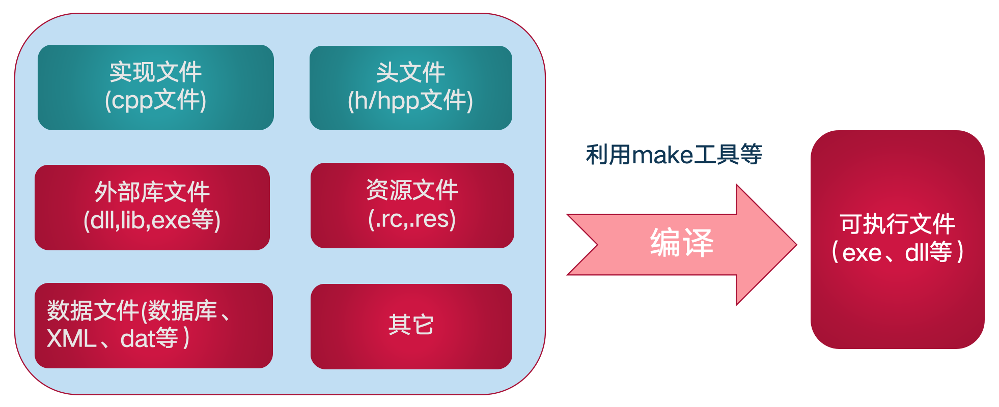
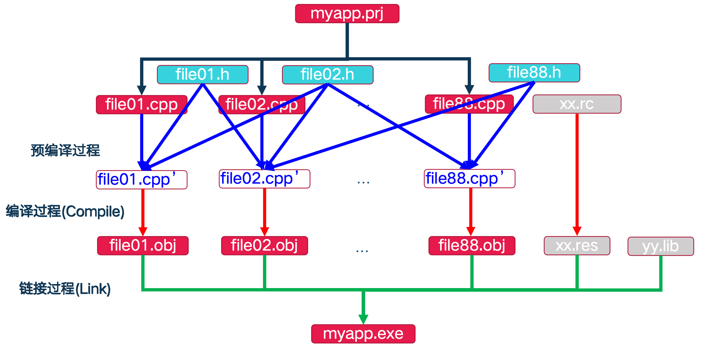
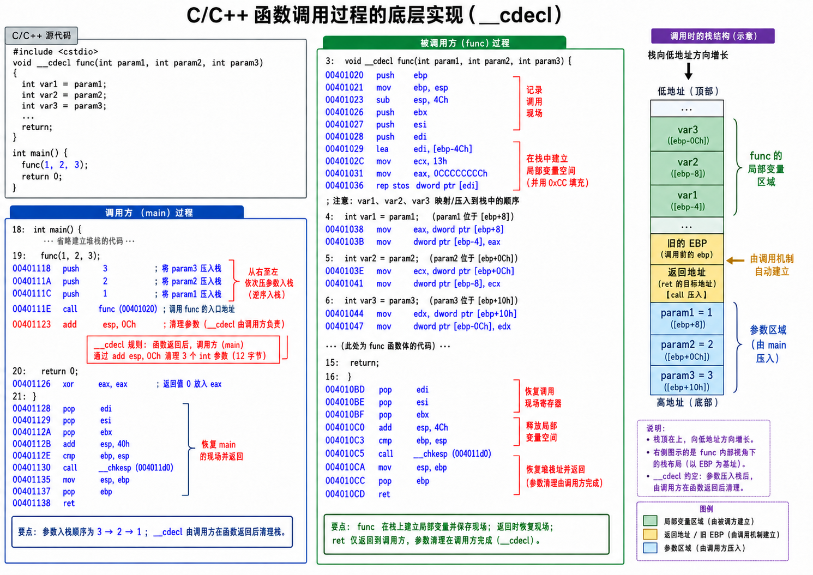

关于OOP，学校的oop考试似乎更注重类似八股文式的考法，甚至大题全部是手写代码，因此借此机会仔细梳理了一下C++的相关知识，虽然这门课考查方式比较阴间，但给分还是相当仁慈喵（

关于文章，似乎原版笔记因为字数、区块过多，全部堆在一篇博客中会造成明显卡顿，因此这里划分为不同章节以降低浏览器渲染压力（

## C++程序结构

### 组成



- 外部库文件 在编程时，我们通常不会从零开始造轮子（比如自己写一个控制显卡画图的代码）。我们会借用别人或者操作系统已经写好的、经过测试的代码，这就是“库”。 `lib`：静态库/导入库 `dll`：动态链接库 `exe`：外部库
- 资源文件 这些文件包含了程序界面和外观所需的**非代码元素**。它们会被直接嵌入到最终的可执行文件中。比如程序的图标（Icon）、鼠标指针样式、弹出的对话框布局、软件的菜单栏、版本信息（右键查看属性里的版本号），甚至是一些内置的图片和声音。 `.rc .res`：资源文件，程序员通常在一个纯文本的 `.rc` (Resource Script) 文件中定义这些资源的位置和属性。在编译时，专门的资源编译器会把 `.rc` 文件转换成二进制的 `.res` 文件，最终打包进 `.exe` 中。
- 数据文件 数据文件是程序在**运行期间**需要读取、修改或产生的文件。它们**不会**参与编译过程，而是作为独立的文件存放在 `.exe` 的同级目录或其他指定位置。 `XML`：可扩展标记语言，一种结构化的纯文本文件，长得很像 HTML网页代码，由各种标签（如 `<user><name>张三</name></user>`）组成。

### 编译过程



1. 预编译 为图中蓝色箭头所指，整个构建过程的第一步，由**预处理器**完成。 预处理器会处理源文件（`.cpp`）中所有以 `#` 开头的指令，最常见的主要是 `#include`（包含头文件）和 `#define`（宏定义）。图中蓝色的线将 `file01.h` 和 `file01.cpp` 指向了 `file01.cpp'`。这表示预处理器将头文件 (`.h`) 里的纯文本内容**直接复制粘贴**到了源文件 (`.cpp`) 中，替换掉了 `#include` 语句。同时，它也会展开宏定义、删除代码中的注释。生成一个体积更大、包含了所有依赖声明的“纯净版”源文件（图中标记为 `file01.cpp'`、`file02.cpp'`）。这个文件通常在后台生成并直接传给下一步，开发者一般看不到它。
2. 编译过程 为图中红色箭头所指，将人类可读的代码翻译成机器语言的核心步骤，由**编译器**完成。 编译器接收上一阶段生成的预编译文件（`.cpp'`），检查语法错误。如果语法完全正确，编译器会将这些 C++ 代码翻译成特定 CPU 架构能理解的二进制机器码。C++ 的编译单元是**独立**的。这意味着 `file01.cpp` 和 `file02.cpp` 是各自分别编译的，互相不知道对方内部的具体实现，只知道对方在头文件里承诺过的“声明”。* 每一个 `fileXX.cpp'` 都通过红色箭头生成了对应的目标文件 **`fileXX.obj`**（在 Linux 系统中通常是 `.o` 文件）。此外，资源文件（如图中的 `xx.rc`，包含程序的图标、对话框界面等信息）也会通过资源编译器被编译成二进制的资源目标文件 **`xx.res`**。产生一堆独立的二进制目标文件（`.obj` 和 `.res`）。此时这些文件还不能运行，因为它们之间是分散的。

```cpp
   //appmain.cpp
   #include "my.h"
   int main(){
     f(2);
     return 0;
   }

   //my.h
   #ifndef AAA
       #include <string>
   #else
       void f(int);
   #endif
```

上述举例两个文件在预编译后变成

```cpp
   //appmain.cpp
   #include <string>（这个string还会继续展开，在这里简写）
   int main(){
     f(2);
     return 0;
   }
```

这个时候编译器就会报错，因为预编译展开所有#给编译器器处理时发现出现在前面从未承诺过的f函数，因而在编译阶段产生报错

但是如果只是把main写成mian并不会有影响，他只会认为这里的函数名为mian，只有在接下来的链接过程发现找不到main函数了才报错，因为操作系统规定，任何一个标准的 C/C++ 可执行程序（.exe），都必须有一个统一的**入口点（Entry Point）**，这个默认的入口点名字就叫 `main`。链接器的工作是把所有的 `.obj` 文件组装起来，并寻找程序的入口。此时，它翻遍了所有生成的 `.obj` 文件，发现其中**找不到名叫 `main` 的函数**。既然找不到程序从哪里开始执行，链接器就会立刻停止工作，并抛出**链接错误（Linker Error）**。

3. 链接过程 为图中绿色箭头所指，最后一步“拼图”游戏，由**链接器**完成。 链接器负责将所有分散的部分“缝合”在一起。它会解决文件之间的相互引用问题（例如：`file01.cpp` 中调用了 `file02.cpp` 里定义的一个函数，链接器负责把这两个地址连接起来）。在图中即为绿色的线将所有的 **`fileXX.obj`**、资源文件 **`xx.res`**，以及外部的静态库文件 **`yy.lib`** 全部汇总在一起。最后将所有目标代码、资源和外部库打包，生成最终的、操作系统可以双击运行的 **`myapp.exe`** 文件。

具体来看，“链接过程”最核心的本质为**把符号（名字）替换成真实的内存地址。**

同时应当说明，每个`.obj`文件都有一份专属自己的**重定位表**和**符号表**


**重定位表**记录了：

**需要修补的位置 (Offset)：** 在当前目标文件的代码段（或数据段）中，哪个字节位置使用了假的占位地址，需要被链接器覆盖替换（例如偏移量 `0x0014` 处）。

**依赖的符号名称 (Symbol Name / Index)：** 链接器在覆盖这个位置时，应该去寻找哪个符号的最终绝对地址填入（例如填入 `add` 的最终地址）。

**重定位类型 (Type)：** 决定链接器如何计算最终要填入的值（例如是填入绝对物理地址，还是填入相对于当前指令的相对跳转偏移量）。


**符号表**记录了：

**符号名称 (Name)：** 例如函数名 `add` 或变量名 `global_count`。

**符号类型 (Type)：** 这是一个函数代码（Code），还是一个数据变量（Data）？

**绑定属性 (Binding)：** 它是全局可见的（Global），还是局部隐藏的（Local / Static）？

**所在的段 (Section)：** 这个符号定义在当前文件的哪个数据段中（例如 `.text` 代码段，或 `.data` 数据段）。

**内部相对偏移量 (Value/Offset)：** 这个符号的定义位于该段起始位置的偏移字节数（例如，相对于 `.text` 段起始位置偏移了 0x0030 字节）。

所以比方说在main函数编译过程中出现add函数的声明以及使用，却没有具体实现从而不知道具体实现地址时，会先用占位地址占位，会在自己main文件的重定位表记录下这一后续需要替换占位地址的请求，而其他main函数写了实现的会被正常写入自己main文件的符号表，而之后在math函数编译过程中出现add函数的声明以及具体实现，他会像前面main函数一样将这个正常写了实现的add函数记录在自己add文件的符号表中，最终在链接过程，链接器的核心本质开始体现，链接器会先合并所有的符号表，他读到main函数的重定位表有替换请求，然后查看总符号表，找到匹配的add函数并把其真实地址写入其中

这时又会遇到几种情况：

1. 完全同名且同参数的普通函数或全局变量，例如`fileA.cpp` 和 `fileB.cpp` 中都定义了 `int add(int a, int b)`，这时链接器会直接报错并终止链接，因为链接器在合并所有符号表时，就已经会发现存在两个绑定属性均为 Global 且名称完全相同的符号记录，这违反了单一定义规则（ODR），链接器无法决断该使用哪一个地址，会直接抛出“符号重定义 (Multiple Definition)”错误（例如 LNK2005）。
2. 同名但参数类型或数量不同的函数（函数重载），例如`fileA.cpp` 定义了 `int add(int a, int b)`，`fileB.cpp` 定义了 `double add(double a, double b)`，结果是正常链接，互不冲突，因为存在符号修饰，C++ 编译器在生成目标文件时，并不会将函数原名 `add` 直接写入符号表。它会根据函数名和参数类型列表，将其转换为唯一的字符串。例如`int add(int, int)` 可能在符号表中记录为 `_Z3addii`，`double add(double, double)` 可能在符号表中记录为 `_Z3adddd`，当 `main.obj` 请求调用 `int add(int, int)` 时，其重定位表中记录的依赖符号是 `_Z3addii`。链接器只需在全局符号表中精确匹配该名称，即可找到 `fileA.obj` 中的实现，不会与 `fileB.obj` 发生冲突。
3. 使用 `static` 修饰的同名函数或变量，例如`fileA.cpp` 定义了公开的 `int add(int a, int b)`，而 `fileB.cpp` 定义了 `static int add(int a, int b)`，结果是正常链接，`main.cpp` 会链接到 `fileA.cpp` 的版本，因为当编译器处理 `fileA.cpp` 时，`add` 函数在符号表中的绑定属性被标记为 **Global**，当编译器处理 `fileB.cpp` 时，由于遇到了 `static` 关键字，`add` 函数在符号表中的绑定属性被标记为 **Local**（本地/隐藏），链接器在进行全局符号解析（即“查表找人”）时，会忽略所有标记为 Local 的符号。因此，链接器在全局范围内只能看到 `fileA.obj` 提供的那个 Global 版本的 `add`，并将请求定位到该地址。

实际编译过程更加复杂，这里的说明只是便于理解

### main函数

C/C++普通可执行程序(exe)的起始函数

返回值： int 或void , 缺省为int。这里的缺省为int是指直接写main()，但这种写法在现代C++版本已经被废除，继续这么写会产生报错，后面更是要求main函数的返回值必须是int

参数部分：无 或 (int argc,char* argv[ ])

### 包含警戒

1. **传统派**：`#ifndef #define #endif`

```cpp
#ifndef MY_HEADER_H
#define MY_HEADER_H

// 你的代码声明（类、函数等）
int add(int a, int b);

#endif
```

它基于**宏定义**。当编译器第一次遇到这个文件时，`MY_HEADER_H` 还没有被定义，所以顺利进入 `#ifndef` 内部，定义宏并编译代码。当同一编译单元（.cpp 文件）再次尝试包含这个头文件时，发现宏已经定义过了，就会直接跳过 `#endif` 之前的所有内容。但需要注释宏命名的冲突问题，如果其他文件中定义过MY_HEADER_H，这个文件会被直接忽略

2. **现代派**：`#pragma once`

```cpp
#pragma once

// 你的代码声明（类、函数等）
int add(int a, int b);
```

它基于**物理文件**。当编译器看到这句指令时，它会在内部记录下这个**文件的物理路径**。在编译同一个 .cpp 文件时，如果再次遇到要求包含这个物理路径的指令，编译器连文件都不会去打开，直接忽略。

### 标准库头文件与自定义头文件

标准库：系统预定义的文件，其可执行代码通常存在于操作系统，或者随编译器一同发布。
属于标准C++的一部分。

`#include <...>` (尖括号 - 标准库/系统库)
编译器会**直接**去系统预设的标准库目录（比如装编译器时自带的 `include` 文件夹）或者你在项目配置里额外指定的外部依赖目录去找。
适用场景为C++ 自带的标准库（如 `<iostream>`, `<vector>`），或者操作系统的 API，以及第三方开源库。

`#include "..."` (双引号 - 自定义/本地头文件)
编译器会**优先**在你当前编写的源文件所在的本地目录中寻找。如果找不到，它会**退而求其次**，再去系统的标准库目录里找一遍。
适用场景为项目里自己写的头文件（如 `"my_class.h"`, `"utils.h"`）。

经典问题：

1. 全部以 `#include "a.h"` 形式定义好吗？
   虽然从语法和搜索机制上来说，你用 `#include "iostream"` 也能编译通过（因为找不到本地文件后，它会去系统目录找），但在工程上绝对不推荐这样做，一是**拖慢编译速度：** 对于每一个标准库文件，编译器都会先在你的本地文件夹里进行毫无意义的磁盘扫描，找不到才去系统目录找。在大型项目中，这会显著增加 I/O 开销，拖慢编译速度。二是**破坏代码可读性：** 尖括号和双引号在视觉上起到了“分类标记”的作用。别人看你的代码，一眼就能分清哪些是你自己写的业务代码，哪些是系统库。全用双引号会让人非常混乱。
2. 使用 `<>` 和 `""` 时，哪个形式放前边？
   虽然Google标准说是`“xxx”`放在前面，因为编译器最先处理 `my_math.h`。因为此时还没遇到 `#include <string>`，编译器会立刻对 `my_math.h` 里的 `std::string` 报错。这就**倒逼着你**必须去把 `my_math.h` 写完整，保证任何头文件都能独立编译（自包含）。但实际上并无明确语法规定，更多还是`<xxx>`在前面，符合使用习惯和一般约定，并且自己的头文件放前面导致和标准头文件冲突了，报错会报在标准头文件中导致难以溯源，似乎课上也说是尖括号放前面，实际考题概率不高，建议记住尖括号放前面保持习惯即可

## 类型和变量

### OOP语言中的类型

1. 基本类型： 语言内置的、最简单的数据表示，它们直接对应着内存中的几个字节，如整型 (`int`, `short`, `long`)、浮点型 (`float`, `double`)、字符型 (`char`)、布尔型 (`bool`)。 比较有意思的：
2. **自定义类型**：ADT的计算机语言表示，也是OOP的核心所在，如类 (`class`)、结构体 (`struct`)、枚举 (`enum`)。
3. 范型：一种“把类型当作变量来传递”的高级技术，目的是为了极致的代码复用，假设你要写一个“排序”功能，你需要为 `int` 写一遍，为 `double` 写一遍，为 `Student` 类再写一遍，这太低效了。泛型允许你写一个**参数化的通用模板**，规定“我不在乎传来的是什么类型，只要它能比较大小，我就能给它排序”。在C++中就有模板 (**Templates**)，比如标准库中的 `std::vector<T>`。这里的 `T` 就是一个类型参数。你可以填入 `vector<int>`，也可以填入 `vector<Student>`，编译器会自动为你生成对应的代码。
4. *元类型及元对象(meta type/meta object)：各类型的类型（C++暂不支持）*

### 内置类型

- **基本类型: char , wchar_t(宽字符)， int, float，(void)**
- 其中有意思的——`wchar_t`（Wide Character，宽字符）是为了解决国际化（尤其是处理像中文这样的大型字符集）而引入的一种基础数据类型。
  **`char` 的局限性：** 在 C/C++ 中，传统的 `char` 类型通常只占 **1 个字节（8 bits）**。这意味着它最多只能表示 $2^8 = 256$ 种不同的字符。这对于英文字母、数字和标点符号（ASCII 码表）来说足够了，但对于动辄几万个汉字的中文，或者日文、韩文以及现在的 Emoji 来说，1 个字节根本装不下。
  **`wchar_t` 的诞生：** 为了能在一个变量里塞下一个中文字符，C++ 标准委员会引入了 `wchar_t`。顾名思义，它比普通的 `char` 更“宽”，占用更多的字节，从而能表示更多的字符。
  `wchar_t` 的使用及其重要语法标志**大写字母 `L`**：

```cpp
  #include <iostream>
  #include <string>

  int main() {
      // 1. 声明单个宽字符：必须在字符前加 L
      wchar_t ch = L'中'; 

      // 2. 声明宽字符串：必须在双引号前加 L
      const wchar_t* str = L"你好，世界"; 

      // 3. 使用 C++ 标准库的宽字符串类：std::wstring
      std::wstring wStr = L"Hello C++";

      // 4. 打印输出：不能用普通的 cout，必须用配套的 wcout
      std::wcout << wStr << std::endl;

      return 0;
  }
```

虽然 `wchar_t` 是 C++ 标准的一部分，但标准**并没有规定它到底占几个字节**，这就导致了一个巨大的历史遗留坑：**在 Windows 平台上（MSVC 编译器）：** `wchar_t` 占 **2 个字节（16 bits）**。它通常使用 UTF-16 编码；**在 Linux / macOS 平台上（GCC / Clang 编译器）：** `wchar_t` 占 **4 个字节（32 bits）**。它通常使用 UTF-32 编码。
因此这也不太可能考，了解即可

- **基本类型的扩展：<类型修饰> 基本类型**
  **类型修饰： short、long、signed、unsigned、double**
- **bool型：非零=true，零=false**

后面C++1z又新增了类型：如 long long ，编译期推导类型（auto，decltype)

- **auto：根据“初始值”推导类型**

1. 基本用法与规则

   使用 `auto` 声明变量时，**必须立刻对其进行初始化**，否则编译器无法推导。

   ```cpp
   auto a = 10; // 推导为 int
   auto b = 3.14; // 推导为 double
   auto c = "hello"; // 推导为 const char*
   ```
2. 最爽的场景：替代冗长的类型名

   在没有 `auto` 之前，遍历标准库容器的迭代器写起来非常痛苦：

   ```cpp
   std::map<std::string, int> myMap;

   // 以前必须这么写：
   for (std::map<std::string, int>::const_iterator it = myMap.begin(); it != myMap.end(); ++it) {
       ...
   }

   // 有了 auto 之后：
   for (auto it = myMap.begin(); it != myMap.end(); ++it) {
       ...
   }
   ```
3. 核心大坑：`auto` 会剥离（丢弃）引用和顶层 const
   这是初学者最容易踩的坑。为了保证新变量是一个独立的副本，`auto` 默认会**扒掉**原变量的 `const` 属性和引用属性 (`&`)。

   ```cpp
   const int x = 5;
   int& ref = x;
   auto y = x; // y 是普通的 int，顶层 const 被丢弃了。你可以修改 y 的值。
   auto z = ref; // z 是普通的 int，不是引用，它是 ref 所指对象的一个拷贝。

   // 如果你想保留 const 和引用，必须显式加上：
   const auto& safe_ref = x; // safe_ref 现在是 const int&
   ```

- **decltype：精准提取“表达式”的类型**

1. 基本用法与规则 与 `auto` 不同，`decltype` **不需要你对变量进行初始化**。它在编译期仅仅是做类型分析，**绝对不会执行**括号里的代码。

   ```cpp
   int x = 5;
   decltype(x) y; // y 被声明为 int，不需要初始化
   decltype(x + 3.14) z; // z 被声明为 double，因为 int + double 结果是 double。注意 x+3.14 不会被实际计算。
   ```
2. 核心特性：绝不剥离

   与`auto`不同，`decltype` 会**100% 完美保留**变量的 `const` 属性和引用属性 (`&`)。

   ```cpp
   const int x = 5;
   const int& ref = x;
   decltype(x) a = 10; // a 完美继承了 x 的类型，是 const int。
   decltype(ref) b = x; // b 完美继承了 ref 的类型，是 const int&。注意：既然是引用，就必须在声明时绑定对象。
   ```
3. 最爽的场景：泛型编程中的返回值推导

   在写模板函数时，你可能不知道两个未知类型相加后到底是什么类型，这时候就可以用 `decltype`：

   ```cpp
   // C++11 的尾置返回类型语法
   template <typename T1, typename T2>
   auto add(T1 a, T2 b) -> decltype(a + b) {
       return a + b;
   }
   ```

   这里又用到了尾置返回类型，首先简单介绍一下这里的范型编程和模板

   假设没有模板，写两数相加，要写很多类型重载：

   ```cpp
   int add(int a, int b) { return a + b; }
   double add(double a, double b) { return a + b; }
   double add(int a, double b) { return a + b; }
   double add(double a, int b) { return a + b; }
   ```

   但如果使用了模板 `template <typename T1, typename T2>` ，代码里实际调用 `add(5, 3.14)` 时，编译器会偷偷观察你传进去的值，发现 `5` 是 `int`，于是决定 **`T1 = int`**，发现 `3.14` 是 `double`，于是决定 **`T2 = double`**，但这时候a+b的返回值如何处理呢？
   传统写法：

   ```cpp
   template <typename T1, typename T2>
   ??? add(T1 a, T2 b) {
       // 返回值写什么？写 T1 还是 T2 都不对！
       return a + b;
   }
   ```

   强行使用 `decltype`（既然不知道，那我们就用 `decltype` 让编译器自己算啊！）：

   ```cpp
   template <typename T1, typename T2>
   decltype(a + b) add(T1 a, T2 b) {
       // ❌ 编译直接报错！
       return a + b;
   }
   ```

   **为什么报错？** 因为 C++ 编译器解析代码是**严格从左往右**的。 当编译器读到最前面的 `decltype(a + b)` 时，参数 `(T1 a, T2 b)` 还没登场，编译器根本不知道 `a` 和 `b` 的存在，所以直接报错说“未声明的标识符”。
   最终C++11尾置返回类型的解法：

   ```cpp
   template <typename T1, typename T2>
   auto add(T1 a, T2 b) -> decltype(a + b) {
       return a + b;
   }
   ```

   代码的运作逻辑是这样的：
   1. **`auto`（占位符）：** 编译器从左往右读，先看到 `auto`。在这里，`auto` **不是用来做类型推导的**，而是告诉编译器这里是占位用的
   2. **`add(T1 a, T2 b)`（参数出场）：** 编译器接着往后读，终于看到了参数列表。现在，编译器在当前作用域里正式认识了变量 `a` 和变量 `b`。
   3. **`-> decltype(a + b)`（揭晓谜底）：** 紧接着箭头 `->` 出现了，这叫“尾置返回类型”。因为前面已经声明了 `a` 和 `b`，所以现在 `decltype(a + b)` 可以合法运作了。编译器成功推断出 `a + b` 的真实类型，并把它填回到前面 `auto` 占的那个坑里。

### 使用typedef的自定义类型

**typedef本质上没有增加新类型**，通常用于简化复杂的类型声明，或者提高代码在不同平台间的可移植性。

1. 基础类型的重命名 **语法格式：** `typedef <已知类型> <新类型名称>;` **实际效果与目的：**
2. **简化代码书写：** `unsigned char` 写起来比较冗长，定义为 `UCHAR` 或 `uint` 后，后续声明变量时代码会更紧凑。
3. **等价替换：** 编译器在处理代码时，会将新名字直接视为原类型。因此 `UCHAR ch = 'a';` 在编译阶段与 `unsigned char ch = 'a';` 是绝对等价的。
4. **语义化与跨平台（如 DWORD）：** `DWORD`（Double Word）是 Windows API 中非常常见的自定义类型。通过 `typedef`，程序员可以将底层的数据类型抽象为具有特定业务或系统含义的名称，当底层系统架构发生改变需要更改数据长度时，只需修改一处 `typedef` 即可。 语义化是指：

   ```cpp
   // 在公共头文件中定义好业务类型
   typedef unsigned int HealthPoints;
   typedef unsigned int AccountBalance;
   typedef unsigned int PlayerID;

   // 在业务代码中使用
   HealthPoints hp = 100;
   AccountBalance balance = 500;
   PlayerID id = 1;
   ```

   使得代码变得好读

   ```cpp
   void takeDamage(unsigned int a, unsigned int b);
   void takeDamage(PlayerID target, HealthPoints amount);
   unsigned int result = calculatePlayerState(player);
   HealthPoints result = calculatePlayerState(player);
   ```

   跨平台与应对架构改变（以 DWORD 为例）是指： 在 C++ 中，`int` 和 `long` 这种基础类型的大小是**不固定**的，它们会随着编译器和操作系统（16位、32位、64位系统）的变化而变化。
   假设你的程序非常依赖一个**绝对是 32 位长**的变量。
   **如果不使用 typedef：**
   你在整个项目的十万行代码里，写满了 `unsigned long`（因为在早年的 32 位系统上，它刚好是 32 位），而当软件要升级到64位系统时，需要**在十万行代码里，逐行搜索并修改**成 `unsigned int`。
   **如果使用了 typedef（只需修改一处）：**
   微软是怎么聪明的解决这个问题的呢？他们创建了一个“中间层”（别名）：

   ```cpp
   // 在系统底层的头文件（比如 windows.h）里：
   #ifdef 运行在16位系统
   typedef unsigned long DWORD; // 16位系统里，long 是 32 位
   #else
   typedef unsigned int DWORD; // 32/64位系统里，int 是 32 位
   #endif
   ```

   因而**不用管底层到底用的是 int 还是 long**。在十万行代码里全都使用 `DWORD`即可
5. **函数指针类型的重命名** **语法格式：** `typedef 返回值类型 (*新类型名称)(参数类型列表);` 本质上是**为了把一段极其复杂的“语法符号”，打包成能一眼看懂的“普通类型名”**。

```cpp
   int add(int a, int b) {
       return a + b;
   }
```

如果需要一个指针变量来指向上述函数，原始写法是：

```cpp
   int (*funcPtr)(int, int) = add;
```

即定义一个名叫 `funcPtr` 的指针变量，它指向一个返回值为 `int`、参数为两个 `int` 的函数，并把它初始化为 `add` 的地址

这时若要将其作为函数参数传入：

```cpp
   // 原始定义写法：极其反人类的参数声明
   void calculate(int x, int y, int (*callback)(int, int)) {
       int result = callback(x, y);
       cout << result;
   }

   // 使用
   int main() {
       // 调用 calculate 函数
       calculate(10, 5, add); //传入add，使得 int (*callback)(int, int) = add; 从而真正确定函数指针的地址
       return 0;
   }
```

即传入x、y、z和一个极其难以阅读

而使用`typedef`即可把这一整套“函数签名（返回值+参数）”抽象成一个统一的类型名。

```cpp
   typedef int (*MathOperation)(int, int);
```

相当于告诉编译器我要给这种函数指针类型起别名了，这是一种返回值为`int`、参数为两个`int`的函数

之后在定义函数指针时语法就变得相当方便：

```cpp
   // 以前： int (*func)(int, int) = add;
   MathOperation func = add;  // 现在
   // 以前： void calculate(int x, int y, int (*callback)(int, int))
   void calculate(int x, int y, MathOperation callback) {
       int result = callback(x, y); // 执行传进来的函数
   }

   // 调用时：
   calculate(10, 5, add); // 把 add 函数当做参数传进去
```

此外还可以更通俗的实现函数指针数组：

```cpp
   int add(int a, int b);
   int sub(int a, int b);
   int mul(int a, int b);
   int div(int a, int b);

   // 像定义普通 int 数组一样定义函数指针数组！
   MathOperation ops[4] = {add, sub, mul, div};

   // 根据用户的输入（比如 0 代表加，1 代表减），直接调用：
   int userInput = 2; // 用户选择了乘法
   int result = ops[userInput](10, 5); // 相当于执行了 mul(10, 5)
```

而这里可以拓展一下，虽然 `typedef` 拯救了函数指针的语法，但 `typedef int (*Name)(int)` 这种把新名字“夹在中间”的格式依然有点反直觉。

从 C++11 开始，官方引入了 **`using`** 关键字，彻底解决了这个问题。现在的业界标准推荐这样写别名：

```cpp
   // C++11 现代写法，完美符合人类直觉：新名字 = 旧类型
   using MathOperation = int(*)(int, int);
```

### 枚举类型

```cpp
enum 枚举类型名 { 枚举值列表 };
```

规则：
枚举的底层值必须是**整数**。
如果不显式指定，**第一个枚举值默认从 `0` 开始**。
后续的枚举值如果没有显式指定，会自动在上一个枚举值的基础上 **`+1`**。

例如：

```cpp
enum WeekDay {MON=1, TUR, WED, THU, FRI, SAT, SUN=0 };

int main()
{
  WeekDay day1,day2;
  day1 = SUN,day2 = THU;
  cout << day1 << endl;
  int num = day2 + 100;
}
```

MON为显示指定，值为1，后续TUR到SAT为隐示指定，值为2-6，最终SUN打破规律重新显示指定，值为0

核心缺陷：

1. 内部就是`int`，没有真正实现严格的新类型隔离
2. 类型不安全，如代码示例中的 `day2 + 100`，枚举值可以随意和 `int` 相互转换、参与加减乘除运算。在软件工程中，让一个代表“星期四”的变量去加 100，在业务逻辑上通常是没有意义的，但编译器不会报错。
3. 同名枚举值冲突（作用域污染），也是enum最大的缺陷，例如会出现下述情况：

```cpp
   enum Dir { LEFT, RIGHT }; （此时 RIGHT 默认为 1）
   enum State { RIGHT, FAILED }; （此时 RIGHT 默认为 0）
```

此时编译器会发现同一个作用域里出现了两个名为 `RIGHT` 的常量，从而导致重定义冲突。如果忽略报错强行使用，`RIGHT` 到底是 0 还是 1 就会产生歧义。

### 强类型枚举

```cpp
enum class 枚举类名 { 枚举值列表 };
```

引入 `enum class`（或 `enum struct`）后，使强类型枚举有以下优势：

1. 枚举值可以指定类型、指定数值，可以显式指定它占用多大内存。例如指定为 `char`、`unsigned int` 等，这在底层开发、内存敏感场景或网络协议解析中非常有用。
2. 枚举值不再允许与int随意转换、比较，`enum class`已经是完全独立的新类型。要想把枚举值当整数用，必须进行**显式的强制类型转换**
3. 使用时必须指明作用域scope(即枚举类名)，解决了命名冲突

```cpp
enum class AAA : unsigned int {
    A = 'a', //字符 'a' 的 ASCII 码值是 97
    EF = 120
};

//需指定作用域，类型是完全隔离的新类型即强类型enum class，需强制显示转化为int才能被cout重载输出
cout << (int)(AAA::A) << endl;
cout << (int)(AAA::EF) << endl;
```

但这里的底层类型依然是整型，**允许**`int`, `char`, `short`, `long`, `long long` 以及它们的无符号版本（如 `unsigned int`, `uint8_t` 等），**绝对不允许**字符串（`std::string` 或 `const char*`）、浮点数（`float`, `double`）、乃至任何用户自定义的类或结构体。

也因此**强类型枚举`enum class` 完全保留了“后一个枚举值自动比前一个加 1”的特性。**

`enum class`也与`enum struct`完全等价没有区别

### 自定义类型

- **`class`** 和 **`struct`** 的区别仅仅在于没有显示指定时，`class`默认是**private**，`struct`默认是**public**
- **`union`** 联合体，核心特征为**共享内存**，例如：

```cpp
  union MyData {
      int i;      // 通常占用 4 字节
      float f;    // 通常占用 4 字节
      char c;     // 占用 1 字节
  };
```

此时**大小由“最大”的成员决定**：因为 `union` 的所有成员都共享同一块内存地址，所以系统分配给 `union` 的总内存大小，只需要能装下它**最大的那个成员**即可。在上面的例子中，最大成员占用 4 字节，所以整个 `MyData` 联合体的大小就是 4 字节，而不是把它们加起来（4 + 4 + 1 = 9 字节）。

```cpp
  MyData data;
  data.i = 10;     // 此时内存里存的是整数 10
  data.f = 3.14f;  // 此时浮点数 3.14 写入了同一块内存！之前的整数 10 被覆盖破坏了。

  // 如果这时候你去读取 data.i，你会得到一个完全无意义的错乱数字
  // 因为这 4 字节的内存现在是以 float 的格式排列的
```

在特定场景下`union`非常有用：

1. **极度节省内存**：在单片机、嵌入式系统或操作系统内核等资源极其紧张的环境下，如果有一组变量**绝对不可能同时被使用**（比如一个状态机，要么处于状态A需要用到变量X，要么处于状态B需要用到变量Y），使用 `union` 可以有效压榨内存空间。
2. **底层数据解析 (Type Punning)**：有时候程序员需要直接操作底层二进制位。例如，在网络编程中，接收到 4 个字节的数据，你想把它当成一个 `int` 读出来，或者当成 4 个单独的 `char` 读出来。`union` 提供了一种直接观察同一块内存不同数据类型“长相”的手段。 在现代 C++ (C++17 之后) 中，为了更安全地实现“在多个类型中任选其一”的功能，官方更推荐使用标准库中的 **`std::variant`**，它是一个“类型安全”的联合体，不会发生意外读取覆盖数据导致崩溃的问题，例如：
3. 翻译规则错乱（产生垃圾数据）

   ```cpp
   union MyNumber {
       int i;
       float f;
   };
   MyNumber num;
   ```
   1. **写入数据**：你执行了 `num.f = 3.14f;`。计算机会用**浮点数的规则**，把 `3.14` 转换成特定的 32 位二进制存进这个单间里（比如 `01000000 01001000 11110101 11000011`）。
   2. **意外读取**：几个月后，你（或者你的同事）忘记了里面存的是小数，错误地执行了 `cout << num.i;`，试图用**整数的规则**把里面的客人叫出来。
   3. **结果**：计算机非常听话，它不管三七二十一，直接把那串为了 `3.14` 准备的二进制，死板地按整数规则翻译出来。结果你会在屏幕上看到一个莫名其妙的巨大数字，比如 `1078530011`。 这时候程序**还没有崩溃**，但这叫**数据被破坏**（Data Corruption），你的游戏可能会出现血量变成十亿，或者人物直接飞出地图等严重逻辑Bug。
4. 真正的崩溃（Segmentation Fault / 内存越界）

   ```cpp
   union DangerousUnion {
       int secret_code; // 普通整数
       char* text_ptr; // 指向一段文字的指针（地址）
   };
   DangerousUnion data;
   ```
   1. **正常情况**：你让 `text_ptr` 指向了一段文字 `"Hello"`。此时 `union` 内存里存的是一个**合法的内存地址**（比如 `0x7FFF0011`）。
   2. **发生覆盖**：你突然给它赋了一个整数：`data.secret_code = 42;`。此时，原来的合法地址 `0x7FFF0011` 被彻底抹掉了，被覆盖成了数字 `42` 的二进制。
   3. **灾难降临**：稍后，程序试图去打印那段文字，它读取了 `data.text_ptr`。计算机取出数字 `42`，并把它当成了一个**内存地址**。程序试图强行闯入内存地址为 `42` 的房间。
   4. **系统制裁**：操作系统（Windows/Linux）一直在监控程序的行为。它发现你的程序试图访问一个根本不存在、或者属于系统核心的非法内存地址 `42`。为了保护整个电脑不被破坏，操作系统会直接把你的程序“击毙”——这就是我们在 C/C++ 中最害怕的 **Segmentation Fault（段错误）**，程序直接闪退崩溃。 而额外的，要理解为什么读取“地址 42”会被操作系统认为是“非法的”，我们需要了解现代操作系统（如 Windows、Linux、macOS）是如何管理和保护内存的。
      你可以把计算机的内存想象成一座拥有几十亿个房间的超级大厦，每个房间都有一个门牌号（内存地址），从 0 开始一直编号到几十亿，操作系统在分配和管理这些房间时，有一套非常严格的“内存保护（Memory Protection）”制度：
   5. **低地址保护区 / 零页保护**：
      在绝大多数现代操作系统中，内存的最开始的一大段区域（通常是从门牌号 `0` 到 `65535` 左右）被故意设置为“禁区”。所以这里你把已经地址已经存上了int类型42的数字当成了内存地址，然后顺着他去访问门牌号42这个内存地址所指的数据，会闯入低地址保护区，从而引发报错
   6. **内核空间保护** 如果你的 `union` 里被意外覆盖的不是 `42`，而是一个非常大的数字（比如 `3,221,225,472`），从而绕过了低地址保护区，其又可能指向高地址空间，而这里往往又是被内核kernel所保留的，因而程序依然会崩溃。
   7. 发现并击毙的过程

      你的 CPU 里有一个专门的硬件模块叫 MMU（内存管理单元）。每次你的程序试图读取任何一个内存地址时，MMU 都会检查你访问的合规性，例如当 CPU 试图访问地址 `42` 时，MMU 查了一下权限表，发现该地址属于“禁区”，会直接向 CPU 发出一个 **硬件中断（Exception）** 的信号，CPU 收到中断后，立刻暂停你的程序，把控制权交给操作系统，操作系统一看，发现你的程序试图越权访问。为了防止你的错误代码把整个系统搞瘫痪（在早期的 DOS 系统或 Windows 98 中，这种行为真的会让电脑直接蓝屏死机），现代操作系统会果断发送一个致命信号（在 Linux 下叫 **`SIGSEGV` / 段错误**），直接将你的进程强制终止（闪退）。

### 导出类型

```cpp
int a[5];  MyClass objs[3]; //数组
int *p = 0;  MyClass *pobjs[4];  int **pp = &p; //指针
int a = 100;  int &b = a; //引用（a为左值）
int&& r = 10; //右值引用（10为右值）
```

**左值和右值**：在 C++ 中，能够取地址、有名字的变量通常叫**左值**（如上面的 `a`）。而那些临时的、没有名字的、马上就要被销毁的数据叫**右值**（比如字面量数字 `10`，或者一个函数返回的临时对象）。

**右值引用的作用**：普通的引用（左值引用 `&`）不能直接绑定到右值上。右值引用的语法是两个 `&` 符号（例如 `int&& r = 10;`）。它最主要的应用场景是实现**移动语义（Move Semantics）**：允许程序直接“接管”临时对象的内存资源，而不是进行昂贵的深度拷贝，从而大幅度提升程序的运行效率。

### 声明与定义

**声明**：

```cpp
extern int a;           // 声明外部整型变量a
extern const int c;     // 声明外部整型常量c
int f(int);             // 声明函数f
struct S;               // 声明结构S
typedef int Int;        // 声明类型 Int
extern X anotherX;      // 声明外部变量anotherX
using N::d;             // 声明名字d
```

**定义**：

```cpp
int a;                       // 定义a
extern const int c = 1;      // 定义c
int f(int x) { return x+a; } // 定义 f 和 x
struct S { int a; int b; };  // 定义S、S::a、和S::b
struct X {                   // 定义 X
    int x;                   // 定义非静态数据成员x
    static int y;            // 声明静态数据成员y
    X(): x(0) { }            // 定义X的构造函数
};
int X::y = 1;                // 定义 X::y
enum { up, down };           // 定义up 和 down
namespace N { int d; }       // 定义N 和 N::d
namespace N1 = N;            // 定义N1
X anX;                       // 定义anX
```

在 C++ 中，判断一个变量是不是“定义”，就看编译器有没有在这一行代码为它“分配真实的内存空间”。


对于`int a;`和`extern int a;`，当你写下 `int a;` 时，编译器看到这句话，会立刻执行一个动作：在内存中划出一块 4 个字节的空间，并在内部字典里记录“这 4 个字节的地址，以后就叫 `a`”。 既然**分配了实体空间**，它就完成了“从无到有”的创造过程，所以它是**定义**。

**绝大多数情况下，它默认被赋予了脏数据！** 而具体情况取决于这个 `int a;` 写在哪里

**情况 A：写在函数内部（局部变量）** 如果你在一个函数里写 `int a;`，这块内存在“栈（Stack）”上分配。栈内存是反复循环使用的。系统把这 4 个字节分给 `a` 时，**根本不会好心地去帮你清零**。这 4 个字节里，保留着上一个使用这块内存的程序留下的历史二进制残骸。 当你把这堆残骸强行当成 `int` 读出来时，就会得到一个乱七八糟的数字（比如 `-858993460`），这就是所谓的**脏数据（Garbage Value）**。这也是为什么`int a`这种写法会被特意指出“**无初始化，不建议**”。

**情况 B：写在所有函数外部（全局变量）** 如果你把 `int a;` 写在全局作用域，操作系统会在程序启动时，统一将全局变量所在的内存区域（BSS段）强制清零。这时候它默认是 `0`，不是脏数据。（但这属于系统底层的保底机制，良好习惯依然是手动赋值）。

然而`extern int a;`却是声明，原因在于`extern`为外部链接关键字，其指出在其他的某个文件里，肯定有定义了 `int a;`的地方并分配了空间，而现在只是先暂用这个名字，用占位地址表示，最后链接的时候再替换其为真实地址，这也就和前面提到的编译过程中用到的重定位表和符号表相对应上了。

对于`using N::d`，需要先了解C++种命名空间（namespace）的知识：
在大型 C++ 项目中，可能会有一万个变量，为了防止重名，我们会把变量装进不同的“文件夹（命名空间）”里。

```cpp
namespace N {
    int d = 100; // 在 N 这个文件夹里，定义了一个变量 d
}
```

正常情况下，你想在外面用这个 `d`，必须带上文件夹的名字，写成 **`N::d`** （意思是 N 里面的 d）。
假设你现在写了一个函数，里面要频繁用到这个 `d`。每次都写 `N::d` 太烦了，你就可以写一句声明：

```cpp
void myFunction() {
    using N::d;   // 声明：接下来的代码里，我只要说 d，指的就是 N 里面的那个 d！

    int x = d + 1; // 编译器会懂，这里的 d 其实是 N::d
}
```

而这里判断他是声明还是定义，便也可以回到开始的核心原则，即**看有没有分配新的内存**，当你写 `using N::d;` 的时候，你只是在当前的区域建立了一个**快捷方式（别名引用）**，指向了早就存在于命名空间 `N` 里的那个 `d`。你并没有创造一个新的变量，也没有为它开辟任何新的内存空间。

**使用原则**

1. **就近原则**

```cpp
   //旧C语言风格（集中声明）
   int main( )
   {
       int i, j, k ;
       for(i=0;i<10;++i) {
           for( j= 1;j<20;++j) {
               k = f( i, j );
               // use k
           }
       }
   }

   //现代 C/C++ 语言风格（就近声明）：
   int main( )
   {
       for(int i=0;i<10;++i) {
           for(int j= 1;j<20;++j) {
               int k = f(i,j);
               // use k
           }
       }
   }
```

变量应该在即将被使用时才进行声明和初始化（例如直接在 `for` 循环的初始化语句中写 `int i = 0;`）。这样不仅能缩短变量的作用域（生命周期），还能有效避免变量未初始化就被使用的问题。

2. **先声明后使用原则** 编译器在处理代码时是从上往下扫描的，必须先知道标识符的存在和类型，才能合法地使用它。两个典型的应用场景：
   1. **跨文件使用全局变量（左侧/中侧）：**

      ```cpp
      //a.cpp
      int count =1;
      int main() { }

      //b.cpp
      extern int count;
      void f( ) {
          count = 10;
      }
      ```

      如果在 `b.cpp` 中想使用在 `a.cpp` 中定义的全局变量 `count`，不能直接使用，必须先在 `b.cpp` 中通过 `extern int count;` 声明它，告诉编译器这个变量存在于外部的其他文件中。
   2. **类的前向声明（右侧）：**

      ```cpp
      //dog.h
      class Bone;
      class Dog {
      public:
          void Eat(Bone * p);
      };
      ```

      在 `dog.h` 中，`Dog` 类的一个成员函数 `Eat` 需要接收一个 `Bone` 类型的指针。为了满足“先声明后使用”，同时又避免直接包含 `Bone` 的完整头文件（以减少编译依赖），这里使用了 `class Bone;` 进行前向声明（Forward Declaration）。
3. **单一定义规则（ODR - One Definition Rule）及其陷阱**： 单一定义规则指出：在同一个编译单元中，同一个标识符（变量、函数等）只能被**定义一次**，但可以被**声明多次**。

   ```cpp
   //反例1：同一文件内重复定义
   //a.cpp
   int count =1;
   int count =1;
   int main() { ... }

   //反例2-a.h：将定义直接放在头文件中（这也是为什么要求头文件只声明，编译过程预处理展开后可能会导致多重定义错误）
   int count =1; //变量count定义
   int f( int n) { //函数f定义
       return 1;
   }

   //反例2-a.cpp
   #include "a.h"
   void main( ) {
       count = 10;
       f( count );
   }

   //反例2-b.cpp
   //b.cpp
   #include "a.h"
   void g( ) {
       int n = f(count);
   }

   //反例2-a.h：尝试添加包含警戒修复
   #ifndef AH
   #define AH
   int count =1;
   int f( int n) {
       return 1;
   }
   #endif
   ```

   这里反例1很好理解，反例2则是在预处理后，a.cpp展开了a.h，b.cpp也展开的a.h，然后各自编译产生a.obj和b.obj，最后在链接时，发现a.obj、b.obj同时有关于变量count和函数f的定义，于是重复定义引发链接失败。
   由上面推导可知，**反例2这里添加包含警戒并不能修复重复定义问题** ，因为头文件警戒线只能防止同一个头文件在一个 `.cpp` 文件中被重复展开，但在本例中，`a.cpp` 和 `b.cpp` 作为两个独立的编译单元，各自展开了一次头文件，编译阶段可以通过，但在最终的**链接阶段（Linking）**，链接器会发现两处都存在 `count` 和 `f` 的实体定义，从而抛出“多重定义（Multiple Definition）”的严重错误。

### 变量的定义和初始化

**C++98：传统的变量定义与旧语法**

1. 复合定义与连续初始化

```cpp
   int state=1, age, weight=10, val=weight;
```

- 同一行可以定义多个同类型变量。
- `age` 没有赋初值。如果它是局部变量，它的值将是内存中的“垃圾随机数”，非常危险。
- `val=weight` 证明变量可以用已经定义并初始化过的另一个变量来初始化。

2. 文件级静态变量（`static` 的隐藏属性）

```cpp
   static long count; // 函数外的static变量
```

- **含义：** 当 `static` 写在所有函数外面（全局位置）时，它不再表示“生命周期长短”，而是表示**文件可见性（Internal Linkage）**。
- **效果：** 变量 `count` 只能在当前的 `.cpp` 文件内部被访问，其他源文件即使加了 `extern` 也绝对无法看到它。
- *备注：* 幻灯片中的红字提到“C++1z（即 C++17）应使用匿名名字空间取代”，在现代 C++ 中，我们更倾向于用 `namespace { long count; }` 来代替这种全局 `static` 写法。

3. 旧时代的 `auto`（已废弃）

```cpp
   auto float r=0.5; 
```

- **含义：** 在 C++98 中，`auto` 代表“自动存储期变量”（即分配在栈上的局部变量）。
- **为什么废弃：** 因为函数内部定义的普通变量默认就是栈变量，所以写 `auto` 纯属画蛇添足。

**C++11：现代 C++ 的两大进化**

1. 列表初始化（Brace Initialization）

```cpp
   int val2{weight};
```

- **新语法：** C++11 允许直接使用大括号 `{}` 来初始化变量，不再强求用等号 `=`。
- **核心优势（安全）：** 列表初始化具有 **防止窄化转换（Narrowing Conversion）** 的机制。例如，如果你写 `int x = 3.14;`，编译器会默默把 `3.14` 斩断成 `3`（引发精度丢失）；但如果你写 `int x{3.14};`，编译器会直接报错，强制你在编译阶段就发现这个潜在的 Bug。

2. `auto` 关键字的蜕变（自动类型推导）

```cpp
   auto val3 = r;
```

- **新含义：** C++11 彻底废弃了 `auto` 原来的“栈变量”含义，将其改造为**自动类型推导**。
- **工作原理：** 编译器在编译这行代码时，会看等号右边的 `r` 是什么类型。因为 `r` 是 `float`，编译器就会自动把 `val3` 的类型替换为 `float`。
- **实际价值：** 面对极其复杂的类型（例如容器的迭代器 `std::vector<int>::iterator`），你不需要再写长长的一串，直接一个 `auto` 就能让代码变得极其清爽。

### 变量的存储空间

老师ppt中介绍的似乎是**内存五区**，即：**代码区**、**常量数据区**、**变量数据区**、**栈区**、**堆区**

```cpp
int n = 100;    //全局变量n，放在变量数据区，即内存四区概念下的全局/静态区

//假设main函数调用f函数时，系统会立刻在main的栈帧上方再压入一个f的栈帧，当f执行完时，f的栈帧瞬间被整体弹出销毁
int f(int n) {    //函数f的形参n，放在f的栈帧里，即栈区，会随栈帧的弹出一同被销毁
    static int m = 8;    //函数内的static，静态局部变量m，放在变量数据区，不在栈帧中，因而不会因栈帧的弹出而销毁
    return m + n;
}    //函数f内的两行代码，被编译成二进制指令，放在代码区，并且只读，其中的数据记为其他区的地址，执行时调用

//程序首先进入主函数，即main函数，在栈区压入一个main的栈帧
int main() {
    int i = 10;    //main函数的局部变量i，main的栈帧里腾出地方放入这个数据，因此其放在栈区
    for (int j = i; j < 10; ++j) {    //for语句中的局部变量j，main的栈帧里腾出地方放入这个数据，因此其放在栈区
    }
    std::cout << "吉林大学";    //字符串字面量，在编译期就被死死刻在可执行文件的只读数据段，即.rodata段，其在常量数据区
}    //main函数的四行代码，被编译成二进制指令，放在代码区，并且只读，其中的数据记为其他区的地址，执行时调用
```

然而最常见的实际上是内存四区，为了方便区分理解，可以直接如下参照对应：

| **幻灯片五区划分** | **宏观归属** | **对应你的应试笔记区域** | **底层系统段 (ELF/PE)** |
| --- | --- | --- | --- |
| **代码区** | 程序区（静态加载） | **代码区** | `.text` 段 |
| **常量数据区** | 程序区（静态加载） | **全局/静态区** (常量部分) | `.rodata` 段 (只读数据) |
| **变量数据区** | 程序区（静态加载） | **全局/静态区** (变量部分) | `.data` 段 / `.bss` 段 |
| **栈区** | 动态运行区 | **栈区** | 运行时自动栈帧 |
| **堆区** | 动态运行区 | **堆区** | 运行时自由存储区 |

#### 内存四区

- **代码区** 存放C/C++代码编译后生成的机器指令(二进制代码)，CPU一条条读取这里的指令来执行程序 特性：

1. 只读：操作系统强制规定这块区域是只读的，防止程序在运行中意外把自己的指令改了导致崩溃或被黑客利用
2. 共享：打开两个同一个程序，比如同时开两个微信，内存上实际只有一份代码区，两个进程共享一份指令以此节约内存

- **全局/静态区** 存放全局变量(和#include这些放在一起)、静态变量(有static关键字)以及一些常量(有const关键字) 特性：

1. 变量的生命周期与程序绑定，程序启动时就分配内存，程序彻底关闭时才会被操作系统回收
2. (仅了解)这个区底层通常还分为.data段(存放已经初始化的变量，即给定了具体初值且初值不为0，例如写在“#include ”下的”global_val = 100;“，且这个100会在编译时直接写进二进制文件中，程序启动时再把100拷贝到内存里)和.bss段(存放未初始化的变量，例如定义了一个巨大的数组，但未初始化，如果放在.data段，二进制文件还没运行就多出了几MB的大小，但放在.bss段时，只有程序真正运行起来时操作系统才会根据这条信息在内存里划出这几MB的空间)

- **栈区** 存放函数的局部变量、函数的参数、以及函数调用是的返回地址，主打快进快出，自动管理 特性：

1. 全自动：当你调用一个函数时，系统自动在栈上为他的变量分配空间，函数已结束，这些空间立刻被自动释放
2. 先进后出：与函数调用息息相关，当你调用一个函数时，系统会为他分配一块内存(栈帧)，此时如main()函数开始运行(入栈)，main()内部调用了funcA()(入栈，并压在main上面)，funcA()内部又调用了funcB()(入栈，再压在funcA上面)，这样子只有funcB执行完出栈后轮到funcA跑，最后才是main，如此这样便可使计算机处理复杂的函数跳转
3. 空间极小、速度极快：栈在底层有专门的CPU指令支持，速度飞快，但他的空间非常有限，在Windows下默认通常仅1MB，故在函数中创建超大数组时会瞬间撑爆栈，造成个部分栈溢出的错误

- **堆区** 存放完全由程序员通过代码手动申请的内存，在C++中通过new申请，delete归还，在C语言中通过malloc申请，用free归还 特性：

1. 极其庞大：只要电脑的物理内存和虚拟内存够大，几乎可以在堆区申请几个G的空间
2. 手动管理：编译器不会帮忙管理堆区，需要自己手动申请和归还
3. 内存泄漏：若申请了堆区空间却忘记归还，这块内存永远成了死区，在程序结束前谁也用不了，如果程序时长时间运行，例如24h的服务器，会导致可用内存越来越少最后系统卡死崩溃

### 作用域

```cpp
#include <iostream>

// 全局/文件作用域部分
extern int global;
int state = 1;
static int filevar = 99; // 文件作用域

int f(int n) {
    static int sa = 9;   // 块级静态变量
    int m = sa;          // C++98下，等价于 auto int m = sa;
    auto k = sa + 8;     // 只在 C++11 (或图中注明的C++1z) 及以上有效
    return sa + n;
}

struct A {
    void fff() {}
    int val;             // 类级作用域
};

int main() {
    int k = 10;          // 块级作用域
    A aA;
    aA.val = 2;
    aA.fff();

    std::cout << "输出"; // 名字空间作用域 std::
    return 0;
}
#include <iostream>
using namespace std;

/// 全局数据区 - num (全局作用域)
int num = 999;

/// 全局数据区 - num2 (文件级作用域)
static int num2 = 8;

void func(int a, int b, int c) /// a, b, c 形参压入栈区
{
    /// 全局数据区 - n (块级作用域)
    static int n = 0;

    /// result 栈区 (块级作用域)
    int result = (a + b + c) * (++n);

    /// 字符串 "Result= " 在全局数据区（常量区）
    cout << "Result= " << result << endl;
}

int main() {
    int a = 10;        /// a 在栈区
    static int b = 20; /// b 在全局数据区

    func(a, b, 20);
    func(a, b, 20);

    /// 变量 p 本身分配在栈区，其指向的内存分配在堆区
    int *p = new int(55);

    // ... 其他代码

    delete p;          /// 释放堆内存
    return 0;
}
```

**全局作用域（Global Scope）**：在**所有函数外部**声明的变量（如 `int state=1;`、`int num = 999;`），在整个程序生命周期内有效，可被其他文件通过 `extern` 关键字引用。

**文件作用域 / 内部链接（File Scope）**：使用 `static` 修饰的**全局变量**（如 `static int filevar=99;`、`static int num2 = 8;`），其可见性被限制在当前源文件中，其他文件无法访问。

**块级作用域（Block Scope）**：在**花括号 `{}` 内部**声明的变量（包括**函数形参**、**局部变量**以及**局部静态变量** `static int sa = 9;`）。它们只在当前代码块内可见。

**类级作用域（Class Scope）**：**结构体或类内部**声明的成员（如 `struct A` 中的 `val` 和 `fff()`），必须通过对象、指针或作用域解析符（`::`）来访问。

**名字空间作用域（Namespace Scope）**：**位于特定命名空间内的标准库对象**（如 `std::cout`），需要通过 `using namespace` 或 `std::` 前缀访问。

### 表达式

**常见表达式分类**：

- 一般表达式和返回值
- `for`循环中的表达式：`for(初值表达式; 条件表达式; 步进表达式)`
- 逗号表达式：如 `x=100, y=x-1000;`
- 条件表达式：如 `if (表达式1 && 表达式2) {…}`
- 赋值表达式：如 `x=y=100+f(5);`

**左值与右值**：

- **左值表达式**：能够作为 `=` 号的左侧表达式，也可以作为右侧表达式。
- **右值表达式**：只能作为 `=` 号的右侧表达式。

**Lambda表达式（C++1z/C++17标准）格式**：

- 通用格式：`[capture] ( params ) mutable exception attribute -> ret { body }`
- 简化格式涵盖了省略返回值类型、省略参数列表等几种变体。

其中有意思的就是**lambda**表达式：

Lambda表达式代表的是一个**匿名（无名）的函数**。它可以像普通函数一样接收参数、执行代码并返回结果，但不需要显式地为其命名，通常用于需要临时定义短小函数的场景（如标准库算法的谓词）。
C++中的Lambda表达式共有4种基本书写格式，完整度依次递减：

```cpp
//完整格式
[ capture ] ( params ) mutable exception attribute -> retType { body }
//省略修饰符和属性
[ capture ] ( params ) -> retType { body }
//省略返回值类型（最常用之一）
[ capture ] ( params ) { body }    //注：此时函数的返回值类型由 body（函数体）中的 return 语句自动推演出来。
//无参简写格式
[ capture ] { body }    //注：省略了参数列表 ( params )，类似于一个无参函数 f()。
```


对于完整格式中的各个修饰符和组成部分：

**`mutable`（可变修饰符）**： 表明 `body` 内的代码**可以修改被按值捕获（capture）的变量**，并且可以访问被捕获对象的 `non-const`（非常量）方法。默认情况下，按值捕获的变量在Lambda内部是只读（`const`）的。

**`exception`（异常说明）**： 说明Lambda表达式是否抛出异常（如使用 `noexcept`），以及抛出何种异常。其效果类似于传统函数声明中的 `void f() throw(X, Y)`。

**`attribute`（属性声明）**： 用来为Lambda表达式声明特定的编译器属性。

**`retType`（返回值类型）**： 指明Lambda的返回类型。可以明确地指定（如 `int`、`bool` 或自定义类型等），也可以利用 `decltype` 关键字进行动态类型推演。

对于捕获列表（capture）机制：
捕获列表位于Lambda表达式最前面的方括号 `[]` 内，它**指定了 `body` 中可以访问的外部自动变量列表**。这是Lambda表达式区别于普通函数的核心特征。

| **捕获语法** | **捕获方式及读写权限** | **具体行为解释** |
| --- | --- | --- |
| **`[a, &b]`** | 混合捕获 | 变量 `a` 以 **传值（副本）** 方式捕获；变量 `b` 以 **引用** 方式捕获。 |
| **`[this]`** | 传值捕获 | 以**传值**的方式捕获当前类对象的 `this` 指针，允许在Lambda内访问该类的成员。 |
| **`[&]`** | 隐式全引用捕获 | 以**引用**的方式捕获所有的外部自动变量。在Lambda内部**可以修改**外部变量的值。 |
| **`[=]`** | 隐式全值捕获 | 以**传值**的方式捕获所有的外部自动变量。在Lambda内部**不可修改**外部变量（除非加了 `mutable`）。 |
| **`[]`** | 空捕获 | **不捕获**外部的任何变量。Lambda体内只能使用传入的参数和全局变量。 |

```cpp
#include <iostream>

using namespace std;

// 辅助打印函数
void show(int a, int b, int c) {
    cout << "a=" << a << "\t";
    cout << "b=" << b << "\t";
    cout << "c=" << c << endl;
}

int main() {
    int a = 10;
    int b = 20;
    int c = 40;

    // --- func1：空捕获 ---
    auto func1 = [](int & n) { return n += 5; };
    show(a, b, c);            /// 输出 a= 10 b= 20 c= 40
    show(a, b, func1(c));     /// 输出 a= 10 b= 20 c= 45
    show(a, b, c);            /// 输出 a= 10 b= 20 c= 40 (注：原幻灯片此处注释为40，但因传引用实际运行结果应为45)

    // --- func2：空捕获（测试外部变量访问） ---
    auto func2 = [](int & n) { return n += 5; };
    // auto func2 = [](int & n) { return n += 5 + a; }; // Error: 不能访问a
    show(a, b, c);            /// 输出 a= 10 b= 20 c= 40
    show(a, b, func2(c));     /// 输出 a= 10 b= 20 c= 45
    show(a, b, c);            /// 输出 a= 10 b= 20 c= 45

    // --- func3：隐式全值捕获 [=] ---
    auto func3 = [=](int & n) { return n += a+b; };
    // auto func3 = [=](int & n) { a=b; return n += a+b; }; /// Error: 不能修改a
    show(a, b, c);            /// 输出 a= 10 b= 20 c= 45
    show(a, b, func3(c));     /// 输出 a= 10 b= 20 c= 75
    show(a, b, c);            /// 输出 a= 10 b= 20 c= 75

    // --- func4：特定变量值捕获 [a] ---
    auto func4 = [a](int & n) { return n += a; };
    // auto func4 = [a](int & n) { return n += a+b; };      /// Error: 不能访问b
    // auto func4 = [a](int & n) { a=99; return n += a; };  /// Error: 不能修改a
    show(a, b, c);            /// 输出 a= 10 b= 20 c= 75
    show(a, b, func4(c));     /// 输出 a= 10 b= 20 c= 85
    show(a, b, c);            /// 输出 a= 10 b= 20 c= 85

    // --- func5：混合捕获（引用捕获b，值捕获a）+ 传引用参数 ---
    auto func5 = [&b, a](int & n) { ++b; return n += a+b; };
    show(a, b, c);            /// 输出 a= 10 b= 20 c= 85
    show(a, b, func5(c));     /// 输出 a= 10 b= 21 c= 116
    show(a, b, c);            /// 输出 a= 10 b= 21 c= 116

    // --- func6：混合捕获 + 传值参数（注意形参变为 int n） ---
    auto func6 = [&b, a](int n) { ++b; return n += a+b; };
    show(a, b, c);            /// 输出 a= 10 b= 21 c= 116
    show(a, b, func6(c));     /// 输出 a= 10 b= 22 c= 148
    show(a, b, c);            /// 输出 a= 10 b= 22 c= 116

    return 0;
}
```

Lambda 在现代 C++ 中的应用非常广泛，主要体现在以下几个场景：

1. 配合 STL 算法（最常见的用法） 在 C++11 之前，如果你想对 `std::vector` 进行自定义排序，或者使用 `std::find_if` 查找特定元素，你必须在外面单独写一个函数或仿函数（Functor）。有了 Lambda，你可以把逻辑直接写在调用的地方，让代码逻辑更加连贯。

```cpp
   #include <iostream>
   #include <vector>
   #include <algorithm>

   int main() {
       std::vector<int> nums = {4, 1, 3, 5, 2};

       // 使用 Lambda 进行降序排序
       std::sort(nums.begin(), nums.end(), [](int a, int b) {
           return a > b; 
       });

       for (int n : nums) std::cout << n << " "; // 输出: 5 4 3 2 1
       return 0;
   }
```

2. 状态保持与闭包 (Closures) 通过捕获列表，Lambda 可以记住并操作它被定义时的上下文环境。这在统计或累加操作时非常有用。

```cpp
   #include <iostream>
   #include <vector>
   #include <algorithm>

   int main() {
       std::vector<int> nums = {1, 2, 3, 4, 5};
       int total_sum = 0;

       // 按引用捕获 total_sum，每次遍历都会修改外部的 total_sum
       std::for_each(nums.begin(), nums.end(), [&total_sum](int x) {
           total_sum += x;
       });

       std::cout << "总和是: " << total_sum << std::endl; // 输出: 总和是: 15
       return 0;
   }
```

3. 简化多线程和异步编程 在并发编程中，我们经常需要把一段相对独立的代码交给新线程执行。Lambda 可以免去定义冗长线程函数的麻烦。

```cpp
   #include <iostream>
   #include <thread>

   int main() {    // 程序从main函数开始，默认在一个主线程中运行
       int thread_id = 42;

       // std::thread t(...)：这行代码立刻创建并启动了一个新的子线程，它被命名为t
       std::thread t([thread_id]() {    // Lambda 作为线程任务：[thread_id]：这里使用了按值捕获，因为子线程和主线程是并行运行的，按值捕获可以确保子线程拥有自己独立的数据副本，不会因为主线程的变量被销毁或修改而产生安全问题。
           std::cout << "正在运行线程 ID: " << thread_id << std::endl;    //{ std::cout ... }：这是子线程真正在后台并行执行的代码操作。
       });

       t.join(); // 等待线程结束
       return 0;
   }
```

4. 替代一次性的局部工具函数 有时你需要在一小段代码中重复执行某个逻辑（比如复杂的初始化计算），但这个逻辑只在这个局部有用。写成全局函数会污染命名空间，写成 Lambda 则刚刚好：

```cpp
   int main() {
       // 定义一个局部的 Lambda 函数
       auto print_greeting = [](const std::string& name) {
           std::cout << "Hello, " << name << "!" << std::endl;
       };

       print_greeting("Alice");
       print_greeting("Bob");

       return 0;
   }
```

## 指针、数组、引用、常量

### 指针

早期 C/C++ 中常用 `NULL` 表示空指针：

```cpp
int* p = NULL;
```

但 `NULL` 在很多实现中本质上是宏定义的 `0`，没有明确的指针类型，在重载、模板等场景中容易引发类型问题。

现代 C++ 推荐使用：

```cpp
int* p = nullptr;
```

`nullptr`有明确的空指针语义，类型更安全。

指针的运算：

```cpp
p + n
```

若p的类型为`T*`，上述式子则表示从 `p` 当前指向的位置开始，向后移动 `n` 个 `T` 类型元素，即移动`n * sizeof(T)`个字节

因为指针运算必须依赖`sizeof`，而`sizeof(void)`是未定义的，因而对`void*`类型的p进行运算是非法的

指针运算与数组下标的联系：

数组下标`a[2]`本质上是指`*(a+2)`，即先对指针a进行加2运算再将其解引用

### 数组

数组可以使用初始化列表：

```cpp
int a[3] = {1, 2, 3};
```

C++11 以后也可以使用更统一的花括号写法：

```cpp
int a[3]{1, 2, 3};
```

对于简单整数数组，两种写法都容易理解。对于后续更复杂的对象数组，花括号初始化会更统一。

不过要注意，虽然定义时是`Type name[constexp]`，但实际底层的类型是`Type[constexp]`，即这里数组`a`的完整类型签名应该是`int[3]`

数组长度必须是编译期常量：

传统 C++ 原生数组声明中，数组长度需要在编译期确定：

```cpp
const int n = 5;
int a[n]; // n 是编译期常量时可以
```

不能依赖运行时输入来声明普通栈上原生数组：

```cpp
int n;
cin >> n;
int a[n]; // 标准 C++ 中不应依赖这种写法，即使多数现代编译器为了方便已经引用了VLA即变长数组
```

这里的关键是：编译器在编译数组声明语句时，需要知道数组大小。

指针数组与数组指针

```cpp
int* p[5];    // 指针数组：p 是数组，底层类型为int*[5]
int (*p)[5];  // 数组指针：p 是指针，底层类型为int[5]
```

`(*p)` 优先说明 `p` 是指针，因为只有`*p`已经被绑定，`p`必须先是一个指针，才能承担`*`的解引用操作

示例：

```cpp
int a[5]{1, 2, 3, 4, 5};
int (*p)[5] = &a;

int value = (*p)[3];
```

`(*p)[3]` 的含义是：先通过 `*p` 得到 `p` 指向的整个数组，再访问下标为 `3` 的元素。

| 写法 | 名字本质 | 元素/指向对象 | 读法 |
| --- | --- | --- | --- |
| `int* p[5]` | `p` 是数组 | 每个元素是 `int*` | 指针数组 |
| `int (*p)[5]` | `p` 是指针，`*p`是数组 | 指向 5 个 `int` 组成的数组 | 数组指针 |

### 引用

一般说的引用是指左值引用，这里先讨论左值引用

```cpp
int a = 10;
int& b = a;
```

要求：

**引用的对象必须初始化**

```cpp
int& b; // 错误：引用必须初始化
```

原因是引用的含义是“别名”。没有真实对象，就不能凭空起别名。

引用和指针的区别：

**引用的使用形式更接近普通变量。**

```cpp
// 指针需要通过*p解引用来访问对象
int a = 10;
int* p = &a;
*p = 20;

//引用可以像原变量一样使用
int a = 10;
int& r = a;
r = 20;
```

且函数传参时也可看出其更接近于普通变量

```cpp
// 按值传参
void f(int a, int b) {
    a = 1;
    b = 2;
}

int x = 10;
int y = 20;
f(x, y);

// 指针传参
void f(int* a, int* b) {
    *a = 1;
    *b = 2;
}

f(&x, &y);

//引用传参
void f(int& a, int& b) {
    a = 1;
    b = 2;
}

f(x, y); // 调用方式仍用f(x,y)却能在函数内部直接修改实参
```

**引用和指针对比**

| 对比项 | 指针 | 引用 |
| --- | --- | --- |
| 定义形式 | `int* p = &a;` | `int& r = a;` |
| 是否必须初始化 | 可以不初始化，但不推荐 | 必须初始化 |
| 是否可以为空 | 可以是 `nullptr` | 通常没有空引用 |
| 访问对象 | `*p` | 直接用 `r` |
| 主要用途 | 地址操作、动态内存、可空关系 | 别名、函数参数、避免拷贝 |
| 调用形式 | `f(&a)` | `f(a)` |

#### 左值与右值

- **左值** 在内存中有地址
- **右值** 通常是寄存器里一段临时数据，或者是一个转瞬即逝的临时对象，一般是直接写在代码里的字面量、表达式的结果、取地址得来的地址值本身、返回普通值的函数调用、后置自增减

#### 引用的类型

- **左值引用**

```cpp
  int x = 10;
  int& ref = x;    //左值引用
  ref = 20;    //修改ref的值，x也跟随着改变
```

格式：**`type_name& ref = 左值;`**

相当于给x起别名ref，避免无意义的拷贝以优化性能

- **右值引用**

```cpp
  int&& rref = 10 + 20;    //右值引用
  rref = 40;    //rref现在是左值，可以被修改，即修改临时对象的值
```

格式：**`type_name&& rref = 右值;`**

使得C++有移动语义的特性，例如在vector容器里，底层的内存是一块连续的数组，当这块内存装满时会寻找一块更大的内存并将原来的数据移动过去，若原来的数据很多对象且没有移动语义的特性，需要一个个深拷贝过去，将会占据极多性能，但有了移动语义后，直接使用std::move，将很多对象的搬家变成指针的重新指向，耗时大大降低

- **常量引用**

```cpp
  const int& cref1 = x;    //常量引用绑定左值
  const int& cref2 = 100;    //常量引用绑定右值
```

格式：const type_name& cref = 左值/右值;

#### 使用场景

- 类中大量使用引用而非指针

1. 安全性更高：引用必须初始化，且不能重新绑定，避免野指针
2. 语法更简洁：无需显示解引用，代码更易读
3. 语义更清晰：引用强调“别名”，指针强调“地址”

- type_name&(普通左值引用)强硬要求传入一个左值，不接受右值，因为右值在执行完这行代码后会立刻销毁，引用指向的数据消失，也不接受常量，因为若接受，显然是权限的放大，这块数据从只读变成可读可写，显然是不可接受的
- const type_name&(常量引用)既可绑定左值又可绑定右值，因为const限制了这个数据的权限是只读不写，若无const，编译器会考虑到你会对这样一块编译器自己建出来的临时数据操作，并且即使你改完也无法拿到修改结果，明显无意义，是bug，但若有了const，编译器只是当成你想看一眼自己建出来的临时数据，是合理的，因此将这个将要消失的右值声明周期延长，底层上编译器在栈区开辟一块临时内存并填入这块右值来延长其寿命，使得你可以在后面继续访问到

### 常量

#### 字面常量

直接写在源代码中的常量值

```text
100，3.14，true，'C'，"吉林大学"，......
```

字面常量不是不能出现，而是有业务含义或是需要反复使用的数字时不应该裸写。

- **字符串字面量（如 `"hello"`）**：存放在全局的**只读数据段（`.rodata`，即常量数据区）**。
- **数值/字符字面量（如 `10`, `3.14`, `'a'`）**：它们通常**不占用独立的数据内存地址**。编译器在生成汇编代码时，会将这些数值作为“立即数（Immediate Value）”直接硬编码到机器指令中，随指令一起存放在**代码段（`.text`）**。

#### 宏定义

```cpp
#define PI 3.1415926
```

`PI` 不是一个 `double` 变量，也不是有作用域的常量对象。预处理器只是把文本替换进去。

因此宏有缺点：

- **没有类型检查**
- 不遵守普通变量那样的作用域规则
- 替换结果可能在编译阶段才暴露错误
- 调试时不如有类型的常量清晰

所以 C++ 中如果只是定义常量，后面更推荐使用**命名常量**，例如 `const` 或现代 C++ 的 `constexpr`。

但宏仍有重要用途：

- **条件编译**

```cpp
  #define DEBUG

  #ifdef DEBUG
  cout << "debug mode" << endl;
  #else
  cout << "release mode" << endl;
  #endif
```

- **`#`字符串化** 在函数式宏中，`#` 可以把宏参数转成**字符串**，即`#x` $\rightarrow$ `"x"`

```cpp
  #define STR(x) #x

  cout << STR(abc) << endl; // 输出 "abc"
  cout << STR(123) << endl; // 输出 "123"
```

`STR(abc)` 不是访问变量 `abc`，而是把参数文本变成字符串 `"abc"`

- **`##`符号连接** `##` 可以把两个记号连接成一个新记号，即`n##x`$\rightarrow$`nx`

```cpp
  #define VAR(x) n##x

  int n1 = 2;
  int n2 = 4;

  cout << VAR(2) << endl; // 等价于 cout << n2 << endl;
```

`VAR(2)` 展开时，`n` 和 `2` 被连接成 `n2`。

- **`@#`字符化** 将参数变成**字符**，即`@#x`$\rightarrow$`'x'`

```cpp
  #define CHAR(x) #x

  cout << CHAR(a) << endl; // 输出 'a'
  cout << CHAR(1) << endl; // 输出 '1'
```

`CHAR(a)` 不是访问变量 `a`，而是把参数文本变成字符 `'a'`

#### 内置宏

C/C++ 提供一些常见**内置宏**，用于获得当前代码位置相关信息：

```cpp
__LINE__   // 当前行号
__FILE__   // 当前文件名
__func__   // 当前函数名，C++ 中常用
```

它们常用于错误信息、日志输出、调试辅助。

例如：

```cpp
cout << __FILE__ << ":" << __LINE__ << endl;
```

编译器报错时能指出“哪个文件、哪一行”，背后也和这类位置信息有关。

#### 命名常量

**`const`** 命名常量常见写法：

```cpp
const int CARD_COUNT = 54;
```

含义是：定义一个整型常量 `CARD_COUNT`，值为 `54`，之后不能再修改。

不允许：

```cpp
CARD_COUNT = 60; // 错误
```

命名习惯上，常量常写成全大写：

```cpp
const double PI = 3.1415926;
const int MAX_BUFFER_SIZE = 1024;
```

枚举 **`enum`** 也能表达命名常量：

```cpp
enum Color {
    RED = 0xff0000,
    GREEN = 0x00ff00,
    BLUE = 0x0000ff
};
```

不过C++中更推荐强类型枚举：

```cpp
enum class Color {
    Red,
    Green,
    Blue
};
```

枚举适合表示一组有限、相关的取值；`const` 更适合表示单个有意义的常量值。

如果命名常量只在一个 `.cpp` 中使用，可以放在该 `.cpp` 中。

如果多个 `.cpp` 都要使用，例如一个扑克牌程序中多个模块都需要 `CARD_COUNT`，就希望把它放到公共头文件中：

```cpp
// card_config.h
const int CARD_COUNT = 54;
```

多个 `.cpp` 包含这个头文件后都能使用 `CARD_COUNT`。

但前文提及过头文件要求**只放声明**，普通全局变量定义放头文件会导致**重复定义**，而这里建议把通用常量的定义也放入头文件的原因在于**常量折叠**机制，

例如：

```cpp
int cards[CARD_COUNT];
```

编译器在预处理阶段就可以直接把 `CARD_COUNT` 替换或折叠为 `54` 来使用，像处理 `#define` 一样，不一定为它分配普通全局变量那样的存储空间。因此多个编译单元包含同一个 `const` 常量定义，通常不会像普通全局变量那样在链接时冲突。

##### const关键字

**const和指针**：

**指向常量的指针**：

两种写法等价：

```cpp
const int* p;
int const* p;
```

读作：`p` 是一个指针`*`指向常量整型`const int`，这里的const限制在于指针指向的内存而非指针本身

示例：

```cpp
int v1 = 100;
int v2 = 200;

const int* p = &v1;

p = &v2;   // 可以：p 本身可以改指向
*p = 300;  // 错误：不能通过 p 修改指向的对象
```

注意：对象本身不一定真是常量。

```cpp
int v = 100;
const int* p = &v;

v = 99;     // 可以，通过原变量改
// *p = 99; // 不可以，通过 p 改
```

因此可以看出`const int* p` 的限制在于且仅在于：**不能通过 `*p` 修改对象**，即这个指针只有**只读**的权限，无法通过解引用去修改他指向的内存

**常量指针**：

写法：

```cpp
int* const p = &v;
```

读作：`p` 是一个常量`const`指针`*`，他指向的内存是int数据，这里的const限制在于指针本身而非他指向的内存

示例：

```cpp
int v1 = 100;
int v2 = 200;

int* const p = &v1;

*p = 300; // 可以：指向的对象可改
p = &v2;  // 错误：p 本身不能改指向
```

因为指针本身是常量，所以定义时必须初始化。

**指向常量的常量指针**：

写法：

```cpp
const int* const p = &v;
```

读作：`p` 是常量`const`指针`*`，指向的对象是常量`cosnt`整型`int`

```cpp
const int* const p = &v;

*p = 1;   // 错误
p = &v2;  // 错误
```

这是最严格的组合：不能改指向，也不能通过它改值。

**字符串字面量与`const char*`**

字符串字面量通常存放在常量数据区，不应通过指针修改。

推荐写法：

```cpp
const char* str = "Hello";
```

不应通过 `str` 修改字符串内容：

```cpp
str[0] = 'h'; // 错误或未定义行为风险
```

如果确实希望修改字符内容，应使用字符数组：

```cpp
char str[] = "Hello";
str[0] = 'h'; // 可以
```

区别是：

- `const char* str = "Hello";`：指向常量字符串数据。
- `char str[] = "Hello";`：把字符串内容复制到数组中，数组元素可修改。

**const和引用**：

普通引用：

```cpp
int value = 100;
int& r1 = value;

r1 = 300; // 可以
```

常量引用：

```cpp
int value = 100;
const int& r2 = value;

r2 = 300; // 错误
```

`r2` 是 `value` 的别名，但这个别名带有 `const` 限制，不能通过它修改对象。

但可以通过原变量修改：

```cpp
value = 300; // 可以
cout << r2 << endl; // 300
```

**常量引用能够绑定右值，是整个 C++ 标准库实现高性能传参的唯一基石**

普通非常量引用不能绑定字面值：

```cpp
int& r = 1; // 错误
```

原因是普通引用要求能修改对象，而字面值 `1` 不是可修改变量。

常量引用可以绑定字面值：

```cpp
const int& r = 1; // 可以
```

编译器会为这个字面值创建一个临时对象，并让常量引用绑定到它。由于引用是 `const`，不能通过引用修改这个临时对象，因此是安全的。

这个特性允许函数参数接收“临时对象”并避免拷贝

在 C++ 中，如果你写了一个需要处理大对象（如 `std::string` 或 `std::vector`）的函数，为了效率，你一定不想用值传递（那会触发拷贝构造函数）

如果我们不用 `const`，只用普通的左值引用：

```cpp
void print(std::string& str) { // 注意：这里没有 const
    std::cout << str << std::endl;
}
```

此时会出现一个巨大的限制：**你无法把一个右值（临时对象）传给它！**

```cpp
print("hello"); // ❌ 编译错误！"hello" 产生的临时 string 是右值，无法绑定到非 const 引用
print(str1 + str2); // ❌ 编译错误！相加产生的临时对象是右值
```

解决方案就是加上 `const`：

```cpp
void print(const std::string& str) { // ✅ 完美
    std::cout << str << std::endl;
}
```

加上 `const` 相当于向编译器只读而绝不修改这个不存在内存的右值从而引发问题，于是编译器就其安全地允许它绑定到右值上了，最终的结果为 `print("hello")` 成功运行，既**没有发生任何对象拷贝**，又**兼容了临时对象**。

此外其还实现了对临时对象生命周期的延长

通常情况下，右值（临时对象）在它所在的表达式结束（比如遇到分号 `;`）时就会被自动销毁。 但是 C++ 规定：**当一个右值被绑定到一个常量引用上时，它的生命周期会被延长，直到这个常量引用自身离开作用域。**

```cpp
{
    // "hello" 产生一个临时的 std::string 对象
    // 如果没有引用绑定，它在这一行结束就死了
    const std::string& r = std::string("hello"); 

    std::cout << r << std::endl; // ✅ 安全！临时对象依然活着

} // 强行续命结束：r 离开作用域，此时临时对象才被真正销毁
```

这个特性确保了在函数调用过程中，传入的临时对象在函数执行完毕之前，绝对不会被提前销毁，从而保证了内存安全。

并且虽然后来的C++引入了专门的右值引用 `T&&`，但常量引用保证了函数不拷贝的高效率的同时拥有了万能接口对传入参数左值右值的同时兼容

**常函数**

```cpp
void printtest () const    //常函数的声明
{
  std::cout<<"test"<<std::endl;
}
```

- 格式：`return_type func_name(parameters) const {}` const需要放在()后面，且这里的**常函数必须是类内的成员函数**，**非成员函数不能拥有const/volatile限定**，因为常函数末尾的const本质上是在限制this指针，不允许其修改当前对象的任何成员变量，但非成员函数压根不隐含this指针，故会造成编译器报错
- 特点：

1. **可与同名函数重载**，普通对象优先调用普通函数，常对象**只能**调用常函数，因为常对象要求对象内部数据不能被修改
2. **不修改成员变量，仅访问成员变量**，类内的成员函数加上const，则其this指针的权限由读写转为只读，若发现其修改成员变量，则会产生编译器报错
3. **常函数只能调用其他常函数或者静态函数，不能调用非静态的非常函数**，从而保证内部数据不被修改，因为调用的常函数this指针权限被限制，调用的静态函数压根没有this指针，若是有调用非静态的非常函数的可能，会造成常函数本身通过其去修改对象内部数据的可能，显然常函数设计违背初衷，故无法实现

**常对象**

```cpp
void Point    //类的声明
{
private:
  int x,y;
public:
  Point(int x,int y):x(x),y(y)    //构造函数，将创建对象时的x、y给类内私有的成员变量
  {
  }
};

const Point p(10,20);    //创建常对象方式一
Point const p(10,20);    //创建常对象方式二
```

- 格式：`const Class_name object_name(arguments);` 或 `Class_name const object_name(arguments);`
- 特点：常对象内部的属性要求不变，因此其无法调用其非内部的非常成员函数，因为其隐含的this指针有对内部属性进行修改的权限，其**只能调用常成员函数或者静态函数**，原因与常函数只能调用这两种函数相同

## 函数

### 函数声明

即函数原型（函数签名），指明函数的**名字**、**参数个数**、**参数顺序**、**参数类型**、**异常**等等

一个函数声明的格式：

```text
连接说明 调用约定 返回类型 函数名(参数列表) const 异常说明;
```

初学时最常见的格式：

```text
返回类型 函数名(参数列表);
```

如果函数声明不写异常说明，通常表示它可能抛出异常。

C++11 以后常用 `noexcept` 表示函数不抛出异常：

```cpp
void swap(int& a, int& b) noexcept;
```

旧式写法中可能出现：

```cpp
void f() throw();
```

现代 C++ 更常见 `noexcept`。

**返回参数**、**缺省参数值**、**值类型参数的const型与非const型**不能作为区分标志，**引用和指针类型参数是否可以改变实参**可作为区分标志

因此以下函数不能仅靠返回值区分

```cpp
int func();
void func();
```

在调用`func()`时，编译器无法仅靠返回类型判断应该调用哪个函数，因此 C++ 不允许仅用返回类型区分函数。

以下函数不能仅靠默认参数区分

```cpp
void func(int n = 6);
void func(int n = 8);
```

同样的 `func();` 可能在编译期被不同编译单元中被补成 `func(6)` 或 `func(8)`，导致源代码看起来一样，实际行为不一致。

因此默认参数应集中写在一个公共声明中，通常放在头文件里。

### 函数的调用过程

假设有函数

```cpp
void func(int a, int b, int c) {
    int v1 = a;
    int v2 = b;
    int v3 = c;
}

int main() {
    func(1, 2, 3);
}
```



以 `func(1, 2, 3)` 为例，在 C/C++ 的默认调用约定（`__cdecl`）中，可以把调用过程理解成：

1. 准备阶段：函数的参数从**右向左**依次压入堆栈 当 `main` 函数准备调用 `func(1, 2, 3)` 时，它会依次执行：`push 3`，`push 2`，`push 1`。 此时，堆栈（Stack）中自底向上（从高地址到低地址）存放着这三个参数。
2. 跳转阶段：压入返回地址然后跳转到 `func` 的入口地址 函数参数压栈完毕后，执行 `call func` 指令，这时，CPU 会自动将 **`call` 指令的下一条指令的地址（返回地址）** 压入堆栈，这样等 `func` 执行完毕后，程序才知道该回到 `main` 函数的哪里继续执行，然后 CPU 会将指令指针（EIP 寄存器）修改为 `func` 的入口地址，开始执行 `func` 的代码。
3. 函数序言：记录调用现场并建立栈帧 进入 `func` 内部后，首先要为当前函数建立它自己的“工作区”（栈帧）。这就是图片左侧汇编代码的前几行：

   - `push ebp`: 将 `main` 函数的基址指针（EBP）压栈保存起来，以免破坏 `main` 的状态。
   - `mov ebp, esp`: **极其关键的一步！** 将当前的栈顶指针（ESP）赋值给 EBP。此时，**`EBP` 就成了 `func` 函数堆栈帧的“基准线”**（锚点）。
     - 通过 `ebp + 偏移量`（如 `ebp+8`, `ebp+12`）可以向下找到传入的**参数**。
     - 通过 `ebp - 偏移量`（如 `ebp-4`, `ebp-8`）可以向上寻址**局部变量**。
   - `sub esp, 4Ch`: 将栈顶指针向上移动（低地址），在堆栈中“腾出”了一块空间，用来存放局部变量（`v1`, `v2`, `v3`）。
   - 随后的 `push ebx`, `esi`, `edi` 是在保存寄存器的旧值（保护现场），接着的 `rep stos` 循环是 Debug 模式特有的操作，把新分配的局部变量空间全部初始化为 `0xCC`（这就是为什么未初始化的变量打印出来经常是类似 "烫烫烫" 的乱码，因为 `0xCC` 在 GBK 编码中对应 "烫"）。

4. 执行逻辑 此时，栈帧已经建立完毕。代码开始执行真正的逻辑 `v1 = a; v2 = b; v3 = c;`：

   - `mov eax, dword ptr [ebp+8]`：从 `ebp+8` 取出参数 `1`（即 `a`），然后 `mov dword ptr [ebp-4], eax` 将其存入 `ebp-4`，也就是局部变量 `v1` 的位置。
   - 接着以此类推，通过 `ebp+0Ch` (12) 取参数 `2` 赋值给 `v2` (`ebp-8`)，通过 `ebp+10h` (16) 取参数 `3` 赋值给 `v3` (`ebp-0Ch`)。

5. 恢复现场与返回 函数执行完毕准备结束 `return;`，必须把堆栈恢复成刚进来时的样子：

   - `pop edi`, `esi`, `ebx`: 按相反顺序恢复刚才保存的寄存器。
   - 销毁栈帧：虽然图片中经过了一些 Debug 模式的安全检查 (`__chkesp`)，但核心逻辑等同于 `mov esp, ebp`（释放局部变量空间，让栈顶回到基准线）和 `pop ebp`（把之前保存的 `main` 函数的 EBP 恢复回去）。
   - `ret`: 弹出之前压入的**返回地址**，跳转回 `main` 函数。

6. 调用者清理堆栈 因为我们用的是 `__cdecl` 约定，`func` 内部并没有清理之前压入的那 3 个参数（12 字节）。所以 `main` 函数在接管控制权后，会执行类似 `add esp, 12` 的指令，把栈顶指针往高地址退 12 个字节，彻底将参数 `1, 2, 3` 从堆栈中“抹去”。（如果是 `__stdcall` 约定，这一步会由 `func` 在内部通过 `ret 12` 自行清理）。

`func` 函数栈帧内存结构模拟表（低地址在上，高地址在下）即为下图：

| **内存地址（相对 EBP）** | **汇编偏移量** | **存放内容 (当前值)** | **说明** |
| --- | --- | --- | --- |
| **[ 栈顶 / 低地址方向 ]** |  |  | （ESP 栈顶指针在这个区域动态移动） |
| `ebp - 16` 及更低 | … | `ebx`, `esi`, `edi` | 汇编中 `push ebx` 等指令保存的寄存器现场 |
| **`ebp - 12`** | `ebp - 0Ch` | **3** (`v3`) | 第 3 个局部变量空间 |
| **`ebp - 8`** | `ebp - 8` | **2** (`v2`) | 第 2 个局部变量空间 |
| **`ebp - 4`** | `ebp - 4` | **1** (`v1`) | 第 1 个局部变量空间 |
| **`ebp`** (当前栈基址) | `ebp` | **Saved EBP** | `push ebp` 保存的 `main` 函数基址指针 |
| **`ebp + 4`** | `ebp + 4` | **返回地址** | `call func` 自动压入的 `main` 函数断点地址 |
| **`ebp + 8`** | `ebp + 8` | **1** | 第 1 个参数 `a`（最后压栈的参数） |
| **`ebp + 12`** | `ebp + 0Ch` | **2** | 第 2 个参数 `b` |
| **`ebp + 16`** | `ebp + 10h` | **3** | 第 3 个参数 `c`（最先压栈的参数） |
| **[ 栈底 / 高地址方向 ]** |  |  | （属于上一层 `main` 函数的栈帧区域） |

在main函数中调用了`func(1, 2, 3)`后，常见的压栈顺序为：

```text
先压 3
再压 2
再压 1
```

即从右到左。压栈顺序属于调用约定的一部分。

谁负责清栈由调用约定决定：

| 方式 | 清栈者 | 特点 |
| --- | --- | --- |
| 调用方清栈 | 调用函数的一方 | 可支持可变参数 |
| 被调用方清栈 | 被调用函数 | 适合固定参数 |

例如 `printf` 这类可变参数函数，参数个数不固定，通常由调用方负责清栈。

**调用约定**

| 序号 | 调用约定 | 简要说明 | 栈的清理者 | 参数压栈顺序 | 函数名的表示（不同编译器有细微差别） |
| --- | --- | --- | --- | --- | --- |
| 1 | `__cdecl` | 标准C/C++调用约定 | 调用者 | 从右至左 | `_MyFuncName` |
| 2 | `__stdcall` | 新标准C/C++调用约定 | 被调用者 | 从右至左 | `MyFuncName` |
| 3 | `__pascall` | PASCAL风格调用 | 被调用者 | 从左到右 | `MYFUNCNAME` |
| 4 | `__fastcall` | 前两个参数尽可能放入寄存器（提高利用效率） | 被调用者 | 从左到右(VC6.0) 从右到左(BCB6.0) | `@MyFuncName` |
| 5 | `__thiscall` | 成员函数时，this指针放入ECX寄存器，其它默认同__cdecl（成员函数常用，隐含 `this` 指针 | 调用者 | 从右至左 | `_MyFuncNameXXX` |

> 注：以上内容主要针对 32 位 (x86) 架构。在 64 位 (x64) 架构下，Windows 统一使用了一种类似 `__fastcall` 的调用约定，前四个参数统一通过寄存器 (RCX, RDX, R8, R9) 传递。

**`__thiscall`** 与**成员函数**

成员函数和普通函数不同，它要知道自己作用在哪个对象上。

成员函数通常隐含一个 `this` 指针：

```cpp
object.method();
```

底层可以理解为：调用 `method` 时还传入了 `object` 的地址，也就是 `this`。

`thiscall` 就是围绕成员函数和 `this` 指针形成的调用约定。

### 函数重载

可以作为重载区分的内容：

- 参数个数不同。
- 参数类型不同。
- 参数顺序不同。
- 引用或指针是否允许修改实参的差异。
- 成员函数中的 `const` 修饰差异。

以下都是合法重载

```cpp
void f(int);
void f(double);
void f(int, int);
void f(int*);
void f(const int*);
```

第一个允许通过指针修改指向对象，第二个不允许通过指针修改指向对象。

```cpp
void f(int&);
void f(const int&);
```

普通变量可能更匹配 `int&`，常量或字面值只能绑定到 `const int&`。

不能作为重载区分的内容：

- 返回类型不能区分

```cpp
  int f();
  void f(); // 错误
```

- 默认参数不能区分

```cpp
  void f(int);
  void f(int = 5); // 错误或冲突
```

- 按值传参的顶层 `const` 不能区分

```cpp
  void f(int);
  void f(const int); // 不能构成重载
```

也存在有些函数声明本身可以共存，但某个调用可能让编译器无法决定选哪一个，即**二义性调用**的情况

例如：

```cpp
void f(int*);
void f(int*, int = 6);
```

调用：

```cpp
f(p);
```

两个函数都能匹配，编译器可能报**二义性**错误。

这不是函数不能重载，而是调用点无法唯一选择。

**名字重整**

函数重载的底层实现就是依靠**名字重整**，即编译器不仅会读取函数的名字，还会提取它的**参数类型**和**参数个数**，然后将这些信息拼接到原本的函数名上，生成一个唯一的、编译器内部使用的新名字。

不过要注意，C++ 中的 `int main()` 函数极其特殊。由于操作系统或运行时库（Runtime）必须通过固定的名称 `main` 来启动程序，因此 C++ 编译器**绝对不会**对 `main` 函数进行名字重整。同时，C++ 标准严格规定：**`main` 函数不能被重载**。

例如，当你写下 `void Fun(int)` 时，编译器在底层可能会将其重整为类似 `_Fun_int` 的名字。如果还有一个 `void Fun(double)`，它可能会被重整为 `_Fun_double`。这样，在链接阶段，虽然源码里它们都叫 `Fun`，但计算机能够准确区分它们。

带来的缺点是由于重整后的名字变得复杂，且不同编译器（如 GCC 和 MSVC）的重整规则往往不同，这导致**一个程序很难去确定并调用另一个程序（尤其是用 C 语言编写的程序）中被重整过的函数**。这就是幻灯片中提到的缺点。

而为了解决 C++ 和 C 语言之间的互相调用问题，C++ 引入了 `extern "C"` 关键字，通过其修饰代码块可以来禁止名字重整

```cpp
extern "C" {
    int Func( );
    int Func(int); // 幻灯片中标注为 //非法
    int OtherFunc( );
}
extern "C" void MyFunc(int); // 单独声明
```

**核心作用**：它相当于给 C++ 编译器下达了一道指令——**“对这部分代码，请按照传统 C 语言的规则进行编译和链接，不要进行名字重整。”**

**禁止函数重载**：因为 C 语言本身是不支持函数重载的，所以一旦你用 `extern "C"` 修饰了代码块，这个代码块里面就**严格禁止出现同名的重载函数**，因而图中的Func(int)被标记为非法

### 函数的参数列表

**默认参数的右侧原则**：

从第一个带默认值的参数开始，右侧所有参数都必须有默认值。

合法：

```cpp
void f(int a, int b = 1, int c = 2);
```

不合法：

```cpp
void f(int a, int b = 1, int c);
```

原因是 C++ 不支持命名参数，调用实参按顺序匹配。中间缺一个、后面再给一个这种写法无法表达。

**参数求值顺序**：

调用约定可以规定参数如何压栈，但并不等于规定每个实参表达式先算哪个。

例如：

```cpp
int a = 10;
f(++a, ++a, ++a);
```

不同编译器或不同标准语境下，实参表达式的求值顺序可能不同，结果不应依赖它。

更好的写法是拆开：

```cpp
int a = 10;
int x = ++a;
int y = ++a;
int z = ++a;
f(x, y, z);
```

**参数类型转换**：

实参和形参类型不完全一致时，编译器可能尝试类型转换。

```cpp
void f(int);
void f(double);

f(2.5f);
```

`2.5f` 是 `float`，可能被转换为 `double` 来匹配。

### 函数的返回

**指针返回**：

```cpp
int* f();
int* const f();
const int* f();
```

第一个是普通的指针返回，f是个指针`*`，指向的内容是整型`int`

第二个在实际工程中极其罕见且没有实际约束力，等同于 `int* f();`，f是个常量`const`指针`*`，指向的内容是整型`int`，const限制在于指针本身而非他指向的内存，因而指针的对象可以改，但指针本身不能修改指向，此外，对于内置的标量类型（如 `int`, `int*` 等），函数按值返回的结果本身就是一个**右值（临时变量，Rvalue）**，临时变量在语句结束后就会销毁，你本来在语法上就无法修改一个按值返回的临时指针，因此，**在这里加上 `const` 是画蛇添足，毫无实际意义的**。现代 C++ 编译器在处理函数返回值时，通常会直接忽略这种标量类型的顶层 `const`

第三个是保护数据的“只读”指针，非常常用，通常用于函数返回一个内部数据结构的地址给外部读取，但不希望外部代码破坏内部数据（提供只读访问），f是个指针`*`，指向的内容是常量`const`整型`int`，const限制在于他指向的内存，因而指针本身可以修改指向但其指向的对象不可被修改

**返回引用**：

```cpp
int& ref();
const int& cref();
```

这里前者为普通引用返回，后者为const引用返回，因而且这返回的引用所代表的数据为整型int，后者返回的引用所代表的数据为常量const整型int，因而后者返回的引用所代表的数据只能被读取而无法被修改

和**按值返回**的本质区别是：

- 按值返回：得到一个结果值。
- 返回引用：得到某个对象的别名。

因此，返回引用必须满足一个前提：返回时被引用的对象仍然真实存在

故**不能返回局部变量的引用**：

局部变量通常存放在函数调用的**栈区**中。函数执行结束后，局部变量生命周期结束，栈空间被清理。

```cpp
int& bad() {
    int x = 88;
    return x; // 错误：x 在函数结束后失效
}
```

这里返回的是 `x` 的别名，但 `x` 离开函数后已经不存在，于是产生悬空引用。

但可以返回静态局部变量和全局变量的引用，因为两者皆存储在全局/静态区，不会因为函数的结束而被销毁对象

```cpp
int& ok1() {
    static int x = 0;
    return x; // 可以：x 函数结束后仍然存在
}

int global = 0;
int& ok2() {
    return global; // 可以：global 仍然存在
}
```

此外还可以返回引用参数，因为他在传入之前就已经存在了，自然不会被销毁

```cpp
int& choose(int& a, int& b) {
    return a > b ? a : b;
}
int& bad(int a) {
    return a; // 错误：a 是函数内部的形参副本，函数结束后失效
}
```

需要注意的是，**不能把右值绑定到非常量引用参数**，因为非常量引用参数要求传入可修改对象，且**从指针参数返回引用要谨慎**，如果函数接收指针参数，再返回 `*p` 的引用：

```cpp
int& risky(int* p) {
    return *p;
}
```

这在 `p` 指向有效对象时看起来没问题，但如果 `p == nullptr`，解引用就会出错。

引用参数比指针参数更强：引用参数天然要求有对象绑定；指针参数可能为空。

```cpp
int& safer(int& x) {
    return x;
}
```
